

     
    
     
    <strong>Universidad Peruana de Ciencias Aplicadas</strong>
      
    <strong>Carrera de Ingeniería de Software</strong>
      
    <strong>Ciclo 202610</strong>
      
    1ASI0657-2610 - Fundamentos de Arquitectura de Software
      
    <strong>NRC:</strong> 7940   
    <strong>Profesor:</strong> Mori Yzaguirre, Daniel Enrique   
    <strong>Informe de TB1</strong>
  

  

    

      <strong>Startup:</strong> Grupo 10 
       
      <strong>Producto:</strong> ChapaTuRuta
    

  

      <strong>Relación de integrantes</strong>
        
      <table style="width: 60%; margin: 0 auto;   text-align: left">
        <thead>
          <tr>
            <th>Código</th>
            <th>Nombre</th>
          </tr>
        </thead>
        <tbody>
          <tr>
            <td>u20231c540 </td>
            <td> Rios Pacheco, Hector </td>
          </tr>
          <tr>
            <td> u20231e795 </td>
            <td> Nuñez Soto, Andy Arturo </td>
          </tr>
          <tr>
            <td> u202210334 </td>
            <td> Valerio Garcia, Adrian Emanuel </td>
          </tr>
        </tbody>
      </table>
      

         
        <strong>Abril 2026</strong>
      

    

  

| Versión | Fecha | Autor | Descripción de modificación |
| :--- | :--- | :--- | :--- |
|  1.0    | 18/04/2026 | Héctor Ríos,  Arturo Nuñez, Adrian Valerio                                              | Añadido template, perfil de la startup, antecedentes y problemática; incorporación de Hypothesis Statements y Lean UX Canvas; segmentos objetivo, needfinding, entrevistas y especificación de requisitos                                                                                                               |

# Project Report Collaboration Insights

En esta seccion se registra la colaboración de todo el equipo durante el desarrollo del informe del proyecto, se adjunta el enlace del repositorio 

| Repository Name | Link |
| :--- | :--- |
| **report** |[ [https://github.com/1ASI0657-2610-7940-G10/report](https://github.com/1ASI0657-2610-7940-G10/report)|

# Contenido

_Tabla de contenidos_

- Student Outcome

- Capítulo I: Introducción
  - [1.1 Startup Profile](#11-startup-profile)
    - [1.1.1 Descripción de la Startup](#111-descripcion-de-la-startup)
    - [1.1.2 Perfiles de integrantes del equipo](#112-perfiles-de-integrantes-del-equipo)
  - [1.2 Solution Profile](#12-solution-profile)
    - [1.2.1 Nombre del producto](#121-nombre-del-producto)
    - [1.2.2 Antecedentes y problemática](#122-antecedentes-y-problematica)
    - [1.2.3 Lean UX Process](#123-lean-ux-process)
      - [1.2.3.1 Lean UX Problem Statement](#1231-lean-ux-problem-statement)
      - [1.2.3.2 Lean UX Assumptions](#1232-lean-ux-assumptions)
      - [1.2.3.3 Lean UX Hypothesis](#1233-lean-ux-hypothesis)
      - [1.2.3.4 Lean UX Canvas](#1234-lean-ux-canvas)
  - [1.3 Segmentos objetivo](#13-segmentos-objetivo)

- Capítulo II: Requirements  & Analysis
  - [2.1 Competidores](#21-competidores)
  - [2.2 Entrevistas](#22-entrevistas)
  - [2.3 Needfinding](#23-needfinding)
    - [2.3.1 User Personas](#231-user-personas)
    - [2.3.2 User Task Matrix](#232-user-task-matrix)
    - [2.3.3 Empathy Maps](#233-empathy-maps)
    - [2.3.4 As-is Scenario Mapping](#234-as-is-scenario-mapping)

- Capítulo III: Requirements Specification
  - [3.1 To-Be Scenario Mapping](#31-to-be-scenario-mapping)
  - [3.2 User Stories](#32-user-stories)
  - [3.3 Impact Map](#33-impact-map)
  - [3.4 Product Backlog](#34-product-backlog)

# Student Outcome

El curso cumple de manera directa el cumplimiento del Student Outcome 5 definido por ABET - EAC, asegurando que los integrantes logren alcanzar las competencias establecidas

Criterio: La capacidad de funcionar efectivamente en un
equipo cuyos miembros juntos proporcionan liderazgo, crean un entorno de
colaboración e inclusivo, establecen objetivos, planifican tareas y cumplen objetivos.

| Criterio específico | Acciones realizadas | Conclusiones |
| :--- | :--- | :--- |
| **Actualiza conceptos y conocimientos necesarios para su desarrollo profesional y en especial para su proyecto en soluciones de software.** |  **Héctor Rios:** Contribuí realizando el capítulo 1 y sedimentando las bases del proyecto    **Arturo Nuñez** Contribuí realizando parte del capitulo II y     **Adrian Valerio** Contribuí realizando el capítulo III y entervistas    |    **Héctor Rios** **TB1:** El desarrollo del capítulo 1 me permitió reforzar mis conocimientos sobre la estructura inicial de un proyecto de software. Sentí que este proceso me ayudó a entender mejor cómo plantear una base sólida, lo cual considero clave para mi crecimiento profesional.     **Arturo Nuñez** **TB1:** Al trabajar en el capítulo II, me di cuenta de la importancia de investigar y aplicar correctamente los conceptos teóricos. Esta experiencia me ayudó a actualizar mis conocimientos y a ser más consciente de cómo estos influyen en la calidad del proyecto.     **Adrian Valerio** **TB1:** El desarrollo del capítulo III y las entrevistas me permitió aplicar conocimientos en un contexto más práctico. Considero que esta experiencia fortaleció mi capacidad de análisis y me motivó a seguir aprendiendo para mejorar mis habilidades en proyectos reales. |
| **Reconoce la necesidad del aprendizaje permanente para el desempeño profesional y el desarrollo de proyectos en soluciones de software.** | **Héctor Rios:** Contribuí realizando el capítulo 1 y sedimentando las bases del proyecto    **Arturo Nuñez** Contribuí realizando parte del capitulo II y     **Adrian Valerio** Contribuí realizando el capítulo III y entervistas | **Héctor Rios** **TB1:** A lo largo del desarrollo del capítulo 1, comprendí que siempre hay aspectos que mejorar y aprender. Esta experiencia me hizo reflexionar sobre la importancia de mantenerme en constante actualización para poder aportar mejor en futuros proyectos.    **Arturo Nuñez** **TB1:** Mientras desarrollaba el capítulo II, noté que el aprendizaje no se limita a lo ya conocido. Me di cuenta de que investigar y aprender continuamente es necesario para adaptarme a nuevos retos dentro del proyecto.    **Adrian Valerio** **TB1:** Durante la realización de entrevistas y el capítulo III, entendí que cada interacción es una oportunidad de aprendizaje. Esto reforzó en mí la idea de que el aprendizaje constante es fundamental para desenvolverme mejor en el ámbito profesional. |

# Capítulo I: Introducción
## 1.1. Startup Profile
Somos un equipo de estudiantes de la Universidad Peruana de Ciencias Aplicadas (UPC) motivados en desarrollar una solución que cuyo objetivo principal sea ayudar a las personas que usan el transporte público.

### 1.1.1. Descripción de la Startup
ChapaTuRuta es un startup enfocado en desarrollar soluciones de software eficientes que resuelvan problemas reales de infraestructura y logística urbana. Priorizamos el rendimiento y la escalabilidad, así como la adopción de prácticas de desarrollo para ofrecer una solución robusta que mejore el tránsito en la ciudad.

**Misión:** Brindar a los estudiantes universitarios una solución digital y accesible que proteja sus pertenencias y su tranquilidad mientras viven lejos de casa, facilitando seguros personalizados y procesos ágiles de gestión y reclamación.

**Visión:** Ser la startup líder en seguros digitales para estudiantes universitarios, reconocida por ofrecer protección confiable, rápida y adaptada a sus necesidades.

### 1.1.2. Perfiles de integrantes del equipo
| Foto | Información General |
| :---: | :--- |
|  | **Nombre y Apellidos:**   Adrian Emanuel Valerio Garca    **Código:**   u202210334    **Carrera:**   Ingeniería de Software    **Información:**   Mi nombre es Adrian Valerio Garcia y tengo 21 años. Soy estudiante de la carrera de Ingeniería de Software en la Universidad Peruana de Ciencias Aplicadas (UPC). Me interesa el aprendizaje continuo y suelo enfocarme en resolver problemas de manera rápida y eficiente. Disfruto los videojuegos y aprender nuevas tecnologías, además de trabajar en equipo para lograr objetivos en conjunto. Tengo conocimientos en lenguajes de programación y procuro mejorar constantemente mis métodos de estudio para ampliar mis habilidades. |

| Foto | Información General |
| :---: | :--- |
|  | **Nombre y Apellidos:** Héctor Javier Rios Pacheco       **Código:**   u20231c540    **Carrera:**   Ingeniería de Software    **Información:**   Soy responsable, me gusta involucrarme activamente en los proyectos, aportar ideas útiles y cumplir con mis tareas a tiempo. Siempre estoy dispuesto a colaborar y ayudar al equipo a avanzar de la mejor manera posible. |

| Foto | Información General |
| :---: | :--- |
|  | **Nombre y Apellidos:**   Nuñez Soto, Andy Arturo    **Código:**   U20231e795    **Carrera:**   Ingeniería de Software    **Información:**   Soy una persona creativa y comprometida, lo que me permite enfrentar desafíos con determinación y encontrar soluciones efectivas. Voy a aportar mis habilidades al proyecto con el objetivo de alcanzar resultados exitosos. |

## 1.2. Solution Profile

### 1.2.1. Nombre del Producto

ChapaTuRuta es una aplicación móvil diseñada para pasajeros y conductores del sistema de transporte interurbano. Permitiendo a los usuarios consultar tiempos estimados de llegada en tiempo y planificar viajes que requieren transbordos estáticos. La propuesta se centra en eliminar la incertidumbre y reducir los tiempos de espera "a ciegas" mediante un sistema de rastreo combinado: los conductores pueden reportar su ubicación vía GPS continuo o mediante un botón de "Check-in"de manera manual al llegar a paraderos clave. El modelo busca formalizar la información de rutas periféricas con una interfaz minimalista, accesible y de rápida respuesta.

### 1.2.2. Antecedentes y problemática
**What**  
-	Los pasajeros del transporte interurbano no cuentan con herramientas para conocer el tiempo estimado de llegada del transporte para planificar rutas con transbordos eficientemente. Al mismo tiempo, los conductores operan a ciegas, sin saber en qué paraderos hay concentración de demanda.

**When**  
-	El problema ocurre diariamente, pero se agudiza en las "horas punta", momentos en los que la necesidad de hacer transbordos es alta y la incertidumbre genera tardanzas y estrés.

**Where**  
-	Surge en zonas periféricas, distritos interurbanos y rutas largas donde el transporte masivo formal no tiene cobertura eficiente. Ocurre en paraderos, esquinas y terminales de paso.

**Who**  
-	Afecta a dos grupos principales: **Los pasajeros** (estudiantes universitarios y trabajadores que dependen de este medio para su rutina diaria) y **los conductores** (choferes que buscan optimizar el recojo de pasajeros).

**Why**  
-	Este problema persiste porque el ecosistema de colectivos es semi-informal por naturaleza. Las aplicaciones de movilidad existentes (como Google Maps o Moovit) están diseñadas para únicamente para ver rutas mas no generan un seguimiento, y no se adaptan a la flexibilidad de rutas ni a las limitaciones tecnológicas de estos conductores.

**How**  
-	Los pasajeros pierden tiempo esperando "a ciegas" en la vía pública, exponiéndose a la inseguridad y al clima.

-	En caso de no encontrar ruta directa, toman decisiones de transbordo ineficientes que les cuestan más dinero.

-	Los conductores se detienen innecesariamente en paraderos vacíos o pierden pasajeros por no avisar su cercanía.
 

**How much**  
-	En gran parte de las principales ciudades del país, el transporte representa un alto porcentaje de los viajes motorizados diarios. Los usuarios pueden llegar a perder en promedio entre 20 a 40 minutos diarios de su tiempo productivo únicamente esperando en los paraderos sin saber a qué hora pasará su vehículo.

---

### 1.2.3. Lean UX Process
#### 1.2.3.1. Lean UX Problem Statements
- Los pasajeros y conductores del transporte interurbano enfrentan una constante falta de previsibilidad sobre los tiempos de llegada y las opciones de transbordo. Las aplicaciones de navegación tradicionales ignoran este sector, obligando a las personas a esperar sin referencias en los paraderos, lo que provoca pérdida de tiempo productivo, exposición a la inseguridad y un servicio ineficiente.
Hemos observado que esta falta de información genera una falta de gestión de tiempo en los usuarios diarios al no poder planificar sus trayectos, mientras que los conductores operan sin saber dónde se concentra la demanda, perdiendo oportunidades de llenar sus vehículos rápidamente.
¿Cómo podríamos ofrecer una plataforma digital minimalista que estandarice la información de rutas informales y calcule tiempos de espera precisos mediante un rastreo de bajo consumo, permitiendo a los pasajeros planificar sus viajes con seguridad sin generar fricción tecnológica para el conductor?

#### 1.2.3.2. Lean UX Assumptions

### Supuestos del negocio

#### 1. Necesidad del Cliente
Creo que mis clientes tienen la necesidad de:
- Conocer con anticipación la ubicación y el tiempo estimado de llegada de los vehículos de transporte interurbano informal.
- Evitar esperas prolongadas.
- Planificar rutas que requieren transbordos.

#### 2. Propuesta de Solución
Estas necesidades pueden resolverse con:
- **ChapaTuRuta**, una plataforma digital y minimalista que:
  - Conecta a conductores y pasajeros mediante un sistema asíncrono de reporte de ubicación.
  - Integra un motor de sugerencias de rutas.
  - Se adapta a las limitaciones de red de la periferia urbana.

#### 3. Segmento de Clientes
Mis clientes iniciales son (o serán):
- **Pasajeros**:
  - Estudiantes
  - Trabajadores
  - Personas que dependen del transporte periférico e informal diario
- **Conductores**:
  - Colectivos
  - Minivans
  - Interesados en optimizar el recojo de pasajeros

#### 4. Propuesta de Valor
El principal valor que un cliente quiere obtener de mi servicio es:
- Reducción de la incertidumbre
- Ahorro de tiempo
- Mayor seguridad (evitar exposición en paraderos vacíos)

#### 5. Canales de Adquisición
Adquiriré la mayoría de mis clientes a través de:
- Recomendación boca a boca
- Paraderos de alta afluencia
- Campus universitarios

#### 6. Modelo de Ingresos
Ganaré dinero mediante:
- **Modelo freemium**
  - Publicidad no invasiva orientada a comercios locales a lo largo de la ruta
- **Alianzas B2B**
  - Suscripción a asociaciones de transportistas
  - Entrega de reportes de demanda de pasajeros

#### 7. Competencia
Mi principal competencia en el mercado será:
- Aplicaciones globales:
  - Moovit
  - Google Maps
- Alternativas locales:
  - TuRuta

##### Ventaja Competitiva
Superaremos a la competencia debido a:
- Enfoque exclusivo en el ecosistema informal e interurbano
- Bajo consumo de datos (modelo de **Check-in**)

#### 8. Riesgos Principales
El mayor riesgo de mi producto es:
- Que los conductores olviden o decidan no interactuar con el botón de "Check-in" manual

##### Mitigación
- Interfaz de uso rápido (un solo toque)
- Diseño que no interrumpa la conducción

#### 9. Suposiciones Críticas
Otras suposiciones que, si se demuestran falsas, harán que el negocio fracase:
- Que los pasajeros confíen en un ETA basado en reportes asíncronos en lugar de un mapa GPS en vivo

### Supuestos del Cliente

#### 1. ¿Quién es el cliente?
- **Pasajeros**:
  - Estudiantes
  - Trabajadores
  - Residentes de zonas periféricas con largas esperas de transporte
- **Conductores**:
  - Choferes de transporte interurbano

#### 2. ¿Dónde encaja nuestro producto en su vida?
El producto se integra en la rutina diaria de movilidad:

- **Pasajeros**:
  - Minutos antes de salir de casa o del trabajo hacia el paradero
- **Conductores**:
  - Durante toda la jornada laboral al volante

#### 3. ¿Qué problemas soluciona nuestro producto?
- Incertidumbre sobre cuándo pasará el próximo colectivo
- Falta de información para realizar transbordos efectivos entre rutas

#### 4. ¿Cuándo y cómo se utiliza nuestro producto?

- **Pasajeros**:
  - Uso diario y breve antes de salir
  - Interacción mediante buscador de origen/destino

- **Conductores**:
  - Uso intermitente pero constante durante la jornada
  - Interacción rápida (un toque) al pasar por paraderos clave

#### 5. ¿Qué características son importantes?
- Velocidad de respuesta (tiempos de carga mínimos)
- Interfaz minimalista
- Alto contraste (legible bajo luz solar)

#### 6. ¿Cómo debe verse y comportarse nuestro producto?
- Diseño directo y sin fricciones
  - Sin menús profundos
  - Sin configuraciones complejas
- Rendimiento fluido y resiliente
  - Funcional incluso en dispositivos móviles de gama baja
  - Capaz de operar con conectividad limitada

#### 1.2.3.3. Lean UX Hypothesis Statements

### 1. Primera Hipótesis
Creemos que:
- Implementar un sistema de reporte de ubicación híbrido (Check-in manual y GPS) aumentará la participación de los conductores de transporte.

Sabremos que estamos bien cuando:
- Al menos el 40% de los conductores en rutas de prueba utilicen el botón de "Check-in" consistentemente al llegar a los paraderos clave durante su jornada.

### 2. Segunda Hipótesis
Creemos que:
- Proporcionar a los pasajeros tiempo estimado de llegada o al menos la última actualización de la ubicación del transporte reducirá drásticamente su incertidumbre y el tiempo de espera.

Sabremos que esto es cierto cuando:
- Los pasajeros involucrados en nuestras pruebas manuales reporten una disminución del 40% en su tiempo de espera en los paraderos.
- Califiquen de manera positiva la precisión del cálculo de llegada.

### 3. Tercera Hipótesis
Creemos que:
- Ofrecer un motor de sugerencias de rutas estáticas para destinos complejos facilitará la planificación de viajes interurbanos que requieren tomar más de un vehículo.

Sabremos que estamos teniendo éxito cuando:
- Más del 30% de las búsquedas de origen/destino que requieran transbordos sean completadas exitosamente usando las indicaciones de la aplicación.
- El usuario no deba consultar a terceros en la calle.

#### 1.2.3.4. Lean UX Canvas

  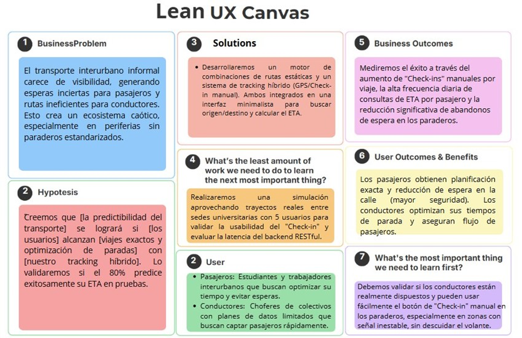

## 1.3. Segmentos objetivo

### Segmento Objetivo 1: Pasajeros

#### Datos Demográficos
- **Sexo**: Masculino y Femenino  
- **Edades**: 18–45 años  
- **Nivel Socioeconómico**: Medio–Bajo a Medio  
- **Ocupación**: Estudiantes universitarios, técnicos y trabajadores dependientes/independientes  
- **Ingresos**: Medios, dependientes del transporte público económico  

#### Aspectos Geográficos
- **Nacionalidad**: Peruana  
- **Ubicación Actual**: Zonas periféricas, distritos interurbanos o ciudades con alto índice de transporte informal (colectivos)  
- **Acceso a Tecnología**: Smartphones de gama media/baja, planes de datos prepago o limitados  

#### Aspectos Psicográficos
- **Motivaciones**:
  - Llegar a tiempo a sus destinos  
  - No perder tiempo esperando "a ciegas" en la calle  
  - Seguridad personal  

- **Estilo de vida**:
  - Rutinario  
  - Horarios ajustados  
  - Alta movilidad interdistrital  

- **Preocupaciones**:
  - Impuntualidad  
  - Clima durante la espera  
  - Inseguridad en paraderos vacíos  

- **Adaptación a la tecnología**:
  - Media-Alta  
  - Uso constante de mensajería y redes sociales  

- **Interés por la personalización**:
  - Medio  
  - Valoran que la app guarde rutas frecuentes  

---

### Segmento Objetivo 2: Conductores (Emisores de Datos)

#### Datos Demográficos
- **Sexo**: Mayoritariamente Masculino  
- **Edades**: 30–60 años  
- **Nivel Socioeconómico**: Medio–Bajo a Medio  
- **Ocupación**: Choferes de colectivos y transporte interurbano  
- **Ingresos**: Variables, dependientes de la cantidad de carreras o "vueltas" diarias  

#### Aspectos Geográficos
- **Nacionalidad**: Peruana  
- **Ubicación Actual**: Mismas zonas de operación que el Segmento 1  
- **Acceso a Tecnología**: Smartphones básicos a gama media, preocupación constante por consumo de datos y batería  

#### Aspectos Psicográficos
- **Motivaciones**:
  - Llenar el vehículo rápidamente  
  - Maximizar ingresos diarios  

- **Estilo de vida**:
  - Dinámico  
  - Largas horas al volante  
  - Alto estrés por el tráfico  

- **Preocupaciones**:
  - Costo del combustible  
  - Consumo de datos del celular  
  - Multas de tránsito  

- **Adaptación a la tecnología**:
  - Básica-Media  
  - Preferencia por interfaces simples (un solo toque)  
  - Rechazo a apps complejas o invasivas  

- **Interés por la personalización**:
  - Bajo  
  - Buscan una herramienta utilitaria y directa 

# Capítulo II: Requirements Elicitation & Analysis
## 2.1. Competidores
### 2.1.1. Análisis competitivo

|  | **Moovit** | **Google Maps** | **TuRuta** |
|---------------------------------------------------------------|-----------------------------|---------------------------|---------------------------|
| **Perfil** Overview | Plataforma enfocada en transporte interurbano informal (colectivos). Usa tracking híbrido (GPS/Check-in) para calcular tiempos y rutas de transbordo en zonas con paraderos no oficiales. | App global en movilidad urbana. Integra horarios de trenes y buses. | Startup peruana enfocada en rutas de buses tradicionales. |
| **Ventaja competitiva** ¿Qué valor ofrece a los clientes? | Integra y visibiliza rutas informales. El modo "Check-in" ahorra datos al conductor. Sugiere transbordos estáticos que otras apps ignoran. | Base de datos masiva de transporte oficial. Alertas paso a paso muy precisas. | Conocimiento local de las rutas de buses tradicionales peruanas y comunidad activa. |

| **Perfil de marketing** |  |  |  |
|-------------------------|--|--|--|
| **Mercado objetivo** | Estudiantes/trabajadores de zonas periféricas y choferes de colectivos interurbanos. | Usuarios de transporte público masivo formal (Metropolitano, corredores). | Usuarios frecuentes de "micros" y combis en Lima metropolitana. |
| **Estrategias de marketing** | Mostrar la app como una manera efectiva de no esperar demasiado y planificar rutas con transbordos. | Alianzas con municipios, SEO global, integración con Uber/Cabify. | Alianzas con empresas de transporte tradicionales y gamificación comunitaria. |

| **Perfil de Producto** |  |  |  |
|------------------------|--|--|--|
| **Productos & Servicios** | App móvil (pasajeros) y módulo de emisión híbrida (conductores). Motor de ETA basado en microservicios. | Planificador multimodal, horarios offline, alertas de bajada. | ETA de buses limeños, alarmas para despertar antes del paradero. |
| **Precios & Costos** | S/ 0 (Desarrollo académico en Free Tier AWS). | Gratis con anuncios (Freemium). | Gratis con anuncios, opción de pago sin publicidad. |
| **Canales de distribución** | Móvil, GitHub | App Store, Google Play, Web. | App Store, Google Play. |

| **FODA** |  |  |  |
|----------|--|--|--|
| **Fortalezas** | Atiende un nicho aún no entendido completamente. Arquitectura Cloud Native ligera. Consumo mínimo de datos. | Precisión extrema en rutas formales y presencia global. | Fuerte tropicalización y entendimiento del caos limeño. |
| **Oportunidades** | Formalizar digitalmente un sector que moviliza a millones. | Integrar micro-movilidad (scooters, bicicletas) en su red. | Expandirse a otras provincias del Perú. |
| **Debilidades** | Dependencia inicial de que los choferes hagan el Check-in. Sistema en fase de prueba manual. | Ignora por completo el transporte de colectivos o taxis de ruta. | Consume muchos datos/batería al requerir GPS constante en todos los buses. |
| **Amenazas** | Que apps locales como TuRuta añadan soporte para seguimiento de buses. | Competencia directa de otras apps como Apple Maps. | Pérdida de usuarios si las flotas apagan sus GPS. |

### 2.1.2. Estrategias y tácticas frente a competidores
- ChapaTuRuta aplicará una estrategia de especialización enfocada en rutas periféricas interurbanas, ofreciendo predictibilidad de tiempos de llegada y opciones de transbordo; complementará con una arquitectura ágil, garantizando cálculos de ETA ultrarrápidos y un modelo de reporte híbrido para superar a la competencia masiva; y finalmente, impulsará la adopción orgánica mediante interfaces utilitarias y minimalistas para generar confianza y eficiencia operativa en sus usuarios.
## 2.2. Entrevistas
### 2.2.1. Diseño de entrevistas

#### Preguntas Generales
1. ¿Cuál es tu nombre, edad, distrito de residencia, ocupación actual y estado civil?
 
2. ¿Qué modelo de smartphone utilizas habitualmente y cuáles son las tres aplicaciones (o marcas digitales) que más usas en tu día a día?  

---

#### Segmento 1: Pasajeros

1. ¿Cómo es tu rutina de viaje diario, qué rutas sueles tomar y cuánto tiempo pasas esperando tu vehículo en el paradero?  

2. ¿Cuál es tu mayor frustración al momento de esperar movilidad o al tener que realizar un transbordo para llegar a tu destino? 

3. Si tuvieras una herramienta que te indique el tiempo exacto de llegada de tu vehículo, ¿qué información priorizarías ver en la pantalla principal para planificar tu viaje?  

4. ¿Qué canales digitales utilizas para informarte sobre rutas o tráfico actualmente (grupos de WhatsApp, Facebook, otras apps)?  

5. ¿Qué tan confiable te resultaría una app que calcula el tiempo de llegada basándose en los reportes de los propios conductores; qué necesitarías para confiar plenamente en ella?  

6. ¿Te consideras una persona que planifica sus viajes con anticipación o prefieres salir y tomar lo primero que pase?  

---

#### Segmento 2: Conductores

1. ¿Cuántos años llevas conduciendo en tu ruta actual, cómo es un día típico de trabajo y cómo decides en qué paraderos detenerte?  

2. ¿Cuál es el mayor desafío o frustración que enfrentas para conseguir pasajeros rápidamente y optimizar el tiempo de tus trayectos?  

3. ¿Qué tan cómodo te sientes usando aplicaciones móviles mientras trabajas y qué características hacen que una app sea realmente fácil de usar para ti?  

4. Si tuvieras un botón amplio en tu pantalla para avisar a los pasajeros que estás llegando a un paradero ("Check-in"), ¿estarías dispuesto a presionarlo en cada viaje? ¿Por qué sí o por qué no? 

5. ¿Qué beneficio concreto necesitarías percibir (por ejemplo, saber exactamente cuántos pasajeros te están esperando) para utilizar la herramienta todos los días?  

6. ¿Dónde colocas tu celular mientras conduces y mediante qué canales digitales sueles comunicarte con otros compañeros de ruta?  

### 2.2.2. Registro de entrevistas
#### Entrevista N°1 – Segmento 1
 
- Nombres: Juan
- Apellidos: Pescoran
- Edad: 19 años
- Ciudad: Trujillo 
- URL Entrevista: https://tinyurl.com/VideoSegmento1
- Duración: 00:08:46 minutos 
- Resumen: 
    Juan, un estudiante universitario de 19 años, comentó que en su experiencia los "jaladores" de colectivos suelen brindar información incorrecta sobre las rutas, lo que genera confusión. Actualmente, su método para abordar un colectivo consiste en preguntar directamente al conductor sobre el recorrido. Además, considera que sería muy útil poder planificar su viaje antes de salir, especialmente porque en Trujillo no existen paraderos formales. Finalmente, destacó que valoraría mucho un sistema confiable que le permita identificar qué colectivos lo pueden llevar a su destino de manera precisa.

#### Entrevista N°2 – Segmento Conductores
  

- **Nombres:** Andy Mauri  
- **Apellidos:** Pillaca Torres  
- **Edad:** 26 años  
- **Ciudad:** Lima  
- **URL Entrevista:** https://drive.google.com/file/d/1so5df0ySYQIBXWjm7smSaWyOXd0-n51H/view?usp=sharing
- **Duración:** 00:04:30 minutos  

- **Resumen:**  
Mauri, conductor de 26 años con varios años de experiencia en transporte urbano informal, comenta que su jornada inicia desde temprano y depende en gran medida de identificar dónde hay pasajeros durante el día. Señala que suele detenerse en paraderos conocidos o donde observa personas esperando, basándose principalmente en su experiencia, aunque reconoce que muchas veces esto implica incertidumbre. Indica que uno de sus principales problemas es no saber con anticipación dónde hay mayor demanda, lo que le hace perder tiempo y combustible, especialmente cuando hay tráfico o mucha competencia en la ruta. En cuanto al uso de tecnología, menciona que utiliza el celular de forma rápida y prefiere aplicaciones simples, con botones grandes y sin pasos innecesarios. Considera útil poder avisar su llegada a paraderos mediante una acción rápida, siempre que no lo distraiga. Finalmente, destaca que usaría una herramienta de forma constante si le ayuda a ubicar pasajeros con mayor precisión y optimizar sus recorridos diarios.

---

#### Entrevista N°1 – Segmento 2
 

- Nombres: Sebastian
- Apellidos: Rodriguez Macedo
- Eda: 23 años
- Ciudad: Lima
- URL Entrevista: https://upcedupe-my.sharepoint.com/:v:/g/personal/u20231c540_upc_edu_pe/IQCiYQ4UaesKQKGHwmrssM8mAU0A970vEi49uwUr2PLSAvk?e=zSdjNy
- Duración: 00:04:05
- Resumen:  
Sebastián, conductor de transporte público de 23 años en Lima, comentó que decide sus paradas según la demanda visible de pasajeros y busca optimizar el tiempo de ruta para maximizar sus ganancias, enfrentando desafíos como el tráfico y la competencia. Usa frecuentemente su celular (iPhone 12) y aplicaciones como WhatsApp para coordinar con otros conductores. Señaló que adoptaría una app como “Chapa tu ruta” siempre que sea intuitiva, rápida y le brinde beneficios concretos, como llenar el bus más eficientemente. Además, consideró viable interactuar con la app durante su jornada, siempre que no interfiera con sus tareas, destacando la importancia de una herramienta práctica que mejore la comunicación y eficiencia en el servicio.

### 2.2.3. Análisis de entrevistas
## 2.3. Needfinding
### 2.3.1. User Personas

  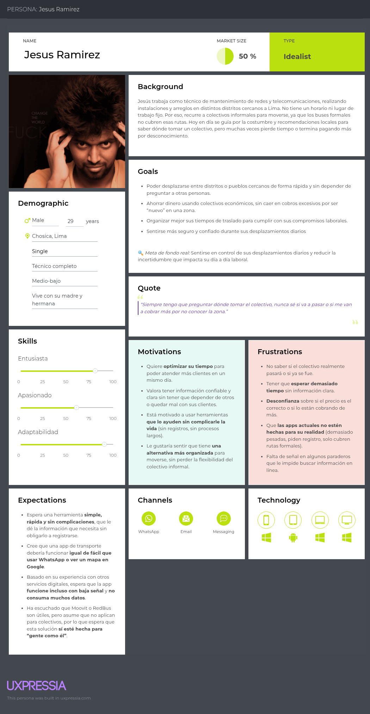

  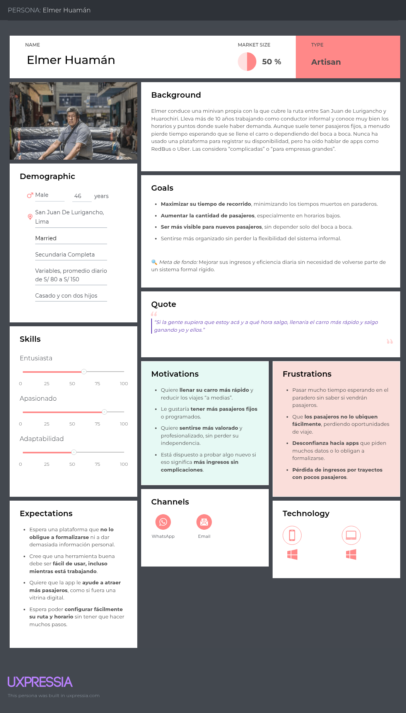

### 2.3.2. User Task Matrix

| Tarea (Task del mundo real) | Jesús Ramírez (Pasajero) | Frecuencia / Importancia | Roberto Quispe (Conductor) | Frecuencia / Importancia |
|-----------------------------|---------------------------|---------------------------|-----------------------------|---------------------------|
| Planificar el horario de salida |  | Alta / Alta |  | Alta / Media |
| Identificar la ruta y trasbordos necesarios |  | Media / Alta |  | Baja / Baja |
| Desplazarse y esperar en el paradero |  | Alta / Alta |  | Alta / Alta |
| Calcular el tiempo de llegada al destino |  | Alta / Alta |  | Media / Alta |
| Identificar paraderos adecuados para abordar/recoger |  | Alta / Alta |  | Media / Media |
| Avisar disponibilidad de espacios a pasajeros (o "dateros") |  | Baja / Media |  | Alta / Alta |
| Ajustar la ruta u horario según los momentos de mayor demanda |  | Baja / Media |  | Alta / Alta |

### 2.3.3. Empathy Mapping

**Segmento 1 y segmento 2:**

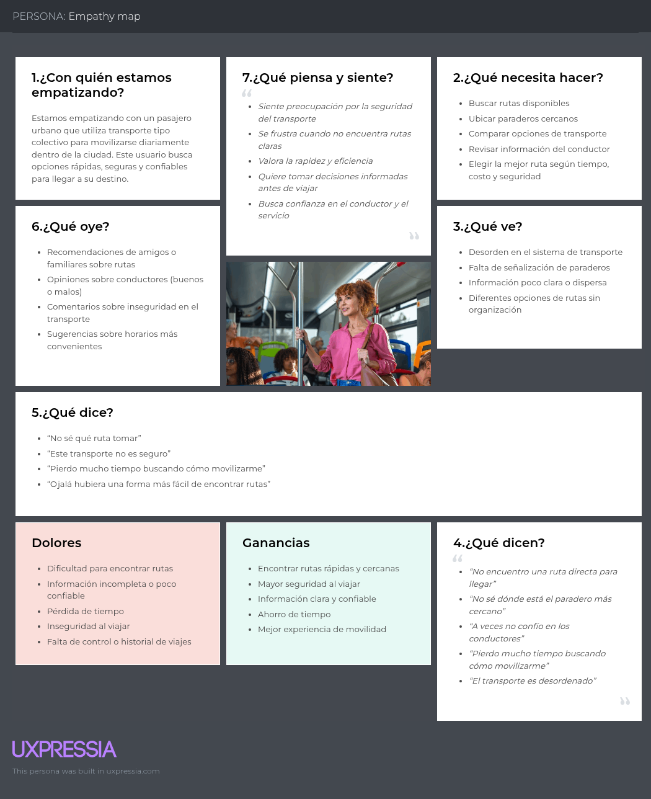

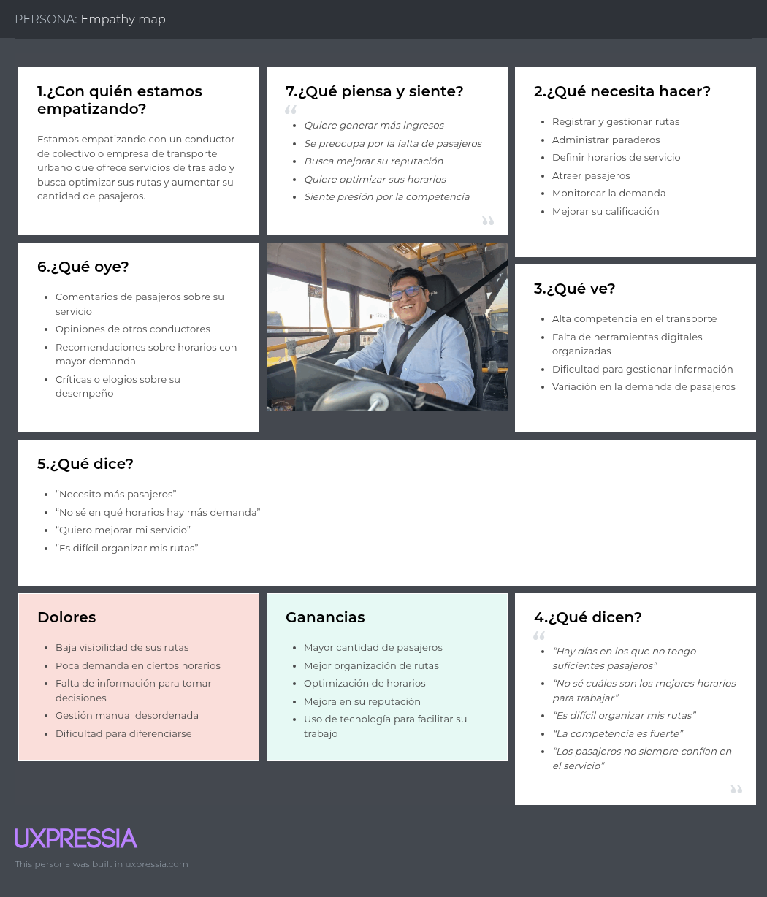

#### 2.3.4. As-is Scenario Mapping
### AS - IS Scenario Mapping (Segmento: Pasajeros)
| FASES             | Buscar ruta/colectivo                          | Planificar viaje                                      | Abordar colectivo                                  | Llegada a destino                                   |
|------------------|------------------------------------------------|------------------------------------------------------|----------------------------------------------------|-----------------------------------------------------|
| **DOING**        | Preguntar a personas locales sobre rutas y paraderos disponibles. | No hay información clara sobre tarifas, horarios o puntos de embarque. | Llegar al paradero y esperar hasta que el colectivo llegue. | Confirmar llegada al destino mediante señales visuales. |
| **THINKING**     | "No sé si estoy en la ruta correcta."          | "No tengo idea de cuánto me costará ni a qué hora llegaré." | "¿Será este el colectivo correcto?"                 | "¿Llegué al lugar adecuado?"                        |
| **FEELING**      | Confusión, incertidumbre.                     | Ansiedad, falta de control.                          | Desconfianza, incomodidad.                         | Estrés, falta de información.                      |

### AS - IS Scenario Mapping (Segmento: Conductores)
| FASES             | Activar disponibilidad                        | Captar pasajeros                                      | Realizar recorrido                                  | Finalizar viaje                                    |
|------------------|------------------------------------------------|------------------------------------------------------|----------------------------------------------------|---------------------------------------------------|
| **DOING**        | No hay plataforma para activar su disponibilidad. | Esperar en el paradero sin saber si hay pasajeros.    | Realizar el recorrido sin un control preciso de tiempo o pasajeros. | No hay seguimiento digital ni estadísticas sobre el viaje. |
| **THINKING**     | "¿Habrá pasajeros para mi ruta hoy?"           | "¿Estarán los pasajeros listos cuando llegue?"        | "¿Voy a llegar a tiempo o hacer paradas innecesarias?" | "No tengo forma de saber si mi viaje fue rentable." |
| **FEELING**      | Incertidumbre, frustración.                    | Inseguridad, desorganización.                         | Estrés, falta de control.                          | Desconcierto, falta de retroalimentación.          |

# Capítulo III: Requirements Specification

## 3.1 To-Be Scenario Mapping
### To - be Scenario mapping (Segmento: Pasajeros)
| FASES             | Buscar ruta/colectivo                        | Planificar viaje                                  | Abordar colectivo                                 | Llegada a destino                              |
|------------------|----------------------------------------------|--------------------------------------------------|--------------------------------------------------|------------------------------------------------|
| **DOING**        | Entro a la app y visualiza rutas y paraderos disponibles. | Consulto tarifas estimadas, horarios aproximados y puntos de embarque. | Llegue al paradero indicado con anticipación y aborda el vehículo. | Confirma llegada y califica al conductor en la app. |
| **THINKING**     | "Ya no tengo que preguntar a nadie en la calle." | "Puedo calcular cuánto me costará y a qué hora llegaré." | "Estoy yendo al lugar correcto, sé quién me llevará." | "Fue un viaje tranquilo, todo estuvo bien organizado." |
| **FEELING**      | Seguridad, autonomía.                         | Confianza, planificación.                        | Tranquilidad, menor ansiedad.                   | Satisfacción, gratitud.                        |

### To - be Scenario mapping (Segmento: Conductores)
| FASES             | Activar disponibilidad                       | Captar pasajeros                                 | Realizar recorrido                               | Finalizar viaje                                 |
|------------------|----------------------------------------------|--------------------------------------------------|--------------------------------------------------|-------------------------------------------------|
| **DOING**        | Abro la app y activo mi ruta habitual.       | Aparecen mis paraderos  con un tiempo de llegada estimado. | Recoge a los pasajeros y sigue la ruta habitual. | Marca el fin del viaje y visualiza estadísticas. |
| **THINKING**     | "Estoy visible para más pasajeros hoy."      | "Ya tengo a quién recoger y sé dónde están."     | "Todo va según lo planeado, sin perder tiempo."  | "Ese viaje fue rentable y bien organizado."      |
| **FEELING**      | Motivación, oportunidad.                     | Eficiencia, comodidad.                           | Control, foco.                                   | Logro, satisfacción.                            |

## 3.2 User Stories
| User Story ID / Technical Story ID | Título                              | Descripción                                                  | Criterios de aceptación                                                            |
|---------------|-------------------------------------|--------------------------------------------------------------|------------------------------------------------------------------------------------------------------------------------|
| US01          | Buscar rutas disponibles            | Como pasajero, quiero buscar rutas de colectivos cercanas para saber qué opciones tengo para movilizarme. | **Escenario 1: Búsqueda exitosa** Dado que soy un pasajero con acceso a la app, Cuando ingreso una ubicación de origen y destino, Entonces el sistema debe mostrarme las rutas de colectivos disponibles.  **Escenario 2: Sin resultados** Dado que no hay rutas activas entre los puntos seleccionados, Cuando realizo la búsqueda, Entonces el sistema debe indicarme que no hay resultados disponibles.   |
| US02          | Ver paraderos en el mapa            | Como pasajero, quiero ver en un mapa los paraderos cercanos para saber dónde tomar el colectivo. | **Escenario 1: Visualización de paraderos** Dado que ingreso a la sección de mapa, Cuando permito el acceso a mi ubicación, Entonces el sistema debe mostrar los paraderos cercanos en el mapa.  **Escenario 2: Error de ubicación** Dado que no doy acceso a mi ubicación, Cuando intento ver el mapa, Entonces el sistema debe mostrar un mensaje indicando que no puede mostrar los paraderos.   |
| US03          | Ver información del conductor        | Como pasajero, quiero ver información del conductor antes de abordar para mayor confianza. | **Escenario 1: Información visible** Dado que selecciono una ruta activa, Cuando visualizo los detalles del colectivo, Entonces debo poder ver el nombre, tipo de vehículo y calificaciones del conductor.  **Escenario 2: Información incompleta** Dado que el conductor no ha completado su perfil, Cuando visualizo su información, Entonces el sistema debe mostrar solo los datos disponibles y un aviso indicando que el perfil no está completo.   |
| US04          | Calificar al conductor              | Como pasajero, quiero calificar al conductor después del viaje para contribuir a la calidad del servicio. | **Escenario 1: Calificación realizada** Dado que he completado un viaje, Cuando accedo a la opción de calificar, Entonces debo poder seleccionar una puntuación y dejar un comentario.  **Escenario 2: Calificación no enviada** Dado que no selecciono ninguna puntuación, Cuando intento enviar la calificación, Entonces el sistema debe indicarme que la puntuación es obligatoria.   |
| US05          | Ver historial de viajes             | Como pasajero, quiero ver mis viajes anteriores para tener un registro de mis trayectos. | **Escenario 1: Historial disponible** Dado que accedo a la sección “Mis viajes”, Cuando la abro, Entonces debo ver una lista con los trayectos anteriores, fechas y conductores.  **Escenario 2: Sin viajes realizados** Dado que no he realizado ningún viaje, Cuando ingreso a la sección, Entonces el sistema debe mostrar un mensaje informativo indicando que aún no tengo historial.   |
| US06          | Registrarse como conductor          | Como conductor, quiero registrarme en la plataforma para ofrecer mi servicio de colectivo. | **Escenario 1: Registro exitoso** Dado que completo el formulario de registro con todos los datos requeridos, Cuando envío el formulario, Entonces debo recibir una confirmación de que el registro fue exitoso.  **Escenario 2: Datos incompletos** Dado que no completo todos los campos requeridos, Cuando intento registrarme, Entonces el sistema debe indicarme los campos faltantes.   |
| US07          | Activar disponibilidad de ruta      | Como conductor, quiero activar mi ruta disponible para que los pasajeros puedan verla. | **Escenario 1: Activación de ruta** Dado que tengo una ruta registrada, Cuando activo mi disponibilidad, Entonces los pasajeros deben poder verla en tiempo real.  **Escenario 2: Ruta sin activar** Dado que no he activado mi disponibilidad, Cuando los pasajeros consultan las rutas, Entonces mi ruta no debe aparecer en los resultados.   |
| US08          | Recibir notificaciones de pasajeros | Como conductor, quiero recibir alertas cuando haya pasajeros interesados en mi ruta. | **Escenario 1: Notificación activa** Dado que tengo activada mi ruta, Cuando un pasajero la selecciona, Entonces debo recibir una notificación con los detalles del posible abordaje.  **Escenario 2: Notificaciones desactivadas** Dado que desactivo las notificaciones, Cuando un pasajero selecciona mi ruta, Entonces no debo recibir alertas en la app.   |
| US09          | Ver demanda de rutas por horario    | Como conductor, quiero ver los horarios con mayor demanda para decidir cuándo salir a trabajar. | **Escenario 1: Datos disponibles** Dado que accedo a la sección de análisis, Cuando selecciono un distrito, Entonces el sistema debe mostrarme los horarios con más búsquedas de esa ruta.  **Escenario 2: Sin datos registrados** Dado que no hay suficiente información histórica, Cuando intento ver la demanda, Entonces el sistema debe indicarme que no hay datos suficientes aún.   |
| US10          | Ver calificaciones de pasajeros     | Como conductor, quiero ver las calificaciones que me han dejado los pasajeros para mejorar mi servicio. | **Escenario 1: Calificaciones visibles** Dado que tengo calificaciones registradas, Cuando ingreso a la sección “Mi reputación”, Entonces debo poder ver un promedio y comentarios recibidos.  **Escenario 2: Sin calificaciones aún** Dado que aún no he sido calificado, Cuando ingreso a esa sección, Entonces debo ver un mensaje que me indique que aún no tengo calificaciones disponibles.   |
| User Story ID | Título                              | Descripción                                                  | Criterios de aceptación                                                                                                |
| US11          | Explorar paraderos desde la Landing | Como visitante, quiero explorar paraderos disponibles desde la Landing Page para encontrar opciones cercanas sin necesidad de registrarme. | **Escenario 1: Acceso a paraderos** Dado que ingreso a la Landing Page, Cuando hago clic en el botón "Explora las paraderos", Entonces debo ser dirigido a una sección o página donde pueda ver los paraderos disponibles.  **Escenario 2: Error en navegación** Dado que el sistema presenta un error de carga, Cuando hago clic en "Explora las paraderos", Entonces el sistema debe mostrar un mensaje de error amigable invitándome a intentar nuevamente.   |
| US12          | Consultar cómo funciona el servicio | Como visitante, quiero entender cómo funciona el servicio para saber cómo usarlo antes de registrarme. | **Escenario 1: Información disponible** Dado que ingreso a la Landing Page, Cuando hago clic en el menú "Cómo funciona", Entonces debo ser dirigido a una sección donde se explique el funcionamiento del servicio de forma clara.  **Escenario 2: Información no encontrada** Dado que no existe la información solicitada, Cuando intento acceder a "Cómo funciona", Entonces el sistema debe mostrar un mensaje indicando que la sección está en construcción o no disponible.   |
| US13          | Conocer las ventajas del servicio   | Como visitante, quiero conocer las ventajas de usar la plataforma para decidirme a utilizarla. | **Escenario 1: Visualización de ventajas** Dado que ingreso a la Landing Page, Cuando hago clic en el menú "Ventajas", Entonces debo ser dirigido a una sección donde se describan claramente los beneficios de usar la plataforma.  **Escenario 2: Sección no cargada** Dado que ocurre un error en la página, Cuando hago clic en "Ventajas", Entonces el sistema debe mostrar un mensaje de error amigable.   |
| US14          | Acceder a preguntas frecuentes (FAQ) | Como visitante, quiero resolver mis dudas rápidamente leyendo preguntas frecuentes. | **Escenario 1: Acceso a FAQ** Dado que ingreso a la Landing Page, Cuando hago clic en el menú "FAQ", Entonces debo ser dirigido a una sección de preguntas frecuentes con respuestas claras.  **Escenario 2: FAQ no disponible** Dado que ocurre un problema de carga, Cuando hago clic en "FAQ", Entonces el sistema debe mostrarme un mensaje indicando que el contenido no está disponible temporalmente.   |
| US15          | Postular como colaborador           | Como visitante, quiero tener una opción para colaborar con la plataforma para aportar al crecimiento del servicio. | **Escenario 1: Acceso a colaboración** Dado que ingreso a la Landing Page, Cuando hago clic en "Colabora", Entonces debo ser dirigido a un formulario o sección que explique cómo puedo colaborar.  **Escenario 2: Sección de colaboración no disponible** Dado que la sección de colaboración no esté activa aún, Cuando intento acceder, Entonces el sistema debe indicarme que aún no está habilitada pero que pronto estará disponible.   |
| US16           | Registro de usuario    | Como usuario, quiero registrarme en la plataforma, para poder gestionar mis paraderos y rutas. | **Escenario 1: Registro exitoso** - Dado que ingreso mi correo y contraseña, - Cuando completo el formulario y envío, - Entonces mi cuenta debe ser creada y recibiré un mensaje de confirmación. **Escenario 2: Correo ya registrado** - Dado que intento registrarme, - Cuando ingreso un correo ya registrado, - Entonces debo ver un mensaje de error indicando "Correo ya en uso". |
| US17           | Inicio de sesión de usuario | Como usuario, quiero iniciar sesión en la plataforma, para gestionar mis paraderos y rutas.      | **Escenario 1: Inicio de sesión exitoso** - Dado que soy un usuario registrada, - Cuando ingreso mis credenciales correctamente, - Entonces debo ser redirigido a mi panel de administración. |
| US18           | Gestión de Rutas para Empresas        | Como empresa de transporte, quiero crear, editar y eliminar rutas, para mantener mi servicio actualizado.       | **Escenario 1: Crear nueva ruta** - Dado que estoy en la sección de rutas, - Cuando creo una nueva ruta, - Entonces debe aparecer en la lista de rutas. **Escenario 2: Editar o eliminar ruta** - Dado que selecciono una ruta existente, - Cuando la edito o elimino, - Entonces los cambios deben reflejarse de inmediato. |
| US19          | Personalización de perfil de empresa | Como empresa de transporte, quiero subir el logo de mi empresa y especificar su nombre, para que los pasajeros puedan identificarme fácilmente. | **Escenario 1: Subida de logo exitoso** - Dado que soy una empresa autenticada, - Cuando selecciono una imagen para el logo y la confirmo, - Entonces el logo debe mostrarse correctamente en mi perfil. **Escenario 2: Edición del nombre de la empresa** - Dado que soy una empresa autenticada, - Cuando cambio el nombre de mi empresa, - Entonces el nuevo nombre debe guardarse y actualizarse. |
| US20          | Navegación en toolbar (Inicio, Paraderos, Rutas) | Como empresa de transporte, quiero navegar fácilmente entre inicio, paraderos y rutas, para gestionar mi servicio de forma rápida. | **Escenario 1: Navegación correcta** - Dado que soy una empresa autenticada, - Cuando hago clic en "Inicio", "Paraderos" o "Rutas", - Entonces debo ser redirigido a la sección correspondiente.                                                                                                  |
| US21          | Ver resumen general en la página de inicio | Como empresa de transporte, quiero ver un resumen general en la página de inicio, para conocer el total de paraderos, tarifa promedio e intervalo promedio. | **Escenario 1: Visualización del resumen** - Dado que soy una empresa autenticada, - Cuando ingreso a la página de inicio, - Entonces debo ver el total de paraderos, la tarifa promedio e intervalo promedio.                                                                                     |
| US22          | Ver paraderos en la página de inicio  | Como empresa de transporte, quiero ver un listado de mis paraderos con su ubicación, para gestionarlos fácilmente. | **Escenario 1: Visualización correcta** - Dado que tengo paraderos registrados, - Cuando ingreso a la página de inicio, - Entonces debo ver el nombre del paradero, su región, localidad, distrito y provincia. **Escenario 2: Opción de ver ubicación** - Dado que estoy en la lista de paraderos, - Cuando hago clic en "Ver ubicación", - Entonces debo ser redirigido al mapa del paradero.         |
| US23          | Gestión de paraderos (agregar, editar, eliminar) | Como empresa de transporte, quiero agregar, editar o eliminar paraderos, para mantener actualizada mi lista de paraderos. | **Escenario 1: Agregar nuevo paradero** - Dado que estoy en la sección de paraderos, - Cuando ingreso los datos de un nuevo paradero y confirmo, - Entonces el paradero debe aparecer en la lista. **Escenario 2: Editar un paradero** - Dado que tengo paraderos existentes, - Cuando selecciono uno y edito sus datos, - Entonces los cambios deben guardarse correctamente.               |
| US24          | Filtrar paraderos por ubicación       | Como viajero, quiero filtrar los paraderos por región, provincia, distrito y localidad, para encontrar las opciones más cercanas a mí. | **Escenario 1: Filtrado exitoso** - Dado que estoy en la página de búsqueda, - Cuando selecciono una región y provincia, - Entonces los paraderos deben actualizarse según el filtro.                                                                                                            |
| US25          | Ver detalles completos de una ruta    | Como viajero, quiero ver detalles completos de una ruta seleccionada, para conocer la empresa, duración, tarifas y horarios. | **Escenario 1: Visualización correcta** - Dado que selecciono una ruta, - Cuando ingreso a sus detalles, - Entonces debo ver la empresa, la dirección, duración, tarifa y horarios.   |
| Technical Story ID | Título                                         | Descripción                                                                                                                                            | Criterios de aceptación                                                                                                                                                                                                                      |
| US26 | Registro de usuario | Como usuario de la plataforma de transporte quiero registrarme para poder iniciar sesión | **Escenario 1: Registro exitoso** Dado que soy un nuevo usuario, Cuando ingreso mis datos válidos en el formulario de registro, Entonces el sistema debe crear mi cuenta y permitirme acceder a la plataforma.  **Escenario 2: Datos inválidos** Dado que estoy en el formulario de registro, Cuando ingreso datos inválidos o incompletos, Entonces el sistema debe mostrarme mensajes de error específicos. |
| US27 | Iniciar sesión | Como usuario de la plataforma quiero poder iniciar sesión para tener acceso a la plataforma | **Escenario 1: Inicio de sesión exitoso** Dado que tengo una cuenta registrada, Cuando ingreso mis credenciales correctas, Entonces el sistema debe autenticarme y darme acceso a la plataforma.  **Escenario 2: Credenciales incorrectas** Dado que estoy en la pantalla de login, Cuando ingreso credenciales incorrectas, Entonces el sistema debe mostrarme un mensaje de error. |
| US28 | Cerrar sesión | Como usuario de la plataforma quiero poder salir de la sesión iniciada para ya no estar más en ella | **Escenario 1: Cierre de sesión exitoso** Dado que tengo una sesión activa, Cuando selecciono la opción de cerrar sesión, Entonces el sistema debe cerrar mi sesión y redirigirme a la página de inicio. |
| US29 | Editar perfil de usuario | Como usuario de la plataforma me gustaría poder editar mi perfil para mantener actualizado mis datos o corregir algún error de tipeo | **Escenario 1: Edición exitosa** Dado que estoy en mi perfil, Cuando modifico mis datos y guardo los cambios, Entonces el sistema debe actualizar mi información correctamente.  **Escenario 2: Datos inválidos** Dado que estoy editando mi perfil, Cuando ingreso datos inválidos, Entonces el sistema debe mostrarme mensajes de error específicos. |
| US30 | Registrar datos de empresa | Como gestor de la empresa de transporte quiero registrar los datos generales de mi compañía inmediatamente después de mi primer inicio de sesión para que esa información —que se mostrará como datos principales a los viajeros— quede guardada y no tenga que volver a ingresar los mismos datos en el futuro | **Escenario 1: Registro exitoso de empresa** Dado que soy un gestor recién registrado, Cuando ingreso los datos de mi empresa por primera vez, Entonces el sistema debe guardar la información y mostrarla en mi perfil de empresa.  **Escenario 2: Datos incompletos** Dado que estoy registrando mi empresa, Cuando no completo todos los campos obligatorios, Entonces el sistema debe indicarme qué campos faltan. |
| US31 | Editar información de empresa | Como gestor de la empresa de transporte, quiero editar la información de la empresa que manejo, para mantenerla actualizada en caso de cambios | **Escenario 1: Edición exitosa** Dado que tengo una empresa registrada, Cuando modifico los datos de la empresa, Entonces el sistema debe actualizar la información correctamente.  **Escenario 2: Cambios no guardados** Dado que estoy editando información de empresa, Cuando intento salir sin guardar, Entonces el sistema debe preguntarme si deseo guardar los cambios. |
| US32 | Crear paradero | Como gestor de la empresa de transporte, quiero crear un nuevo paradero para poder agregarlo al sistema y luego asociarlo a una ruta | **Escenario 1: Creación exitosa** Dado que estoy en la sección de paraderos, Cuando ingreso los datos de un nuevo paradero y confirmo, Entonces el paradero debe aparecer en la lista.  **Escenario 2: Datos duplicados** Dado que estoy creando un paradero, Cuando ingreso datos de un paradero existente, Entonces el sistema debe mostrarme un mensaje de error. |
| US33 | Ver lista de paraderos | Como gestor de la empresa de transporte, quiero ver la lista completa de paraderos registrados, para confirmar que mis paraderos existen y sus datos son correctos | **Escenario 1: Visualización correcta** Dado que tengo paraderos registrados, Cuando ingreso a la página de inicio, Entonces debo ver el nombre del paradero, su región, localidad, distrito y provincia.  **Escenario 2: Opción de ver ubicación** Dado que estoy en la lista de paraderos, Cuando selecciono "Ver ubicación", Entonces debo ver la ubicación del paradero en el mapa. |
| US34 | Editar paradero | Como gestor de la empresa de transporte, quiero editar los datos de un paradero para mantener la información siempre actualizada | **Escenario 1: Edición exitosa** Dado que tengo paraderos existentes, Cuando selecciono uno y edito sus datos, Entonces los cambios deben guardarse correctamente. |
| US35 | Eliminar paradero | Como gestor de la empresa de transporte, quiero eliminar un paradero que ya no esté en servicio, para evitar confusiones al momento de crear o mostrar rutas | **Escenario 1: Eliminación exitosa** Dado que tengo un paradero que ya no uso, Cuando selecciono eliminarlo, Entonces debe desaparecer de la lista y no estar disponible para nuevas rutas. |
| US36 | Crear ruta | Como gestor de la empresa de transporte, quiero crear una nueva ruta seleccionando dos paraderos existentes para ofrecer ese recorrido en la plataforma | **Escenario 1: Creación exitosa** Dado que tengo paraderos disponibles, Cuando selecciono dos paraderos y creo una ruta, Entonces la ruta debe aparecer en mi lista de rutas disponibles. |
| US37 | Ver lista de rutas | Como gestor de la empresa de transporte, quiero ver la lista completa de rutas registradas para verificar qué trayectos estoy ofreciendo actualmente | **Escenario 1: Visualización correcta** Dado que tengo rutas registradas, Cuando accedo a la lista de rutas, Entonces debo ver todas mis rutas con sus detalles básicos. |
| US38 | Editar ruta | Como gestor de la empresa de transporte, quiero editar una ruta existente para ajustar tarifas o corregir errores en la ruta | **Escenario 1: Edición exitosa** Dado que tengo una ruta existente, Cuando modifico sus datos, Entonces los cambios deben guardarse y reflejarse en la plataforma. |
| US39 | Eliminar ruta | Como gestor de la empresa de transporte, quiero eliminar una ruta que ya no voy a operar para que no aparezca más en los listados públicos ni interfiera con las colecciones de viajeros | **Escenario 1: Eliminación exitosa** Dado que tengo una ruta que ya no opero, Cuando la elimino, Entonces debe desaparecer de todos los listados públicos. |
| US40 | Configurar horarios de ruta | Como gestor de la empresa de transporte, quiero ingresar los horarios de atención en la que está disponible la ruta de dicho viaje para que los viajeros puedan revisarlos | **Escenario 1: Configuración exitosa** Dado que tengo una ruta creada, Cuando configuro los horarios de operación, Entonces los viajeros deben poder ver estos horarios en los detalles de la ruta. |
| US41 | Filtrar rutas por ubicación | Como viajero quiero filtrar por región, provincia, distrito y finalmente ciudad para poder ubicar las rutas que se encuentran en esa locación | **Escenario 1: Filtrado exitoso** Dado que estoy en la página de búsqueda, Cuando selecciono una región y provincia, Entonces los paraderos deben actualizarse según el filtro.  **Escenario 2: Sin resultados** Dado que no hay rutas activas entre los puntos seleccionados, Cuando realizo la búsqueda, Entonces el sistema debe indicarme que no hay resultados disponibles. |
| US42 | Ver resultados de búsqueda | Como viajero quiero ver el resultado del filtro en forma de tarjetas resumidas, para comparar de un vistazo las opciones disponibles sin salir de la pantalla principal | **Escenario 1: Visualización correcta** Dado que he aplicado filtros, Cuando se muestran los resultados, Entonces debo ver tarjetas con información resumida de cada ruta. |
| US43 | Ver detalles de ruta | Como viajero quiero navegar a la página de detalle de la ruta para ver información completa | **Escenario 1: Navegación exitosa** Dado que estoy viendo una lista de rutas, Cuando selecciono una ruta, Entonces debo acceder a una página con todos los detalles de esa ruta. |
| US44 | Volver al listado | Como viajero, quiero ver un botón "Volver al listado", para regresar fácilmente al listado de rutas sin perder los filtros previamente aplicados | **Escenario 1: Navegación con filtros preservados** Dado que estoy en el detalle de una ruta, Cuando selecciono "Volver al listado", Entonces debo regresar a la lista manteniendo los filtros aplicados. |
| US45 | Crear colección | Como viajero autenticado, quiero crear una nueva colección con un nombre descriptivo, para agrupar rutas que me interesen | **Escenario 1: Creación exitosa** Dado que soy un usuario autenticado, Cuando creo una nueva colección con un nombre, Entonces la colección debe aparecer en mi lista personal. |
| US46 | Ver mis colecciones | Como viajero autenticado, quiero ver la lista de mis colecciones existentes para seleccionar rápidamente la colección donde quiero revisar mis rutas guardadas | **Escenario 1: Visualización correcta** Dado que tengo colecciones creadas, Cuando accedo a mi área personal, Entonces debo ver todas mis colecciones con sus nombres. |
| US47 | Editar nombre de colección | Como viajero autenticado, quiero editar el nombre de una colección, para renombrarla según cambien mis necesidades | **Escenario 1: Edición exitosa** Dado que tengo una colección existente, Cuando cambio su nombre, Entonces el nuevo nombre debe guardarse correctamente. |
| US48 | Eliminar colección | Como viajero autenticado, quiero eliminar una colección completa, para borrar agrupaciones que ya no uso y mantener organizada mi lista | **Escenario 1: Eliminación exitosa** Dado que tengo una colección que ya no uso, Cuando la elimino, Entonces debe desaparecer de mi lista de colecciones. |
| US49 | Agregar ruta a colección | Como viajero autenticado, quiero ver el botón "Agregar a colección" en la pantalla de detalle de ruta, para guardar esa ruta dentro de una de mis colecciones existentes | **Escenario 1: Botón visible** Dado que estoy viendo el detalle de una ruta, Cuando soy un usuario autenticado, Entonces debo ver el botón "Agregar a colección". |
| US50 | Seleccionar colección para ruta | Como viajero autenticado, quiero seleccionar la colección a la cual agregar la ruta, para clasificar cada ruta según el contexto | **Escenario 1: Selección exitosa** Dado que quiero agregar una ruta a colección, Cuando selecciono una colección específica, Entonces la ruta debe agregarse a esa colección. |
| US51 | Quitar ruta de colección | Como viajero autenticado, quiero quitar una ruta de una colección, para eliminar rutas que ya no me interesan o cambiaron de planes | **Escenario 1: Eliminación exitosa** Dado que tengo rutas en una colección, Cuando selecciono quitar una ruta, Entonces debe desaparecer de esa colección específica. |
| US52 | Ver rutas de colección | Como viajero autenticado, quiero entrar a una colección específica y ver la lista de rutas guardadas | **Escenario 1: Visualización correcta** Dado que tengo rutas guardadas en una colección, Cuando accedo a esa colección, Entonces debo ver todas las rutas que he guardado en ella. 
| TS01                | Configuración de Fake API (JSON Server)       | Como desarrollador, quiero configurar una Fake API usando JSON Server para simular datos y endpoints.                                                  | **Escenario 1: Configuración inicial** - Dado que tengo JSON Server instalado, - Cuando configuro el archivo `db.json`, - Entonces debe iniciarse correctamente con los endpoints configurados.                                      |
| TS02                | Simulación de regiones, provincias y distritos | Como desarrollador, quiero simular regiones, provincias y distritos para organizar las zonas de operación de los colectivos.                           | **Escenario 1: Visualización correcta** - Dado que accedo a la Fake API, - Cuando consulto los endpoints de regiones, provincias y distritos, - Entonces deben listarse correctamente según la relación establecida.                |
| TS03                | Simulación de paraderos y localidades          | Como desarrollador, quiero definir paraderos y localidades para representar puntos de embarque y desembarque.                                          | **Escenario 1: Paraderos visibles** - Dado que accedo a la Fake API, - Cuando consulto el endpoint de paraderos, - Entonces deben mostrarse correctamente con su localidad correspondiente.                                        |
| TS04                | Simulación de conductores y usuarios           | Como desarrollador, quiero crear entidades simuladas de conductores y pasajeros para pruebas de interacción en la app.                                  | **Escenario 1: Creación de usuarios** - Dado que accedo a la Fake API, - Cuando consulto el endpoint de usuarios, - Entonces deben mostrarse los usuarios y conductores simulados correctamente.                                   |
| TS05                | Simulación de rutas de colectivos              | Como desarrollador, quiero definir rutas simuladas que conecten paraderos, especificando precios y horarios.                                           | **Escenario 1: Rutas creadas correctamente** - Dado que accedo a la Fake API, - Cuando consulto el endpoint de rutas, - Entonces las rutas deben aparecer con paraderos, precios y horarios definidos.                              |
| TS06                | Gestión de horarios de disponibilidad          | Como desarrollador, quiero establecer horarios de salida de los colectivos para probar disponibilidad en la Fake API.                                  | **Escenario 1: Horarios configurados** - Dado que accedo al endpoint de horarios, - Cuando se consultan los horarios de salida, - Entonces deben aparecer correctamente según la configuración.                                      |
| TS07                | Relación entre rutas y paraderos               | Como desarrollador, quiero definir la relación entre rutas y paraderos para reflejar su conexión real.                                                  | **Escenario 1: Relación establecida** - Dado que accedo a la Fake API, - Cuando consulto el endpoint de rutas, - Entonces las rutas deben incluir los paraderos asociados correctamente.                                             |
| TS08                | Gestión de itinerarios para pasajeros          | Como desarrollador, quiero permitir que los pasajeros creen itinerarios seleccionando rutas simuladas.                                                  | **Escenario 1: Creación de itinerarios** - Dado que accedo a la Fake API, - Cuando un pasajero crea un itinerario, - Entonces debe aparecer en el listado de itinerarios.                                                          |
| TS09                | Simulación de precios y tarifas                | Como desarrollador, quiero definir precios variables para las rutas para probar diferentes escenarios de cobro.                                         | **Escenario 1: Precios definidos correctamente** - Dado que accedo a la Fake API, - Cuando consulto las rutas, - Entonces deben aparecer los precios y tarifas correctamente configurados.                                          |  
| TS10 | Simulación de regiones, provincias y distritos | Como desarrollador, quiero simular regiones, provincias y distritos para organizar las zonas de operación de los colectivos | **Escenario 1: Visualización correcta** Dado que accedo a la Fake API, Cuando consulto los endpoints de regiones, provincias y distritos, Entonces deben listarse correctamente según la relación establecida. |
| TS11 | Simulación de paraderos y localidades | Como desarrollador, quiero definir paraderos y localidades para representar puntos de embarque y desembarque | **Escenario 1: Paraderos visibles** Dado que accedo a la Fake API, Cuando consulto el endpoint de paraderos, Entonces deben mostrarse correctamente con su localidad correspondiente. |

## 3.3. Impact Mapping

**Segmento 1 y segmento 2:**

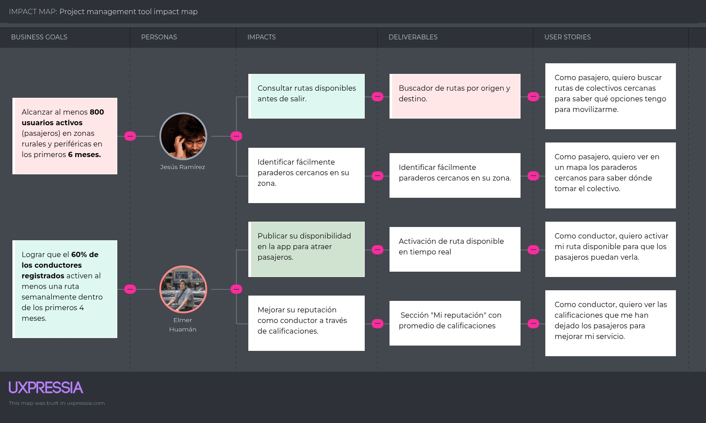

## 3.4. Product Backlog

| Orden | User Story Id | Título | Descripción | Story Points |
|------|--------------|--------|-------------|--------------|
| 1 | US01 | Buscar rutas disponibles | Como pasajero, quiero buscar rutas de colectivos cercanas para saber qué opciones tengo para movilizarme. | 5 |
| 2 | US02 | Ver paraderos en el mapa | Como pasajero, quiero ver en un mapa los paraderos cercanos para saber dónde tomar el colectivo. | 8 |
| 3 | US07 | Activar disponibilidad de ruta | Como conductor, quiero activar mi ruta disponible para que los pasajeros puedan verla. | 5 |
| 4 | US08 | Recibir notificaciones de pasajeros | Como conductor, quiero recibir alertas cuando haya pasajeros interesados en mi ruta. | 5 |
| 5 | US41 | Filtrar rutas por ubicación | Como viajero quiero filtrar por región, provincia, distrito y finalmente ciudad para poder ubicar las rutas que se encuentran en esa locación. | 3 |
| 6 | US42 | Ver resultados de búsqueda | Como viajero quiero ver el resultado del filtro en forma de tarjetas resumidas, para comparar de un vistazo las opciones disponibles. | 3 |
| 7 | US43 | Ver detalles de ruta | Como viajero quiero navegar a la página de detalle de la ruta para ver información completa. | 3 |
| 8 | US24 | Filtrar paraderos por ubicación | Como viajero, quiero filtrar los paraderos por región, provincia, distrito y localidad, para encontrar las opciones más cercanas a mí. | 3 |
| 9 | US25 | Ver detalles completos de una ruta | Como viajero, quiero ver detalles completos de una ruta seleccionada, para conocer la empresa, duración, tarifas y horarios. | 3 |
| 10 | US44 | Volver al listado | Como viajero, quiero ver un botón "Volver al listado", para regresar fácilmente al listado de rutas sin perder los filtros. | 2 |
| 11 | US03 | Ver información del conductor | Como pasajero, quiero ver información del conductor antes de abordar para mayor confianza. | 3 |
| 12 | US09 | Ver demanda de rutas por horario | Como conductor, quiero ver los horarios con mayor demanda para decidir cuándo salir a trabajar. | 5 |
| 13 | US18 | Gestión de Rutas para Empresas | Como empresa de transporte, quiero crear, editar y eliminar rutas, para mantener mi servicio actualizado. | 8 |
| 14 | US36 | Crear ruta | Como gestor de la empresa de transporte, quiero crear una nueva ruta seleccionando dos paraderos existentes. | 5 |
| 15 | US37 | Ver lista de rutas | Como gestor de la empresa de transporte, quiero ver la lista completa de rutas registradas para verificar qué trayectos ofrezco. | 3 |
| 16 | US38 | Editar ruta | Como gestor de la empresa de transporte, quiero editar una ruta existente para ajustar tarifas o corregir errores en la ruta. | 3 |
| 17 | US39 | Eliminar ruta | Como gestor de la empresa de transporte, quiero eliminar una ruta que ya no voy a operar. | 2 |
| 18 | US40 | Configurar horarios de ruta | Como gestor de la empresa de transporte, quiero ingresar los horarios de atención en la que está disponible la ruta. | 3 |
| 19 | US23 | Gestión de paraderos | Como empresa de transporte, quiero agregar, editar o eliminar paraderos, para mantener actualizada mi lista. | 8 |
| 20 | US32 | Crear paradero | Como gestor de la empresa de transporte, quiero crear un nuevo paradero para poder agregarlo al sistema y asociarlo a una ruta. | 5 |
| 21 | US33 | Ver lista de paraderos | Como gestor de la empresa de transporte, quiero ver la lista completa de paraderos registrados. | 3 |
| 22 | US34 | Editar paradero | Como gestor de la empresa de transporte, quiero editar los datos de un paradero para mantener la información siempre actualizada. | 3 |
| 23 | US35 | Eliminar paradero | Como gestor de la empresa de transporte, quiero eliminar un paradero que ya no esté en servicio. | 2 |
| 24 | US21 | Ver resumen general en inicio | Como empresa de transporte, quiero ver un resumen general en la página de inicio (total paraderos, tarifa, etc.). | 5 |
| 25 | US22 | Ver paraderos en inicio | Como empresa de transporte, quiero ver un listado de mis paraderos con su ubicación, para gestionarlos fácilmente. | 3 |
| 26 | US20 | Navegación en toolbar | Como empresa de transporte, quiero navegar fácilmente entre inicio, paraderos y rutas, para gestionar mi servicio. | 2 |
| 27 | TS01 | Configuración de Fake API | Como desarrollador, quiero configurar una Fake API usando JSON Server para simular datos y endpoints. | 5 |
| 28 | TS02 | Simulación de regiones... | Como desarrollador, quiero simular regiones, provincias y distritos para organizar las zonas de operación. | 3 |
| 29 | TS03 | Simulación de paraderos... | Como desarrollador, quiero definir paraderos y localidades para representar puntos de embarque y desembarque. | 3 |
| 30 | TS04 | Simulación de usuarios | Como desarrollador, quiero crear entidades simuladas de conductores y pasajeros para pruebas de interacción en la app. | 3 |
| 31 | TS05 | Simulación de rutas | Como desarrollador, quiero definir rutas simuladas que conecten paraderos, especificando precios y horarios. | 5 |
| 32 | TS06 | Gestión de horarios... | Como desarrollador, quiero establecer horarios de salida de los colectivos para probar disponibilidad en la Fake API. | 3 |
| 33 | TS07 | Relación rutas y paraderos | Como desarrollador, quiero definir la relación entre rutas y paraderos para reflejar su conexión real. | 5 |
| 34 | TS08 | Gestión de itinerarios... | Como desarrollador, quiero permitir que los pasajeros creen itinerarios seleccionando rutas simuladas. | 5 |
| 35 | TS09 | Simulación de precios | Como desarrollador, quiero definir precios variables para las rutas para probar diferentes escenarios de cobro. | 2 |
| 36 | TS10 | Simulación de regiones... | Como desarrollador, quiero simular regiones, provincias y distritos para organizar las zonas de operación de los colectivos. | 2 |
| 37 | TS11 | Simulación de paraderos... | Como desarrollador, quiero definir paraderos y localidades para representar puntos de embarque y desembarque. | 2 |
| 38 | US04 | Calificar al conductor | Como pasajero, quiero calificar al conductor después del viaje para contribuir a la calidad del servicio. | 3 |
| 39 | US05 | Ver historial de viajes | Como pasajero, quiero ver mis viajes anteriores para tener un registro de mis trayectos. | 3 |
| 40 | US10 | Ver calificaciones... | Como conductor, quiero ver las calificaciones que me han dejado los pasajeros para mejorar mi servicio. | 3 |
| 41 | US45 | Crear colección | Como viajero autenticado, quiero crear una nueva colección con un nombre descriptivo, para agrupar rutas. | 3 |
| 42 | US46 | Ver mis colecciones | Como viajero autenticado, quiero ver la lista de mis colecciones existentes. | 2 |
| 43 | US47 | Editar nombre de colección | Como viajero autenticado, quiero editar el nombre de una colección, para renombrarla. | 2 |
| 44 | US48 | Eliminar colección | Como viajero autenticado, quiero eliminar una colección completa, para borrar agrupaciones que ya no uso. | 2 |
| 45 | US49 | Agregar ruta a colección | Como viajero autenticado, quiero ver el botón "Agregar a colección" en la pantalla de detalle de ruta. | 3 |
| 46 | US50 | Seleccionar colección... | Como viajero autenticado, quiero seleccionar la colección a la cual agregar la ruta. | 2 |
| 47 | US51 | Quitar ruta de colección | Como viajero autenticado, quiero quitar una ruta de una colección. | 2 |
| 48 | US52 | Ver rutas de colección | Como viajero autenticado, quiero entrar a una colección específica y ver la lista de rutas guardadas. | 3 |
| 49 | US11 | Explorar desde la Landing | Como visitante, quiero explorar paraderos disponibles desde la Landing Page sin necesidad de registrarme. | 5 |
| 50 | US12 | Consultar cómo funciona | Como visitante, quiero entender cómo funciona el servicio para saber cómo usarlo antes de registrarme. | 2 |
| 51 | US13 | Conocer las ventajas | Como visitante, quiero conocer las ventajas de usar la plataforma para decidirme a utilizarla. | 2 |
| 52 | US14 | Acceder a FAQ | Como visitante, quiero resolver mis dudas rápidamente leyendo preguntas frecuentes. | 2 |
| 53 | US15 | Postular como colaborador | Como visitante, quiero tener una opción para colaborar con la plataforma. | 3 |
| 54 | US06 | Registrarse como conductor | Como conductor, quiero registrarme en la plataforma para ofrecer mi servicio de colectivo. | 5 |
| 55 | US16 | Registro de usuario | Como usuario, quiero registrarme en la plataforma, para poder gestionar mis paraderos y rutas. | 5 |
| 56 | US26 | Registro de usuario (Plataforma) | Como usuario de la plataforma de transporte quiero registrarme para poder iniciar sesión. | 5 |
| 57 | US17 | Inicio de sesión de usuario | Como usuario, quiero iniciar sesión en la plataforma, para gestionar mis paraderos y rutas. | 3 |
| 58 | US27 | Iniciar sesión | Como usuario de la plataforma quiero poder iniciar sesión para tener acceso a la plataforma. | 3 |
| 59 | US28 | Cerrar sesión | Como usuario de la plataforma quiero poder salir de la sesión iniciada para ya no estar más en ella. | 2 |
| 60 | US29 | Editar perfil de usuario | Como usuario de la plataforma me gustaría poder editar mi perfil para mantener actualizado mis datos. | 3 |
| 61 | US30 | Registrar datos de empresa | Como gestor de la empresa de transporte quiero registrar los datos generales de mi compañía tras el primer inicio de sesión. | 5 |
| 62 | US31 | Editar información de empresa | Como gestor de la empresa de transporte, quiero editar la información de la empresa que manejo, para mantenerla actualizada. | 3 |
| 63 | US19 | Personalización de perfil | Como empresa de transporte, quiero subir el logo de mi empresa y especificar su nombre, para que los pasajeros me identifiquen. | 3 |

### 4.1 Design Concepts, ViewPoints & ER Diagrams
#### 4.1.1 Principles Statements
El enfoque de diseño de software se fundamenta en principios sólidos que aseguran la calidad y mantenibilidad del sistema. Se utilizó Domain Driven Design (DDD) para alinear el modelo con una comprensión detallada del dominio empresarial, lo que permite escalar y desarrollar software de manera eficiente, enfocado en las necesidades del negocio. También se incorporó los principios SOLID para garantizar la creación de código limpio y robusto durante todo el ciclo de desarrollo. Conceptos como el Principio de Responsabilidad Única y el Principio de Inversión de Dependencia son esenciales en nuestra metodología.

  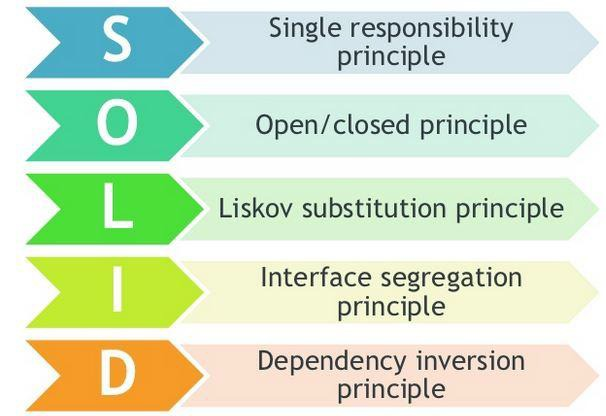

#### 4.1.2 Approaches Statements Architectural Styles & Patterns
Se adoptó Domain-Driven Design (DDD) como enfoque de desarrollo debido a las ventajas que ofrece en la construcción de soluciones alineadas con el negocio. Este enfoque fomenta el uso de un lenguaje ubicuo compartido entre desarrolladores y expertos del dominio, lo que facilita la comunicación y asegura una mejor comprensión de los requerimientos. Asimismo, la segmentación del sistema en bounded contexts permite controlar la complejidad de manera estructurada, asegurando que cada parte del sistema responda de forma precisa a necesidades específicas del dominio.

Adicionalmente, se plantea una evolución progresiva desde una arquitectura monolítica hacia un enfoque basado en microservicios, siguiendo lineamientos compatibles con DDD. Esta estrategia contribuye a mejorar la escalabilidad y mantenibilidad del sistema. La definición de contextos delimitados permite desacoplar funcionalidades y organizar el dominio de forma eficiente. En complemento, la adopción de Clean Architecture garantiza una adecuada separación de responsabilidades, favoreciendo un código más claro, modular y preparado para cambios futuros.

#### 4.1.3 Context Diagram

  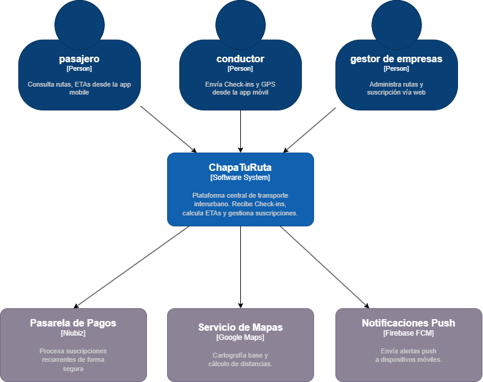

#### 4.1.4 Approach Driven ViewPoints Diagrams
Los esquemas de contenedores ilustran las distintas partes que conforman el sistema, tales como aplicaciones en línea, bases de datos, microservicios y la forma en que interactúan entre ellos. Estos esquemas ofrecen una panorámica detallada de la arquitectura del sistema, resaltando las obligaciones de cada contenedor y sus relaciones entre sí.
Diagrama container:

  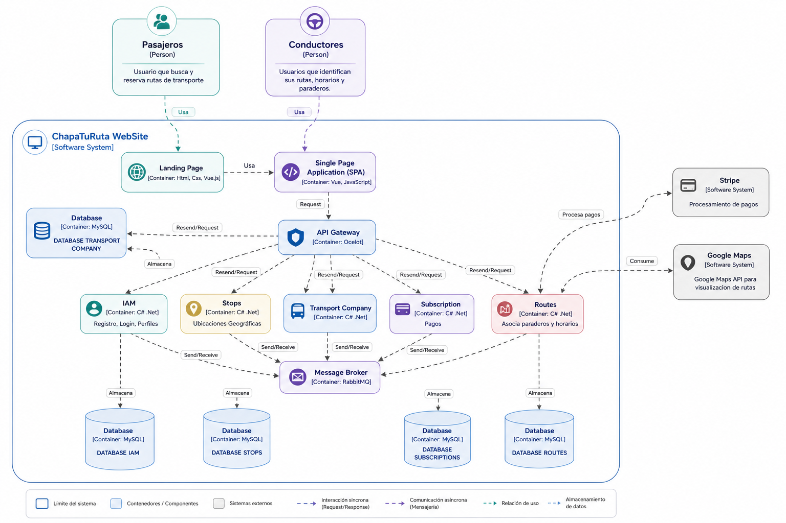

#### 4.1.5 Relational / Non-Relational Database Diagram

  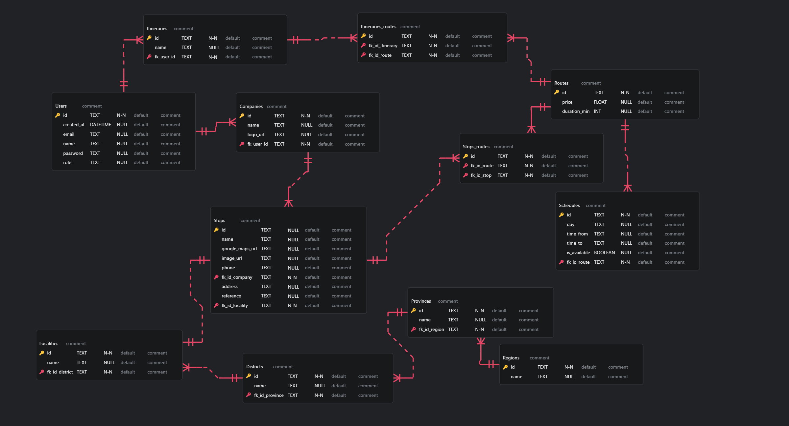

#### 4.1.6 Design Patterns

### Patrón Facade (Fachada)

Es un patrón de diseño de tipo conductual que define una relación de dependencia de uno a muchos entre objetos. Bajo este enfoque, cuando un objeto cambia su estado, comunica automáticamente dicho cambio a todos los objetos que dependen de él. Resulta especialmente útil en sistemas donde es necesario que las modificaciones en un componente se reflejen en otros, evitando un acoplamiento directo entre ellos mediante el uso de notificaciones.

Este patrón permite que tanto el objeto principal como sus observadores puedan evolucionar de manera independiente, sin generar impactos mutuos. Asimismo, brinda flexibilidad al sistema, ya que posibilita agregar o eliminar observadores en tiempo de ejecución, adaptándose a necesidades dinámicas.

  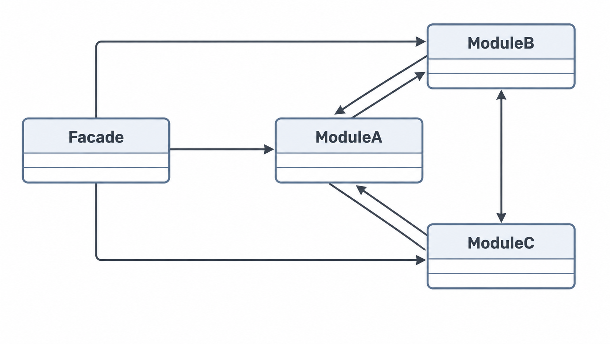

### Patrón Observador

Es un patrón de diseño conductual que define una relación de dependencia de tipo uno a muchos entre distintos objetos. En este esquema, cuando un objeto modifica su estado, informa automáticamente a todos aquellos que dependen de él.

Se utiliza en sistemas donde los cambios en un componente deben propagarse a otros, evitando un acoplamiento directo gracias al uso de mecanismos de notificación. Esto permite que tanto el objeto principal como los dependientes puedan modificarse de forma independiente sin generar impactos entre sí.

Adicionalmente, el patrón proporciona flexibilidad, ya que permite incorporar o remover observadores durante la ejecución, facilitando la adaptación a cambios dinámicos del sistema.

  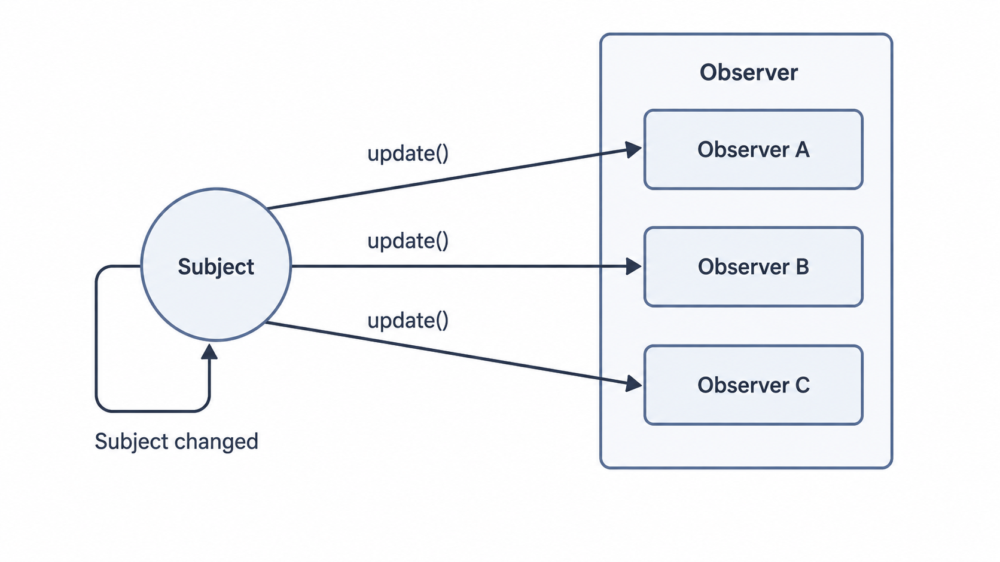

### Patrón Identidad
El Patrón de Identidad tiene como finalidad administrar y representar entidades únicas dentro de un sistema mediante la asignación de un identificador irrepetible, como un ID o UUID, lo que permite mantener su consistencia a lo largo de toda la aplicación. Este patrón resulta especialmente útil en contextos donde es necesario distinguir de manera inequívoca múltiples instancias de un mismo tipo de objeto.

Su aplicación contribuye a la coherencia del sistema, asegurando que cada objeto sea tratado de forma uniforme en los distintos componentes. Asimismo, favorece la eficiencia operativa al facilitar procesos como la búsqueda, almacenamiento y recuperación de objetos, especialmente en entornos con uso de caché o arquitecturas distribuidas.

### Patrón de Entidad
El Patrón de Entidad se utiliza para modelar y gestionar objetos que representan elementos del dominio dentro de un sistema. Una entidad se caracteriza por poseer una identidad única y persistente, lo que permite diferenciarla claramente de otros objetos.

Estas entidades contienen atributos que describen sus propiedades y, además, pueden incorporar comportamientos asociados a su lógica de negocio. Este patrón es ampliamente utilizado en sistemas donde la persistencia y administración de datos son fundamentales, como en bases de datos relacionales y plataformas de gestión de información.

#### 4.1.7 Tactics

### Usabilidad
- **Prototipos y wireframes:** Emplear herramientas de diseño como Figma o Adobe XD para crear prototipos y esquemas visuales antes de desarrollar completamente las funcionalidades.
- **Guía de estilos y consistencia:** Definir una guía de diseño que incluya tipografías, colores y componentes reutilizables para asegurar uniformidad en toda la aplicación.

### Disponibilidad
- **Monitoreo en tiempo real y alertas:** Implementar soluciones que permitan detectar fallas o degradaciones del sistema de forma inmediata, facilitando una respuesta rápida ante incidentes.
- **Compatibilidad multiplataforma:** Asegurar el correcto funcionamiento en los navegadores más utilizados (Chrome, Firefox, Edge y Safari) para garantizar el acceso continuo de los usuarios.
- **Clustering:** Utilizar clústeres de servidores que permitan distribuir la carga y mantener el servicio activo ante la caída de alguno de ellos.
- **Monitoreo proactivo:** Integrar herramientas como New Relic o Datadog para anticipar problemas y mitigarlos antes de que impacten a los usuarios.

### Seguridad
- **Cifrado de datos:** Proteger la información mediante encriptación tanto en tránsito como en reposo, especialmente datos sensibles como transacciones y perfiles.
- **Control de acceso y roles:** Establecer mecanismos que limiten las acciones críticas únicamente a usuarios autorizados.
- **Gestión de roles y permisos:** Implementar un sistema que asigne permisos según el rol del usuario, restringiendo el acceso a funcionalidades específicas.

### 4.2 Architectural Drivers

#### 4.2.1 Design Purpose

El objetivo principal de la arquitectura de **Frock** es definir una base tecnológica sólida que permita administrar rutas de transporte de forma eficiente, confiable y segura. Este diseño busca optimizar el rendimiento del sistema, garantizar su disponibilidad continua y ofrecer tiempos de respuesta adecuados frente a múltiples solicitudes.

Además, la arquitectura está pensada para adaptarse al crecimiento del sistema, permitiendo incrementar el número de usuarios y operaciones sin afectar su funcionamiento. También se considera fundamental la integración con servicios externos y la evolución progresiva del sistema, asegurando la integridad y exactitud de los datos manejados.

---

#### 4.2.1.1 Primary Functionality (Primary User Stories)

A continuación, se describen las funcionalidades clave que influyen directamente en las decisiones de diseño arquitectónico:

##### **US01 – Consulta de rutas disponibles**
El sistema permitirá a los usuarios visualizar rutas disponibles mediante filtros como ubicación, fecha o tipo de servicio. Para ello, será necesario implementar mecanismos eficientes de consulta y gestión de datos que soporten múltiples solicitudes simultáneas.

##### **US07 – Habilitación de rutas**
Los usuarios con permisos específicos podrán activar rutas dentro del sistema para que estén disponibles para su consulta. Esta funcionalidad requiere control de accesos, consistencia en la información y actualización inmediata de los datos.

##### **US18 – Administración de rutas empresariales**
Los administradores tendrán la capacidad de gestionar y asignar rutas a clientes corporativos. Esto implica manejar distintos niveles de acceso, segmentación de información y soporte para diferentes tipos de usuarios.

---

#### 4.2.1.2 Quality Attribute Scenarios

##### **QA01 – Rendimiento**
El sistema deberá responder a múltiples solicitudes concurrentes en un tiempo menor a 2 segundos en la mayoría de los casos bajo condiciones normales de operación.

##### **QA02 – Disponibilidad**
Se espera que la plataforma mantenga un nivel de disponibilidad del 99.9%, asegurando el acceso continuo mediante mecanismos de tolerancia a fallos y redundancia.

##### **QA03 – Exactitud**
La información presentada al usuario, especialmente las rutas, debe ser confiable, manteniendo un margen de error mínimo en los datos procesados.

---

#### 4.2.1.3 Constraints

- **CON-1:** El sistema debe soportar una alta cantidad de usuarios concurrentes, utilizando técnicas de escalabilidad y distribución de carga.  
- **CON-2:** Se empleará MySQL como sistema de base de datos, optimizado para consultas rápidas, uso de índices y replicación de información.  
- **CON-3:** La conexión con servicios externos deberá realizarse mediante APIs seguras, cumpliendo estándares como PCI DSS en el caso de plataformas de pago.  
- **CON-4:** Se deben respetar las normativas de protección de datos vigentes, incluyendo GDPR y la legislación peruana, garantizando la seguridad de la información sensible.  

---

#### 4.2.1.4 Architectural Concerns

- **CRN-1:** Implementar mecanismos de seguridad que incluyan cifrado de datos, autenticación robusta y monitoreo continuo del sistema.  
- **CRN-2:** Diseñar la arquitectura para soportar alta demanda mediante escalabilidad y balanceo de carga dinámico.  
- **CRN-3:** Adoptar un enfoque modular o basado en microservicios que facilite el mantenimiento y la evolución del sistema.  
- **CRN-4:** Mantener una adecuada organización interna con bajo acoplamiento y alta cohesión entre componentes.  
- **CRN-5:** Establecer control de acceso mediante roles y permisos, incluyendo auditoría de acciones dentro del sistema.  

### 4.3 ADD Iterations
#### 4.3.X Iteration N: <Iteration Name>
##### 4.3.X.1 Architectural Design Backlog N
##### 4.3.1.2 Establish Iteration Goal by Selecting Drivers

El objetivo principal de esta primera iteración es refinar la arquitectura inicial del sistema **ChapatuRuta**, enfocándose en la consolidación de las funcionalidades críticas relacionadas con la consulta de rutas, visualización de paraderos y gestión de disponibilidad por parte de los conductores.

Esta iteración está guiada por drivers arquitectónicos prioritarios como la **usabilidad**, el **rendimiento** y la **disponibilidad**, los cuales responden directamente a las características del contexto de uso del sistema. En particular, se considera que los usuarios objetivo —pasajeros y conductores de transporte informal— utilizan dispositivos móviles de gama media o baja, con conectividad limitada, lo que exige una solución ligera, eficiente y de fácil interacción.

Asimismo, se busca garantizar una experiencia de usuario intuitiva que minimice la fricción de uso, especialmente en conductores con baja adaptación tecnológica, quienes requieren interfaces simples y de rápida ejecución. De igual forma, el sistema debe ser capaz de responder de manera ágil a múltiples consultas de rutas, asegurando tiempos de respuesta adecuados incluso en escenarios de alta concurrencia.

En este sentido, la iteración no solo se orienta a validar funcionalidades, sino también a establecer una base arquitectónica coherente que permita soportar el crecimiento del sistema y la incorporación de nuevas capacidades en futuras iteraciones.

---

##### 4.3.1.3 Choose One or More Elements of the System to Refine

En esta iteración, se han seleccionado los siguientes elementos del sistema para su refinamiento, debido a su impacto directo en los drivers arquitectónicos definidos y en la experiencia de los usuarios finales:

| Decisiones | Justificación |
|-----------|--------------|
| **Interfaz de Usuario (Frontend)** | La interfaz de usuario es el principal punto de interacción para pasajeros y conductores, por lo que debe ser altamente intuitiva, accesible y eficiente. Dado que los usuarios operan en contextos de movilidad constante y con limitaciones tecnológicas, es fundamental optimizar la navegación, reducir la cantidad de pasos necesarios para realizar acciones y garantizar tiempos de carga rápidos. |
| **API RESTful (Backend)** | La API constituye el núcleo funcional del sistema, encargándose de procesar solicitudes relacionadas con la búsqueda de rutas, filtrado por ubicación, disponibilidad de conductores y gestión de datos. Su refinamiento es esencial para garantizar la eficiencia en el procesamiento de consultas, la consistencia de la información y la correcta integración con servicios externos como APIs de geolocalización. |

---

##### 4.3.1.4 Choose One or More Design Concepts That Satisfy the Selected Drivers

Con el objetivo de satisfacer los drivers arquitectónicos identificados, se han adoptado los siguientes conceptos de diseño:

| Decisiones | Justificación |
|-----------|--------------|
| **Desarrollo de la interfaz de usuario utilizando Vue.js** | Vue.js permite la construcción de interfaces basadas en componentes reutilizables, facilitando el mantenimiento y la escalabilidad del sistema. Su enfoque progresivo resulta adecuado para el desarrollo incremental del proyecto, mientras que su eficiencia contribuye a mejorar el rendimiento en dispositivos con recursos limitados. |
| **Desarrollo de la API RESTful utilizando .NET** | El uso de .NET permite desarrollar servicios robustos, seguros y de alto rendimiento, capaces de manejar múltiples solicitudes concurrentes. Además, facilita la implementación de buenas prácticas, control de acceso y gestión eficiente de datos. |
| **Aplicación de diseño responsive (Responsive Design)** | El diseño responsive permite adaptar la interfaz a distintos tamaños de pantalla, garantizando una experiencia de usuario consistente tanto en dispositivos móviles como en equipos de escritorio. |
| **Integración con servicios de geolocalización (Mapas)** | La incorporación de APIs de geolocalización permite visualizar rutas y paraderos en tiempo real, mejorando la toma de decisiones y aportando mayor claridad al usuario. |
| **Arquitectura cliente-servidor desacoplada** | La separación entre frontend, backend y base de datos permite reducir el acoplamiento entre componentes, facilitando el mantenimiento, la escalabilidad y la evolución del sistema. |
##### 4.3.X.5 Instantiate Architectural Elements, Allocate Responsibilities, and Define Interfaces
##### 4.3.X.6 Sketch Views (C4 & UML) and Record Design Decisions
##### 4.3.1.7 Analysis of Current Design and Review Iteration Goal (Kanban Board)

###### Analysis of Current Design

En esta iteración, la arquitectura del sistema **ChapatuRuta** se ha definido a nivel preliminar, adoptando un enfoque cliente-servidor compuesto por una interfaz web (frontend), un conjunto de servicios (backend) y una base de datos. Esta organización permite distribuir responsabilidades entre componentes, facilitando tanto el mantenimiento como la evolución futura del sistema.

De igual manera, se han identificado y priorizado un conjunto de historias de usuario (**US01–US09**) que representan las funcionalidades esenciales del sistema para los distintos tipos de usuarios. Estas historias actúan como impulsores del diseño arquitectónico, ya que establecen la necesidad de implementar consultas eficientes, gestión dinámica de disponibilidad y visualización de información en tiempo real.

Además, se ha contemplado la incorporación de servicios de geolocalización y la administración de perfiles de conductores. Esto responde a la necesidad de aumentar la confiabilidad del sistema, permitiendo que los usuarios dispongan de información relevante para la toma de decisiones.

---

###### Fortalezas identificadas

- La propuesta arquitectónica responde de forma directa a los principales retos del dominio, como la detección de rutas disponibles, la ubicación de paraderos, la disponibilidad del servicio y la percepción de seguridad por parte del usuario.  
- Se ha puesto énfasis en la facilidad de uso mediante una interfaz intuitiva y accesible, evitando la obligatoriedad de registro en fases iniciales, lo que disminuye la barrera de entrada y favorece la adopción del sistema.  
- La organización del backlog en historias de usuario claramente definidas permite una gestión ágil del desarrollo, facilitando la planificación iterativa y la distribución de tareas dentro del equipo.  
- La separación de componentes principales (frontend, backend y base de datos) establece una base sólida para futuras mejoras relacionadas con escalabilidad y modularidad.  

---

###### Debilidades y aspectos pendientes

- Aún no se ha definido con precisión la interacción entre los distintos componentes del sistema, especialmente en lo relacionado con la comunicación entre el backend, la base de datos y servicios externos como APIs de geolocalización.  
- El diseño actual no contempla explícitamente mecanismos de escalabilidad, lo cual podría representar un problema ante un aumento significativo de usuarios concurrentes.  
- Los aspectos de seguridad han sido considerados de manera general, pero requieren mayor detalle, particularmente en temas de autenticación, autorización y validación de identidad de los conductores.  
- No se han establecido criterios claros para el manejo de errores, tolerancia a fallos ni estrategias de recuperación, elementos clave para asegurar la continuidad del servicio.  

---

###### Enfoque para la siguiente iteración

En la próxima iteración, el equipo deberá enfocarse en mejorar y detallar la arquitectura del sistema considerando los siguientes puntos:

- Especificar con claridad los componentes del sistema, sus responsabilidades, relaciones e interfaces de comunicación.  
- Fortalecer los mecanismos de seguridad, incluyendo autenticación de usuarios, validación de datos y protección de información sensible.  
- Analizar e implementar estrategias de escalabilidad, como balanceo de carga o distribución de servicios, de acuerdo con los escenarios de crecimiento previstos.  
- Construir prototipos funcionales que permitan validar la experiencia de usuario antes de avanzar hacia la implementación completa.  

---

###### Review Iteration Goal

El propósito de esta iteración fue optimizar la arquitectura inicial del sistema, asegurando que los principales atributos de calidad —como la usabilidad, la accesibilidad y la confianza del usuario— se reflejen adecuadamente en las decisiones de diseño adoptadas.

---

###### Resultados obtenidos

- Se desarrollaron diagramas iniciales utilizando modelos **C4** y **UML**, lo que permitió comprender la estructura general del sistema y la relación entre sus componentes.  
- Se definieron y priorizaron los principales impulsores arquitectónicos, destacando la facilidad de uso, la claridad de la información y la confiabilidad percibida por los usuarios.  
- Se documentaron decisiones clave orientadas a garantizar la flexibilidad del sistema, facilitando su adaptación a futuros requerimientos.  
- Se logró una alineación inicial entre los requerimientos funcionales y los atributos de calidad, estableciendo una base coherente para el diseño arquitectónico.  

---

###### Evaluación del objetivo

Se considera que el objetivo de la iteración ha sido alcanzado de manera satisfactoria, ya que se ha logrado establecer una visión clara de la arquitectura y de los factores que influyen en su diseño. Sin embargo, el nivel de detalle alcanzado sigue siendo conceptual, por lo que será necesario profundizar en aspectos técnicos en futuras iteraciones.

En este sentido, será fundamental avanzar en la definición de interfaces, protocolos de comunicación, mecanismos de seguridad y estrategias de escalabilidad, además de validar las decisiones mediante prototipos más desarrollados.

---

#### 5.3.1.3 Testing Suite Evidence for Sprint Review

Para garantizar la calidad del software y evitar regresiones, se implementó una estrategia de pruebas automatizadas combinando Pruebas Unitarias con Behavior-Driven Development (BDD) utilizando el framework Cucumber y JUnit 5.

### A. Pruebas Unitarias en Capa de Dominio y Aplicación

Se desarrollaron suites con Mockito para validar la lógica de negocio de forma aislada. Por ejemplo, la clase `RegisterUserUseCaseImplTest` verifica que el sistema arroje excepciones de dominio si se intenta registrar un correo previamente existente, mientras que `SearchRoutesUseCaseImplTest` valida que el algoritmo retorne la lista correcta de rutas disponibles.

#### Evidencia de ejecución de pruebas unitarias

  

  <em>
  Ejecución satisfactoria de pruebas automatizadas en el módulo identity-service mediante Maven Surefire y JUnit 5, incluyendo la validación del caso de uso RegisterUserUseCaseImplTest utilizando Mockito.
  </em>

  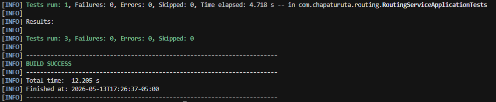

  <em>
  Ejecución satisfactoria de pruebas automatizadas en el módulo routing-service, incluyendo SearchRoutesUseCaseImplTest para validar la lógica de búsqueda de rutas disponibles.
  </em>

---

### B. Pruebas de Comportamiento (BDD con Cucumber)

Se redactaron archivos `.feature` en lenguaje Gherkin para que las pruebas reflejen fielmente los criterios de aceptación del negocio.

- `register_user.feature`: Valida los flujos de éxito y error en la creación de pasajeros y conductores.
- `search_routes.feature`: Simula peticiones de búsqueda de pasajeros indicando distritos de origen y destino, verificando que los Step Definitions (`SearchRoutesSteps.java`) respondan con las rutas esperadas.

#### Evidencia de ejecución BDD

  

  <em>
  Ejecución de escenarios BDD definidos en register_user.feature mediante Cucumber y Step Definitions en el módulo identity-service.
  </em>

  

  <em>
  Validación de escenarios definidos en search_routes.feature utilizando Cucumber y SearchRoutesSteps.java en el módulo routing-service.
  </em>

#### 5.3.1.8 Kanban Board

|  BACKLOG (Product Backlog General) |  TO DO (Sprint 1 Commitments) |  IN PROGRESS |  DONE (Sprint 1 Completado) |
|---|---|---|---|
| US01 Explorar paraderos desde Landing | (Las 8 tareas planificadas para este Sprint ya iniciaron su ciclo) | (Ninguna tarea quedó bloqueada o a medias al cierre del Sprint) | TS01 Seguridad en API Gateway |
| US02 Consultar funcionamiento y ventajas |  |  | TS02 Persistencia Relacional (PostgreSQL) |
| US03 Acceder a FAQ |  |  | US04 Registro de Pasajeros |
| US07 Cierre de Sesión |  |  | US05 Registro de Conductores con RUC |
| US08 Edición de Perfil de Usuario |  |  | US06 Inicio de Sesión con JWT |
| US09 Registro inicial de Empresa |  |  | US12 Crear y listar Paraderos |
| US10 Personalizar perfil de Empresa |  |  | US15 Crear Ruta y Horarios |
| US11 Panel de resumen de métricas |  |  | US17 Búsqueda de Rutas y Transbordos |
| US13 Editar y eliminar Paraderos |  |  |  |
| US14 Visualizar paraderos en el mapa |  |  |  |
| US16 Gestionar Rutas (Editar/Eliminar) |  |  |  |
| US18 Detalle visual de la Ruta |  |  |  |
| US19 Indicar espera en Paradero |  |  |  |
| TS03 Caché de Coordenadas (Redis) |  |  |  |
| US28 Transmitir ubicación GPS |  |  |  |
| US29 Check-in manual en Paraderos |  |  |  |
| US20 Consultar Tiempo Estimado (ETA) |  |  |  |
| TS04 Bus de Eventos (RabbitMQ) |  |  |  |
| US30 Ver concurrencia en tiempo real |  |  |  |
| TS05 Integración de SDK Firebase Admin |  |  |  |
| US21 Notificaciones push de proximidad |  |  |  |
| US22 Confirmación manual de abordaje |  |  |  |
| US23 Eliminación automática de espera |  |  |  |
| US24 Ver información del Conductor |  |  |  |
| US25 Calificar viaje y Conductor |  |  |  |
| US31 Consultar reputación propia |  |  |  |
| US26 Crear y listar Colecciones |  |  |  |
| US27 Gestionar rutas en Colecciones |  |  |  |
| TS06 Pruebas BDD y Unitarias |  |  |  |

### Kanban Board del Sprint 1

  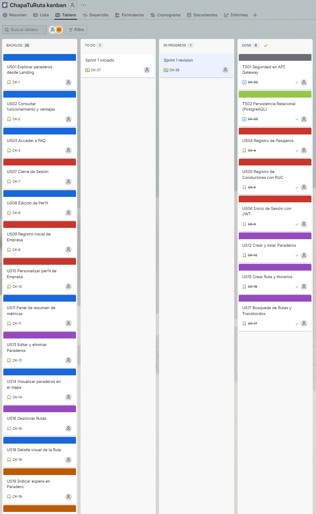

### Descripción de etiquetas

#### 🔵 Azul (Frontend / UX)

- US01 – Explorar paraderos desde Landing
- US02 – Consultar funcionamiento y ventajas
- US03 – Acceder a FAQ
- US08 – Edición de Perfil de Usuario
- US10 – Personalizar perfil de Empresa
- US11 – Panel de resumen de métricas
- US18 – Detalle visual de la Ruta
- US22 – Confirmación manual de abordaje
- US24 – Ver información del Conductor
- US25 – Calificar viaje y Conductor
- US26 – Crear y listar Colecciones
- US27 – Gestionar rutas en Colecciones
- US31 – Consultar reputación propia

#### 🔴 Rojo (Backend)

- US04 – Registro de Pasajeros
- US05 – Registro de Conductores con RUC
- US06 – Inicio de Sesión con JWT
- US07 – Cierre de Sesión
- US09 – Registro inicial de Empresa
- US12 – Crear y listar Paraderos
- US13 – Editar y eliminar Paraderos
- US15 – Crear Ruta y Horarios
- US16 – Gestionar Rutas (Editar/Eliminar)

#### 🟠 Naranja (Tiempo Real / Geolocalización)

- US14 – Visualizar paraderos en el mapa
- US17 – Búsqueda de Rutas y Transbordos
- US19 – Indicar espera en Paradero
- US20 – Consultar Tiempo Estimado (ETA)
- US21 – Notificaciones push de proximidad
- US23 – Eliminación automática de espera
- US28 – Transmitir ubicación GPS
- US29 – Check-in manual en Paraderos
- US30 – Ver concurrencia en tiempo real

#### 🟢 Verde (Base de Datos)

- TS02 – Persistencia Relacional (PostgreSQL)
- TS03 – Caché de Coordenadas (Redis)

#### ⚫ Negro (Infraestructura)

- TS01 – Seguridad en API Gateway
- TS04 – Bus de Eventos (RabbitMQ)
- TS05 – Integración de SDK Firebase Admin

#### 🟨 Amarillo (Testing)

- TS06 – Pruebas BDD y Unitarias

**Fuente:** Elaboración propia mediante Jira.  
**Enlace:** [Kanban Board del Proyecto](https://arturons.atlassian.net/jira/software/projects/CK/boards/2?atlOrigin=eyJpIjoiMmZiZjEyNzNjOWQzNDllOTlhZGI1YmU0YTUyMjM2NWEiLCJwIjoiaiJ9)

#### 5.3.2.8 Kanban Board

|  BACKLOG (Product Backlog General) |  TO DO (Sprint 2 Commitments) |  IN PROGRESS |  DONE (Sprint 2 Completado) |
|---|---|---|---|
| US01 Explorar paraderos desde Landing | (Las 10 tareas planificadas para este Sprint completaron satisfactoriamente su ciclo de desarrollo) | (Ninguna tarea quedó bloqueada o pendiente al cierre del Sprint) | TS03 Caché de Coordenadas (Redis) |
| US02 Consultar funcionamiento y ventajas |  |  | US28 Transmitir ubicación GPS |
| US03 Acceder a FAQ |  |  | US19 Indicar espera en Paradero |
| US07 Cierre de Sesión |  |  | US20 Consultar Tiempo Estimado (ETA) |
| US08 Edición de Perfil de Usuario |  |  | TS04 Bus de Eventos (RabbitMQ) |
| US09 Registro inicial de Empresa |  |  | US23 Eliminación automática de espera |
| US10 Personalizar perfil de Empresa |  |  | TS06 Pruebas BDD y Unitarias (Fase II) |
| US11 Panel de resumen de métricas |  |  | TS07 Dockerización e Infraestructura CI/CD |
| US13 Editar y eliminar Paraderos |  |  | TS08 Configuración Externalizada de Red |
| US14 Visualizar paraderos en el mapa |  |  | TS09 Resiliencia de Sentencias de BD |
| US16 Gestionar Rutas (Editar/Eliminar) |  |  |  |
| US18 Detalle visual de la Ruta |  |  |  |
| US21 Notificaciones push de proximidad |  |  |  |
| US22 Confirmación manual de abordaje |  |  |  |
| US24 Ver información del Conductor |  |  |  |
| US25 Calificar viaje y Conductor |  |  |  |
| US26 Crear y listar Colecciones |  |  |  |
| US27 Gestionar rutas en Colecciones |  |  |  |
| US29 Check-in manual en Paraderos |  |  |  |
| US30 Ver concurrencia en tiempo real |  |  |  |
| US31 Consultar reputación propia |  |  |  |
| TS05 Integración de SDK Firebase Admin |  |  |  |

### Kanban Board del Sprint 2

  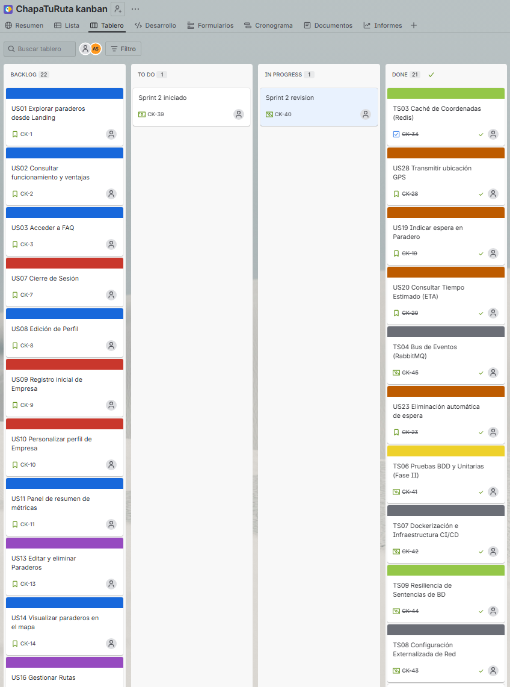

### Descripción de etiquetas

#### 🔵 Azul (Frontend / UX)

- US01 – Explorar paraderos desde Landing
- US02 – Consultar funcionamiento y ventajas
- US03 – Acceder a FAQ
- US08 – Edición de Perfil de Usuario
- US10 – Personalizar perfil de Empresa
- US11 – Panel de resumen de métricas
- US18 – Detalle visual de la Ruta
- US22 – Confirmación manual de abordaje
- US24 – Ver información del Conductor
- US25 – Calificar viaje y Conductor
- US26 – Crear y listar Colecciones
- US27 – Gestionar rutas en Colecciones
- US31 – Consultar reputación propia

#### 🔴 Rojo (Backend)

- US07 – Cierre de Sesión
- US09 – Registro inicial de Empresa
- US13 – Editar y eliminar Paraderos
- US16 – Gestionar Rutas (Editar/Eliminar)

#### 🟠 Naranja (Tiempo Real / Geolocalización)

- US14 – Visualizar paraderos en el mapa
- US19 – Indicar espera en Paradero
- US20 – Consultar Tiempo Estimado (ETA)
- US21 – Notificaciones push de proximidad
- US23 – Eliminación automática de espera
- US28 – Transmitir ubicación GPS
- US29 – Check-in manual en Paraderos
- US30 – Ver concurrencia en tiempo real

#### 🟢 Verde (Base de Datos)

- TS03 – Caché de Coordenadas (Redis)
- TS09 – Resiliencia de Sentencias de BD

#### ⚫ Negro (Infraestructura)

- TS04 – Bus de Eventos (RabbitMQ)
- TS05 – Integración de SDK Firebase Admin
- TS07 – Dockerización e Infraestructura CI/CD
- TS08 – Configuración Externalizada de Red

#### 🟨 Amarillo (Testing)

- TS06 – Pruebas BDD y Unitarias (Fase II)

**Fuente:** Elaboración propia mediante Jira.  
**Enlace:** [Kanban Board del Proyecto](https://arturons.atlassian.net/jira/software/projects/CK/boards/2?atlOrigin=eyJpIjoiMmZiZjEyNzNjOWQzNDllOTlhZGI1YmU0YTUyMjM2NWEiLCJwIjoiaiJ9)
