<p align="center">
    <br />
    
    <br />
    <strong>Universidad Peruana de Ciencias Aplicadas</strong>
    <br /><br />
    <strong>Carrera de Ingeniería de Software</strong>
    <br /><br />
    <strong>Ciclo 202610</strong>
    <br /><br />
    1ASI0657-2610 - Fundamentos de Arquitectura de Software
    <br /><br />
    <strong>NRC:</strong> 7940 <br /><br />
    <strong>Profesor:</strong> Mori Yzaguirre, Daniel Enrique <br /><br />
    <strong>Informe de TB1</strong>
  </p>

  <div style="width: 80%; margin: 0 auto; text-align: center">
    <p>
      <strong>Startup:</strong> Grupo 10 
      <br />
      <strong>Producto:</strong> ChapaTuRuta
    </p>

  <div>
      <strong>Relación de integrantes</strong>
      <br /><br />
      <table style="width: 60%; margin: 0 auto;   text-align: left">
        <thead>
          <tr>
            <th>Código</th>
            <th>Nombre</th>
          </tr>
        </thead>
        <tbody>
          <tr>
            <td>u20231c540 </td>
            <td> Rios Pacheco, Hector </td>
          </tr>
          <tr>
            <td> u20231e795 </td>
            <td> Nuñez Soto, Andy Arturo </td>
          </tr>
          <tr>
            <td> u202210334 </td>
            <td> Valerio Garcia, Adrian Emanuel </td>
          </tr>
        </tbody>
      </table>
      <p style="text-align: center">
        <br />
        <strong>Abril 2026</strong>
      </p>
    </div>

  </div>
</div>

<div style="page-break-after: always;"></div>

| Versión | Fecha | Autor | Descripción de modificación |
| :--- | :--- | :--- | :--- |
|  1.0    | 18/04/2026 | Héctor Ríos,  Arturo Nuñez, Adrian Valerio                                              | Añadido template, perfil de la startup, antecedentes y problemática; incorporación de Hypothesis Statements y Lean UX Canvas; segmentos objetivo, needfinding, entrevistas y especificación de requisitos                                                                                                               |


# Project Report Collaboration Insights

En esta seccion se registra la colaboración de todo el equipo durante el desarrollo del informe del proyecto, backend. 

- Organización: https://github.com/1ASI0657-2610-7940-G10

Se adjunta el enlace del repositorios:

| Repository Name | Link |
| :--- | :--- |
| **report** |[ [https://github.com/1ASI0657-2610-7940-G10/report](https://github.com/1ASI0657-2610-7940-G10/report)|

# Contenido

_Tabla de contenidos_


- Student Outcome

- Capítulo I: Introducción
  - [1.1 Startup Profile](#11-startup-profile)
    - [1.1.1 Descripción de la Startup](#111-descripcion-de-la-startup)
    - [1.1.2 Perfiles de integrantes del equipo](#112-perfiles-de-integrantes-del-equipo)
  - [1.2 Solution Profile](#12-solution-profile)
    - [1.2.1 Nombre del producto](#121-nombre-del-producto)
    - [1.2.2 Antecedentes y problemática](#122-antecedentes-y-problematica)
    - [1.2.3 Lean UX Process](#123-lean-ux-process)
      - [1.2.3.1 Lean UX Problem Statement](#1231-lean-ux-problem-statement)
      - [1.2.3.2 Lean UX Assumptions](#1232-lean-ux-assumptions)
      - [1.2.3.3 Lean UX Hypothesis](#1233-lean-ux-hypothesis)
      - [1.2.3.4 Lean UX Canvas](#1234-lean-ux-canvas)
  - [1.3 Segmentos objetivo](#13-segmentos-objetivo)

- Capítulo II: Requirements  & Analysis
  - [2.1 Competidores](#21-competidores)
  - [2.2 Entrevistas](#22-entrevistas)
  - [2.3 Needfinding](#23-needfinding)
    - [2.3.1 User Personas](#231-user-personas)
    - [2.3.2 User Task Matrix](#232-user-task-matrix)
    - [2.3.3 Empathy Maps](#233-empathy-maps)
    - [2.3.4 As-is Scenario Mapping](#234-as-is-scenario-mapping)

- Capítulo III: Requirements Specification
  - [3.1 To-Be Scenario Mapping](#31-to-be-scenario-mapping)
  - [3.2 User Stories](#32-user-stories)
  - [3.3 Impact Map](#33-impact-map)
  - [3.4 Product Backlog](#34-product-backlog)

- Capítulo IV: Product Architecture Design
  - [4.1 Design Concepts, ViewPoints & ER Diagrams](#41-design-concepts-viewpoints--er-diagrams)
    - [4.1.1 Principles Statements](#411-principles-statements)
    - [4.1.2 Approaches Statements Architectural Styles & Patterns](#412-approaches-statements-architectural-styles--patterns)
    - [4.1.3 Context Diagram](#413-context-diagram)
    - [4.1.4 Approach Driven ViewPoints Diagrams](#414-approach-driven-viewpoints-diagrams)
    - [4.1.5 Relational / Non-Relational Database Diagram](#415-relational--non-relational-database-diagram)
    - [4.1.6 Design Patterns](#416-design-patterns)
    - [4.1.7 Tactics](#417-tactics)
    - [4.1.8 Design Purpose](#418-design-purpose)
    - [4.1.9 Primary Functionality (Primary User Stories)](#419-primary-functionality-primary-user-stories)
    - [4.1.10 Quality Attribute Scenarios](#4110-quality-attribute-scenarios)
    - [4.1.11 Constraints](#4111-constraints)
    - [4.1.12 Architectural Concerns](#4112-architectural-concerns)

  - [4.2 Architectural Drivers](#42-architectural-drivers)

  - [4.3 ADD Iterations](#43-add-iterations)
    - [4.3.X Iteration N: <Iteration Name>](#43x-iteration-n-iteration-name)
      - [4.3.X.1 Architectural Design Backlog N](#43x1-architectural-design-backlog-n)
      - [4.3.X.2 Establish Iteration Goal by Selecting Drivers](#43x2-establish-iteration-goal-by-selecting-drivers)
      - [4.3.X.3 Choose One or More Elements of the System to Refine](#43x3-choose-one-or-more-elements-of-the-system-to-refine)
      - [4.3.X.4 Choose One or More Design Concepts That Satisfy the Selected Drivers](#43x4-choose-one-or-more-design-concepts-that-satisfy-the-selected-drivers)
      - [4.3.X.5 Instantiate Architectural Elements, Allocate Responsibilities, and Define Interfaces](#43x5-instantiate-architectural-elements-allocate-responsibilities-and-define-interfaces)
      - [4.3.X.6 Sketch Views (C4 & UML) and Record Design Decisions](#43x6-sketch-views-c4--uml-and-record-design-decisions)
      - [4.3.X.7 Analysis of Current Design and Review Iteration Goal (Kanban Board) (Avance 2)](#43x7-analysis-of-current-design-and-review-iteration-goal-kanban-board-avance-2)

- Capítulo V: Product Implementation, Validation & Deployment
  - [5.1 Testing Suites & General Patterns](#51-testing-suites--general-patterns)
    - [5.1.1 Backend Application Core Testing Suite](#511-backend-application-core-testing-suite)
    - [5.1.2 Pattern Based Backend Application(s)](#512-pattern-based-backend-applications)
    - [5.1.3 Pattern Based Custom Software Library](#513-pattern-based-custom-software-library)
    - [5.1.4 Framework Pattern Driven Refactoring Report](#514-framework-pattern-driven-refactoring-report)

  - [5.2 Software Configuration Management](#52-software-configuration-management)
    - [5.2.1 Software Development Environment Configuration](#521-software-development-environment-configuration)
    - [5.2.2 Source Code Management](#522-source-code-management)
    - [5.2.3 Source Code Style Guide & Conventions](#523-source-code-style-guide--conventions)
    - [5.2.4 Software Deployment Configuration](#524-software-deployment-configuration)

  - [5.3 Microservices Implementation](#53-microservices-implementation)
    - [5.3.1 Sprint 1](#531-sprint-1)
      - [5.3.1.1 Sprint Backlog 1](#5311-sprint-backlog-1)
      - [5.3.1.2 Development Evidence for Sprint Review](#5312-development-evidence-for-sprint-review)
      - [5.3.1.3 Testing Suite Evidence for Sprint Review](#5313-testing-suite-evidence-for-sprint-review)
      - [5.3.1.4 Execution Evidence for Sprint Review](#5314-execution-evidence-for-sprint-review)
      - [5.3.1.5 Microservices Documentation Evidence for Sprint Review](#5315-microservices-documentation-evidence-for-sprint-review)
      - [5.3.1.6 Software Deployment Evidence for Sprint Review](#5316-software-deployment-evidence-for-sprint-review)
      - [5.3.1.7 Team Collaboration Insights during Sprint](#5317-team-collaboration-insights-during-sprint)
      - [5.3.1.8 Kanban Board](#5318-kanban-board)

# Student Outcome

El curso cumple de manera directa el cumplimiento del Student Outcome 5 definido por ABET - EAC, asegurando que los integrantes logren alcanzar las competencias establecidas.

**Criterio:** La capacidad de funcionar efectivamente en un equipo cuyos miembros juntos proporcionan liderazgo, crean un entorno de colaboración e inclusivo, establecen objetivos, planifican tareas y cumplen objetivos.

| Criterio  | Acciones realizadas        | Conclusiones    |
| :------------------ | :------------------------------------------------- | :-------------------------------------------------------------------------------------- |
| **Actualiza conceptos y conocimientos necesarios para su desarrollo profesional y en especial para su proyecto en soluciones de software.** | **Héctor Rios AV1:** Contribuí realizando el capítulo 1 y sedimentando las bases del proyecto <br><br> **Arturo Nuñez AV1:** Contribuí realizando parte del capítulo II <br><br> **Adrian Valerio AV1:** Contribuí realizando el capítulo III y entrevistas <br><br> **Héctor Rios AV2:** Lideré el diseño arquitectónico detallado en el Capítulo 4, aplicando el método ADD, seleccionando patrones avanzados (CQRS, Strategy, Repository) y definiendo escenarios de atributos de calidad <br><br> **Adrian Valerio AV2:** Participé en la estructuración y documentación del Capítulo 4, apoyando en la definición de contenedores, relaciones entre componentes (C4) y validación de decisiones arquitectónicas alineadas a los atributos de calidad <br><br> **Arturo Nuñez AV2:** Contribuí en el desarrollo y documentación del Capítulo 4, participando en la definición de drivers arquitectónicos, estructuración en Markdown, organización del contenido y apoyo en la coherencia técnica del diseño propuesto <br><br> **Héctor Rios TP1:** Lideré el desarrollo del Capítulo V relacionado con implementación, validación y despliegue del producto, participando en la configuración del entorno de desarrollo, gestión de código fuente, definición de convenciones de estilo, implementación de microservicios, desarrollo de evidencias de testing, despliegue y documentación técnica del Sprint 1, así como en la organización del tablero Kanban y evidencias de colaboración del equipo <br><br> **Adrian Valerio TP1:** Participé en el desarrollo del Capítulo V, apoyando en la implementación del producto, validación de funcionalidades, documentación técnica, organización de evidencias del Sprint 1 y revisión del despliegue de la solución en el repositorio del proyecto <br><br> **Arturo Nuñez TP1:** Participé en el desarrollo del Capítulo V relacionado con implementación y validación del Sprint 1, contribuyendo en la documentación técnica en Markdown, organización del Kanban Board, estructuración de evidencias de testing automatizado con JUnit y Cucumber, integración de evidencias de despliegue, y apoyo en la documentación de microservicios, pruebas y repositorios del proyecto. <br><br> **Arturo Nuñez AV3:** Participé en el desarrollo y documentación del Capítulo V correspondiente al Sprint 2, contribuyendo en la elaboración y actualización del Kanban Board, organización de historias de usuario y tareas técnicas, estructuración de evidencias de implementación y validación, documentación en Markdown de los avances del proyecto y apoyo en la consolidación de artefactos relacionados con infraestructura, testing y funcionalidades desarrolladas durante la iteración.| **Héctor Rios AV1:** El desarrollo del capítulo 1 me permitió reforzar mis conocimientos sobre la estructura inicial de un proyecto de software. Esto me ayudó a entender mejor cómo construir una base sólida para futuros proyectos. <br><br> **Arturo Nuñez AV1:** Al trabajar en el capítulo II, comprendí la importancia de investigar y aplicar correctamente los conceptos teóricos, mejorando la calidad del proyecto. <br><br> **Adrian Valerio AV1:** El desarrollo del capítulo III y las entrevistas fortaleció mi capacidad de análisis y aplicación práctica del conocimiento. <br><br> **Héctor Rios AV2:** La ejecución de iteraciones ADD y el uso de patrones como CQRS y arquitectura orientada a eventos me permitió elevar mi nivel técnico en diseño de sistemas complejos, comprendiendo mejor cómo lograr escalabilidad y desacoplamiento. <br><br> **Adrian Valerio AV2:** La participación en el diseño arquitectónico y modelado C4 me permitió consolidar mis conocimientos en estructuración de sistemas, comprendiendo mejor la relación entre componentes y la importancia de documentar decisiones técnicas. <br><br> **Arturo Nuñez AV2:** La participación en la organización y documentación del diseño arquitectónico me permitió fortalecer mis habilidades en estructuración de contenido técnico, comprensión de drivers arquitectónicos y uso de herramientas como Markdown para la presentación profesional de soluciones de software. <br><br> **Héctor Rios TP1:** El desarrollo del Capítulo V me permitió fortalecer mis conocimientos en pruebas automatizadas, gestión de configuración de software, despliegue de aplicaciones y desarrollo de microservicios. Además, comprendí mejor la importancia de integrar testing, documentación y colaboración continua para garantizar la calidad y mantenibilidad de soluciones de software modernas. <br><br> **Adrian Valerio TP1:** La participación en la implementación, validación y documentación del Sprint 1 me permitió reforzar mis conocimientos sobre despliegue de aplicaciones, control de versiones, organización de evidencias y desarrollo colaborativo en soluciones de software. <br><br> **Arturo Nuñez TP1:** La participación en el desarrollo del Capítulo V me permitió fortalecer mis conocimientos en documentación técnica profesional, organización de evidencias de testing automatizado, metodologías ágiles con Kanban, estructuración de microservicios y uso de herramientas de validación y despliegue dentro de soluciones modernas de software. <br><br> **Arturo Nuñez AV3:** La participación en el desarrollo del Sprint 2 me permitió ampliar mis conocimientos en documentación técnica, seguimiento de proyectos ágiles mediante Kanban, organización de evidencias de implementación, gestión de requerimientos y comprensión de componentes relacionados con infraestructura, bases de datos, geolocalización y testing dentro de una solución de software moderna.|
| **Reconoce la necesidad del aprendizaje permanente para el desempeño profesional y el desarrollo de proyectos en soluciones de software.**  | **Héctor Rios AV1:** Contribuí realizando el capítulo 1 y sedimentando las bases del proyecto <br><br> **Arturo Nuñez AV1:** Contribuí realizando parte del capítulo II <br><br> **Adrian Valerio AV1:** Contribuí realizando el capítulo III y entrevistas <br><br> **Héctor Rios AV2:** Lideré el diseño arquitectónico detallado en el Capítulo 4, aplicando el método ADD y patrones avanzados <br><br> **Adrian Valerio AV2:** Apoyé en la investigación y comprensión de patrones arquitectónicos y herramientas de modelado, reforzando el aprendizaje continuo aplicado al proyecto <br><br> **Arturo Nuñez AV2:** Participé en el análisis de decisiones arquitectónicas y en la mejora de la documentación técnica, investigando conceptos relacionados con drivers, atributos de calidad y buenas prácticas de estructuración <br><br> **Héctor Rios TP1:** Participé en la implementación y validación de microservicios, investigando herramientas de testing automatizado, gestión de despliegue, control de versiones y prácticas de integración continua para fortalecer el desarrollo del Sprint 1 <br><br> **Adrian Valerio TP1:** Participé en la revisión e implementación de funcionalidades del Sprint 1, investigando aspectos relacionados con el despliegue, organización del repositorio, documentación técnica y validación de evidencias del proyecto <br><br> **Arturo Nuñez TP1:** Participé en la investigación y documentación de herramientas utilizadas durante el Sprint 1, incluyendo testing automatizado con JUnit y Cucumber, gestión de repositorios GitHub, estructuración de microservicios y organización de evidencias técnicas mediante Markdown y tableros Kanban. <br><br> **Arturo Nuñez AV3:** Participé en la investigación y documentación de tecnologías y prácticas utilizadas durante el Sprint 2, incluyendo mecanismos de caché con Redis, mensajería mediante RabbitMQ, pruebas automatizadas, despliegue de servicios y herramientas de integración, fortaleciendo mi capacidad de aprendizaje continuo aplicada al desarrollo del proyecto. | **Héctor Rios AV1:** Comprendí la importancia de mantenerme en constante aprendizaje para mejorar mi desempeño en proyectos futuros. <br><br> **Arturo Nuñez AV1:** Identifiqué que el aprendizaje continuo es clave para adaptarme a nuevos retos dentro del proyecto. <br><br> **Adrian Valerio AV1:** Entendí que cada experiencia es una oportunidad de aprendizaje, reforzando la importancia de la mejora continua. <br><br> **Héctor Rios AV2:** Al enfrentar desafíos de diseño como alta disponibilidad y procesamiento asíncrono con RabbitMQ, reafirmé la necesidad de aprender constantemente nuevas tecnologías para construir soluciones modernas y resilientes. <br><br> **Adrian Valerio AV2:** La exposición a decisiones arquitectónicas y nuevas herramientas evidenció la necesidad de seguir aprendiendo continuamente para adaptarme a entornos tecnológicos más complejos y cambiantes. <br><br> **Arturo Nuñez AV2:** La participación en el desarrollo del capítulo 4 me permitió reconocer la importancia del aprendizaje continuo, especialmente en temas de arquitectura de software y documentación técnica, necesarios para enfrentar proyectos de mayor complejidad. <br><br> **Héctor Rios TP1:** La implementación práctica de pruebas, despliegue y microservicios me permitió reconocer que el aprendizaje permanente es esencial para adaptarse a nuevas herramientas, metodologías ágiles y tecnologías emergentes utilizadas en el desarrollo profesional de software. <br><br> **Adrian Valerio TP1:** El trabajo realizado en el Sprint 1 me permitió reconocer la importancia de seguir aprendiendo sobre herramientas de desarrollo, despliegue, control de versiones y documentación técnica para mejorar mi desempeño profesional en proyectos de software. <br><br> **Arturo Nuñez TP1:** El desarrollo del Sprint 1 me permitió reconocer la importancia del aprendizaje continuo en tecnologías de testing, documentación técnica, metodologías ágiles y herramientas colaborativas, comprendiendo que la actualización constante es fundamental para adaptarse a proyectos de software cada vez más complejos. <br><br> **Arturo Nuñez AV3:** El trabajo realizado durante el Sprint 2 me permitió reconocer la importancia de mantener un aprendizaje continuo en tecnologías emergentes, herramientas de infraestructura, metodologías ágiles y prácticas de integración, comprendiendo que la actualización constante es fundamental para afrontar proyectos de software con mayores niveles de complejidad y escalabilidad.|


# Capítulo I: Introducción
## 1.1. Startup Profile
Somos un equipo de estudiantes de la Universidad Peruana de Ciencias Aplicadas (UPC) motivados en desarrollar una solución que cuyo objetivo principal sea ayudar a las personas que usan el transporte público.

### 1.1.1. Descripción de la Startup
ChapaTuRuta es un startup enfocado en desarrollar soluciones de software eficientes que resuelvan problemas reales de infraestructura y logística urbana. Priorizamos el rendimiento y la escalabilidad, así como la adopción de prácticas de desarrollo para ofrecer una solución robusta que mejore el tránsito en la ciudad.

**Misión:** Brindar a los estudiantes universitarios una solución digital y accesible que proteja sus pertenencias y su tranquilidad mientras viven lejos de casa, facilitando seguros personalizados y procesos ágiles de gestión y reclamación.

**Visión:** Ser la startup líder en seguros digitales para estudiantes universitarios, reconocida por ofrecer protección confiable, rápida y adaptada a sus necesidades.

### 1.1.2. Perfiles de integrantes del equipo
| Foto | Información General |
| :---: | :--- |
|  | **Nombre y Apellidos:** <br> Adrian Emanuel Valerio Garca <br><br> **Código:** <br> u202210334 <br><br> **Carrera:** <br> Ingeniería de Software <br><br> **Información:** <br> Mi nombre es Adrian Valerio Garcia y tengo 21 años. Soy estudiante de la carrera de Ingeniería de Software en la Universidad Peruana de Ciencias Aplicadas (UPC). Me interesa el aprendizaje continuo y suelo enfocarme en resolver problemas de manera rápida y eficiente. Disfruto los videojuegos y aprender nuevas tecnologías, además de trabajar en equipo para lograr objetivos en conjunto. Tengo conocimientos en lenguajes de programación y procuro mejorar constantemente mis métodos de estudio para ampliar mis habilidades. |

| Foto | Información General |
| :---: | :--- |
|  | **Nombre y Apellidos:** Héctor Javier Rios Pacheco <br>  <br><br> **Código:** <br> u20231c540 <br><br> **Carrera:** <br> Ingeniería de Software <br><br> **Información:** <br> Soy responsable, me gusta involucrarme activamente en los proyectos, aportar ideas útiles y cumplir con mis tareas a tiempo. Siempre estoy dispuesto a colaborar y ayudar al equipo a avanzar de la mejor manera posible. |

| Foto | Información General |
| :---: | :--- |
|  | **Nombre y Apellidos:** <br> Nuñez Soto, Andy Arturo <br><br> **Código:** <br> U20231e795 <br><br> **Carrera:** <br> Ingeniería de Software <br><br> **Información:** <br> Soy una persona creativa y comprometida, lo que me permite enfrentar desafíos con determinación y encontrar soluciones efectivas. Voy a aportar mis habilidades al proyecto con el objetivo de alcanzar resultados exitosos. |

## 1.2. Solution Profile

### 1.2.1. Nombre del Producto

ChapaTuRuta es una aplicación móvil diseñada para pasajeros y conductores del sistema de transporte interurbano. Permitiendo a los usuarios consultar tiempos estimados de llegada en tiempo y planificar viajes que requieren transbordos estáticos. La propuesta se centra en eliminar la incertidumbre y reducir los tiempos de espera "a ciegas" mediante un sistema de rastreo combinado: los conductores pueden reportar su ubicación vía GPS continuo o mediante un botón de "Check-in"de manera manual al llegar a paraderos clave. El modelo busca formalizar la información de rutas periféricas con una interfaz minimalista, accesible y de rápida respuesta.

### 1.2.2. Antecedentes y problemática
**What**  
-	Los pasajeros del transporte interurbano no cuentan con herramientas para conocer el tiempo estimado de llegada del transporte para planificar rutas con transbordos eficientemente. Al mismo tiempo, los conductores operan a ciegas, sin saber en qué paraderos hay concentración de demanda.

**When**  
-	El problema ocurre diariamente, pero se agudiza en las "horas punta", momentos en los que la necesidad de hacer transbordos es alta y la incertidumbre genera tardanzas y estrés.

**Where**  
-	Surge en zonas periféricas, distritos interurbanos y rutas largas donde el transporte masivo formal no tiene cobertura eficiente. Ocurre en paraderos, esquinas y terminales de paso.

**Who**  
-	Afecta a dos grupos principales: **Los pasajeros** (estudiantes universitarios y trabajadores que dependen de este medio para su rutina diaria) y **los conductores** (choferes que buscan optimizar el recojo de pasajeros).

**Why**  
-	Este problema persiste porque el ecosistema de colectivos es semi-informal por naturaleza. Las aplicaciones de movilidad existentes (como Google Maps o Moovit) están diseñadas para únicamente para ver rutas mas no generan un seguimiento, y no se adaptan a la flexibilidad de rutas ni a las limitaciones tecnológicas de estos conductores.

**How**  
-	Los pasajeros pierden tiempo esperando "a ciegas" en la vía pública, exponiéndose a la inseguridad y al clima.

-	En caso de no encontrar ruta directa, toman decisiones de transbordo ineficientes que les cuestan más dinero.

-	Los conductores se detienen innecesariamente en paraderos vacíos o pierden pasajeros por no avisar su cercanía.
 

**How much**  
-	En gran parte de las principales ciudades del país, el transporte representa un alto porcentaje de los viajes motorizados diarios. Los usuarios pueden llegar a perder en promedio entre 20 a 40 minutos diarios de su tiempo productivo únicamente esperando en los paraderos sin saber a qué hora pasará su vehículo. Y según datos publicados por el comercio, Lima no solo está dentro del top 10 de ciudades con más tráfico del mundo, también que se pierden alrededor de 195 horas al año en horas punta.

---

### 1.2.3. Lean UX Process
#### 1.2.3.1. Lean UX Problem Statements
- Los pasajeros y conductores del transporte interurbano enfrentan una constante falta de previsibilidad sobre los tiempos de llegada y las opciones de transbordo. Las aplicaciones de navegación tradicionales ignoran este sector, obligando a las personas a esperar sin referencias en los paraderos, lo que provoca pérdida de tiempo productivo, exposición a la inseguridad y un servicio ineficiente.
Hemos observado que esta falta de información genera una falta de gestión de tiempo en los usuarios diarios al no poder planificar sus trayectos, mientras que los conductores operan sin saber dónde se concentra la demanda, perdiendo oportunidades de llenar sus vehículos rápidamente.
¿Cómo podríamos ofrecer una plataforma digital minimalista que estandarice la información de rutas informales y calcule tiempos de espera precisos mediante un rastreo de bajo consumo, permitiendo a los pasajeros planificar sus viajes con seguridad sin generar fricción tecnológica para el conductor?

#### 1.2.3.2. Lean UX Assumptions

### Supuestos del negocio

#### 1. Necesidad del Cliente
Creo que mis clientes tienen la necesidad de:
- Conocer con anticipación la ubicación y el tiempo estimado de llegada de los vehículos de transporte interurbano informal.
- Evitar esperas prolongadas.
- Planificar rutas que requieren transbordos.

#### 2. Propuesta de Solución
Estas necesidades pueden resolverse con:
- **ChapaTuRuta**, una plataforma digital y minimalista que:
  - Conecta a conductores y pasajeros mediante un sistema asíncrono de reporte de ubicación.
  - Integra un motor de sugerencias de rutas.
  - Se adapta a las limitaciones de red de la periferia urbana.

#### 3. Segmento de Clientes
Mis clientes iniciales son (o serán):
- **Pasajeros**:
  - Estudiantes
  - Trabajadores
  - Personas que dependen del transporte periférico e informal diario
- **Conductores**:
  - Colectivos
  - Minivans
  - Interesados en optimizar el recojo de pasajeros

#### 4. Propuesta de Valor
El principal valor que un cliente quiere obtener de mi servicio es:
- Reducción de la incertidumbre
- Ahorro de tiempo
- Mayor seguridad (evitar exposición en paraderos vacíos)

#### 5. Canales de Adquisición
Adquiriré la mayoría de mis clientes a través de:
- Recomendación boca a boca
- Paraderos de alta afluencia
- Campus universitarios

#### 6. Modelo de Ingresos
Ganaré dinero mediante:
- **Modelo freemium**
  - Publicidad no invasiva orientada a comercios locales a lo largo de la ruta
- **Alianzas B2B**
  - Suscripción a asociaciones de transportistas
  - Entrega de reportes de demanda de pasajeros

#### 7. Competencia
Mi principal competencia en el mercado será:
- Aplicaciones globales:
  - Moovit
  - Google Maps
- Alternativas locales:
  - TuRuta

##### Ventaja Competitiva
Superaremos a la competencia debido a:
- Enfoque exclusivo en el ecosistema informal e interurbano
- Bajo consumo de datos (modelo de **Check-in**)

#### 8. Riesgos Principales
El mayor riesgo de mi producto es:
- Que los conductores olviden o decidan no interactuar con el botón de "Check-in" manual

##### Mitigación
- Interfaz de uso rápido (un solo toque)
- Diseño que no interrumpa la conducción

#### 9. Suposiciones Críticas
Otras suposiciones que, si se demuestran falsas, harán que el negocio fracase:
- Que los pasajeros confíen en un ETA basado en reportes asíncronos en lugar de un mapa GPS en vivo


### Supuestos del Cliente

#### 1. ¿Quién es el cliente?
- **Pasajeros**:
  - Estudiantes
  - Trabajadores
  - Residentes de zonas periféricas con largas esperas de transporte
- **Conductores**:
  - Choferes de transporte interurbano

#### 2. ¿Dónde encaja nuestro producto en su vida?
El producto se integra en la rutina diaria de movilidad:

- **Pasajeros**:
  - Minutos antes de salir de casa o del trabajo hacia el paradero
- **Conductores**:
  - Durante toda la jornada laboral al volante

#### 3. ¿Qué problemas soluciona nuestro producto?
- Incertidumbre sobre cuándo pasará el próximo colectivo
- Falta de información para realizar transbordos efectivos entre rutas

#### 4. ¿Cuándo y cómo se utiliza nuestro producto?

- **Pasajeros**:
  - Uso diario y breve antes de salir
  - Interacción mediante buscador de origen/destino

- **Conductores**:
  - Uso intermitente pero constante durante la jornada
  - Interacción rápida (un toque) al pasar por paraderos clave

#### 5. ¿Qué características son importantes?
- Velocidad de respuesta (tiempos de carga mínimos)
- Interfaz minimalista
- Alto contraste (legible bajo luz solar)

#### 6. ¿Cómo debe verse y comportarse nuestro producto?
- Diseño directo y sin fricciones
  - Sin menús profundos
  - Sin configuraciones complejas
- Rendimiento fluido y resiliente
  - Funcional incluso en dispositivos móviles de gama baja
  - Capaz de operar con conectividad limitada

#### 1.2.3.3. Lean UX Hypothesis Statements

### 1. Primera Hipótesis
Creemos que:
- Implementar un sistema de reporte de ubicación híbrido (Check-in manual y GPS) aumentará la participación de los conductores de transporte.

Sabremos que estamos bien cuando:
- Al menos el 40% de los conductores en rutas de prueba utilicen el botón de "Check-in" consistentemente al llegar a los paraderos clave durante su jornada.

### 2. Segunda Hipótesis
Creemos que:
- Proporcionar a los pasajeros tiempo estimado de llegada o al menos la última actualización de la ubicación del transporte reducirá drásticamente su incertidumbre y el tiempo de espera.

Sabremos que esto es cierto cuando:
- Los pasajeros involucrados en nuestras pruebas manuales reporten una disminución del 40% en su tiempo de espera en los paraderos.
- Califiquen de manera positiva la precisión del cálculo de llegada.

### 3. Tercera Hipótesis
Creemos que:
- Ofrecer un motor de sugerencias de rutas estáticas para destinos complejos facilitará la planificación de viajes interurbanos que requieren tomar más de un vehículo.

Sabremos que estamos teniendo éxito cuando:
- Más del 30% de las búsquedas de origen/destino que requieran transbordos sean completadas exitosamente usando las indicaciones de la aplicación.
- El usuario no deba consultar a terceros en la calle.

#### 1.2.3.4. Lean UX Canvas

<p align="center">
  
</p>

## 1.3. Segmentos objetivo

### Segmento Objetivo 1: Pasajeros

#### Datos Demográficos
- **Sexo**: Masculino y Femenino  
- **Edades**: 18–45 años  
- **Nivel Socioeconómico**: Medio–Bajo a Medio  
- **Ocupación**: Estudiantes universitarios, técnicos y trabajadores dependientes/independientes  
- **Ingresos**: Medios, dependientes del transporte público económico  

#### Aspectos Geográficos
- **Nacionalidad**: Peruana  
- **Ubicación Actual**: Zonas periféricas, distritos interurbanos o ciudades con alto índice de transporte informal (colectivos)  
- **Acceso a Tecnología**: Smartphones de gama media/baja, planes de datos prepago o limitados  

#### Aspectos Psicográficos
- **Motivaciones**:
  - Llegar a tiempo a sus destinos  
  - No perder tiempo esperando "a ciegas" en la calle  
  - Seguridad personal  

- **Estilo de vida**:
  - Rutinario  
  - Horarios ajustados  
  - Alta movilidad interdistrital  

- **Preocupaciones**:
  - Impuntualidad  
  - Clima durante la espera  
  - Inseguridad en paraderos vacíos  

- **Adaptación a la tecnología**:
  - Media-Alta  
  - Uso constante de mensajería y redes sociales  

- **Interés por la personalización**:
  - Medio  
  - Valoran que la app guarde rutas frecuentes  

---

### Segmento Objetivo 2: Conductores (Emisores de Datos)

#### Datos Demográficos
- **Sexo**: Mayoritariamente Masculino  
- **Edades**: 30–60 años  
- **Nivel Socioeconómico**: Medio–Bajo a Medio  
- **Ocupación**: Choferes de colectivos y transporte interurbano  
- **Ingresos**: Variables, dependientes de la cantidad de carreras o "vueltas" diarias  

#### Aspectos Geográficos
- **Nacionalidad**: Peruana  
- **Ubicación Actual**: Mismas zonas de operación que el Segmento 1  
- **Acceso a Tecnología**: Smartphones básicos a gama media, preocupación constante por consumo de datos y batería  

#### Aspectos Psicográficos
- **Motivaciones**:
  - Llenar el vehículo rápidamente  
  - Maximizar ingresos diarios  

- **Estilo de vida**:
  - Dinámico  
  - Largas horas al volante  
  - Alto estrés por el tráfico  

- **Preocupaciones**:
  - Costo del combustible  
  - Consumo de datos del celular  
  - Multas de tránsito  

- **Adaptación a la tecnología**:
  - Básica-Media  
  - Preferencia por interfaces simples (un solo toque)  
  - Rechazo a apps complejas o invasivas  

- **Interés por la personalización**:
  - Bajo  
  - Buscan una herramienta utilitaria y directa 

# Capítulo II: Requirements Elicitation & Analysis
## 2.1. Competidores
### 2.1.1. Análisis competitivo

|  | **Moovit** | **Google Maps** | **TuRuta** |
|---------------------------------------------------------------|-----------------------------|---------------------------|---------------------------|
| **Perfil**<br>Overview | Plataforma enfocada en transporte interurbano informal (colectivos). Usa tracking híbrido (GPS/Check-in) para calcular tiempos y rutas de transbordo en zonas con paraderos no oficiales. | App global en movilidad urbana. Integra horarios de trenes y buses. | Startup peruana enfocada en rutas de buses tradicionales. |
| **Ventaja competitiva**<br>¿Qué valor ofrece a los clientes? | Integra y visibiliza rutas informales. El modo "Check-in" ahorra datos al conductor. Sugiere transbordos estáticos que otras apps ignoran. | Base de datos masiva de transporte oficial. Alertas paso a paso muy precisas. | Conocimiento local de las rutas de buses tradicionales peruanas y comunidad activa. |

| **Perfil de marketing** |  |  |  |
|-------------------------|--|--|--|
| **Mercado objetivo** | Estudiantes/trabajadores de zonas periféricas y choferes de colectivos interurbanos. | Usuarios de transporte público masivo formal (Metropolitano, corredores). | Usuarios frecuentes de "micros" y combis en Lima metropolitana. |
| **Estrategias de marketing** | Mostrar la app como una manera efectiva de no esperar demasiado y planificar rutas con transbordos. | Alianzas con municipios, SEO global, integración con Uber/Cabify. | Alianzas con empresas de transporte tradicionales y gamificación comunitaria. |

| **Perfil de Producto** |  |  |  |
|------------------------|--|--|--|
| **Productos & Servicios** | App móvil (pasajeros) y módulo de emisión híbrida (conductores). Motor de ETA basado en microservicios. | Planificador multimodal, horarios offline, alertas de bajada. | ETA de buses limeños, alarmas para despertar antes del paradero. |
| **Precios & Costos** | S/ 0 (Desarrollo académico en Free Tier AWS). | Gratis con anuncios (Freemium). | Gratis con anuncios, opción de pago sin publicidad. |
| **Canales de distribución** | Móvil, GitHub | App Store, Google Play, Web. | App Store, Google Play. |

| **FODA** |  |  |  |
|----------|--|--|--|
| **Fortalezas** | Atiende un nicho aún no entendido completamente. Arquitectura Cloud Native ligera. Consumo mínimo de datos. | Precisión extrema en rutas formales y presencia global. | Fuerte tropicalización y entendimiento del caos limeño. |
| **Oportunidades** | Formalizar digitalmente un sector que moviliza a millones. | Integrar micro-movilidad (scooters, bicicletas) en su red. | Expandirse a otras provincias del Perú. |
| **Debilidades** | Dependencia inicial de que los choferes hagan el Check-in. Sistema en fase de prueba manual. | Ignora por completo el transporte de colectivos o taxis de ruta. | Consume muchos datos/batería al requerir GPS constante en todos los buses. |
| **Amenazas** | Que apps locales como TuRuta añadan soporte para seguimiento de buses. | Competencia directa de otras apps como Apple Maps. | Pérdida de usuarios si las flotas apagan sus GPS. |

### 2.1.2. Estrategias y tácticas frente a competidores
- ChapaTuRuta aplicará una estrategia de especialización enfocada en rutas periféricas interurbanas, ofreciendo predictibilidad de tiempos de llegada y opciones de transbordo; complementará con una arquitectura ágil, garantizando cálculos de ETA ultrarrápidos y un modelo de reporte híbrido para superar a la competencia masiva; y finalmente, impulsará la adopción orgánica mediante interfaces utilitarias y minimalistas para generar confianza y eficiencia operativa en sus usuarios.
## 2.2. Entrevistas
### 2.2.1. Diseño de entrevistas

#### Preguntas Generales
1. ¿Cuál es tu nombre, edad, distrito de residencia, ocupación actual y estado civil?
 
2. ¿Qué modelo de smartphone utilizas habitualmente y cuáles son las tres aplicaciones (o marcas digitales) que más usas en tu día a día?  

---

#### Segmento 1: Pasajeros

1. ¿Cómo es tu rutina de viaje diario, qué rutas sueles tomar y cuánto tiempo pasas esperando tu vehículo en el paradero?  

2. ¿Cuál es tu mayor frustración al momento de esperar movilidad o al tener que realizar un transbordo para llegar a tu destino? 

3. Si tuvieras una herramienta que te indique el tiempo exacto de llegada de tu vehículo, ¿qué información priorizarías ver en la pantalla principal para planificar tu viaje?  

4. ¿Qué canales digitales utilizas para informarte sobre rutas o tráfico actualmente (grupos de WhatsApp, Facebook, otras apps)?  

5. ¿Qué tan confiable te resultaría una app que calcula el tiempo de llegada basándose en los reportes de los propios conductores; qué necesitarías para confiar plenamente en ella?  

6. ¿Te consideras una persona que planifica sus viajes con anticipación o prefieres salir y tomar lo primero que pase?  

---

#### Segmento 2: Conductores

1. ¿Cuántos años llevas conduciendo en tu ruta actual, cómo es un día típico de trabajo y cómo decides en qué paraderos detenerte?  

2. ¿Cuál es el mayor desafío o frustración que enfrentas para conseguir pasajeros rápidamente y optimizar el tiempo de tus trayectos?  

3. ¿Qué tan cómodo te sientes usando aplicaciones móviles mientras trabajas y qué características hacen que una app sea realmente fácil de usar para ti?  

4. Si tuvieras un botón amplio en tu pantalla para avisar a los pasajeros que estás llegando a un paradero ("Check-in"), ¿estarías dispuesto a presionarlo en cada viaje? ¿Por qué sí o por qué no? 

5. ¿Qué beneficio concreto necesitarías percibir (por ejemplo, saber exactamente cuántos pasajeros te están esperando) para utilizar la herramienta todos los días?  

6. ¿Dónde colocas tu celular mientras conduces y mediante qué canales digitales sueles comunicarte con otros compañeros de ruta?  

### 2.2.2. Registro de entrevistas
#### Entrevista N°1 – Segmento 1
 
- Nombres: Juan
- Apellidos: Pescoran
- Edad: 19 años
- Ciudad: Trujillo 
- URL Entrevista: https://tinyurl.com/VideoSegmento1
- Duración: 00:08:46 minutos 
- Resumen:<br>
    Juan, un estudiante universitario de 19 años, comentó que en su experiencia los "jaladores" de colectivos suelen brindar información incorrecta sobre las rutas, lo que genera confusión. Actualmente, su método para abordar un colectivo consiste en preguntar directamente al conductor sobre el recorrido. Además, considera que sería muy útil poder planificar su viaje antes de salir, especialmente porque en Trujillo no existen paraderos formales. Finalmente, destacó que valoraría mucho un sistema confiable que le permita identificar qué colectivos lo pueden llevar a su destino de manera precisa.

#### Entrevista N°2 – Segmento Conductores
  

- **Nombres:** Andy Mauri  
- **Apellidos:** Pillaca Torres  
- **Edad:** 26 años  
- **Ciudad:** Lima  
- **URL Entrevista:** https://drive.google.com/file/d/1so5df0ySYQIBXWjm7smSaWyOXd0-n51H/view?usp=sharing
- **Duración:** 00:04:30 minutos  

- **Resumen:**  
Mauri, conductor de 26 años con varios años de experiencia en transporte urbano informal, comenta que su jornada inicia desde temprano y depende en gran medida de identificar dónde hay pasajeros durante el día. Señala que suele detenerse en paraderos conocidos o donde observa personas esperando, basándose principalmente en su experiencia, aunque reconoce que muchas veces esto implica incertidumbre. Indica que uno de sus principales problemas es no saber con anticipación dónde hay mayor demanda, lo que le hace perder tiempo y combustible, especialmente cuando hay tráfico o mucha competencia en la ruta. En cuanto al uso de tecnología, menciona que utiliza el celular de forma rápida y prefiere aplicaciones simples, con botones grandes y sin pasos innecesarios. Considera útil poder avisar su llegada a paraderos mediante una acción rápida, siempre que no lo distraiga. Finalmente, destaca que usaría una herramienta de forma constante si le ayuda a ubicar pasajeros con mayor precisión y optimizar sus recorridos diarios.


---

#### Entrevista N°1 – Segmento 2
 

- Nombres: Sebastian
- Apellidos: Rodriguez Macedo
- Eda: 23 años
- Ciudad: Lima
- URL Entrevista: https://upcedupe-my.sharepoint.com/:v:/g/personal/u20231c540_upc_edu_pe/IQCiYQ4UaesKQKGHwmrssM8mAU0A970vEi49uwUr2PLSAvk?e=zSdjNy
- Duración: 00:04:05
- Resumen: <br>
Sebastián, conductor de transporte público de 23 años en Lima, comentó que decide sus paradas según la demanda visible de pasajeros y busca optimizar el tiempo de ruta para maximizar sus ganancias, enfrentando desafíos como el tráfico y la competencia. Usa frecuentemente su celular (iPhone 12) y aplicaciones como WhatsApp para coordinar con otros conductores. Señaló que adoptaría una app como “Chapa tu ruta” siempre que sea intuitiva, rápida y le brinde beneficios concretos, como llenar el bus más eficientemente. Además, consideró viable interactuar con la app durante su jornada, siempre que no interfiera con sus tareas, destacando la importancia de una herramienta práctica que mejore la comunicación y eficiencia en el servicio.


### 2.2.3. Análisis de entrevistas
## 2.3. Needfinding
### 2.3.1. User Personas

<p align="center">
  
</p>

<p align="center">
  
</p>

### 2.3.2. User Task Matrix

| Tarea (Task del mundo real) | Jesús Ramírez (Pasajero) | Frecuencia / Importancia | Roberto Quispe (Conductor) | Frecuencia / Importancia |
|-----------------------------|---------------------------|---------------------------|-----------------------------|---------------------------|
| Planificar el horario de salida |  | Alta / Alta |  | Alta / Media |
| Identificar la ruta y trasbordos necesarios |  | Media / Alta |  | Baja / Baja |
| Desplazarse y esperar en el paradero |  | Alta / Alta |  | Alta / Alta |
| Calcular el tiempo de llegada al destino |  | Alta / Alta |  | Media / Alta |
| Identificar paraderos adecuados para abordar/recoger |  | Alta / Alta |  | Media / Media |
| Avisar disponibilidad de espacios a pasajeros (o "dateros") |  | Baja / Media |  | Alta / Alta |
| Ajustar la ruta u horario según los momentos de mayor demanda |  | Baja / Media |  | Alta / Alta |

### 2.3.3. Empathy Mapping

**Segmento 1 y segmento 2:**


#### 2.3.4. As-is Scenario Mapping
### AS - IS Scenario Mapping (Segmento: Pasajeros)
| FASES             | Buscar ruta/colectivo                          | Planificar viaje                                      | Abordar colectivo                                  | Llegada a destino                                   |
|------------------|------------------------------------------------|------------------------------------------------------|----------------------------------------------------|-----------------------------------------------------|
| **DOING**        | Preguntar a personas locales sobre rutas y paraderos disponibles. | No hay información clara sobre tarifas, horarios o puntos de embarque. | Llegar al paradero y esperar hasta que el colectivo llegue. | Confirmar llegada al destino mediante señales visuales. |
| **THINKING**     | "No sé si estoy en la ruta correcta."          | "No tengo idea de cuánto me costará ni a qué hora llegaré." | "¿Será este el colectivo correcto?"                 | "¿Llegué al lugar adecuado?"                        |
| **FEELING**      | Confusión, incertidumbre.                     | Ansiedad, falta de control.                          | Desconfianza, incomodidad.                         | Estrés, falta de información.                      |

### AS - IS Scenario Mapping (Segmento: Conductores)
| FASES             | Activar disponibilidad                        | Captar pasajeros                                      | Realizar recorrido                                  | Finalizar viaje                                    |
|------------------|------------------------------------------------|------------------------------------------------------|----------------------------------------------------|---------------------------------------------------|
| **DOING**        | No hay plataforma para activar su disponibilidad. | Esperar en el paradero sin saber si hay pasajeros.    | Realizar el recorrido sin un control preciso de tiempo o pasajeros. | No hay seguimiento digital ni estadísticas sobre el viaje. |
| **THINKING**     | "¿Habrá pasajeros para mi ruta hoy?"           | "¿Estarán los pasajeros listos cuando llegue?"        | "¿Voy a llegar a tiempo o hacer paradas innecesarias?" | "No tengo forma de saber si mi viaje fue rentable." |
| **FEELING**      | Incertidumbre, frustración.                    | Inseguridad, desorganización.                         | Estrés, falta de control.                          | Desconcierto, falta de retroalimentación.          |


# Capítulo III: Requirements Specification

## 3.1 To-Be Scenario Mapping
### To - be Scenario mapping (Segmento: Pasajeros)
| FASES             | Buscar ruta/colectivo                        | Planificar viaje                                  | Abordar colectivo                                 | Llegada a destino                              |
|------------------|----------------------------------------------|--------------------------------------------------|--------------------------------------------------|------------------------------------------------|
| **DOING**        | Entro a la app y visualiza rutas y paraderos disponibles. | Consulto tarifas estimadas, horarios aproximados y puntos de embarque. | Llegue al paradero indicado con anticipación y aborda el vehículo. | Confirma llegada y califica al conductor en la app. |
| **THINKING**     | "Ya no tengo que preguntar a nadie en la calle." | "Puedo calcular cuánto me costará y a qué hora llegaré." | "Estoy yendo al lugar correcto, sé quién me llevará." | "Fue un viaje tranquilo, todo estuvo bien organizado." |
| **FEELING**      | Seguridad, autonomía.                         | Confianza, planificación.                        | Tranquilidad, menor ansiedad.                   | Satisfacción, gratitud.                        |

### To - be Scenario mapping (Segmento: Conductores)
| FASES             | Activar disponibilidad                       | Captar pasajeros                                 | Realizar recorrido                               | Finalizar viaje                                 |
|------------------|----------------------------------------------|--------------------------------------------------|--------------------------------------------------|-------------------------------------------------|
| **DOING**        | Abro la app y activo mi ruta habitual.       | Aparecen mis paraderos  con un tiempo de llegada estimado. | Recoge a los pasajeros y sigue la ruta habitual. | Marca el fin del viaje y visualiza estadísticas. |
| **THINKING**     | "Estoy visible para más pasajeros hoy."      | "Ya tengo a quién recoger y sé dónde están."     | "Todo va según lo planeado, sin perder tiempo."  | "Ese viaje fue rentable y bien organizado."      |
| **FEELING**      | Motivación, oportunidad.                     | Eficiencia, comodidad.                           | Control, foco.                                   | Logro, satisfacción.                            |

## 3.2 User Stories
| ID | Título | Descripción | Criterios de Aceptación |
|---|---|---|---|
| US01 | Explorar paraderos desde Landing | Como visitante, quiero explorar los paraderos disponibles desde la Landing Page para conocer la cobertura sin registrarme. | Escenario 1: Al hacer clic en "Explorar paraderos", el sistema muestra un mapa o listado público de paraderos activos.<br>Escenario 2: Si no hay paraderos en la zona, se muestra un mensaje informativo amigable. |
| US02 | Consultar funcionamiento y ventajas | Como visitante, quiero leer las secciones "Cómo funciona" y "Ventajas" para entender el valor de la plataforma. | Escenario 1: Navegación fluida y acceso a infografías o textos explicativos de transbordos y seguimiento. |
| US03 | Acceder a FAQ | Como visitante, quiero acceder a las Preguntas Frecuentes para resolver mis dudas sobre el servicio. | Escenario 1: Se listan respuestas claras sobre tarifas, tiempos de espera y reporte de problemas. |
| US04 | Registro de Pasajeros | Como pasajero, quiero registrarme con mis datos básicos para poder acceder a la búsqueda y seguimiento de buses. | Escenario 1: Al enviar nombre, correo y contraseña válida, se crea la cuenta con rol PASSENGER.<br>Escenario 2: Rechazo automático si el correo ya existe en la base de datos. |
| US05 | Registro de Conductores con RUC | Como conductor, quiero registrarme ingresando mi información y el RUC de mi empresa para validar mi legitimidad. | Escenario 1: El sistema valida el RUC, confirma que pertenece a una empresa/ruta registrada y asocia al usuario con rol DRIVER.<br>Escenario 2: Bloqueo del registro si el RUC es inválido o no existe, evitando que pasajeros se registren como conductores. |
| US06 | Inicio de Sesión con JWT | Como usuario, quiero iniciar sesión de forma segura para acceder a mi panel correspondiente. | Escenario 1: Al ingresar credenciales correctas, el backend genera y devuelve un Access Token firmado en formato JWT. |
| US07 | Cierre de Sesión | Como usuario, quiero cerrar mi sesión activa para proteger mi información en dispositivos compartidos. | Escenario 1: Al presionar "Cerrar sesión", el cliente elimina el token JWT y redirige a la Landing Page. |
| US08 | Edición de Perfil de Usuario | Como usuario, quiero editar mi nombre y datos de contacto para corregir errores o actualizar mi información. | Escenario 1: Los cambios se persisten correctamente tras la confirmación y validación de formato. |
| US09 | Registro inicial de Empresa | Como gestor de empresa, quiero registrar los datos generales de mi compañía en mi primer login para no volver a ingresarlos. | Escenario 1: Tras el primer inicio de sesión, un formulario obligatorio captura la razón social y datos de contacto antes de habilitar el panel. |
| US10 | Personalizar perfil de Empresa | Como gestor de empresa, quiero subir un logo y editar el nombre comercial para que los pasajeros identifiquen mis buses. | Escenario 1: Al subir un archivo de imagen (PNG/JPG), el sistema lo procesa y actualiza la identidad visual en las búsquedas. |
| US11 | Panel de resumen de métricas | Como gestor de empresa, quiero ver un dashboard inicial con el total de paraderos, tarifa e intervalo promedio. | Escenario 1: El sistema calcula y renderiza las métricas en tiempo real al cargar la vista principal de la empresa. |
| US12 | Crear y listar Paraderos | Como gestor de empresa, quiero registrar nuevos paraderos y ver mi lista completa para estructurar mis recorridos. | Escenario 1: Al ingresar nombre, región, provincia, distrito y coordenadas, el paradero se persiste y lista. |
| US13 | Editar y eliminar Paraderos | Como gestor de empresa, quiero modificar o dar de baja paraderos para mantener mi red de embarque actualizada. | Escenario 1: Un paradero eliminado deja de estar disponible para futuras asignaciones de rutas. |
| US14 | Visualizar paraderos en el mapa | Como gestor o pasajero, quiero filtrar paraderos por ubicación y verlos geolocalizados en un mapa interactivo. | Escenario 1: Al aplicar filtros de región/provincia/distrito, los marcadores en el mapa se actualizan dinámicamente. |
| US15 | Crear Ruta y Horarios | Como gestor de empresa, quiero crear rutas conectando paraderos y definiendo tarifas y frecuencias de salida. | Escenario 1: Se asocian paraderos de origen, paraderos intermediarios y destino, fijando el precio y el intervalo en minutos. |
| US16 | Gestionar Rutas (Editar/Eliminar) | Como gestor de empresa, quiero modificar o eliminar rutas existentes en caso de cambios operativos. | Escenario 1: Los cambios en tarifas o recorridos se reflejan inmediatamente en el motor de búsqueda. |
| US17 | Búsqueda de Rutas y Transbordos | Como pasajero, quiero buscar cómo llegar a un destino obteniendo rutas directas o sugerencias de transbordos. | Escenario 1: El algoritmo calcula e indica si el trayecto es directo o requiere cambiar de bus en un paradero intermedio. |
| US18 | Detalle visual de la Ruta | Como pasajero, quiero ver la foto del bus, compañía, región y distritos que recorre para abordar con certeza. | Escenario 1: La tarjeta de resultado expone la fotografía del vehículo, el logo de la empresa y la lista secuencial de distritos. |
| US19 | Indicar espera en Paradero | Como pasajero, quiero marcar en qué paradero estoy y hacia dónde voy para notificar mi demanda a los buses. | Escenario 1: Al confirmar espera, se incrementa el contador de concurrencia de ese paradero sin requerir GPS permanente. |
| US20 | Consultar Tiempo Estimado (ETA) | Como pasajero, quiero ver el tiempo exacto faltante para que el bus más cercano llegue a mi ubicación. | Escenario 1: El sistema consulta la última coordenada del bus y calcula la estimación de llegada en minutos. |
| US21 | Notificaciones push de proximidad | Como pasajero, quiero recibir una alerta en mi teléfono cuando el bus esté cerca de mi paradero. | Escenario 1: Al entrar el bus en el radio de proximidad, se dispara una notificación push mediante Firebase. |
| US22 | Confirmación manual de abordaje | Como pasajero, quiero marcar "Subí al bus" para retirarme activamente de la lista de espera del paradero. | Escenario 1: Al presionar el botón, el sistema descuenta al usuario de la concurrencia visible para el conductor. |
| US23 | Eliminación automática de espera | Como pasajero, quiero que el sistema me retire de la cola si olvido marcar, a los 2 minutos de la llegada del bus. | Escenario 1: Un job verifica si el bus pasó por el paradero; tras 2 minutos sin confirmación manual, limpia la cola automáticamente. |
| US24 | Ver información del Conductor | Como pasajero, quiero visualizar el nombre, vehículo y calificación del conductor antes de abordar. | Escenario 1: Los datos y el promedio de estrellas se renderizan al consultar la unidad en aproximación. |
| US25 | Calificar viaje y Conductor | Como pasajero, quiero asignar una puntuación (1-5) y dejar un comentario al finalizar mi trayecto. | Escenario 1: La calificación se procesa y recalcula la reputación global del conductor. |
| US26 | Crear y listar Colecciones | Como viajero autenticado, quiero crear carpetas/colecciones con nombres personalizados para agrupar mis rutas. | Escenario 1: Se permite crear colecciones como "Universidad" o "Trabajo" y visualizarlas en una lista. |
| US27 | Gestionar rutas en Colecciones | Como viajero autenticado, quiero agregar o quitar rutas específicas dentro de mis colecciones guardadas. | Escenario 1: El botón "Agregar a colección" en el detalle de la ruta enlaza correctamente la ruta con la carpeta seleccionada. |
| US28 | Transmitir ubicación GPS | Como conductor, quiero activar el envío de mi ubicación GPS en tiempo real durante mi jornada laboral. | Escenario 1: El dispositivo móvil emite coordenadas periódicamente hacia el backend mientras la ruta esté activa. |
| US29 | Check-in manual en Paraderos | Como conductor, quiero presionar un botón de Check-in al llegar a un paradero si no tengo buena señal GPS. | Escenario 1: El Check-in fuerza la actualización instantánea de la ubicación del bus en ese punto exacto. |
| US30 | Ver concurrencia en tiempo real | Como conductor, quiero ver cuántos pasajeros me esperan en los próximos paraderos para prever paradas. | Escenario 1: La pantalla de navegación muestra un indicador numérico de demanda por cada paradero próximo. |
| US31 | Consultar reputación propia | Como conductor, quiero revisar mi promedio de estrellas y comentarios recibidos para evaluar mi desempeño. | Escenario 1: Acceso a un panel consolidado con el feedback anónimo de los pasajeros. |
| TS01 | Seguridad en API Gateway | Implementar Spring Cloud Gateway con un filtro global que intercepte y valide la firma de los tokens JWT. | Escenario 1: Peticiones sin token o con token expirado hacia rutas protegidas son rechazadas con estado HTTP 401. |
| TS02 | Persistencia Relacional (PostgreSQL) | Configurar esquemas, tablas y relaciones (entidades de usuarios, empresas, rutas y paraderos) con integridad referencial. | Escenario 1: Las migraciones se ejecutan correctamente y las restricciones impiden registrar rutas con paraderos inexistentes. |
| TS03 | Caché de Coordenadas (Redis) | Implementar almacenamiento clave-valor en memoria para procesar las ráfagas de ubicación vehicular a alta velocidad. | Escenario 1: Las lecturas para el cálculo de ETA se resuelven desde Redis, reduciendo la carga en la base de datos principal. |
| TS04 | Bus de Eventos (RabbitMQ) | Configurar exchanges y colas para publicar eventos de Check-in, actualización GPS y demanda de paraderos de forma asíncrona. | Escenario 1: El Tracking Service emite el mensaje sin bloquear el hilo principal de ejecución del conductor. |
| TS05 | Integración de SDK Firebase Admin | Desarrollar un worker consumidor que procese eventos de proximidad y despache alertas a los tokens de dispositivos móviles. | Escenario 1: El worker recibe el evento de RabbitMQ y ejecuta el envío push a través de los servidores de Firebase. |
| TS06 | Pruebas BDD y Unitarias | Mantener la cobertura del apartado 5.1 implementando Cucumber y JUnit 5 Platform Suite en los flujos core. | Escenario 1: Los pipelines de integración continua ejecutan exitosamente los archivos `.feature` de identidad, ruteo y tracking. |

## 3.3. Impact Mapping


**Segmento 1 y segmento 2:**


## 3.4. Product Backlog

| Orden | ID | Título | Descripción | Story Points |
|---|---|---|---|---|
| 1 | TS01 | Seguridad en API Gateway | Configuración de Spring Cloud Gateway y validación de tokens JWT. | 5 |
| 2 | TS02 | Persistencia Relacional (PostgreSQL) | Modelado de base de datos e integridad de identidades, paraderos y rutas. | 5 |
| 3 | US01 | Explorar paraderos desde Landing | Visualización pública de mapas y paraderos sin autenticación. | 3 |
| 4 | US02 | Consultar funcionamiento y ventajas | Vistas informativas estáticas sobre el uso del servicio. | 2 |
| 5 | US03 | Acceder a FAQ | Sección de preguntas frecuentes para visitantes. | 2 |
| 6 | US04 | Registro de Pasajeros | Creación de cuentas con validación de correo único. | 3 |
| 7 | US05 | Registro de Conductores con RUC | Creación de cuentas asociadas a empresas validando el RUC. | 5 |
| 8 | US06 | Inicio de Sesión con JWT | Endpoint de autenticación y despacho de Access Tokens. | 3 |
| 9 | US07 | Cierre de Sesión | Inactivación de sesión desde el cliente y redirección. | 2 |
| 10 | US08 | Edición de Perfil de Usuario | Modificación de datos personales y de contacto. | 3 |
| 11 | US09 | Registro inicial de Empresa | Captura obligatoria de razón social en el primer acceso. | 3 |
| 12 | US10 | Personalizar perfil de Empresa | Carga de archivos para logo empresarial y cambio de nombre. | 3 |
| 13 | US11 | Panel de resumen de métricas | Renderizado de promedios (tarifas, intervalos, paraderos). | 5 |
| 14 | US12 | Crear y listar Paraderos | CRUD básico: alta y listado de puntos de embarque. | 5 |
| 15 | US13 | Editar y eliminar Paraderos | CRUD básico: modificación y baja lógica/física de paraderos. | 3 |
| 16 | US14 | Visualizar paraderos en el mapa | Renderizado geolocalizado con filtros de región/provincia/distrito. | 5 |
| 17 | US15 | Crear Ruta y Horarios | Asociación secuencial de paraderos, definición de precio y tiempo. | 8 |
| 18 | US16 | Gestionar Rutas (Editar/Eliminar) | Ajuste de tarifas, cambios de itinerario y eliminación de rutas. | 3 |
| 19 | US17 | Búsqueda de Rutas y Transbordos | Algoritmo central para calcular rutas directas o con transbordos. | 8 |
| 20 | US18 | Detalle visual de la Ruta | Interfaz visual que incluye foto del bus, logo y distritos. | 5 |
| 21 | US19 | Indicar espera en Paradero | Acción del pasajero para registrar su origen y destino deseado. | 5 |
| 22 | TS03 | Caché de Coordenadas (Redis) | Setup de almacenamiento en memoria para rastreo veloz. | 5 |
| 23 | US28 | Transmitir ubicación GPS | Emisión continua de coordenadas vehiculares desde el móvil. | 5 |
| 24 | US29 | Check-in manual en Paraderos | Opción de actualización de posición por botón para zonas sin GPS. | 3 |
| 25 | US20 | Consultar Tiempo Estimado (ETA) | Cálculo matemático de llegada basado en la última coordenada. | 5 |
| 26 | TS04 | Bus de Eventos (RabbitMQ) | Orquestación de mensajería asíncrona para tracking y concurrencia. | 5 |
| 27 | US30 | Ver concurrencia en tiempo real | Consumo de datos de demanda para mostrar pasajeros al conductor. | 5 |
| 28 | TS05 | Integración de SDK Firebase Admin | Creación de worker para despachar alertas push a móviles. | 5 |
| 29 | US21 | Notificaciones push de proximidad | Recepción de alerta en el móvil del pasajero ante cercanía del bus. | 5 |
| 30 | US22 | Confirmación manual de abordaje | Botón del pasajero para salir voluntariamente de la espera. | 3 |
| 31 | US23 | Eliminación automática de espera | Job de limpieza automática de la cola a los 2 minutos de la llegada. | 5 |
| 32 | US24 | Ver información del Conductor | Consulta de perfil, foto y reputación del chofer asignado. | 3 |
| 33 | US25 | Calificar viaje y Conductor | Envío de feedback (estrellas y texto) tras finalizar recorrido. | 3 |
| 34 | US31 | Consultar reputación propia | Vista del conductor para revisar sus promedios y comentarios. | 3 |
| 35 | US26 | Crear y listar Colecciones | Módulo de usuario para generar carpetas de rutas favoritas. | 3 |
| 36 | US27 | Gestionar rutas en Colecciones | Lógica de vinculación/desvinculación de rutas en carpetas. | 3 |
| 37 | TS06 | Pruebas BDD y Unitarias | Implementación continua de test automatizados en capa de negocio. | 5 |


# Capítulo IV: Product Architecture Design


### 4.1 Design Concepts, ViewPoints & ER Diagrams
#### 4.1.1 Principles Statements
De acuerdo con la visión de negocio necesitamos proveer de previsibilidad en el transporte interurbano bajo diferentes situaciones y realizando una revisión arquitectónica podemos decir que se encuentra orientada al uso de microservicios en la nube:

#### Llamadas asincrónicas sobre las sincrónicas

- Debido a que los conductores operan en distintos lugares y no siempre puede haber una cobertura o una estabilidad de red permanente si la aplicacion dependiera de llamadas sincrónicas la interfaz se bloquearía al esperar la respuesta del servidor por lo que invalidaría completamente la propuesta  solución que ofrecemos.

- Se priorizará el asincronismo mediante el envío de eventos en segundo plano (background sync). Cuando el conductor presiona "Llegué al paradero", el evento se encola localmente y se transmite de forma asíncrona al backend tan pronto como haya red.

#### Desacoplamiento de por contextos de dominio

- El sistema debe manejar por separado los datos que se actualizan constantemente como la ubicación por gps, check-ins, ETAs; de datos más estáticos pues mezclarlos generaría latencias y cuellos de botella.

- Las responsabilidades se separan usando el concepto de DDD. ningun microservicio debería compartir base de datos con otro. Si el módulo de pasajeros necesita validar la información de un conductor, no hará consultas SQL directas a la base de datos de usuarios, sino que se comunicará mediante APIs, asegurando que cada módulo pueda escalar o modificarse de forma aislada.

#### Diseño para el fallo y recuperación

- En una arquitectura distribuidad, fallos de red, caídas de servidores es inevitable por lo que no podemos permitirnos una caída general.

- Si el microservicio pierde conexión, la aplicación móvil de los pasajeros seguirá funcionando, mostrando la última ubicación almacenada en la memoria caché o permitiendo acceder al mapa estático de paraderos del microservicio de Routing.

#### Arquitectura optimizada para la lectura

- La proporcion de tipos de usuarios es asimétrica. Existirá una cantidad mínima de conductores en comparación a los pasajeros los cuales estarán consultando constantemente la ubicación

- el diseño arquitctónico priorizará la velocidad de lectora sobre la escritura. Las ubicaciones de los buses se mantendrá en memoria (Redis) para garantizar qu elas consultas no tengan latencia.


#### 4.1.2 Approaches Statements Architectural Styles & Patterns

#### Approaches Statements (Enfoques de Desarrollo)

- Se ha adoptado Domain-Driven Design (DDD) como el enfoque principal para abordar la complejidad del tema del negocio. Este enfoque nos permite alinear el desarrollo de software con las reglas de negocio de un ecosistema que carece de estandarización.

#### Architectural Styles (Estilos Arquitectónicos)

- **Arquitectura de Microservicios:** Para complir con los requerimientos del producto y escalabilidad se necesita de una arquitectura basada en microservicios. Esta decisión permite aislar el microservicio de Tracking del de Routing.

- **Arquitectura Hexagonal:** Para cada microservicio se usarán puertos y adaptadores. el core se mantendrá aislado pues toda comunicacion con las bases de datos serán atra vés de iknterfaces

#### Architectural Patterns

- **Patron CQRS:** el suo de este patrón ayudará a separar las consultas (miles de cosnultas del ETA) de la escritura la cual será menor (check-in)

- **API gateway:** Ayudaraá a la validación y comunicación con microservicios.


#### 4.1.3 Context Diagram

<p align="center">
  
</p>

#### 4.1.4 Approach Driven ViewPoints Diagrams
Los esquemas de contenedores ilustran las distintas partes que conforman el sistema, tales como aplicaciones en línea, bases de datos, microservicios y la forma en que interactúan entre ellos. Estos esquemas ofrecen una panorámica detallada de la arquitectura del sistema, resaltando las obligaciones de cada contenedor y sus relaciones entre sí.
Diagrama container:

<p align="center">
  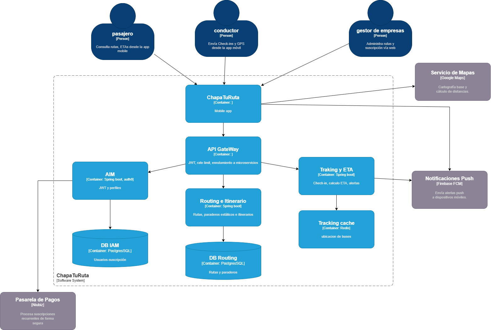
</p>

#### 4.1.5 Relational / Non-Relational Database Diagram

<p align="center">
  
</p>

#### 4.1.6 Design Patterns

Para asegurar una arquitectura **mantenible**, **escalable** y alineada con los principios de diseño establecidos, UrbanFlow implementa los siguientes patrones tácticos y arquitectónicos:

---

## **Patrones Arquitectónicos**

- **API Gateway**
  - Se implementa como **fachada única** para la aplicación móvil.
  - Centraliza el **enrutamiento de peticiones** hacia los microservicios:
    - Identity
    - Routing
    - Tracking
  - Maneja la **validación de seguridad** (tokens JWT).
  - Abstrae la complejidad del backend para los clientes.

- **CQRS (Command Query Responsibility Segregation)**
  - Crucial para el rendimiento del microservicio de Tracking.
  - Separa:
    - **Command (escritura)** → usado por conductores para enviar *Check-ins*.
    - **Query (lectura)** → usado por pasajeros para consultar ETAs.
  - Utiliza una **caché optimizada (Redis)** para mejorar el rendimiento en lecturas masivas.

- **Publish-Subscribe (Orientado a Eventos)**
  - Implementado mediante un **Message Broker (RabbitMQ)**.
  - Permite la **comunicación asíncrona** entre servicios.
  - Flujo:
    - Se registra un *Check-in*.
    - El servicio de Tracking publica un evento.
    - El evento es consumido en segundo plano.
    - Se disparan **notificaciones Push** (Firebase).
  - Evita bloqueos en la interfaz del conductor.

---

## **Patrones Tácticos (Domain-Driven Design)**

- **Patrón Entidad**
  - Modela objetos con una **identidad única y persistente** en el tiempo.
  - Ejemplos:
    - Usuarios
    - Vehículos
    - Rutas
  - Se identifican mediante **UUIDs**.
  - Permiten trazabilidad entre distintos **Bounded Contexts**.

- **Patrón Objeto de Valor**
  - Modela atributos **inmutables** sin identidad propia.
  - Se comparan por **valor**, no por identidad.
  - Ejemplo:
    - CoordenadasGPS
  - Si dos objetos tienen la misma latitud y longitud, representan exactamente la **misma ubicación**.

#### 4.1.7 Tactics


#### **1. Escalabilidad (Scalability)**

- **Descripción**
  - UrbanFlow maneja un uso **asimétrico**:
    - Miles de pasajeros consultando datos
    - Menos conductores enviando información

- **Tácticas**

  - **Desacoplamiento de Lectura y Escritura (CQRS)**
    - Se separan operaciones de:
      - **Lectura** → consultas de pasajeros (Redis)
      - **Escritura** → Check-ins de conductores
    - Evita sobrecargar la base de datos principal.

  - **Procesamiento Asíncrono (Colas de Mensajes)**
    - Uso de **RabbitMQ** para tareas en segundo plano.
    - El sistema responde rápido y procesa notificaciones después.
    - Mejora la **capacidad de respuesta y escalabilidad**.

---

#### **2. Confiabilidad (Reliability)**

- **Descripción**
  - El sistema debe funcionar incluso con **conectividad limitada o inestable**.

- **Tácticas**

  - **Modo Degradado (Fallback)**
    - Si falla el tracking en tiempo real:
      - Se muestra la **última ubicación conocida**.
    - Evita errores críticos en la aplicación.

  - **Prevención de Errores**
    - Validaciones antes de enviar datos:
      - Conexión a internet
      - Coordenadas GPS válidas
    - Permite almacenar datos localmente si no hay red.

---

#### **3. Rendimiento (Performance)**

- **Descripción**
  - La aplicación requiere **respuestas casi instantáneas** para mantener su valor.

- **Tácticas**

  - **Optimización del Tiempo de Respuesta**
    - Uso de **Redis** para consultas rápidas.
    - Reduce la latencia a milisegundos.

  - **Procesamiento Eficiente**
    - Cálculos complejos (ETA) se ejecutan:
      - Solo cuando hay nuevos datos
    - Evita procesamiento innecesario.

---

#### **4. Usabilidad**

- **Descripción**
  - El sistema debe ser **simple e intuitivo**, especialmente para conductores.

- **Tácticas**

  - **Soporte a Acciones del Usuario**
    - Botón de **Check-in grande y de un solo toque**.
    - Minimiza distracciones mientras conduce.

  - **Feedback del Sistema**
    - Confirmación visual y sonora al registrar acciones.
    - Asegura que el usuario entienda el estado sin esfuerzo.

### **4.2 Architectural Drivers**

- **Descripción**
  - No todos los requerimientos tienen el mismo peso en el diseño.
  - Los **Drivers Arquitectónicos** son el subconjunto crítico que influye directamente en la arquitectura.
  - Incluyen:
    - Requerimientos funcionales clave
    - Atributos de calidad
    - Restricciones técnicas

---

#### **4.2.1 Design Purpose**

- **Descripción**
  - Establecer una base sólida para UrbanFlow que garantice:
    - **Alta disponibilidad**
    - **Baja latencia** en la entrega de información
  - Mantener una **experiencia simple** para los conductores.

- **Objetivos del Diseño**
  - Guiar la transición de:
    - Monolito → **Microservicios en la nube**
  - Asegurar coherencia con:
    - **Patrones tácticos (DDD)**
    - **Patrones arquitectónicos (CQRS, Arquitectura Hexagonal)**

---

#### **4.2.3 Primary Functionality (Primary User Stories)**

- **Descripción**
  - Son los **drivers funcionales** que definen la arquitectura.
  - Justifican el uso de:
    - Microservicios
    - Bases de datos separadas

- **Funcionalidades Clave**

  - **Consulta masiva y concurrente de ETAs (US01, US02)**
    - Miles de pasajeros consultando simultáneamente.
    - Implica:
      - Uso de **CQRS**
      - Caché en memoria (**Redis**)
    - Enfocado en alto rendimiento en lecturas.

  - **Reporte asíncrono de ubicación / Check-in (US07, US08)**
    - Conductores enviando datos en zonas con baja conectividad.
    - Implica:
      - Arquitectura **orientada a eventos**
      - Uso de **RabbitMQ**
    - Permite procesamiento en segundo plano sin bloquear la app.

  - **Gestión estática del mapa y transbordos (US41, US43)**
    - Cálculo de rutas y combinaciones.
    - Implica:
      - Modelo **relacional estructurado**
      - Uso de **PostgreSQL**
      - Microservicio independiente (**Routing Service**)

#### **4.2.4 Quality Attribute Scenarios — ChapaTuRuta**

Los siguientes escenarios permiten evaluar atributos de calidad como **escalabilidad**, **confiabilidad**, **rendimiento** y **usabilidad**.

---

#### **Escenario 1: Escalabilidad (Scalability)**

| **Componente**            | **Descripción** |
|--------------------------|----------------|
| **Fuente de Estímulo**   | Múltiples pasajeros usando la app concurrentemente |
| **Estímulo**             | Consultas simultáneas de ETA en hora pico (7:00–8:00 a.m.) |
| **Medioambiente**        | Sistema bajo carga máxima |
| **Artefacto Estimulado** | Microservicio de Tracking & ETA + Redis |
| **Respuesta**            | Lectura desde caché sin impactar la BD |
| **Medida de Respuesta**  | 95% < 200 ms, CPU < 70% |

---

#### **Escenario 2: Confiabilidad (Reliability)**

| **Componente**            | **Descripción** |
|--------------------------|----------------|
| **Fuente de Estímulo**   | Entorno de red del conductor |
| **Estímulo**             | Pérdida de conexión al enviar Check-in |
| **Medioambiente**        | Zona con baja cobertura |
| **Artefacto Estimulado** | App móvil + Tracking Service |
| **Respuesta**            | Almacenamiento local + reintento + modo degradado |
| **Medida de Respuesta**  | 0% pérdida de eventos, 0 crashes |

---

#### **Escenario 3: Rendimiento (Performance)**

| **Componente**            | **Descripción** |
|--------------------------|----------------|
| **Fuente de Estímulo**   | Sistema interno (nuevo Check-in) |
| **Estímulo**             | Nueva ubicación → recalcular ETA + notificar |
| **Medioambiente**        | Operación normal |
| **Artefacto Estimulado** | Sistema ETA + RabbitMQ |
| **Respuesta**            | Procesamiento asíncrono + actualización en Redis |
| **Medida de Respuesta**  | ETA < 50 ms, respuesta < 1 s |

---

#### **Escenario 4: Usabilidad (Usability)**

| **Componente**            | **Descripción** |
|--------------------------|----------------|
| **Fuente de Estímulo**   | Conductor |
| **Estímulo**             | Registrar llegada a paradero |
| **Medioambiente**        | Conducción con atención limitada |
| **Artefacto Estimulado** | UI de la app |
| **Respuesta**            | Botón One-Tap + feedback inmediato |
| **Medida de Respuesta**  | Interacción < 1.5 s |


#### **4.2.5 Constraints**

- **Descripción**
  - Son restricciones **no negociables** que guían el diseño del sistema.
  - Definen límites técnicos, económicos y de entorno.

- **Restricciones**

  - **CON-01 (Económica / Infraestructura)**
    - Uso exclusivo de **Free Tier** en la nube.
    - Ejemplos:
      - AWS (t2.micro)
      - MongoDB Atlas M0
      - Redis gratuito
    - Objetivo: mantener **costo cero** en fase académica.

  - **CON-02 (Tecnológica)**
    - Backend:
      - **Java + Spring Boot**
    - Base de datos:
      - **PostgreSQL**
    - Alineado con lineamientos del curso.

  - **CON-03 (Entorno / Cliente)**
    - Compatibilidad con:
      - **Android de gama media-baja**
      - Versiones antiguas del sistema operativo
    - Considera limitaciones reales del usuario final.

---

#### **4.2.6 Architectural Concerns**

- **Descripción**
  - Son riesgos o aspectos críticos que pueden impactar la arquitectura.
  - Deben ser **gestionados activamente**.

- **Preocupaciones**

  - **Consistencia de Datos Distribuida**
    - Riesgo de inconsistencia entre microservicios.
    - **Solución:**
      - Uso de eventos con **RabbitMQ**
      - Aplicación de **consistencia eventual**

  - **Complejidad Operativa**
    - Mayor complejidad frente a un monolito.
    - **Solución:**
      - Uso de **API Gateway**
      - Contenerización con **Docker**

  - **Seguridad en Endpoints Públicos**
    - Riesgo de uso malicioso (Check-ins falsos).
    - **Solución:**
      - Autenticación con **JWT**
      - Validación centralizada en el **API Gateway**

### **4.3 ADD Iterations — ChapaTuRuta**

En esta sección se aplica el método **Attribute-Driven Design (ADD)** para diseñar la arquitectura en iteraciones, abordando los drivers arquitectónicos y mitigando riesgos.

---

#### **4.3.1 Iteration 1: Estructura Macro del Sistema (Monolito a Microservicios)**

- **Descripción**
  - Se define la estructura general del sistema.
  - Se busca separar dominios (**DDD**) y sentar bases para:
    - Escalabilidad
    - Confiabilidad

---

##### **4.3.1.1 Architectural Design Backlog 1**

- **Drivers Funcionales**
  - **US01** → Inicio de Sesión con JWT
  - **US017** → Búsqueda de Rutas y Transbordos
  - **US20** → Consultar Tiempo Estimado (ETA)

  - **Drivers Técnicos**
  - **TS01** → Seguridad en API Gateway
  - **TS02** → Persistencia Relacional (PostgreSQL)

- **Drivers de Calidad**
  - **QA-01** → Escalabilidad
  - **QA-02** → Confiabilidad

- **Restricciones**
  - **CON-01** → Free Tier (costo cero)
  - **CON-02** → Java + Spring Boot + PostgreSQL

---

##### **4.3.1.2 Establish Iteration Goal by Selecting Drivers**

- **Objetivo**
  - Definir una arquitectura de alto nivel que:
    - Desacople datos **volátiles** (ETAs, ubicaciones)
    - De datos **estáticos** (usuarios, rutas)
  - Evite:
    - Cuellos de botella
    - Puntos únicos de fallo

---

##### **4.3.1.3 Choose One or More Elements of the System to Refine**

- **Elemento seleccionado**
  - Sistema completo **ChapaTuRuta**
  - Enfoque:
    - Proyecto **Greenfield** (desde cero)
    - Definición de contenedores principales

---

##### **4.3.1.4 Choose One or More Design Concepts That Satisfy the Selected Drivers**

- **Patrón Arquitectónico**
  - **Microservicios**
  - **API Gateway**

- **Gestión de Datos**
  - **Database-per-service**
  - Persistencia políglota:
    - **PostgreSQL** (datos estructurados)
    - **Redis** (datos en tiempo real)

---

##### **4.3.1.5 Instantiate Architectural Elements, Allocate Responsibilities, and Define Interfaces**
 
- **API Gateway (TS01)**
  - Enrutamiento de peticiones
  - Validación de **JWT**
  - Punto de entrada único

- **Identity Service (PostgreSQL - TS02)**
  - Gestión de:
    - Gestión de Pasajeros (US04), Conductores (US05), Empresas (US09/10) y autenticación (US06).

- **Routing Service (PostgreSQL - TS02)**
  - Gestión de Paraderos (US12/13/14), Rutas (US15/16) y algoritmo de búsqueda (US17)

- **Tracking Service (Redis - TS03)**
  - Ingesta de coordenadas GPS y resoluciones de ETA en tiempo real (US20).


##### **4.3.1.6 Sketch Views (C4 & UML) and Record Design Decisions**

- Se aislaron las bases de datos para evitar que consultas pesadas de ruteo afecten el inicio de sesión o la lectura de ubicaciones.

---

<p align="center">
  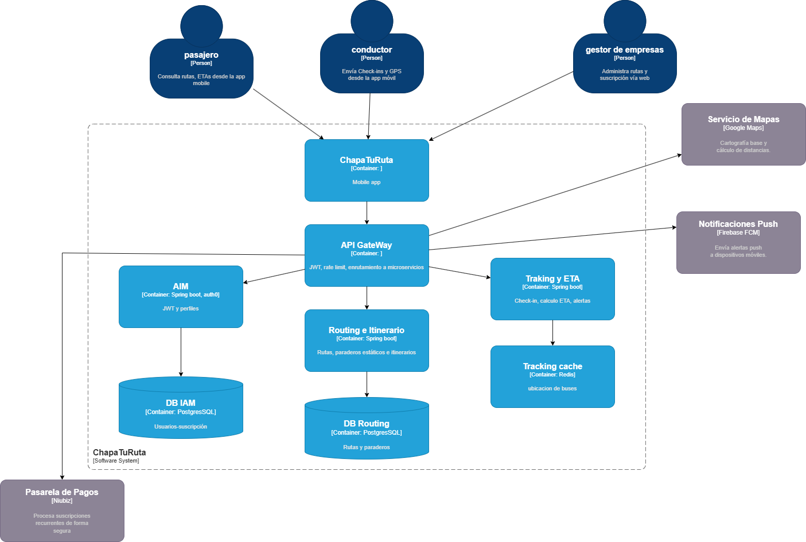
</p>

---

##### **4.3.1.7 Analysis of Current Design and Review Iteration Goal**


<p align="center">
  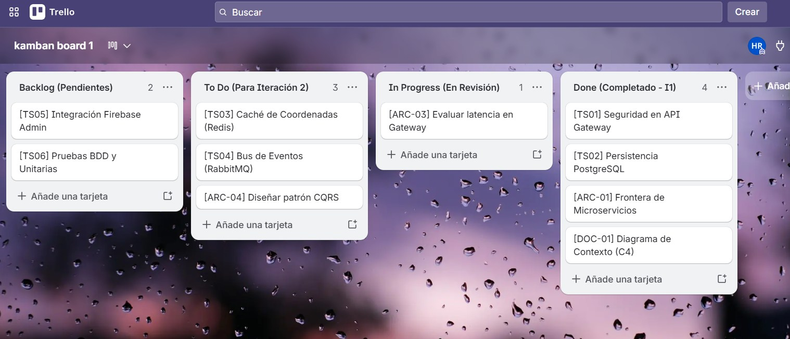
</p>


#### **4.3.2 Iteration 2: Microservicio de Tracking & ETA (CQRS y Eventos) — ChapaTuRuta**

En esta iteración se refina el componente más crítico del sistema: el **Fleet Tracking & ETA Service**, encargado de manejar la mayor carga operativa.

---

##### **4.3.2.1 Architectural Design Backlog 2**

- **Drivers Funcionales**
  - **US028** → Transmitir ubicación GPS
  - **US029** → Check-in manual en Paraderos
  - **US020** → Consultar Tiempo Estimado (ETA)
  - **US021** → Notificaciones push de proximidad

  - **Drivers Técnicos**
  - **TS03** → Caché de Coordenadas (Redis)
  - **TS04** → Bus de Eventos (RabbitMQ)
  - **TS05** → Integración de SDK Firebase Admin

- **Drivers de Calidad**
  - **QA-01** → Escalabilidad extrema (consultas masivas de ETA)
  - **QA-02** → Confiabilidad (tolerancia a fallos)

---

##### **4.3.2.2 Establish Iteration Goal by Selecting Drivers**

- **Objetivo**
  - Separar:
    - **Escrituras (Check-ins US28/29)**
    - **Lecturas (consultas de pasajeros de ETA US20)**
  - Orquestar la comunicación asíncrona (TS04) para disparar alertas móviles (US21) en segundo plano.

---

##### **4.3.2.3 Choose One or More Elements of the System to Refine**

- **Elemento seleccionado**
  - Tracking Service y sus adaptadores externos (Redis, RabbitMQ y Firebase).

---

##### **4.3.2.4 Choose One or More Design Concepts That Satisfy the Selected Drivers**

- **Patrones Tácticos**
  - **CQRS (Command Query Responsibility Segregation)**

- **Patrón de Comunicación**
  - **Publish-Subscribe (RabbitMQ)**

- **Patrón Estructural**
  - **Arquitectura Hexagonal (Ports & Adapters)**

---

##### **4.3.2.5 Instantiate Architectural Elements, Allocate Responsibilities, and Define Interfaces**

- **Command Model (Escritura)**
  - Recibe Check-ins
  - Valida coordenadas
  - Actualiza estado en **Redis**
  - Publica evento **CheckInRegistered** en RabbitMQ
  - Retorna respuesta inmediata (**HTTP 200**)

- **Query Model (Lectura)**
  - Endpoint optimizado
  - Lee datos directamente desde **Redis**
  - Calcula y retorna ETA

- **Notification Worker (Consumidor)**
  - Escucha eventos en RabbitMQ
  - Procesa notificaciones en segundo plano
  - Envía alertas push vía **Firebase (FCM)**

---

##### **4.3.2.6 Sketch Views (C4 & UML) and Record Design Decisions**

---

<p align="center">
  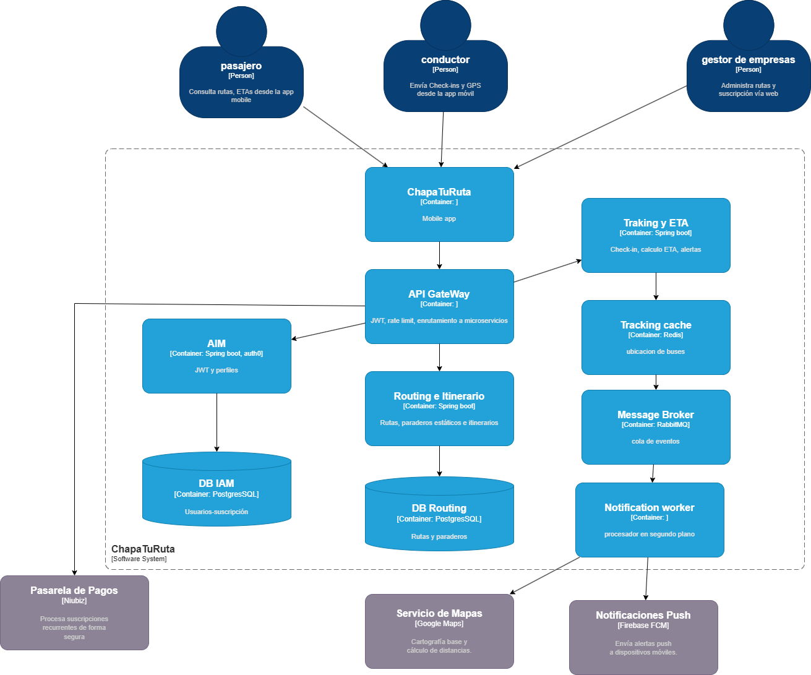
</p>

---

##### **4.3.2.7 Analysis of Current Design and Review Iteration Goal**

<p align="center">
  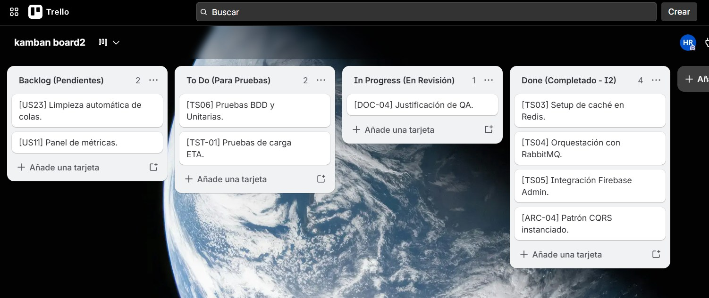
</p>


# Capítulo V: Product Implementation, Validation & Deployment

### **5.1 Testing Suites & General Patterns**

#### **5.1.1 Backend Application Core Testing Suite**

Para garantizar la calidad de los Web Services, se implementará una suite de pruebas automatizadas:

- Unit Testing: Uso de JUnit 5 y Mockito para validar la lógica de dominio en aislamiento.

- Integration Testing: Validación de la persistencia y comunicación entre servicios usando 

-  Acceptance Testing (BDD): Implementación de pruebas de aceptación utilizando el lenguaje Gherkin y la herramienta Cucumber, asegurando que cada funcionalidad cumpla con los criterios de aceptación de las User Stories.

#### **5.1.2 Pattern Based Backend Application(s)**

#### 1. Puertos de Entrada (Inbound Ports)

- `RegisterUserUseCase.java`
  - Interfaz que define el contrato de operaciones.

#### 2. Adaptadores Primarios (Driving Adapters)
- `UserController.java`
  - Controlador REST que recibe peticiones HTTP y activa el caso de uso.

#### 3. Puertos de Salida (Outbound Ports)
- `UserRepository.java`
  - Contrato de persistencia en la capa de dominio.

#### 4. Adaptadores Secundarios (Driven Adapters)
- `UserRepositoryAdapter.java`
- `SpringDataUserRepository.java`


#### **5.1.3 Pattern Based Custom Software Library**

Se ha diseñado la librería ChapaTuRuta-Shared-Lib para estandarizar:
- El manejo de excepciones globales y respuestas HTTP uniformes.
- Contratos de eventos comunes para la comunicación asíncrona vía RabbitMQ. 
- Configuraciones base para la validación de tokens JWT en el API Gateway.

#### **5.1.4 Framework Pattern Driven Refactoring Report**

#### 1. Implementación de Arquitectura Hexagonal
- Se refactorizó el sistema para separar la lógica de negocio de las dependencias externas utilizando el patrón de **Puertos y Adaptadores**.
- Mediante la definición de interfaces de dominio (**Puertos**), se asgura que el núcelo se encuentre independiente de la infrastructura.
- La infraestructura externa, como PostgreSQL y Redis, es gestionada por **Adaptadores** específicos.

---

#### 2. Adopción de CQRS (Command Query Responsibility Segregation)
- Para resolver cuellos de botella en el módulo de Tracking, se refactorizó la estrategia de acceso a datos.
- Se separaron las operaciones de escritura (**Command**), encargadas de actualizar el estado de los buses.
- Las operaciones de lectura (**Query**) se optimizaron para recuperar los ETAs directamente desde la memoria caché de Redis.

---

#### 3. Refactorización hacia Comunicación Orientada a Eventos
- La comunicación síncrona entre el servicio de rastreo y el sistema de avisos se refactorizó hacia un modelo asíncrono basado en el patrón **Publish-Subscribe**.
- Se integró RabbitMQ como **Message Broker** para desacoplar estos procesos.
- Esto permitió que el conductor reciba confirmación inmediata mientras las notificaciones se procesan en segundo plano.

---

#### 4. Implementación de los Patrones Strategy y Repository

#### Patrón Strategy
- Se aplicó el patrón **Strategy** para permitir que los algoritmos de cálculo de ETA sean intercambiables.
- Dependiendo de la disponibilidad de datos del conductor, el sistema puede utilizar:
  - Algoritmos basados en historial.
  - Algoritmos basados en GPS en vivo.

#### Patrón Repository
- El patrón **Repository** se estandarizó en todos los servicios.
- Esto permitió:
  - Centralizar la lógica de persistencia.
  - Facilitar la ejecución de pruebas unitarias.


### **5.2 Software Configuration Management**

#### **5.2.1 Software Development Environment Configuration**

#### 1. Project Management
- Trello (Tablero Kanban).

#### 2. Software Development
- IntelliJ IDEA.
- Docker Desktop (Contenerización).

#### 3. Testing
- Postman para Web Services.
- Cucumber para BDD.
- Unit Test:

#### 1. Identity Service

- **Pruebas Unitarias (JUnit 5 & Mockito):**
  - `RegisterUserUseCaseImplTest.java`: Valida la lógica de registro de usuarios, asegurando la creación exitosa de cuentas y el rechazo por correos duplicados.
  - `IdentityServiceApplicationTests.java`: Verifica que el contexto de la aplicación cargue correctamente.

- **Pruebas BDD (Cucumber):**
  - `register_user.feature` y `RegisterUserSteps.java`: Validan el flujo de negocio para el registro de pasajeros y conductores.
  - `CucumberTestRunner.java`: Orquestador de la ejecución de pruebas BDD.

#### 2. Routing Service

- **Pruebas Unitarias (JUnit 5 & Mockito):**
  - `SearchRoutesUseCaseImplTest.java`: Comprueba la búsqueda de rutas por distritos de origen y destino, validando tanto la obtención de datos como el manejo de búsquedas sin resultados.
  - `RoutingServiceApplicationTests.java`: Confirma la inicialización íntegra del microservicio.

- **Pruebas BDD (Cucumber):**
  - `search_routes.feature` y `SearchRoutesSteps.java`: Evalúan el flujo de consulta de rutas disponibles para el usuario.
  - `CucumberTestRunner.java`: Ejecutor de las características de búsqueda.

#### 3. Tracking Service

- **Pruebas Unitarias (JUnit 5 & Mockito):**
  - `TrackingCommandServiceTest.java`: Testea el procesamiento de Check-In de vehículos, verificando el almacenamiento de coordenadas en caché (Redis) y la emisión de eventos asíncronos (RabbitMQ).
  - `TrackingServiceApplicationTests.java`: Asegura que el servicio arranque sin errores.

- **Pruebas BDD (Cucumber):**
  - `vehicle_checkin.feature` y `VehicleCheckInSteps.java`: Validan el rastreo en tiempo real y la notificación de ubicación del vehículo.
  - `CucumberTestRunner.java`: Gestiona la ejecución de los escenarios de rastreo.


#### 4. Software Deployment
- AWS Management Console.

#### 5. Software Deployment
- Software Documentation

#### **5.2.2 Source Code Management**

### 1. Plataforma de Control de Versiones
- Se utiliza GitHub como plataforma de control de versiones.
- Organización: https://github.com/1ASI0657-2610-7940-G10

### 2. Implementación de GitFlow

### Ramas Principales
- `main` (producción).
- `develop` (desarrollo).

### Feature Branches
- `feature/identity-service`
- `feature/routing-service`
- `feature/tracking-service`
- `feature/api-gateway`

### 3. Convención de Commits

- Se aplica el estándar Conventional Commits para estructurar los mensajes de confirmación de cambios.
- Esto facilita la legibilidad del historial.

#### feat
- Implementación de una nueva característica.

#### fix
- Solución de un error o bug.

#### test
- Adición o modificación de pruebas automatizadas.

#### docs
- Actualización en la documentación.

#### **5.2.3 Source Code Style Guide & Conventions**

#### Guía de Estilo Java
- Se adopta de forma estricta la Google Java Style Guide.

#### Idioma
- Toda la nomenclatura de paquetes, clases, interfaces, variables y métodos se realiza estrictamente en inglés para mantener un estándar profesional internacional.

#### Especificaciones BDD
- Para la redacción de los archivos de pruebas, se siguen las Gherkin Conventions for Readable Specifications.
- Uso correcto de `Given`, `When`, `Then` y `And` en inglés.
- Esto asegura que los escenarios sean perfectamente legibles por los stakeholders y dueños de producto.

#### **5.2.4 Software Deployment Configuration**

El despliegue de la solución se realiza íntegramente bajo la capa gratuita de AWS (Free Tier) para evitar costos operativos. La infraestructura se compone de una instancia EC2 (t2.micro) para alojar el API Gateway y los microservicios, y una instancia RDS (db.t3.micro) para la base de datos PostgreSQL. El proceso de publicación consiste en aprovisionar los recursos en la nube, preparar el entorno con el JDK adecuado, compilar el código fuente y ejecutar el artefacto .jar enlazándolo a la base de datos mediante variables de entorno. Finalmente, la topología de red y la distribución de los servidores se documentan visualmente mediante el Diagrama de Despliegue del Modelo C4.


### 5.3 Microservices Implementation

#### 5.3.1 Sprint 1
#### 5.3.1.1 Sprint Backlog 1

| Orden | ID   | Título                   | Descripción                                                                    | Story Points | Estado | Asignado a   |
| ----: | ---- | ------------------------ | ------------------------------------------------------------------------------ | -----------: | ------ | ------------ |
|     1 | TS01 | Seguridad en API Gateway | Configuración de Spring Cloud Gateway y validación centralizada de tokens JWT. |            5 | Done   | Hector Rios |
|     2 | TS02 | Persistencia Relacional  | Modelado de base de datos e integridad relacional en PostgreSQL (Supabase).    |            5 | Done   | Andy Nuñez |
|     3 | US04 | Registro de Pasajeros    | Creación de cuentas de usuario final con validación de correo único.           |            3 | Done   | Hector Rios |
|     4 | US05 | Registro de Conductores  | Creación de cuentas operativas asociadas a empresas validadas por RUC.         |            5 | Done   | Hector Rios |
|     5 | US06 | Inicio de Sesión con JWT | Endpoint de autenticación segura y despacho de Access Tokens firmados.         |            3 | Done   | Adrian Valerio |
|     6 | US12 | Crear y listar Paraderos | CRUD básico: alta y listado geolocalizado de puntos de embarque.               |            5 | Done   | Andy Nuñez|
|     7 | US15 | Crear Ruta y Horarios    | Asociación secuencial de paraderos, definición de tarifas y tiempos estimados. |            8 | Done   | Hector Rios |
|     8 | US17 | Búsqueda de Rutas        | Algoritmo central para calcular rutas directas entre orígenes y destinos.      |            8 | Done   | Adrian Valerio|

#### 5.3.1.2 Development Evidence for Sprint Review

- La implementación del código se organizó estrictamente bajo los patrones de Arquitectura Hexagonal (Ports and Adapters) y Domain-Driven Design (DDD) dentro de un monorepositorio en Java 21 con Spring Boot 3.4.5.

### A. API Gateway & Seguridad Centralizada (TS01)

Se implementó un filtro global (`JwtAuthenticationFilter`) en el API Gateway utilizando Spring WebFlux. Este componente intercepta todas las peticiones entrantes, extrae el token del encabezado `Authorization`, verifica su firma criptográfica y enruta el tráfico de forma transparente hacia los microservicios internos, garantizando que los endpoints protegidos no sean accesibles sin credenciales válidas.

```java
// Extracto de implementación: JwtAuthenticationFilter.java en API Gateway
@Component
public class JwtAuthenticationFilter implements GlobalFilter, Ordered {
    // Validación de firma JWT y propagación de claims hacia los microservicios
}
```

### B. Identity Service (US04, US05, US06)

Se construyó el servicio de identidad gestionando el agregado raíz `User` y sus entidades asociadas `Role` y `Company`. La lógica de negocio garantiza que las contraseñas se almacenen de forma segura y despacha Web Tokens (JWT) con una validez de 24 horas tras una autenticación exitosa en el `UserController`.

### C. Routing Service (US12, US15, US17)

Se programó el motor logístico definiendo las entidades de dominio `Route`, `Stop` y `District`. La persistencia se resolvió mediante adaptadores JPA (`RouteRepositoryAdapter`) que mapean las coordenadas espaciales y relaciones secuenciales en la base de datos relacional.

<p align="center">
  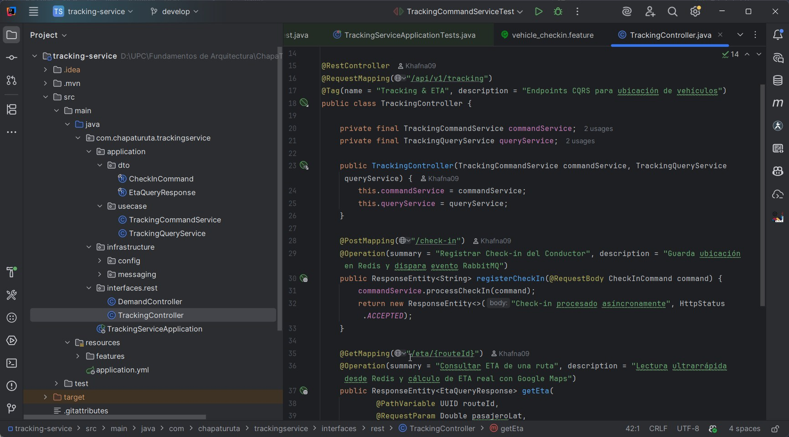
</p>

<p align="center">
  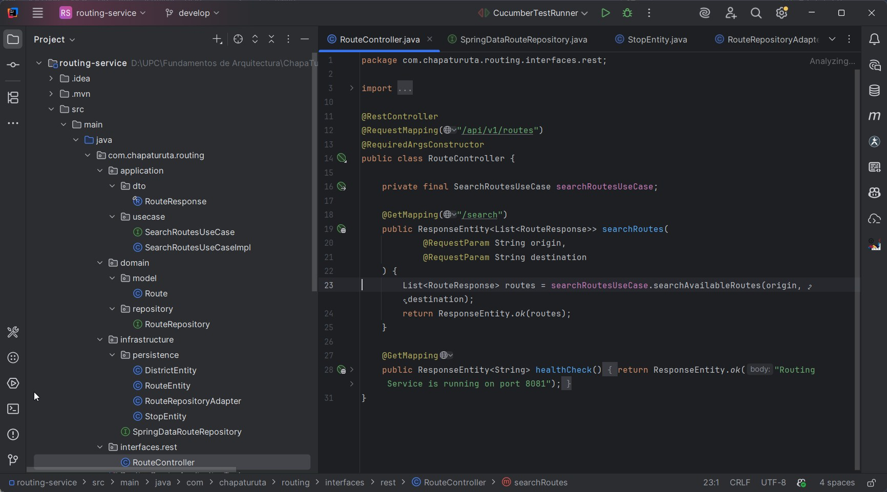
</p>

<p align="center">
  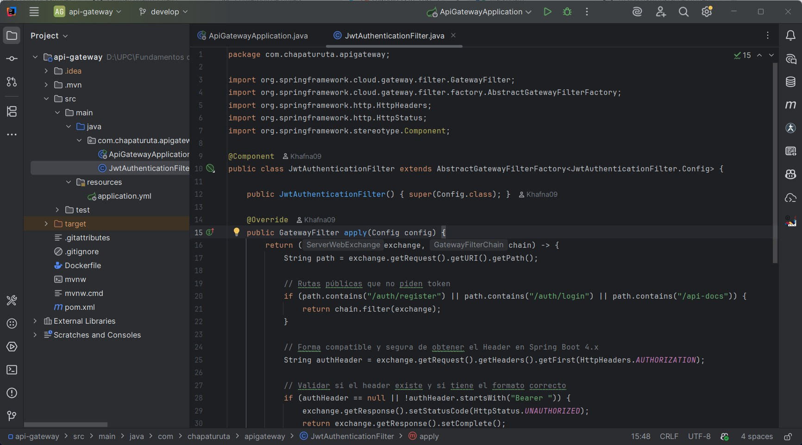
</p>

<p align="center">
  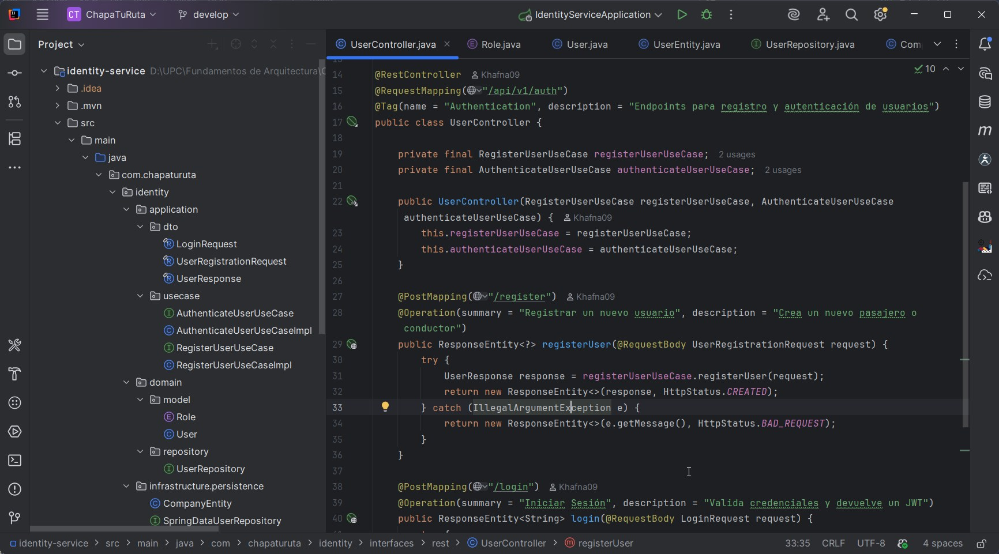
</p>

#### 5.3.1.3 Testing Suite Evidence for Sprint Review

Para garantizar la calidad del software y evitar regresiones, se implementó una estrategia de pruebas automatizadas combinando Pruebas Unitarias con Behavior-Driven Development (BDD) utilizando el framework Cucumber y JUnit 5.

### A. Pruebas Unitarias en Capa de Dominio y Aplicación

Se desarrollaron suites con Mockito para validar la lógica de negocio de forma aislada. Por ejemplo, la clase `RegisterUserUseCaseImplTest` verifica que el sistema arroje excepciones de dominio si se intenta registrar un correo previamente existente, mientras que `SearchRoutesUseCaseImplTest` valida que el algoritmo retorne la lista correcta de rutas disponibles.

#### Evidencia de ejecución de pruebas unitarias

<p align="center">
  
</p>

<p align="center">
  <em>
  Ejecución satisfactoria de pruebas automatizadas en el módulo identity-service mediante Maven Surefire y JUnit 5, incluyendo la validación del caso de uso RegisterUserUseCaseImplTest utilizando Mockito.
  </em>
</p>

<p align="center">
  
</p>

<p align="center">
  <em>
  Ejecución satisfactoria de pruebas automatizadas en el módulo routing-service, incluyendo SearchRoutesUseCaseImplTest para validar la lógica de búsqueda de rutas disponibles.
  </em>
</p>

---

### B. Pruebas de Comportamiento (BDD con Cucumber)

Se redactaron archivos `.feature` en lenguaje Gherkin para que las pruebas reflejen fielmente los criterios de aceptación del negocio.

- `register_user.feature`: Valida los flujos de éxito y error en la creación de pasajeros y conductores.
- `search_routes.feature`: Simula peticiones de búsqueda de pasajeros indicando distritos de origen y destino, verificando que los Step Definitions (`SearchRoutesSteps.java`) respondan con las rutas esperadas.

#### Evidencia de ejecución BDD

<p align="center">
  
</p>

<p align="center">
  <em>
  Ejecución de escenarios BDD definidos en register_user.feature mediante Cucumber y Step Definitions en el módulo identity-service.
  </em>
</p>

<p align="center">
  
</p>

<p align="center">
  <em>
  Validación de escenarios definidos en search_routes.feature utilizando Cucumber y SearchRoutesSteps.java en el módulo routing-service.
  </em>
</p>


#### 5.3.1.4 Execution Evidence for Sprint Review

<p align="center">
  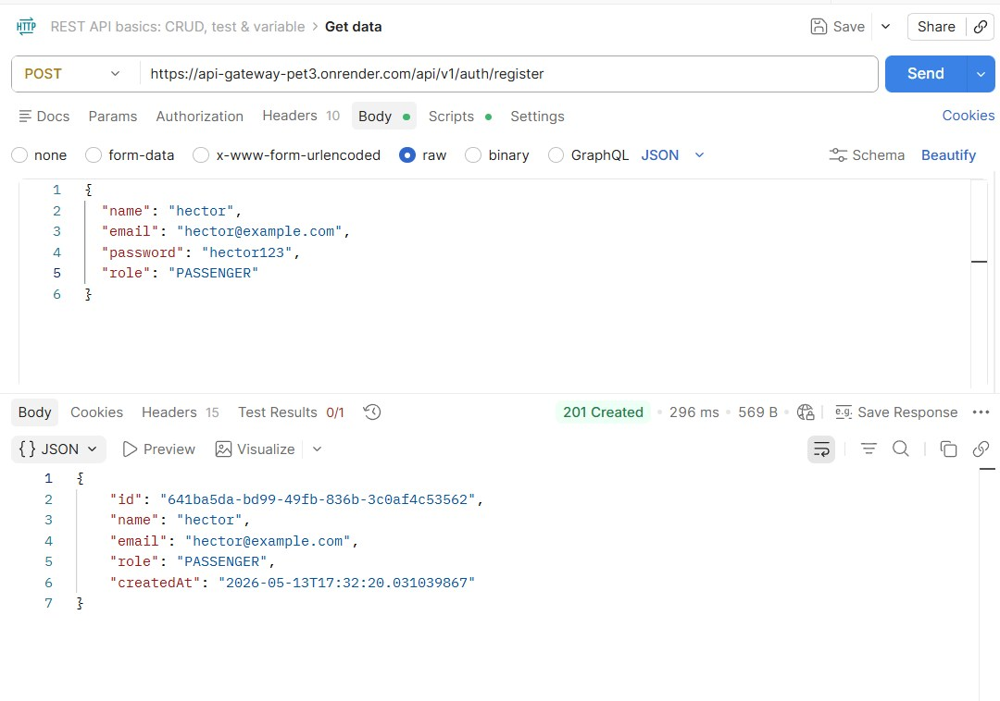
</p>

<p align="center">
  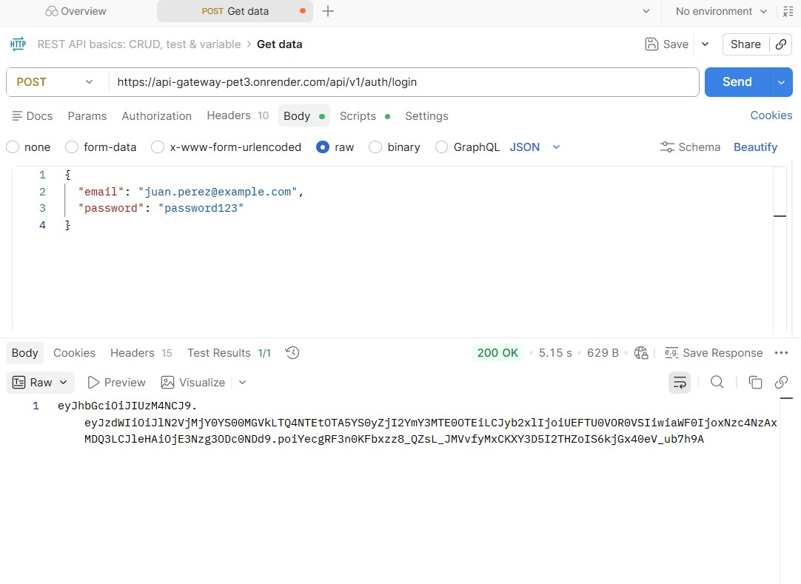
</p>

<p align="center">
  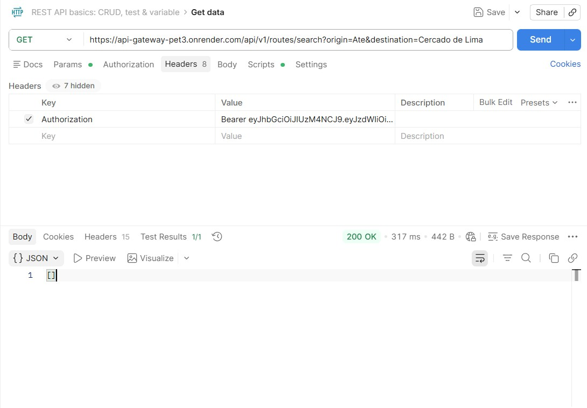
</p>

#### 5.3.1.5 Microservices Documentation Evidence for Sprint Review
Cada microservicio tiene su documentación basándose en el estándar OpenAPI, facilitando la integración para los desarrolladores frontend y aplicaciones móviles.

**Identity Service OpenAPI:** Expone los esquemas de datos para peticiones de login y registro de conductores.

**Routing Service OpenAPI:** Documenta los parámetros de consulta espaciales para paraderos y los algoritmos de búsqueda de rutas.

**Tracking Service OpenAPI:** Detalla los endpoints iniciales para la ingesta de coordenadas GPS y la consulta de disponibilidad de flota.

<p align="center">
  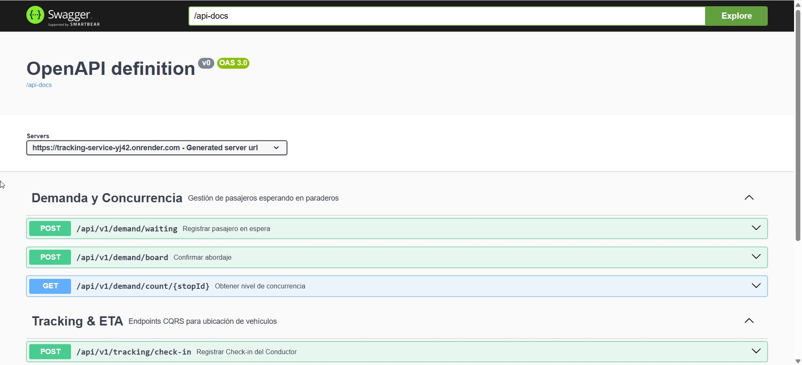
</p>

<p align="center">
  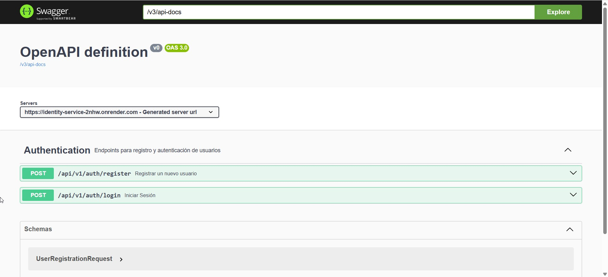
</p>

<p align="center">
  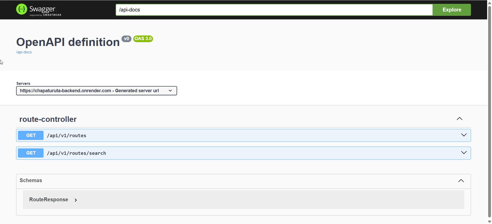
</p>


https://identity-service-2nhw.onrender.com/swagger-ui/index.html

https://tracking-service-yj42.onrender.com/swagger-ui/index.html

https://chapaturuta-backend.onrender.com/swagger-ui/index.html

#### 5.3.1.6 Software Deployment Evidence for Sprint Review

El aprovisionamiento de la infraestructura se llevó a cabo aplicando el patrón *Database-per-service* y utilizando plataformas de nube nativas bajo la restricción de costo cero (*Free Tier*).

### A. Aislamiento de Bases de Datos en Supabase

Se crearon instancias separadas en Supabase (PostgreSQL) para disociar la carga operativa:

- El esquema `identity_schema` almacena las credenciales y perfiles.
- El esquema `routing_schema` persiste los distritos, paraderos y rutas.

La conexión se optimizó utilizando el *Session Pooler* (puerto `5432` con soporte IPv4) inyectando las cadenas de conexión con el protocolo `jdbc:` de forma segura mediante variables de entorno.

### B. Despliegue en Render.com mediante Dockerfiles Universales

Debido a que Render delega las aplicaciones Java a su entorno de contenedores en la capa gratuita, se implementó un `Dockerfile` optimizado multi-etapa en la raíz de cada microservicio. Este archivo descarga la imagen oficial `eclipse-temurin:21-jdk`, empaqueta el código dinámicamente mediante el wrapper de Maven (`mvnw clean package`) y expone la aplicación en el puerto interno `10000` asignado automáticamente por Render.

Los servicios enlazados en producción y operando en estado *Live* son:

- API Gateway: `https://api-gateway-pet3.onrender.com`
- Identity Service: `https://identity-service-2nhw.onrender.com`
- Routing Service: `https://chapaturuta-backend.onrender.com`

<p align="center">
  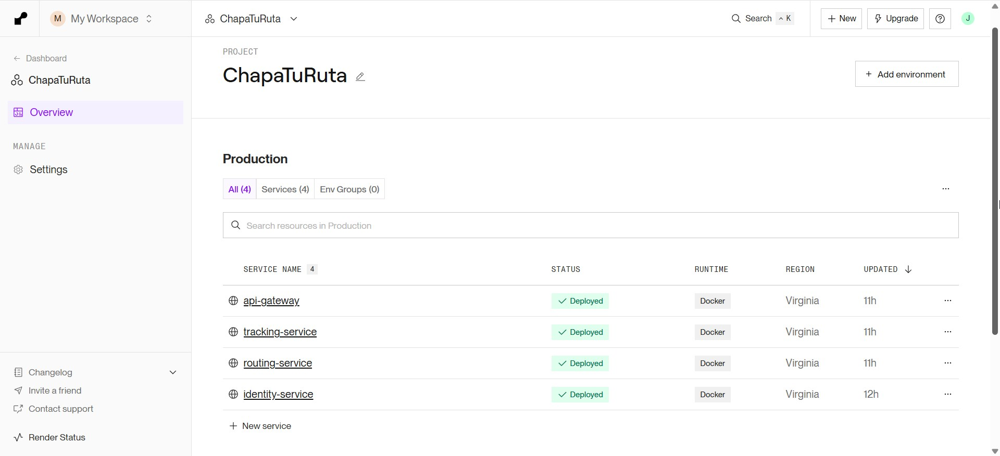
</p>

#### 5.3.1.7 Team Collaboration Insights during Sprint

**Informe:**
<br>

<p align="center">
  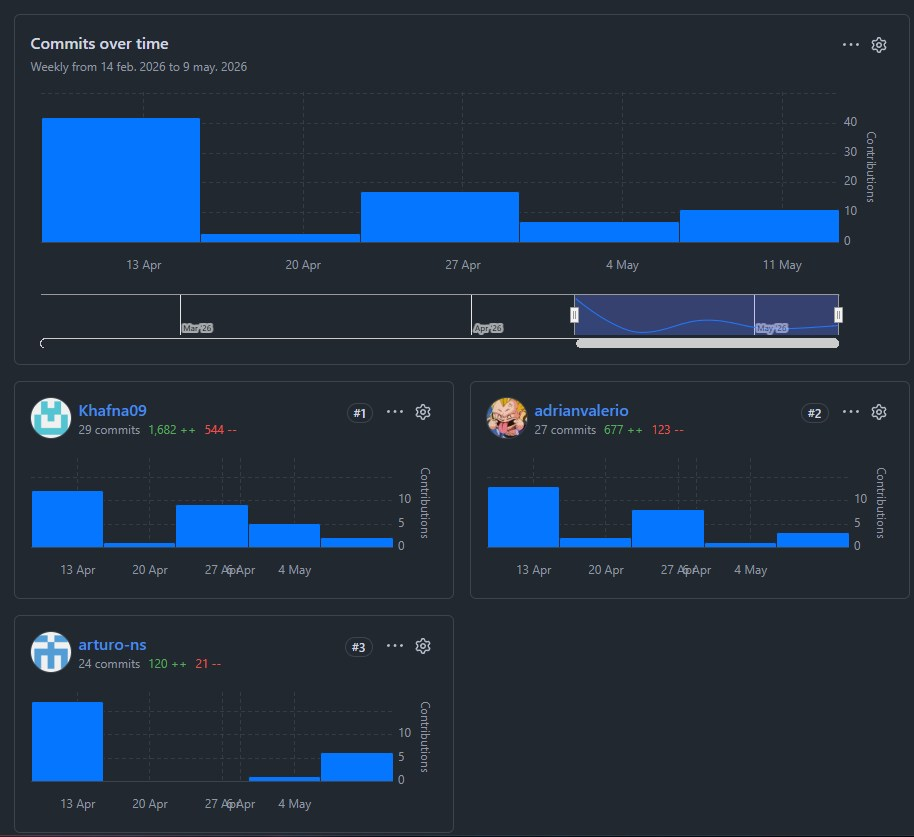
</p>

<br>

**Landing:**
<br>
<p align="center">
  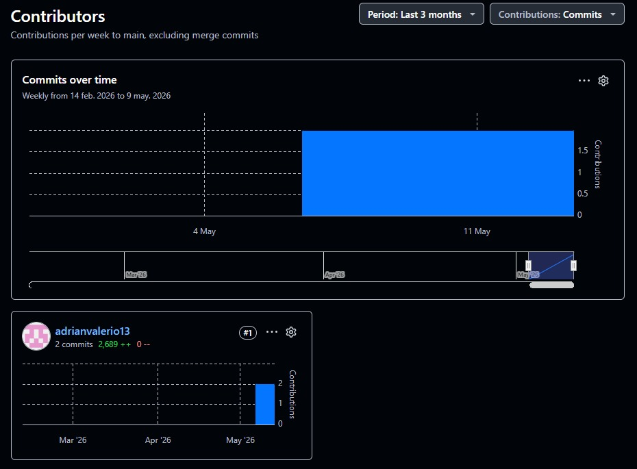
</p>

<br>


<br>

**Backend:**
<br>

<p align="center">
  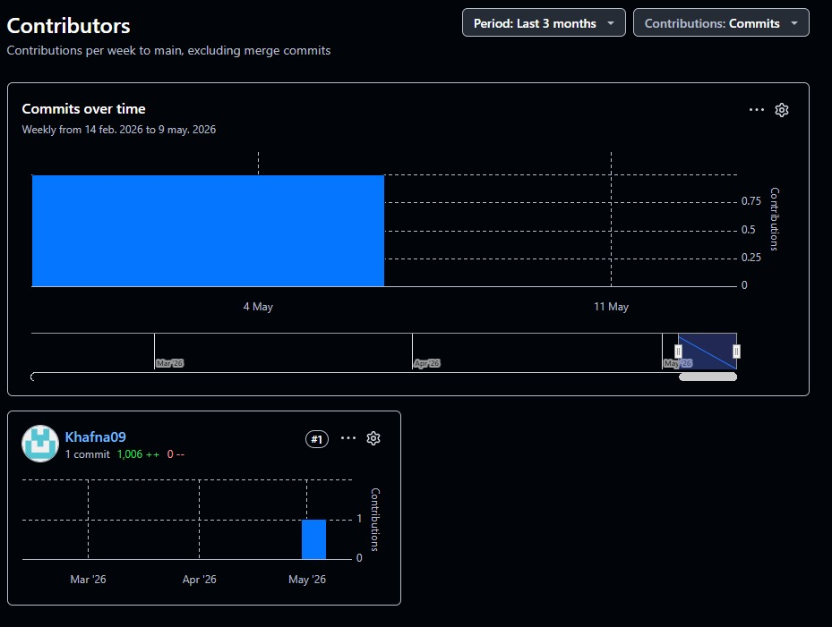
</p>

#### 5.3.1.8 Kanban Board


|  BACKLOG (Product Backlog General) |  TO DO (Sprint 1 Commitments) |  IN PROGRESS |  DONE (Sprint 1 Completado) |
|---|---|---|---|
| US01 Explorar paraderos desde Landing | (Las 8 tareas planificadas para este Sprint ya iniciaron su ciclo) | (Ninguna tarea quedó bloqueada o a medias al cierre del Sprint) | TS01 Seguridad en API Gateway |
| US02 Consultar funcionamiento y ventajas |  |  | TS02 Persistencia Relacional (PostgreSQL) |
| US03 Acceder a FAQ |  |  | US04 Registro de Pasajeros |
| US07 Cierre de Sesión |  |  | US05 Registro de Conductores con RUC |
| US08 Edición de Perfil de Usuario |  |  | US06 Inicio de Sesión con JWT |
| US09 Registro inicial de Empresa |  |  | US12 Crear y listar Paraderos |
| US10 Personalizar perfil de Empresa |  |  | US15 Crear Ruta y Horarios |
| US11 Panel de resumen de métricas |  |  | US17 Búsqueda de Rutas y Transbordos |
| US13 Editar y eliminar Paraderos |  |  |  |
| US14 Visualizar paraderos en el mapa |  |  |  |
| US16 Gestionar Rutas (Editar/Eliminar) |  |  |  |
| US18 Detalle visual de la Ruta |  |  |  |
| US19 Indicar espera en Paradero |  |  |  |
| TS03 Caché de Coordenadas (Redis) |  |  |  |
| US28 Transmitir ubicación GPS |  |  |  |
| US29 Check-in manual en Paraderos |  |  |  |
| US20 Consultar Tiempo Estimado (ETA) |  |  |  |
| TS04 Bus de Eventos (RabbitMQ) |  |  |  |
| US30 Ver concurrencia en tiempo real |  |  |  |
| TS05 Integración de SDK Firebase Admin |  |  |  |
| US21 Notificaciones push de proximidad |  |  |  |
| US22 Confirmación manual de abordaje |  |  |  |
| US23 Eliminación automática de espera |  |  |  |
| US24 Ver información del Conductor |  |  |  |
| US25 Calificar viaje y Conductor |  |  |  |
| US31 Consultar reputación propia |  |  |  |
| US26 Crear y listar Colecciones |  |  |  |
| US27 Gestionar rutas en Colecciones |  |  |  |
| TS06 Pruebas BDD y Unitarias |  |  |  |

### Kanban Board del Sprint 1

<p align="center">
  
</p>

### Descripción de etiquetas

#### 🔵 Azul (Frontend / UX)

- US01 – Explorar paraderos desde Landing
- US02 – Consultar funcionamiento y ventajas
- US03 – Acceder a FAQ
- US08 – Edición de Perfil de Usuario
- US10 – Personalizar perfil de Empresa
- US11 – Panel de resumen de métricas
- US18 – Detalle visual de la Ruta
- US22 – Confirmación manual de abordaje
- US24 – Ver información del Conductor
- US25 – Calificar viaje y Conductor
- US26 – Crear y listar Colecciones
- US27 – Gestionar rutas en Colecciones
- US31 – Consultar reputación propia

#### 🔴 Rojo (Backend)

- US04 – Registro de Pasajeros
- US05 – Registro de Conductores con RUC
- US06 – Inicio de Sesión con JWT
- US07 – Cierre de Sesión
- US09 – Registro inicial de Empresa
- US12 – Crear y listar Paraderos
- US13 – Editar y eliminar Paraderos
- US15 – Crear Ruta y Horarios
- US16 – Gestionar Rutas (Editar/Eliminar)

#### 🟠 Naranja (Tiempo Real / Geolocalización)

- US14 – Visualizar paraderos en el mapa
- US17 – Búsqueda de Rutas y Transbordos
- US19 – Indicar espera en Paradero
- US20 – Consultar Tiempo Estimado (ETA)
- US21 – Notificaciones push de proximidad
- US23 – Eliminación automática de espera
- US28 – Transmitir ubicación GPS
- US29 – Check-in manual en Paraderos
- US30 – Ver concurrencia en tiempo real

#### 🟢 Verde (Base de Datos)

- TS02 – Persistencia Relacional (PostgreSQL)
- TS03 – Caché de Coordenadas (Redis)

#### ⚫ Negro (Infraestructura)

- TS01 – Seguridad en API Gateway
- TS04 – Bus de Eventos (RabbitMQ)
- TS05 – Integración de SDK Firebase Admin

#### 🟨 Amarillo (Testing)

- TS06 – Pruebas BDD y Unitarias

**Fuente:** Elaboración propia mediante Jira.  
**Enlace:** [Kanban Board del Proyecto](https://arturons.atlassian.net/jira/software/projects/CK/boards/2?atlOrigin=eyJpIjoiMmZiZjEyNzNjOWQzNDllOTlhZGI1YmU0YTUyMjM2NWEiLCJwIjoiaiJ9)

#### 5.3.2.8 Kanban Board

|  BACKLOG (Product Backlog General) |  TO DO (Sprint 2 Commitments) |  IN PROGRESS |  DONE (Sprint 2 Completado) |
|---|---|---|---|
| US01 Explorar paraderos desde Landing | (Las 10 tareas planificadas para este Sprint completaron satisfactoriamente su ciclo de desarrollo) | (Ninguna tarea quedó bloqueada o pendiente al cierre del Sprint) | TS03 Caché de Coordenadas (Redis) |
| US02 Consultar funcionamiento y ventajas |  |  | US28 Transmitir ubicación GPS |
| US03 Acceder a FAQ |  |  | US19 Indicar espera en Paradero |
| US07 Cierre de Sesión |  |  | US20 Consultar Tiempo Estimado (ETA) |
| US08 Edición de Perfil de Usuario |  |  | TS04 Bus de Eventos (RabbitMQ) |
| US09 Registro inicial de Empresa |  |  | US23 Eliminación automática de espera |
| US10 Personalizar perfil de Empresa |  |  | TS06 Pruebas BDD y Unitarias (Fase II) |
| US11 Panel de resumen de métricas |  |  | TS07 Dockerización e Infraestructura CI/CD |
| US13 Editar y eliminar Paraderos |  |  | TS08 Configuración Externalizada de Red |
| US14 Visualizar paraderos en el mapa |  |  | TS09 Resiliencia de Sentencias de BD |
| US16 Gestionar Rutas (Editar/Eliminar) |  |  |  |
| US18 Detalle visual de la Ruta |  |  |  |
| US21 Notificaciones push de proximidad |  |  |  |
| US22 Confirmación manual de abordaje |  |  |  |
| US24 Ver información del Conductor |  |  |  |
| US25 Calificar viaje y Conductor |  |  |  |
| US26 Crear y listar Colecciones |  |  |  |
| US27 Gestionar rutas en Colecciones |  |  |  |
| US29 Check-in manual en Paraderos |  |  |  |
| US30 Ver concurrencia en tiempo real |  |  |  |
| US31 Consultar reputación propia |  |  |  |
| TS05 Integración de SDK Firebase Admin |  |  |  |

### Kanban Board del Sprint 2

<p align="center">
  
</p>

### Descripción de etiquetas

#### 🔵 Azul (Frontend / UX)

- US01 – Explorar paraderos desde Landing
- US02 – Consultar funcionamiento y ventajas
- US03 – Acceder a FAQ
- US08 – Edición de Perfil de Usuario
- US10 – Personalizar perfil de Empresa
- US11 – Panel de resumen de métricas
- US18 – Detalle visual de la Ruta
- US22 – Confirmación manual de abordaje
- US24 – Ver información del Conductor
- US25 – Calificar viaje y Conductor
- US26 – Crear y listar Colecciones
- US27 – Gestionar rutas en Colecciones
- US31 – Consultar reputación propia

#### 🔴 Rojo (Backend)

- US07 – Cierre de Sesión
- US09 – Registro inicial de Empresa
- US13 – Editar y eliminar Paraderos
- US16 – Gestionar Rutas (Editar/Eliminar)

#### 🟠 Naranja (Tiempo Real / Geolocalización)

- US14 – Visualizar paraderos en el mapa
- US19 – Indicar espera en Paradero
- US20 – Consultar Tiempo Estimado (ETA)
- US21 – Notificaciones push de proximidad
- US23 – Eliminación automática de espera
- US28 – Transmitir ubicación GPS
- US29 – Check-in manual en Paraderos
- US30 – Ver concurrencia en tiempo real

#### 🟢 Verde (Base de Datos)

- TS03 – Caché de Coordenadas (Redis)
- TS09 – Resiliencia de Sentencias de BD

#### ⚫ Negro (Infraestructura)

- TS04 – Bus de Eventos (RabbitMQ)
- TS05 – Integración de SDK Firebase Admin
- TS07 – Dockerización e Infraestructura CI/CD
- TS08 – Configuración Externalizada de Red

#### 🟨 Amarillo (Testing)

- TS06 – Pruebas BDD y Unitarias (Fase II)

**Fuente:** Elaboración propia mediante Jira.  
**Enlace:** [Kanban Board del Proyecto](https://arturons.atlassian.net/jira/software/projects/CK/boards/2?atlOrigin=eyJpIjoiMmZiZjEyNzNjOWQzNDllOTlhZGI1YmU0YTUyMjM2NWEiLCJwIjoiaiJ9)

