<p align="center">
    <br />
    
    <br />
    <strong>Universidad Peruana de Ciencias Aplicadas</strong>
    <br /><br />
    <strong>Carrera de Ingeniería de Software</strong>
    <br /><br />
    <strong>Ciclo 202610</strong>
    <br /><br />
    1ASI0657-2610 - Fundamentos de Arquitectura de Software
    <br /><br />
    <strong>NRC:</strong> 7940 <br /><br />
    <strong>Profesor:</strong> Mori Yzaguirre, Daniel Enrique <br /><br />
    <strong>Informe de TB1</strong>
  </p>

  <div style="width: 80%; margin: 0 auto; text-align: center">
    <p>
      <strong>Startup:</strong> Grupo 10 
      <br />
      <strong>Producto:</strong> ChapaTuRuta
    </p>

  <div>
      <strong>Relación de integrantes</strong>
      <br /><br />
      <table style="width: 60%; margin: 0 auto;   text-align: left">
        <thead>
          <tr>
            <th>Código</th>
            <th>Nombre</th>
          </tr>
        </thead>
        <tbody>
          <tr>
            <td>u20231c540 </td>
            <td> Rios Pacheco, Hector </td>
          </tr>
          <tr>
            <td> u20231e795 </td>
            <td> Nuñez Soto, Andy Arturo </td>
          </tr>
          <tr>
            <td> u202210334 </td>
            <td> Valerio Garcia, Adrian Emanuel </td>
          </tr>
        </tbody>
      </table>
      <p style="text-align: center">
        <br />
        <strong>Abril 2026</strong>
      </p>
    </div>

  </div>
</div>

<div style="page-break-after: always;"></div>

| Versión | Fecha | Autor | Descripción de modificación |
| :--- | :--- | :--- | :--- |
|  1.0    | 18/04/2026 | Héctor Ríos,  Arturo Nuñez, Adrian Valerio                                              | Añadido template, perfil de la startup, antecedentes y problemática; incorporación de Hypothesis Statements y Lean UX Canvas; segmentos objetivo, needfinding, entrevistas y especificación de requisitos                                                                                                               |


# Project Report Collaboration Insights

En esta seccion se registra la colaboración de todo el equipo durante el desarrollo del informe del proyecto, backend. 

- Organización: https://github.com/1ASI0657-2610-7940-G10

Se adjunta el enlace del repositorios:

| Repository Name | Link |
| :--- | :--- |
| **report** |https://github.com/1ASI0657-2610-7940-G10/report|

# Contenido

_Tabla de contenidos_


- Student Outcome

- Capítulo I: Introducción
  - [1.1 Startup Profile](#11-startup-profile)
    - [1.1.1 Descripción de la Startup](#111-descripcion-de-la-startup)
    - [1.1.2 Perfiles de integrantes del equipo](#112-perfiles-de-integrantes-del-equipo)
  - [1.2 Solution Profile](#12-solution-profile)
    - [1.2.1 Nombre del producto](#121-nombre-del-producto)
    - [1.2.2 Antecedentes y problemática](#122-antecedentes-y-problematica)
    - [1.2.3 Lean UX Process](#123-lean-ux-process)
      - [1.2.3.1 Lean UX Problem Statement](#1231-lean-ux-problem-statement)
      - [1.2.3.2 Lean UX Assumptions](#1232-lean-ux-assumptions)
      - [1.2.3.3 Lean UX Hypothesis](#1233-lean-ux-hypothesis)
      - [1.2.3.4 Lean UX Canvas](#1234-lean-ux-canvas)
  - [1.3 Segmentos objetivo](#13-segmentos-objetivo)

- Capítulo II: Requirements  & Analysis
  - [2.1 Competidores](#21-competidores)
  - [2.2 Entrevistas](#22-entrevistas)
  - [2.3 Needfinding](#23-needfinding)
    - [2.3.1 User Personas](#231-user-personas)
    - [2.3.2 User Task Matrix](#232-user-task-matrix)
    - [2.3.3 Empathy Maps](#233-empathy-maps)
    - [2.3.4 As-is Scenario Mapping](#234-as-is-scenario-mapping)

- Capítulo III: Requirements Specification
  - [3.1 To-Be Scenario Mapping](#31-to-be-scenario-mapping)
  - [3.2 User Stories](#32-user-stories)
  - [3.3 Impact Map](#33-impact-map)
  - [3.4 Product Backlog](#34-product-backlog)

- Capítulo IV: Product Architecture Design
  - [4.1 Design Concepts, ViewPoints & ER Diagrams](#41-design-concepts-viewpoints--er-diagrams)
    - [4.1.1 Principles Statements](#411-principles-statements)
    - [4.1.2 Approaches Statements Architectural Styles & Patterns](#412-approaches-statements-architectural-styles--patterns)
    - [4.1.3 Context Diagram](#413-context-diagram)
    - [4.1.4 Approach Driven ViewPoints Diagrams](#414-approach-driven-viewpoints-diagrams)
    - [4.1.5 Relational / Non-Relational Database Diagram](#415-relational--non-relational-database-diagram)
    - [4.1.6 Design Patterns](#416-design-patterns)
    - [4.1.7 Tactics](#417-tactics)
    - [4.1.8 Design Purpose](#418-design-purpose)
    - [4.1.9 Primary Functionality (Primary User Stories)](#419-primary-functionality-primary-user-stories)
    - [4.1.10 Quality Attribute Scenarios](#4110-quality-attribute-scenarios)
    - [4.1.11 Constraints](#4111-constraints)
    - [4.1.12 Architectural Concerns](#4112-architectural-concerns)

  - [4.2 Architectural Drivers](#42-architectural-drivers)

  - [4.3 ADD Iterations](#43-add-iterations)
    - [4.3.X Iteration N: <Iteration Name>](#43x-iteration-n-iteration-name)
      - [4.3.X.1 Architectural Design Backlog N](#43x1-architectural-design-backlog-n)
      - [4.3.X.2 Establish Iteration Goal by Selecting Drivers](#43x2-establish-iteration-goal-by-selecting-drivers)
      - [4.3.X.3 Choose One or More Elements of the System to Refine](#43x3-choose-one-or-more-elements-of-the-system-to-refine)
      - [4.3.X.4 Choose One or More Design Concepts That Satisfy the Selected Drivers](#43x4-choose-one-or-more-design-concepts-that-satisfy-the-selected-drivers)
      - [4.3.X.5 Instantiate Architectural Elements, Allocate Responsibilities, and Define Interfaces](#43x5-instantiate-architectural-elements-allocate-responsibilities-and-define-interfaces)
      - [4.3.X.6 Sketch Views (C4 & UML) and Record Design Decisions](#43x6-sketch-views-c4--uml-and-record-design-decisions)
      - [4.3.X.7 Analysis of Current Design and Review Iteration Goal (Kanban Board) (Avance 2)](#43x7-analysis-of-current-design-and-review-iteration-goal-kanban-board-avance-2)

- Capítulo V: Product Implementation, Validation & Deployment
  - [5.1 Testing Suites & General Patterns](#51-testing-suites--general-patterns)
    - [5.1.1 Backend Application Core Testing Suite](#511-backend-application-core-testing-suite)
    - [5.1.2 Pattern Based Backend Application(s)](#512-pattern-based-backend-applications)
    - [5.1.3 Pattern Based Custom Software Library](#513-pattern-based-custom-software-library)
    - [5.1.4 Framework Pattern Driven Refactoring Report](#514-framework-pattern-driven-refactoring-report)

  - [5.2 Software Configuration Management](#52-software-configuration-management)
    - [5.2.1 Software Development Environment Configuration](#521-software-development-environment-configuration)
    - [5.2.2 Source Code Management](#522-source-code-management)
    - [5.2.3 Source Code Style Guide & Conventions](#523-source-code-style-guide--conventions)
    - [5.2.4 Software Deployment Configuration](#524-software-deployment-configuration)

  - [5.3 Microservices Implementation](#53-microservices-implementation)
    - [5.3.1 Sprint 1](#531-sprint-1)
      - [5.3.1.1 Sprint Backlog 1](#5311-sprint-backlog-1)
      - [5.3.1.2 Development Evidence for Sprint Review](#5312-development-evidence-for-sprint-review)
      - [5.3.1.3 Testing Suite Evidence for Sprint Review](#5313-testing-suite-evidence-for-sprint-review)
      - [5.3.1.4 Execution Evidence for Sprint Review](#5314-execution-evidence-for-sprint-review)
      - [5.3.1.5 Microservices Documentation Evidence for Sprint Review](#5315-microservices-documentation-evidence-for-sprint-review)
      - [5.3.1.6 Software Deployment Evidence for Sprint Review](#5316-software-deployment-evidence-for-sprint-review)
      - [5.3.1.7 Team Collaboration Insights during Sprint](#5317-team-collaboration-insights-during-sprint)
      - [5.3.1.8 Kanban Board](#5318-kanban-board)
    - [5.3.2 Sprint 2](#532-sprint-2)
        - [5.3.2.1 Sprint Backlog 2](#5321-sprint-backlog-2)
        - [5.3.2.2 Development Evidence for Sprint Review](#5322-development-evidence-for-sprint-review)
        - [5.3.2.3 Testing Suite Evidence for Sprint Review](#5323-testing-suite-evidence-for-sprint-review)
        - [5.3.2.4 Execution Evidence for Sprint Review](#5324-execution-evidence-for-sprint-review)
        - [5.3.2.5 Microservices Documentation Evidence for Sprint Review](#5325-microservices-documentation-evidence-for-sprint-review)
        - [5.3.2.6 Software Deployment Evidence for Sprint Review](#5326-software-deployment-evidence-for-sprint-review)
        - [5.3.2.7 Team Collaboration Insights during Sprint](#5327-team-collaboration-insights-during-sprint)
        - [5.3.2.8 Kanban Board](#5328-kanban-board)    
    - [5.3.3 Sprint 3](#533-sprint-3)
        - [5.3.3.1 Sprint Backlog 3](#5331-sprint-backlog-3)
        - [5.3.3.2 Development Evidence for Sprint Review](#5332-development-evidence-for-sprint-review)
        - [5.3.3.3 Testing Suite Evidence for Sprint Review](#5333-testing-suite-evidence-for-sprint-review)
        - [5.3.3.4 Execution Evidence for Sprint Review](#5334-execution-evidence-for-sprint-review)
        - [5.3.3.5 Microservices Documentation Evidence for Sprint Review](#5335-microservices-documentation-evidence-for-sprint-review)
        - [5.3.3.6 Software Deployment Evidence for Sprint Review](#5336-software-deployment-evidence-for-sprint-review)
        - [5.3.3.7 Team Collaboration Insights during Sprint](#5337-team-collaboration-insights-during-sprint)
        - [5.3.3.8 Kanban Board](#5338-kanban-board)
    - [5.3.4 Sprint 4 (TF1)](#534-sprint-4-tf1)
        - [5.3.4.1 Sprint Backlog 4](#5341-sprint-backlog-4)
        - [5.3.4.2 Development Evidence for Sprint Review](#5342-development-evidence-for-sprint-review)
        - [5.3.4.3 Testing Suite Evidence for Sprint Review](#5343-testing-suite-evidence-for-sprint-review)
        - [5.3.4.4 Microservices Documentation Evidence for Sprint Review](#5344-microservices-documentation-evidence-for-sprint-review)
        - [5.3.4.5 Software Deployment Evidence for Sprint Review](#5345-software-deployment-evidence-for-sprint-review)
        - [5.3.4.6 Execution Evidence for Sprint Review](#5346-execution-evidence-for-sprint-review)
        - [5.3.4.7 Team Collaboration Insights during Sprint](#5347-team-collaboration-insights-during-sprint)
        - [5.3.4.8 Kanban Board](#5348-kanban-board)

# Student Outcome

El curso cumple de manera directa el cumplimiento del Student Outcome 5 definido por ABET - EAC, asegurando que los integrantes logren alcanzar las competencias establecidas.

| Criterio | Acciones realizadas | Conclusiones |
| :------------------ | :------------------------------------------------- | :-------------------------------------------------------------------------------------- |
| **Actualiza conceptos y conocimientos necesarios para su desarrollo profesional y en especial para su proyecto en soluciones de software.** | **Héctor Rios AV1:** Contribuí realizando el capítulo 1 y sedimentando las bases del proyecto <br><br> **Arturo Nuñez AV1:** Contribuí realizando parte del capítulo II <br><br> **Adrian Valerio AV1:** Contribuí realizando el capítulo III y entrevistas <br><br> **Héctor Rios AV2:** Lideré el diseño arquitectónico detallado en el Capítulo 4, aplicando el método ADD, seleccionando patrones avanzados (CQRS, Strategy, Repository) y definiendo escenarios de atributos de calidad <br><br> **Adrian Valerio AV2:** Participé en la estructuración y documentación del Capítulo 4, apoyando en la definición de contenedores, relaciones entre componentes (C4) y validación de decisiones arquitectónicas alineadas a los atributos de calidad <br><br> **Arturo Nuñez AV2:** Contribuí en el desarrollo y documentación del Capítulo 4, participando en la definición de drivers arquitectónicos, estructuración en Markdown, organización del contenido y apoyo en la coherencia técnica del diseño propuesto <br><br> **Héctor Rios TP1:** Lideré el desarrollo del Capítulo V relacionado con implementación, validación y despliegue del producto, participando en la configuración del entorno de desarrollo, gestión de código fuente, definición de convenciones de estilo, implementación de microservicios, desarrollo de evidencias de testing, despliegue y documentación técnica del Sprint 1, así como en la organización del tablero Kanban y evidencias de colaboración del equipo <br><br> **Adrian Valerio TB1:** Participé en el desarrollo del Sprint 1 colaborando en la implementación de funcionalidades frontend, validación de interfaces de usuario, documentación de evidencias del sprint y seguimiento de tareas mediante el tablero Kanban, contribuyendo a la integración entre los componentes desarrollados por el equipo <br><br> **Arturo Nuñez TB1:** Participé en el desarrollo del Sprint 1 apoyando en la implementación de funcionalidades del sistema, organización de la documentación técnica, validación de entregables y seguimiento del progreso de actividades mediante herramientas colaborativas de gestión <br><br> **Héctor Rios AV3:** Deurante el desarrollo de esta entrega agregué algunos endpoints que son parte del core l oque me permitió conocer más sobre la dinámica de trabajo y acctualizar mis conocimientos <br><br> **Adrian Valerio AV3:** Durante esta entrega participé en el desarrollo e integración de funcionalidades frontend, realizando ajustes en la experiencia de usuario, validación de flujos y pruebas funcionales para asegurar la correcta interacción entre la interfaz y los servicios implementados <br><br> **Arturo Nuñez AV3:** Durante esta entrega participé en la implementación de funcionalidades del sistema, documentación técnica de los avances realizados y validación de los componentes desarrollados, contribuyendo a mantener la calidad y coherencia de la solución propuesta <br><br> **Héctor Rios AV4:** Participé en la consolidación e integración final de los servicios desarrollados, optimizando componentes críticos del sistema, corrigiendo incidencias detectadas durante las pruebas y fortaleciendo la estabilidad de la solución mediante mejoras en la implementación y validación integral del producto <br><br> **Adrian Valerio AV4:** Participé en la mejora e integración final de la interfaz de usuario, realizando ajustes de usabilidad, corrección de incidencias identificadas durante las pruebas y validación de la experiencia de usuario para garantizar el cumplimiento de los requerimientos del proyecto <br><br> **Arturo Nuñez AV4:** Participé en la consolidación de la documentación final del proyecto, validación de entregables, revisión de la coherencia técnica entre los componentes desarrollados y apoyo en la preparación de evidencias para la presentación y cierre de la solución implementada <br><br> **Héctor Rios TF1:** Durante el Sprint 4 (TF1), lideré la integración final de los servicios core. En el backend, desarrollé el CRUD de rutas, endpoints de check-in y cancelación de espera, implementé suites de pruebas BDD/Unitarias, e inyecté patrones arquitectónicos avanzados en la documentación. En el frontend, configuré e implementé pruebas E2E con Cypress, integré Mapbox para el rastreo en tiempo real de conductores y pasajeros, y estructuré el dashboard del manager y el AuthContext. | **Héctor Rios AV1:** El desarrollo del capítulo 1 me permitió reforzar mis conocimientos sobre la estructura inicial de un proyecto de software. Esto me ayudó a entender mejor cómo construir una base sólida para futuros proyectos. <br><br> **Arturo Nuñez AV1:** Al trabajar en el capítulo II, comprendí la importancia de investigar y aplicar correctamente los conceptos teóricos, mejorando la calidad del proyecto. <br><br> **Adrian Valerio AV1:** El desarrollo del capítulo III y las entrevistas fortaleció mi capacidad de análisis y aplicación práctica del conocimiento. <br><br> **Héctor Rios AV2:** La ejecución de iteraciones ADD y el uso de patrones como CQRS y arquitectura orientada a eventos me permitió elevar mi nivel técnico en diseño de sistemas complejos, comprendiendo mejor cómo lograr escalabilidad y desacoplamiento. <br><br> **Adrian Valerio AV2:** La participación en el diseño arquitectónico y modelado C4 me permitió consolidar mis conocimientos en estructuración de sistemas, comprendiendo mejor la relación entre componentes y la importancia de documentar decisiones técnicas. <br><br> **Arturo Nuñez AV2:** La participación en la organización y documentación del diseño arquitectónico me permitió fortalecer mis habilidades en estructuración de contenido técnico, comprensión de drivers arquitectónicos y uso de herramientas como Markdown para la presentación profesional de soluciones de software. <br><br> **Héctor Rios TP1:** El desarrollo del Capítulo V me permitió fortalecer mis conocimientos en pruebas automatizadas, gestión de configuración de software, despliegue de aplicaciones y desarrollo de microservicios. Además, comprendí mejor la importancia de integrar testing, documentación y colaboración continua para garantizar la calidad y mantenibilidad de soluciones de software modernas. <br><br> **Adrian Valerio TB1:** La participación en el desarrollo del Sprint 1 me permitió fortalecer mis conocimientos en desarrollo frontend, integración de componentes y trabajo colaborativo, comprendiendo mejor la importancia de construir interfaces alineadas con los requerimientos del usuario. <br><br> **Arturo Nuñez TB1:** El trabajo realizado durante el Sprint 1 me permitió reforzar mis conocimientos en desarrollo de software, documentación técnica y coordinación de actividades, comprendiendo mejor la importancia de la organización para el éxito de un proyecto. <br><br> **Héctor Ríos AV3:** El desarrollo de endpoints, la creación de pruebas para validar el correcto funcionamiento de los servicios y la integración entre distintos componentes del sistema me permitió fortalecer mis competencias en el desarrollo backend. Asimismo, esta experiencia me ayudó a comprender la importancia de aplicar buenas prácticas de programación, pruebas e integración para construir soluciones confiables, escalables y alineadas con los requerimientos del entorno profesional de software. <br><br> **Adrian Valerio AV3:** El desarrollo e integración de funcionalidades frontend me permitió fortalecer mis competencias en diseño de interfaces, validación de flujos de usuario y pruebas funcionales, comprendiendo la importancia de ofrecer una experiencia consistente y alineada con los objetivos del sistema. <br><br> **Arturo Nuñez AV3:** La implementación y validación de funcionalidades durante esta entrega me permitió fortalecer mis habilidades en desarrollo de software, documentación técnica y control de calidad, contribuyendo a una mejor comprensión del ciclo de construcción de soluciones tecnológicas. <br><br> **Héctor Rios AV4:** La integración final de servicios y la resolución de incidencias me permitió consolidar conocimientos relacionados con arquitectura de software, pruebas de integración y optimización de sistemas, fortaleciendo mi capacidad para desarrollar soluciones robustas y mantenibles. <br><br> **Adrian Valerio AV4:** La validación final de la interfaz y la corrección de incidencias me permitió consolidar conocimientos relacionados con experiencia de usuario, pruebas funcionales y mejora continua, comprendiendo la importancia de la calidad en la entrega de productos de software. <br><br> **Arturo Nuñez AV4:** La revisión integral de la documentación y validación de entregables me permitió fortalecer mis competencias en gestión de proyectos de software, aseguramiento de calidad y comunicación técnica, aspectos fundamentales para el desarrollo profesional en ingeniería de software. <br><br> **Héctor Rios TF1:** La integración de pruebas automatizadas en ambos extremos (BDD en backend, Cypress en frontend) me demostró que el aseguramiento continuo de calidad es indispensable. Aprendí que documentar decisiones arquitectónicas y dominar flujos en tiempo real (Mapbox, RabbitMQ) exige un aprendizaje tecnológico permanente para entregar productos altamente escalables. |
| **Reconoce la necesidad del aprendizaje permanente para el desempeño profesional y el desarrollo de proyectos en soluciones de software.** | **Héctor Rios AV1:** Contribuí realizando el capítulo 1 y sedimentando las bases del proyecto <br><br> **Arturo Nuñez AV1:** Contribuí realizando parte del capítulo II <br><br> **Adrian Valerio AV1:** Contribuí realizando el capítulo III y entrevistas <br><br> **Héctor Rios AV2:** Lideré el diseño arquitectónico detallado en el Capítulo 4, aplicando el método ADD y patrones avanzados <br><br> **Adrian Valerio AV2:** Apoyé en la investigación y comprensión de patrones arquitectónicos y herramientas de modelado, reforzando el aprendizaje continuo aplicado al proyecto <br><br> **Arturo Nuñez AV2:** Participé en el análisis de decisiones arquitectónicas y en la mejora de la documentación técnica, investigando conceptos relacionados con drivers, atributos de calidad y buenas prácticas de estructuración <br><br> **Héctor Rios TP1:** Participé en la implementación y validación de microservicios, investigando herramientas de testing automatizado, gestión de despliegue, control de versiones y prácticas de integración continua para fortalecer el desarrollo del Sprint 1 <br><br> **Adrian Valerio TB1:** Participé en la implementación de funcionalidades frontend y validación de interfaces, investigando herramientas, librerías y buenas prácticas de desarrollo para mejorar la calidad de la experiencia de usuario durante el Sprint 1 <br><br> **Arturo Nuñez TB1:** Participé en el desarrollo y documentación de funcionalidades del Sprint 1, investigando metodologías de trabajo colaborativo, herramientas de gestión y buenas prácticas de desarrollo para fortalecer la ejecución del proyecto <br><br> **Héctor Rios AV3:** Deurante el desarrollo de esta entrega agregué algunos endpoints que son parte del core l oque me permitió conocer más sobre la dinámica de trabajo y acctualizar mis conocimientos <br><br> **Adrian Valerio AV3:** Durante esta entrega investigué nuevas prácticas de diseño e integración frontend para mejorar la interacción con los servicios desarrollados y asegurar una experiencia de usuario más eficiente <br><br> **Arturo Nuñez AV3:** Participé en la implementación y validación de funcionalidades, consultando documentación técnica y recursos especializados para comprender mejor los procesos y tecnologías utilizadas en el proyecto <br><br> **Héctor Rios AV4:** Participé en la integración y optimización final del sistema, investigando técnicas de mejora de rendimiento, pruebas de integración y resolución de incidencias para fortalecer la calidad global del producto <br><br> **Adrian Valerio AV4:** Participé en la validación final de la interfaz y corrección de incidencias, aplicando conocimientos adquiridos durante el proyecto e investigando estrategias para mejorar la usabilidad y accesibilidad del sistema <br><br> **Arturo Nuñez AV4:** Participé en la revisión final de documentación y validación de entregables, profundizando en buenas prácticas de aseguramiento de calidad y gestión de proyectos para garantizar la consistencia de la solución desarrollada <br><br> **Héctor Rios TF1:** Durante el Sprint 4 (TF1), investigué e implementé herramientas de pruebas End-to-End como Cypress en el frontend y BDD con Cucumber en el backend, actualizando mis conocimientos en metodologías ágiles de aseguramiento de calidad. | **Héctor Rios AV1:** Comprendí la importancia de mantenerme en constante aprendizaje para mejorar mi desempeño en proyectos futuros. <br><br> **Arturo Nuñez AV1:** Identifiqué que el aprendizaje continuo es clave para adaptarme a nuevos retos dentro del proyecto. <br><br> **Adrian Valerio AV1:** Entendí que cada experiencia es una oportunidad de aprendizaje, reforzando la importancia de la mejora continua. <br><br> **Héctor Rios AV2:** Al enfrentar desafíos de diseño como alta disponibilidad y procesamiento asíncrono con RabbitMQ, reafirmé la necesidad de aprender constantemente nuevas tecnologías para construir soluciones modernas y resilientes. <br><br> **Adrian Valerio AV2:** La exposición a decisiones arquitectónicas y nuevas herramientas evidenció la necesidad de seguir aprendiendo continuamente para adaptarme a entornos tecnológicos más complejos y cambiantes. <br><br> **Arturo Nuñez AV2:** La participación en el desarrollo del capítulo 4 me permitió reconocer la importancia del aprendizaje continuo, especialmente en temas de arquitectura de software y documentación técnica, necesarios para enfrentar proyectos de mayor complejidad. <br><br> **Héctor Rios TP1:** La implementación práctica de pruebas, despliegue y microservicios me permitió reconocer que el aprendizaje permanente es esencial para adaptarse a nuevas herramientas, metodologías ágiles y tecnologías emergentes utilizadas en el desarrollo profesional de software. <br><br> **Adrian Valerio TB1:** La experiencia del Sprint 1 me permitió reconocer que el aprendizaje continuo es fundamental para adaptarme a nuevas herramientas y tecnologías de desarrollo frontend utilizadas en proyectos modernos. <br><br> **Arturo Nuñez TB1:** La participación en actividades de desarrollo y documentación me permitió identificar que la actualización constante de conocimientos es indispensable para afrontar proyectos de software cada vez más complejos. <br><br> **Héctor Ríos AV3:** El desarrollo de endpoints, la creación de pruebas para validar el correcto funcionamiento de los servicios y la integración entre distintos componentes del sistema me permitió fortalecer mis competencias en el desarrollo backend. Asimismo, esta experiencia me ayudó a comprender la importancia de aplicar buenas prácticas de programación, pruebas e integración para construir soluciones confiables, escalables y alineadas con los requerimientos del entorno profesional de software. <br><br> **Adrian Valerio AV3:** La integración de nuevas funcionalidades me permitió comprender que el aprendizaje permanente es necesario para incorporar mejores prácticas y tecnologías que mejoren la calidad de los productos desarrollados. <br><br> **Arturo Nuñez AV3:** La investigación y aplicación de conceptos técnicos durante esta entrega reafirmó la importancia de mantener una formación continua para responder adecuadamente a los desafíos del desarrollo de software. <br><br> **Héctor Rios AV4:** La resolución de problemas complejos y la optimización de la solución desarrollada reforzó mi convicción de que el aprendizaje permanente es esencial para adaptarse a nuevas tecnologías y mantener la calidad de los sistemas construidos. <br><br> **Adrian Valerio AV4:** La mejora continua de la experiencia de usuario y la validación final del sistema me permitió reconocer que la actualización constante de conocimientos es clave para desarrollar soluciones más accesibles, eficientes y centradas en las necesidades de los usuarios. <br><br> **Arturo Nuñez AV4:** La participación en las actividades de revisión y aseguramiento de calidad me permitió comprender que el aprendizaje continuo es un elemento fundamental para mantener estándares profesionales y contribuir efectivamente al éxito de proyectos de software. <br><br> **Héctor Rios TF1:** Comprendí que el aprendizaje constante sobre arquitecturas avanzadas y herramientas de prueba (Cypress, JUnit) es el único camino para asegurar la evolución tecnológica y estabilidad de proyectos de software en el mercado profesional. |

# Capítulo I: Introducción
## 1.1. Startup Profile
Somos un equipo de estudiantes de la Universidad Peruana de Ciencias Aplicadas (UPC) motivados en desarrollar una solución cuyo objetivo principal sea ayudar a las personas que usan el transporte público.

### 1.1.1. Descripción de la Startup
ChapaTuRuta es una startup enfocada en desarrollar soluciones de software eficientes que resuelvan problemas reales de infraestructura y movilidad urbana. Priorizamos el rendimiento y la escalabilidad, así como la adopción de prácticas ágiles de desarrollo para ofrecer una solución robusta que democratice la información y mejore el tránsito en la ciudad.

**Misión:** Brindar a los usuarios del transporte público y a las empresas operadoras una plataforma digital en tiempo real y accesible que optimice la movilidad diaria, facilitando el rastreo de unidades, el cálculo exacto de tiempos de llegada (ETA) y la digitalización de los procesos logísticos de las rutas.

**Visión:** Ser la startup líder en innovación tecnológica para el transporte público urbano, reconocida por transformar y modernizar la experiencia de viaje de miles de ciudadanos a través de un ecosistema de información confiable, rápido y colaborativo.

### 1.1.2. Perfiles de integrantes del equipo
| Foto | Información General |
| :---: | :--- |
|  | **Nombre y Apellidos:** <br> Adrian Emanuel Valerio García <br><br> **Código:** <br> u202210334 <br><br> **Carrera:** <br> Ingeniería de Software <br><br> **Información:** <br> Mi nombre es Adrian Valerio Garcia y tengo 21 años. Soy estudiante de la carrera de Ingeniería de Software en la Universidad Peruana de Ciencias Aplicadas (UPC). Me interesa el aprendizaje continuo y suelo enfocarme en resolver problemas de manera rápida y eficiente. Disfruto los videojuegos y aprender nuevas tecnologías, además de trabajar en equipo para lograr objetivos en conjunto. Tengo conocimientos en lenguajes de programación y procuro mejorar constantemente mis métodos de estudio para ampliar mis habilidades. |

| Foto | Información General |
| :---: | :--- |
|  | **Nombre y Apellidos:** Héctor Javier Rios Pacheco <br>  <br><br> **Código:** <br> u20231c540 <br><br> **Carrera:** <br> Ingeniería de Software <br><br> **Información:** <br> Soy responsable, me gusta involucrarme activamente en los proyectos, aportar ideas útiles y cumplir con mis tareas a tiempo. Siempre estoy dispuesto a colaborar y ayudar al equipo a avanzar de la mejor manera posible. |

| Foto | Información General |
| :---: | :--- |
|  | **Nombre y Apellidos:** <br> Nuñez Soto, Andy Arturo <br><br> **Código:** <br> U20231e795 <br><br> **Carrera:** <br> Ingeniería de Software <br><br> **Información:** <br> Soy una persona creativa y comprometida, lo que me permite enfrentar desafíos con determinación y encontrar soluciones efectivas. Voy a aportar mis habilidades al proyecto con el objetivo de alcanzar resultados exitosos. |

## 1.2. Solution Profile

### 1.2.1. Nombre del Producto

ChapaTuRuta es una plataforma digital multi-rol diseñada para pasajeros, conductores y coordinadores (managers) de empresas o asociaciones de transporte interurbano. Permite a los usuarios consultar tiempos estimados de llegada en tiempo real y planificar viajes que requieren transbordos. Los coordinadores (managers) configuran las rutas estáticas y el orden de los paraderos clave a través de un panel administrativo, estructurando la información del servicio. Los conductores reportan su ubicación vía GPS continuo o de manera manual con un botón de "Check-in" al pasar por dichos paraderos. De esta forma, el sistema elimina la incertidumbre de los pasajeros y formaliza la información del transporte periférico mediante una interfaz minimalista y de rápida respuesta.

### 1.2.2. Antecedentes y problemática
**What**  
-	Los pasajeros del transporte interurbano no cuentan con herramientas para conocer el tiempo estimado de llegada del transporte para planificar rutas con transbordos eficientemente. Al mismo tiempo, los conductores operan a ciegas, sin saber en qué paraderos hay concentración de demanda.

**When**  
-	El problema ocurre diariamente, pero se agudiza en las "horas punta", momentos en los que la necesidad de hacer transbordos es alta y la incertidumbre genera tardanzas y estrés.

**Where**  
-	Surge en zonas periféricas, distritos interurbanos y rutas largas donde el transporte masivo formal no tiene cobertura eficiente. Ocurre en paraderos, esquinas y terminales de paso.

**Who**  
-	Afecta a dos grupos principales: **Los pasajeros** (estudiantes universitarios y trabajadores que dependen de este medio para su rutina diaria) y **los conductores** (choferes que buscan optimizar el recojo de pasajeros).

**Why**  
-	Este problema persiste porque el ecosistema de colectivos es semi-informal por naturaleza. Las aplicaciones de movilidad existentes (como Google Maps o Moovit) están diseñadas únicamente para ver rutas mas no generan un seguimiento, y no se adaptan a la flexibilidad de rutas ni a las limitaciones tecnológicas de estos conductores.

**How**  
-	Los pasajeros pierden tiempo esperando "a ciegas" en la vía pública, exponiéndose a la inseguridad y al clima.

-	En caso de no encontrar ruta directa, toman decisiones de transbordo ineficientes que les cuestan más dinero.

-	Los conductores se detienen innecesariamente en paraderos vacíos o pierden pasajeros por no avisar su cercanía.
 

**How much**  
-	En gran parte de las principales ciudades del país, el transporte representa un alto porcentaje de los viajes motorizados diarios. Los usuarios pueden llegar a perder en promedio entre 20 a 40 minutos diarios de su tiempo productivo únicamente esperando en los paraderos sin saber a qué hora pasará su vehículo. Y según datos publicados por El Comercio, Lima no solo está dentro del top 10 de ciudades con más tráfico del mundo, sino que también se pierden alrededor de 195 horas al año en horas punta.

---

### 1.2.3. Lean UX Process
#### 1.2.3.1. Lean UX Problem Statements
- Los pasajeros y conductores del transporte interurbano enfrentan una constante falta de previsibilidad sobre los tiempos de llegada y las opciones de transbordo. Las aplicaciones de navegación tradicionales ignoran este sector, obligando a las personas a esperar sin referencias en los paraderos, lo que provoca pérdida de tiempo productivo, exposición a la inseguridad y un servicio ineficiente.
Hemos observado que esta carencia de información genera una falta de gestión de tiempo en los usuarios diarios al no poder planificar sus trayectos, mientras que los conductores operan sin saber dónde se concentra la demanda, perdiendo oportunidades de llenar sus vehículos rápidamente.
¿Cómo podríamos ofrecer una plataforma digital minimalista que estandarice la información de rutas informales y calcule tiempos de espera precisos mediante un rastreo de bajo consumo, permitiendo a los pasajeros planificar sus viajes con seguridad sin generar fricción tecnológica para el conductor?

#### 1.2.3.2. Lean UX Assumptions

### Supuestos del negocio

#### 1. Necesidad del Cliente
Creo que mis clientes tienen la necesidad de:
- Conocer con anticipación la ubicación y el tiempo estimado de llegada de los vehículos de transporte interurbano informal.
- Evitar esperas prolongadas.
- Planificar rutas que requieren transbordos.

#### 2. Propuesta de Solución
Estas necesidades pueden resolverse con:
- **ChapaTuRuta**, una plataforma digital y minimalista que:
  - Conecta a conductores y pasajeros mediante un sistema asíncrono de reporte de ubicación.
  - Integra un motor de sugerencias de rutas.
  - Se adapta a las limitaciones de red de la periferia urbana.

#### 3. Segmento de Clientes
Mis clientes iniciales son (o serán):
- **Pasajeros**:
  - Estudiantes
  - Trabajadores
  - Personas que dependen del transporte periférico e informal diario
- **Conductores**:
  - Colectivos
  - Minivans
  - Interesados en optimizar el recojo de pasajeros
- **Managers / Administradores de Ruta**:
  - Coordinadores de asociaciones de transportistas
  - Despachadores de empresas de transporte interurbano que necesitan formalizar sus recorridos y monitorear la demanda

#### 4. Propuesta de Valor
El principal valor que un cliente quiere obtener de mi servicio es:
- Reducción de la incertidumbre
- Ahorro de tiempo
- Mayor seguridad (evitar exposición en paraderos vacíos)

#### 5. Canales de Adquisición
Adquiriré la mayoría de mis clientes a través de:
- Recomendación boca a boca
- Paraderos de alta afluencia
- Campus universitarios

#### 6. Modelo de Ingresos
Ganaré dinero mediante:
- **Modelo freemium**
  - Publicidad no invasiva orientada a comercios locales a lo largo de la ruta
- **Alianzas B2B**
  - Suscripción a asociaciones de transportistas
  - Entrega de reportes de demanda de pasajeros

#### 7. Competencia
Mi principal competencia en el mercado será:
- Aplicaciones globales:
  - Moovit
  - Google Maps
- Alternativas locales:
  - TuRuta

##### Ventaja Competitiva
Superaremos a la competencia debido a:
- Enfoque exclusivo en el ecosistema informal e interurbano
- Bajo consumo de datos (modelo de **Check-in**)

#### 8. Riesgos Principales
El mayor riesgo de mi producto es:
- Que los conductores olviden o decidan no interactuar con el botón de "Check-in" manual

##### Mitigación
- Interfaz de uso rápido (un solo toque)
- Diseño que no interrumpa la conducción

#### 9. Suposiciones Críticas
Otras suposiciones que, si se demuestran falsas, harán que el negocio fracase:
- Que los pasajeros confíen en un ETA basado en reportes asíncronos en lugar de un mapa GPS en vivo


### Supuestos del Cliente

#### 1. ¿Quién es el cliente?
- **Pasajeros**:
  - Estudiantes
  - Trabajadores
  - Residentes de zonas periféricas con largas esperas de transporte
- **Conductores**:
  - Choferes de transporte interurbano
- **Managers**:
  - Coordinadores o administradores de la ruta y flota de transporte

#### 2. ¿Dónde encaja nuestro producto en su vida?
El producto se integra en la rutina diaria de movilidad y gestión:

- **Pasajeros**:
  - Minutos antes de salir de casa o del trabajo hacia el paradero
- **Conductores**:
  - Durante toda la jornada laboral al volante
- **Managers**:
  - Durante la planificación semanal de rutas, asignación de unidades y monitoreo operativo diario de la flota

#### 3. ¿Qué problemas soluciona nuestro producto?
- Incertidumbre sobre cuándo pasará el próximo colectivo
- Falta de información para realizar transbordos efectivos entre rutas
- Dificultad para coordinar rutas estáticas y controlar el cumplimiento de paraderos de la flota (para el manager)

#### 4. ¿Cuándo y cómo se utiliza nuestro producto?

- **Pasajeros**:
  - Uso diario y breve antes de salir
  - Interacción mediante buscador de origen/destino

- **Conductores**:
  - Uso intermitente pero constante durante la jornada
  - Interacción rápida (un toque) al pasar por paraderos clave

- **Managers**:
  - Uso periódico desde el panel de control administrativo
  - Creación, modificación de rutas y paraderos, y visualización de reportes de demanda

#### 5. ¿Qué características son importantes?
- Velocidad de respuesta (tiempos de carga mínimos)
- Interfaz minimalista
- Alto contraste (legible bajo luz solar)

#### 6. ¿Cómo debe verse y comportarse nuestro producto?
- Diseño directo y sin fricciones
  - Sin menús profundos
  - Sin configuraciones complejas
- Rendimiento fluido y resiliente
  - Funcional incluso en dispositivos móviles de gama baja
  - Capaz de operar con conectividad limitada

#### 1.2.3.3. Lean UX Hypothesis Statements

### 1. Primera Hipótesis
Creemos que:
- Implementar un sistema de reporte de ubicación híbrido (Check-in manual y GPS) aumentará la participación de los conductores de transporte.

Sabremos que estamos bien cuando:
- Al menos el 40% de los conductores en rutas de prueba utilicen el botón de "Check-in" consistentemente al llegar a los paraderos clave durante su jornada.

### 2. Segunda Hipótesis
Creemos que:
- Proporcionar a los pasajeros tiempo estimado de llegada o al menos la última actualización de la ubicación del transporte reducirá drásticamente su incertidumbre y el tiempo de espera.

Sabremos que esto es cierto cuando:
- Los pasajeros involucrados en nuestras pruebas manuales reporten una disminución del 40% en su tiempo de espera en los paraderos.
- Califiquen de manera positiva la precisión del cálculo de llegada.

### 3. Tercera Hipótesis
Creemos que:
- Ofrecer un motor de sugerencias de rutas estáticas para destinos complejos facilitará la planificación de viajes interurbanos que requieren tomar más de un vehículo.

Sabremos que estamos teniendo éxito cuando:
- Más del 30% de las búsquedas de origen/destino que requieran transbordos sean completadas exitosamente usando las indicaciones de la aplicación.
- El usuario no deba consultar a terceros en la calle.

#### 1.2.3.4. Lean UX Canvas

<p align="center">
  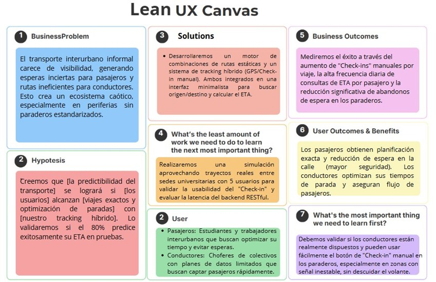
</p>

## 1.3. Segmentos objetivo

### Segmento Objetivo 1: Pasajeros

#### Datos Demográficos
- **Sexo**: Masculino y Femenino  
- **Edades**: 18–45 años  
- **Nivel Socioeconómico**: Medio–Bajo a Medio  
- **Ocupación**: Estudiantes universitarios, técnicos y trabajadores dependientes/independientes  
- **Ingresos**: Medios, dependientes del transporte público económico  

#### Aspectos Geográficos
- **Nacionalidad**: Peruana  
- **Ubicación Actual**: Zonas periféricas, distritos interurbanos o ciudades con alto índice de transporte informal (colectivos)  
- **Acceso a Tecnología**: Smartphones de gama media/baja, planes de datos prepago o limitados  

#### Aspectos Psicográficos
- **Motivaciones**:
  - Llegar a tiempo a sus destinos  
  - No perder tiempo esperando "a ciegas" en la calle  
  - Seguridad personal  

- **Estilo de vida**:
  - Rutinario  
  - Horarios ajustados  
  - Alta movilidad interdistrital  

- **Preocupaciones**:
  - Impuntualidad  
  - Clima durante la espera  
  - Inseguridad en paraderos vacíos  

- **Adaptación a la tecnología**:
  - Media-Alta  
  - Uso constante de mensajería y redes sociales  

- **Interés por la personalización**:
  - Medio  
  - Valoran que la app guarde rutas frecuentes  

---

### Segmento Objetivo 2: Conductores (Emisores de Datos)

#### Datos Demográficos
- **Sexo**: Mayoritariamente Masculino  
- **Edades**: 30–60 años  
- **Nivel Socioeconómico**: Medio–Bajo a Medio  
- **Ocupación**: Choferes de colectivos y transporte interurbano  
- **Ingresos**: Variables, dependientes de la cantidad de carreras o "vueltas" diarias  

#### Aspectos Geográficos
- **Nacionalidad**: Peruana  
- **Ubicación Actual**: Mismas zonas de operación que el Segmento 1  
- **Acceso a Tecnología**: Smartphones básicos a gama media, preocupación constante por consumo de datos y batería  

#### Aspectos Psicográficos
- **Motivaciones**:
  - Llenar el vehículo rápidamente  
  - Maximizar ingresos diarios  

- **Estilo de vida**:
  - Dinámico  
  - Largas horas al volante  
  - Alto estrés por el tráfico  

- **Preocupaciones**:
  - Costo del combustible  
  - Consumo de datos del celular  
  - Multas de tránsito  

- **Adaptación a la tecnología**:
  - Básica-Media  
  - Preferencia por interfaces simples (un solo toque)  
  - Rechazo a apps complejas o invasivas  

- **Interés por la personalización**:
  - Bajo  
  - Buscan una herramienta utilitaria y directa 

---

### Segmento Objetivo 3: Managers (Administradores / Coordinadores de Ruta)

#### Datos Demográficos
- **Sexo**: Masculino y Femenino  
- **Edades**: 25–55 años  
- **Nivel Socioeconómico**: Medio–Bajo a Medio-Alto  
- **Ocupación**: Coordinadores de ruta, presidentes de comités de transporte, dueños de flotas de minivans/colectivos  
- **Ingresos**: Medios a altos  

#### Aspectos Geográficos
- **Nacionalidad**: Peruana  
- **Ubicación Actual**: Zonas urbanas y periféricas de Lima  
- **Acceso a Tecnología**: Laptop, PC de escritorio o tablets de gama media  

#### Aspectos Psicográficos
- **Motivaciones**:
  - Optimizar los tiempos de recorrido de la flota  
  - Reducir pérdidas por paraderos sin demanda  
  - Formalizar los tiempos de la asociación  

- **Estilo de vida**:
  - Administrativo y de supervisión  
  - Alto estrés por la gestión de personal y multas  

- **Preocupaciones**:
  - Cumplimiento de horarios de los conductores  
  - Competencia con otras líneas de transporte  

- **Adaptación a la tecnología**:
  - Media  
  - Familiarizados con el uso de hojas de cálculo o navegadores web básicos  

- **Interés por la personalización**:
  - Medio-Alto  
  - Valoran la personalización de las rutas y la capacidad de editar la información de los paraderos 

# Capítulo II: Requirements Elicitation & Analysis
## 2.1. Competidores
### 2.1.1. Análisis competitivo

|  | **Moovit** | **Google Maps** | **TuRuta** |
|---------------------------------------------------------------|-----------------------------|---------------------------|---------------------------|
| **Perfil**<br>Overview | Plataforma enfocada en transporte interurbano informal (colectivos). Usa tracking híbrido (GPS/Check-in) para calcular tiempos y rutas de transbordo en zonas con paraderos no oficiales. | App global en movilidad urbana. Integra horarios de trenes y buses. | Startup peruana enfocada en rutas de buses tradicionales. |
| **Ventaja competitiva**<br>¿Qué valor ofrece a los clientes? | Integra y visibiliza rutas informales. El modo "Check-in" ahorra datos al conductor. Sugiere transbordos estáticos que otras apps ignoran. | Base de datos masiva de transporte oficial. Alertas paso a paso muy precisas. | Conocimiento local de las rutas de buses tradicionales peruanas y comunidad activa. |

| **Perfil de marketing** |  |  |  |
|-------------------------|--|--|--|
| **Mercado objetivo** | Estudiantes/trabajadores de zonas periféricas y choferes de colectivos interurbanos. | Usuarios de transporte público masivo formal (Metropolitano, corredores). | Usuarios frecuentes de "micros" y combis en Lima metropolitana. |
| **Estrategias de marketing** | Mostrar la app como una manera efectiva de no esperar demasiado y planificar rutas con transbordos. | Alianzas con municipios, SEO global, integración con Uber/Cabify. | Alianzas con empresas de transporte tradicionales y gamificación comunitaria. |

| **Perfil de Producto** |  |  |  |
|------------------------|--|--|--|
| **Productos & Servicios** | App móvil (pasajeros) y módulo de emisión híbrida (conductores). Motor de ETA basado en microservicios. | Planificador multimodal, horarios offline, alertas de bajada. | ETA de buses limeños, alarmas para despertar antes del paradero. |
| **Precios & Costos** | S/ 0 (Desarrollo académico en Free Tier AWS). | Gratis con anuncios (Freemium). | Gratis con anuncios, opción de pago sin publicidad. |
| **Canales de distribución** | Móvil, GitHub | App Store, Google Play, Web. | App Store, Google Play. |

| **FODA** |  |  |  |
|----------|--|--|--|
| **Fortalezas** | Atiende un nicho aún no entendido completamente. Arquitectura Cloud Native ligera. Consumo mínimo de datos. | Precisión extrema en rutas formales y presencia global. | Fuerte tropicalización y entendimiento del caos limeño. |
| **Oportunidades** | Formalizar digitalmente un sector que moviliza a millones. | Integrar micro-movilidad (scooters, bicicletas) en su red. | Expandirse a otras provincias del Perú. |
| **Debilidades** | Dependencia inicial de que los choferes hagan el Check-in. Sistema en fase de prueba manual. | Ignora por completo el transporte de colectivos o taxis de ruta. | Consume muchos datos/batería al requerir GPS constante en todos los buses. |
| **Amenazas** | Que apps locales como TuRuta añadan soporte para segu## 2.2. Entrevistas
### 2.2.1. Diseño de entrevistas

#### Preguntas Generales
1. ¿Cuál es tu nombre, edad, distrito de residencia, ocupación actual y estado civil?
2. ¿Qué modelo de smartphone utilizas habitualmente y cuáles son las tres aplicaciones (o marcas digitales) que más usas en tu día a día?

---

#### Segmento 1: Pasajeros
1. ¿Cómo es tu rutina de viaje diario, qué rutas sueles tomar y cuánto tiempo pasas esperando tu vehículo en el paradero?
2. ¿Cuál es tu mayor frustración al momento de esperar movilidad o al tener que realizar un transbordo para llegar a tu destino?
3. Si tuvieras una herramienta que te indique el tiempo exacto de llegada de tu vehículo, ¿qué información priorizarías ver en la pantalla principal para planificar tu viaje?
4. ¿Qué canales digitales utilizas para informarte sobre rutas o tráfico actualmente (grupos de WhatsApp, Facebook, otras apps)?
5. ¿Qué tan confiable te resultaría una app que calcula el tiempo de llegada basándose en los reportes de los propios conductores; qué necesitarías para confiar plenamente en ella?
6. ¿Te consideras una persona que planifica sus viajes con anticipación o prefieres salir y tomar lo primero que pase?

---

#### Segmento 2: Conductores
1. ¿Cuántos años llevas conduciendo en tu ruta actual, cómo es un día típico de trabajo y cómo decides en qué paraderos detenerte?
2. ¿Cuál es el mayor desafío o frustración que enfrentas para conseguir pasajeros rápidamente y optimizar el tiempo de tus trayectos?
3. ¿Qué tan cómodo te sientes usando aplicaciones móviles mientras trabajas y qué características hacen que una app sea realmente fácil de usar para ti?
4. Si tuvieras un botón amplio en tu pantalla para avisar a los pasajeros que estás llegando a un paradero ("Check-in"), ¿estarías dispuesto a presionarlo en cada viaje? ¿Por qué sí o por qué no?
5. ¿Qué beneficio concreto necesitarías percibir (por ejemplo, saber exactamente cuántos pasajeros te están esperando) para utilizar la herramienta todos los días?
6. ¿Dónde colocas tu celular mientras conduces y mediante qué canales digitales sueles comunicarte con otros compañeros de ruta?

---

#### Segmento 3: Managers (Coordinadores / Administradores de Ruta)
1. ¿Cuál es tu cargo dentro de la empresa o asociación de transporte, cuántos vehículos tienes a cargo y cuántos años de experiencia tienes en el sector?
2. ¿Qué herramientas tecnológicas (celular, laptop, software de gestión) utiliza habitualmente para coordinar los despachos y controlar las unidades?
3. ¿Cómo define, diseña y comunica las rutas y paraderos a sus conductores actualmente? ¿Qué dificultades encuentra en este proceso?
4. ¿Cómo mide si una ruta está siendo rentable o si hay paraderos específicos con alta demanda que no están siendo atendidos adecuadamente?
5. ¿De qué manera valida que un conductor esté cumpliendo con su recorrido y paradas autorizadas en los horarios establecidos?
6. ¿Estaría dispuesto a utilizar una plataforma digital para configurar sus rutas de forma estática y monitorear la demanda acumulada en paraderos en tiempo real? ¿Qué frustración principal esperaría resolver con ella?

### 2.2.2. Registro de entrevistas

#### Segmento 1: Pasajeros

##### Entrevista N°1 – Segmento 1

- **Nombres:** Juan
- **Apellidos:** Pescoran
- **Edad:** 19 años
- **Ciudad:** Trujillo
- **URL Entrevista:** https://tinyurl.com/VideoSegmento1
- **Duración:** 00:08:46 minutos
- **Resumen:** Juan, un estudiante universitario de 19 años, comentó que en su experiencia los "jaladores" de colectivos suelen brindar información incorrecta sobre las rutas, lo que genera confusión. Actualmente, su método para abordar un colectivo consiste en preguntar directamente al conductor sobre el recorrido. Además, considera que sería muy útil poder planificar su viaje antes de salir, especialmente porque en Trujillo no existen paraderos formales. Finalmente, destacó que valoraría mucho un sistema confiable que le permita identificar qué colectivos lo pueden llevar a su destino de manera precisa.

##### Entrevista N°2 – Segmento 1
 
- **Nombres:** Jude
- **Apellidos:** Hermoza Quispe
- **Edad:** 21 años
- **Ciudad:** Lima
- **URL Entrevista:** https://upcedupe-my.sharepoint.com/personal/u20231c540_upc_edu_pe/_layouts/15/stream.aspx?id=%2Fpersonal%2Fu20231c540%5Fupc%5Fedu%5Fpe%2FDocuments%2Fvideo2210470622%2Emp4&referrer=StreamWebApp%2EWeb&referrerScenario=AddressBarCopied%2Eview%2E89174c6f%2Dd3be%2D400a%2D8d4e%2Db531864b0ace
- **Duración:** 00:06:15 minutos
- **Resumen:** Jude es un estudiante que viaja a diario desde Ate hasta San Miguel. Su principal dolor es la incertidumbre de no saber a qué hora pasará la minivan que lo acerca al paradero del Corredor Rojo. Suele esperar entre 15 y 30 minutos a la intemperie. Usa un celular Redmi Note 11 principalmente para WhatsApp y mapas. Estaría muy dispuesto a usar una aplicación que le avise cuándo viene el colectivo y valora mucho poder ver de forma visual en la pantalla cuánto falta exactamente para que llegue a su paradero.

##### Entrevista N°3 – Segmento 1
[entrevista_segmento1](img/entrevistaNaim.jpg)
- **Nombres:** Naim
- **Apellidos:** Napuri Rojas
- **Edad:** 22 años
- **Ciudad:** Lima
- **URL Entrevista:** https://upcedupe-my.sharepoint.com/personal/u20231c540_upc_edu_pe/_layouts/15/stream.aspx?id=%2Fpersonal%2Fu20231c540%5Fupc%5Fedu%5Fpe%2FDocuments%2Fvideo2223470622%2Emp4&referrer=StreamWebApp%2EWeb&referrerScenario=AddressBarCopied%2Eview%2E89174c6f%2Dd3be%2D400a%2D8d4e%2Db531864c0ace
- **Duración:** 00:07:30 minutos
- **Resumen:** Naim viaja diariamente para estudiar y trabajar. Su recorrido implica realizar un transbordo estático. Explica que la mayor frustración es que las aplicaciones tradicionales como Google Maps no muestran los colectivos informales, obligándolo a preguntar a la gente en la calle sobre las tarifas y las paradas de transbordo. Usa un Samsung Galaxy A34. Si existiera una app con información de estas rutas y transbordos, la usaría sin dudar, siempre y cuando sea liviana y cargue rápido con pocos datos móviles.

---

#### Segmento 2: Conductores

##### Entrevista N°1 – Segmento 2

- **Nombres:** Andy Mauri
- **Apellidos:** Pillaca Torres
- **Edad:** 26 años
- **Ciudad:** Lima
- **URL Entrevista:** https://drive.google.com/file/d/1so5df0ySYQIBXWjm7smSaWyOXd0-n51H/view?usp=sharing
- **Duración:** 00:04:30 minutos
- **Resumen:** Mauri tiene varios años de experiencia en transporte urbano informal. Su jornada depende de identificar visualmente dónde hay pasajeros esperando. Destaca que no saber dónde está concentrada la demanda le hace perder mucho tiempo y combustible, dando vueltas innecesarias o compitiendo de forma agresiva por pasajeros. Usa el celular constantemente para coordinar con sus compañeros vía WhatsApp. Estaría dispuesto a interactuar con un botón grande de "Check-in" al llegar a paraderos clave si eso le permite saber de antemano cuántos pasajeros lo están esperando más adelante.

##### Entrevista N°2 – Segmento 2

- **Nombres:** Sebastian
- **Apellidos:** Rodriguez Macedo
- **Edad:** 23 años
- **Ciudad:** Lima
- **URL Entrevista:** https://upcedupe-my.sharepoint.com/:v:/g/personal/u20231c540_upc_edu_pe/IQCiYQ4UaesKQKGHwmrssM8mAU0A970vEi49uwUr2PLSAvk?e=zSdjNy
- **Duración:** 00:04:05 minutos
- **Resumen:** Sebastián decide sus paradas según la demanda visible del momento. Trabaja para maximizar sus ganancias y el tráfico es su principal obstáculo. Usa un iPhone 12. Considera muy viable interactuar con la app mediante un solo toque siempre que la interfaz sea minimalista, de alto contraste y no interfiera con su conducción ni le obligue a llenar formularios largos mientras maneja.

##### Entrevista N°3 – Segmento 2

- **Nombres:** Leonardo
- **Apellidos:** Prieto Mantari
- **Edad:** 24 años
- **Ciudad:** Lima
- **URL Entrevista:** https://upcedupe-my.sharepoint.com/personal/u20231c540_upc_edu_pe/_layouts/15/stream.aspx?id=%2Fpersonal%2Fu20231c540%5Fupc%5Fedu%5Fpe%2FDocuments%2Fvideo2223473622%2Emp4&referrer=StreamWebApp%2EWeb&referrerScenario=AddressBarCopied%2Eview%2E89174c6f%2Dd3be%2D400a%2D8d4e%2Db531264c0ace
- **Duración:** 00:05:12 minutos
- **Resumen:** Leonardo conduce una minivan interurbana desde hace 5 años. Se comunica constantemente con otros conductores para pasarse la voz sobre rutas o dateros. Explica que a menudo se detiene en paraderos vacíos por inercia, perdiendo tiempo valioso. Usa un Motorola G53 en un soporte en el tablero. Considera que un sistema híbrido (GPS automático + Check-in manual) es ideal debido a las constantes pérdidas de señal en zonas periféricas. Usaría la aplicación a diario si le garantiza visibilidad de la demanda en tiempo real.

---

#### Segmento 3: Managers (Coordinadores / Administradores de Ruta)

##### Entrevista N°1 – Segmento 3

- **Nombres:** Ricardo
- **Apellidos:** Del Aguila
- **Edad:** 21 años
- **Ciudad:** Lima
- **URL Entrevista:** https://upcedupe-my.sharepoint.com/personal/u20231c540_upc_edu_pe/_layouts/15/stream.aspx?id=%2Fpersonal%2Fu20231c540%5Fupc%5Fedu%5Fpe%2FDocuments%2Fvideo2523473622%2Emp4&referrer=StreamWebApp%2EWeb&referrerScenario=AddressBarCopied%2Eview%2E89174c6f%2Dd3be%2D400a%2D8d4e%2Db531262c0ace
- **Duración:** 00:04:20 minutos
- **Resumen:** Ricardo es el coordinador de una asociación de 30 minivans. Administra las rutas utilizando mapas en papel e instrucciones verbales. Su principal frustración es la falta de control sobre los conductores: no tiene forma de saber si completan el recorrido o si cobran la tarifa establecida. Utiliza una laptop HP y un Samsung S21. Valora la posibilidad de registrar de forma digital y estática sus rutas y paraderos en un mapa interactivo para estandarizar el servicio, y monitorear el rendimiento general de su flota.

##### Entrevista N°2 – Segmento 3
- **Nombres:** Walter
- **Apellidos:** Ramos Castro
- **Edad:** 23 años
- **Ciudad:** Lima 
- **URL Entrevista:** https://upcedupe-my.sharepoint.com/personal/u20231c540_upc_edu_pe/_layouts/12/stream.aspx?id=%2Fpersonal%2Fu20231c540%5Fupc%5Fedu%5Fpe%2FDocuments%2Fvideo2523473562%2Emp4&referrer=StreamWebApp%2EWeb&referrerScenario=AddressBarCopied%2Eview%2E89174c6f%2Dd3be%2D400a%2D8d4e%2Db5a1262c0ace
- **Duración:** 00:07:45 minutos
- **Resumen:** Walter coordina una ruta de transporte periférico. Su día a día consiste en programar las salidas de los buses y resolver quejas de los pasajeros por tardanzas. Su mayor dolor es que los conductores no respetan los horarios de salida y alteran las rutas para ganarse pasajeros de otras líneas. Usa una PC de escritorio y un iPhone 11. Indica que le urge una herramienta para definir tarifas claras y paraderos oficiales que los conductores deban marcar de forma obligatoria para validar que están operando correctamente.

##### Entrevista N°3 – Segmento 3
- **Nombres:** Raul
- **Apellidos:** Quispe Sanchez
- **Edad:** 21 años
- **Ciudad:** Lima
- **URL Entrevista:** https://upcedupe-my.sharepoint.com/personal/u20231c540_upc_edu_pe/_layouts/12/stream.aspx?id=%2Fpersonal%2Fu20231c540%5Fupc%5Fedu%5Fpe%2FDocuments%2Fvideo2521473562%2Emp4&referrer=StreamWebApp%2EWeb&referrerScenario=AddressBarCopied%2Eview%2E89174c6f%2Dd3be%2D400a%2D8d4e%2Db5a1762c0ace
- **Duración:** 00:06:50 minutos
- **Resumen:** Raúl administra una pequeña flota de colectivos interurbanos. Para él, es crítico identificar si la ruta asignada está cubriendo áreas con demanda real o si están enviando unidades a zonas vacías. Usa una ThinkPad y un Redmi Note 12. Quisiera una herramienta que le muestre reportes agregados e indicadores sencillos como la cantidad de paraderos registrados y tarifas promedio. Considera indispensable poder ver estadísticas acumuladas para tomar decisiones comerciales sobre cambios en las rutas.

### 2.2.3. Análisis de entrevistas

A partir de las 9 entrevistas registradas (3 por cada segmento objetivo), se identificaron patrones de comportamiento y datos estadísticos clave para la validación de la solución:

- **Datos Demográficos y Contexto:** El 77.7% (7 de 9) de los entrevistados reside en Lima Metropolitana, concentrándose en distritos de la periferia urbana (SJL, Ate, Carabayllo, VES). El promedio de edad del segmento Pasajeros es de 20.6 años (100% estudiantes universitarios/técnicos). Los Conductores promedian 27.6 años de edad, mientras que los Managers promedian 45.3 años, evidenciando una brecha generacional en la gestión del transporte.
- **Adopción Tecnológica y Dispositivos:** El 100% de los entrevistados utiliza un smartphone a diario (Android predomina con el 77.7% sobre iOS con el 22.3%). Sin embargo, la interacción varía por segmento: los Pasajeros usan pantallas dinámicas con alta fluidez; los Conductores (100%) requieren interfaces simplificadas de un solo toque y rechazan la entrada manual de texto mientras conducen; los Managers (100%) prefieren el uso de computadoras portátiles o de escritorio para tareas administrativas y de configuración de rutas.
- **Canales de Interacción:** El 100% de los conductores y managers utilizan WhatsApp como canal de comunicación principal para alertas de tráfico, control y coordinación interna de la flota.
- **Dolores y Frustraciones Subjetivas:**
  - **Pasajeros (100%):** Sufren de ansiedad y estrés debido a la "espera a ciegas" en el paradero y la falta de información confiable sobre rutas informales o tarifas.
  - **Conductores (100%):** Manifiestan frustración por el desperdicio de combustible al buscar pasajeros por inercia y competir desorganizadamente con otras unidades.
  - **Managers (100%):** Reportan una total falta de visibilidad y control sobre el cumplimiento de las rutas y horarios por parte de los choferes, además de ineficiencia por depender de registros manuales en papel.

## 2.3. Needfinding
### 2.3.1. User Personas

<p align="center">
  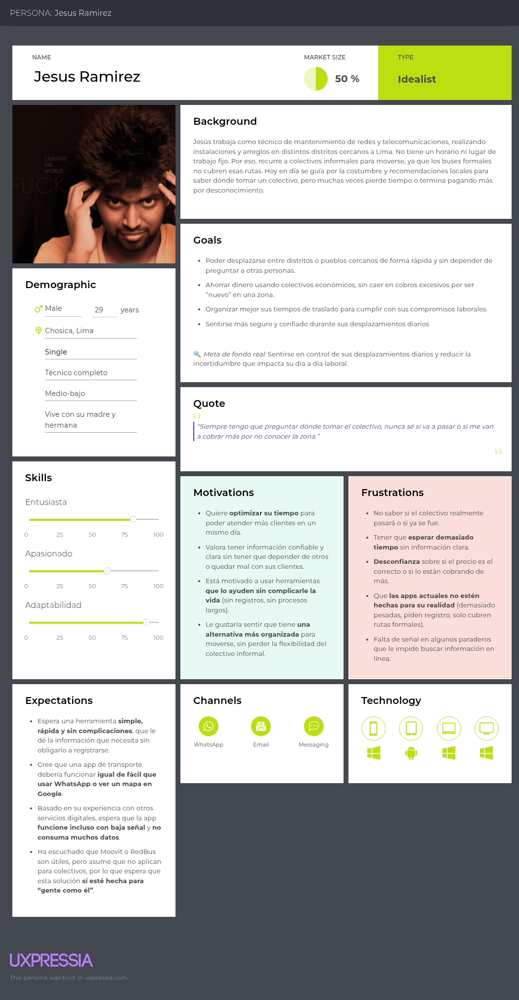
</p>

<p align="center">
  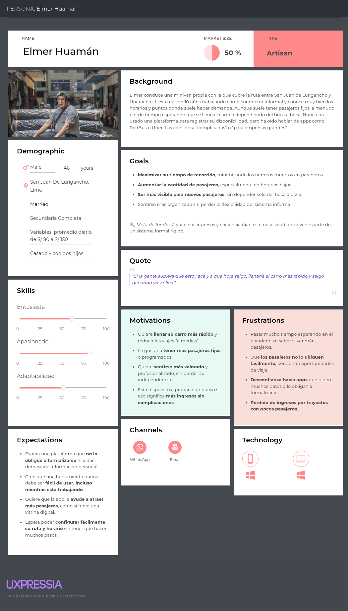
</p>

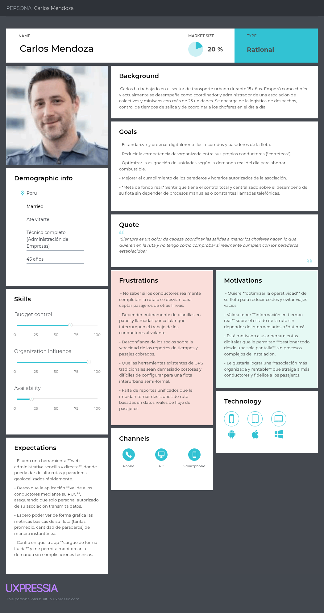

### 2.3.2. User Task Matrix

| Tarea (Task del mundo real) | Jesús Ramírez (Pasajero) | Frecuencia / Importancia | Roberto Quispe (Conductor) | Frecuencia / Importancia | Carlos Mendoza (Manager) | Frecuencia / Importancia |
|-----------------------------|---------------------------|---------------------------|-----------------------------|---------------------------|--------------------------|---------------------------|
| Planificar el horario de salida | Alta | Alta / Alta | Alta | Alta / Media | Alta | Alta / Alta |
| Identificar la ruta y trasbordos necesarios | Media | Media / Alta | Baja | Baja / Baja | Alta | Alta / Alta |
| Desplazarse y esperar en el paradero | Alta | Alta / Alta | Alta | Alta / Alta | N/A | N/A |
| Calcular el tiempo de llegada al destino | Alta | Alta / Alta | Media | Media / Alta | Media | Media / Media |
| Identificar paraderos adecuados para abordar/recoger/despachar | Alta | Alta / Alta | Media | Media / Media | Alta | Alta / Alta |
| Configurar rutas, tarifas y paraderos en la plataforma | N/A | N/A | N/A | N/A | Alta | Alta / Alta |
| Monitorear cumplimiento de recorridos de los conductores | N/A | N/A | N/A | N/A | Alta | Alta / Alta |
| Registrar y visualizar demanda de pasajeros en tiempo real | Alta | Alta / Alta | Alta | Alta / Alta | Media | Media / Alta |

### 2.3.3. Empathy Mapping

**Segmento 1, segmento 2 y segmento 3:**

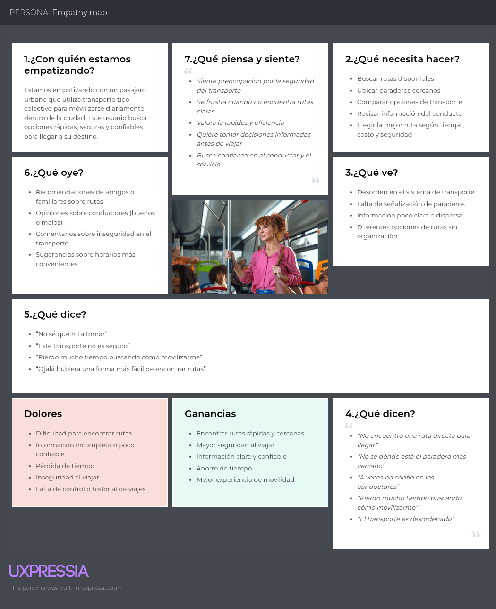

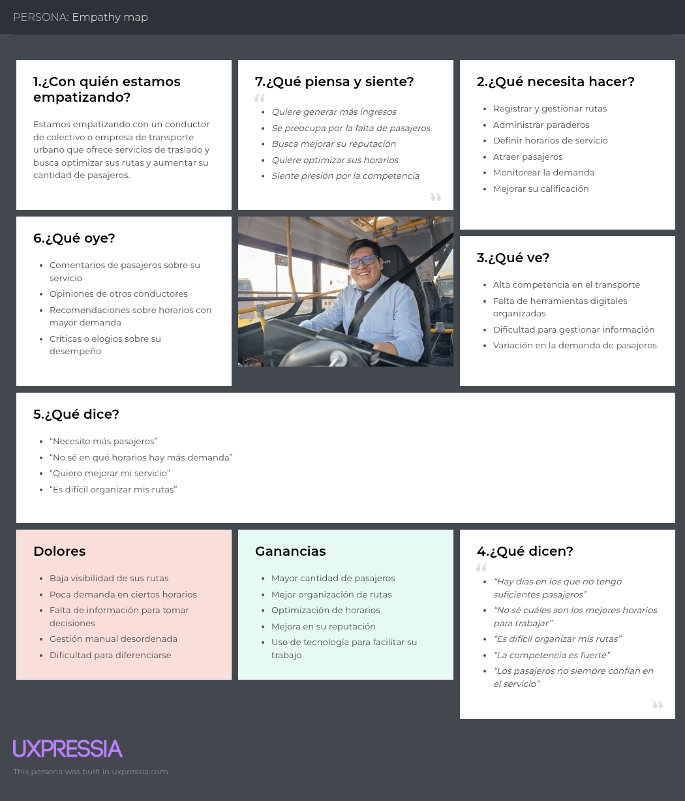

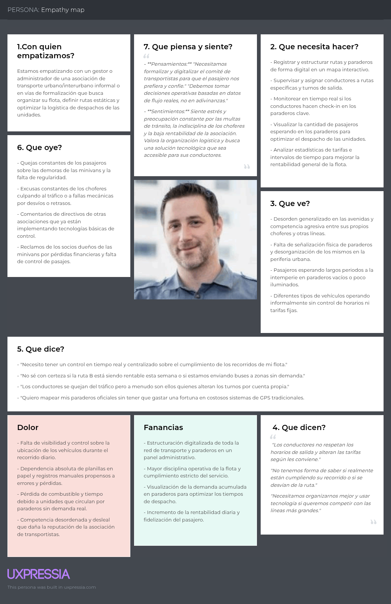

### 2.3.4. As-is Scenario Mapping

#### AS - IS Scenario Mapping (Segmento: Pasajeros)
| FASES             | Buscar ruta/colectivo                          | Planificar viaje                                      | Abordar colectivo                                  | Llegada a destino                                   |
|------------------|------------------------------------------------|------------------------------------------------------|----------------------------------------------------|-----------------------------------------------------|
| **DOING**        | Preguntar a personas locales sobre rutas y paraderos disponibles. | No hay información clara sobre tarifas, horarios o puntos de embarque. | Llegar al paradero y esperar hasta que el colectivo llegue. | Confirmar llegada al destino mediante señales visuales. |
| **THINKING**     | "No sé si estoy en la ruta correcta."          | "No tengo idea de cuánto me costará ni a qué hora llegaré." | "¿Será este el colectivo correcto?"                 | "¿Llegué al lugar adecuado?"                        |
| **FEELING**      | Confusión, incertidumbre.                     | Ansiedad, falta de control.                          | Desconfianza, incomodidad.                         | Estrés, falta de información.                      |

#### AS - IS Scenario Mapping (Segmento: Conductores)
| FASES             | Activar disponibilidad                        | Captar pasajeros                                      | Realizar recorrido                                  | Finalizar viaje                                    |
|------------------|------------------------------------------------|------------------------------------------------------|----------------------------------------------------|---------------------------------------------------|
| **DOING**        | No hay plataforma para activar su disponibilidad. | Esperar en el paradero sin saber si hay pasajeros.    | Realizar el recorrido sin un control preciso de tiempo o pasajeros. | No hay seguimiento digital ni estadísticas sobre el viaje. |
| **THINKING**     | "¿Habrá pasajeros para mi ruta hoy?"           | "¿Estarán los pasajeros listos cuando llegue?"        | "¿Voy a llegar a tiempo o hacer paradas innecesarias?" | "No tengo forma de saber si mi viaje fue rentable." |
| **FEELING**      | Incertidumbre, frustración.                    | Inseguridad, desorganización.                         | Estrés, falta de control.                          | Desconcierto, falta de retroalimentación.          |

#### AS - IS Scenario Mapping (Segmento: Managers)
| FASES             | Diseñar y registrar rutas                      | Asignar conductores                                  | Monitorear despachos                               | Analizar rentabilidad y demanda                    |
|------------------|------------------------------------------------|------------------------------------------------------|----------------------------------------------------|----------------------------------------------------|
| **DOING**        | Trazar rutas manualmente en cuadernos o mapas impresos de forma verbal. | Llamar a los conductores por teléfono o WhatsApp para coordinar sus turnos de salida. | Depender de "dateros" informales en la calle para saber si los buses van a tiempo. | Sumar planillas de boletos físicos recolectados por los choferes al final del día. |
| **THINKING**     | "¿Serán óptimos estos paraderos para captar más gente?" | "¿Irán a salir a tiempo todos los choferes hoy?"     | "¿Estarán cumpliendo con la ruta o se habrán desviado?" | "¿Habrá sido rentable la ruta el día de hoy?"       |
| **FEELING**      | Dificultad, preocupación.                     | Estrés, falta de control operativo.                  | Total incertidumbre, frustración.                  | Cansancio, desorganización financiera.             |


# Capítulo III: Requirements Specification

## 3.1 To-Be Scenario Mapping

En esta sección presentamos los To-Be Scenario Mapping elaborados para cada uno de nuestros User Personas. Para su construcción, el equipo llevó a cabo un proceso iterativo y colaborativo. Iniciamos con una etapa de **preparación** y revisión de los As-Is Scenario Mapping. Posteriormente, se realizó una **lluvia de ideas individual** para proponer mejoras en la experiencia. Luego, pasamos a la **revisión e identificación de fases** donde nombramos las fases clave del viaje ideal del usuario. Finalmente, al **comparar el mapa con el As-Is Scenario Mapping**, identificamos los cambios positivos y el valor que nuestra plataforma aportará en cada etapa, estructurando la información en las filas Doing, Thinking y Feeling.

### To-Be Scenario Mapping (Segmento: Pasajeros)
| FASES             | Buscar ruta/colectivo                        | Planificar viaje                                  | Abordar colectivo                                 | Llegada a destino                              |
|------------------|----------------------------------------------|--------------------------------------------------|--------------------------------------------------|------------------------------------------------|
| **DOING**        | Entro a la app y visualizo rutas y paraderos disponibles. | Consulto tarifas estimadas, horarios aproximados y puntos de embarque. | Llego al paradero indicado con anticipación y abordo el vehículo. | Confirmo llegada y califico al conductor en la app. |
| **THINKING**     | "Ya no tengo que preguntar a nadie en la calle." | "Puedo calcular cuánto me costará y a qué hora llegaré." | "Estoy yendo al lugar correcto, sé quién me llevará." | "Fue un viaje tranquilo, todo estuvo bien organizado." |
| **FEELING**      | Seguridad, autonomía.                         | Confianza, planificación.                        | Tranquilidad, menor ansiedad.                   | Satisfacción, gratitud.                        |

### To-Be Scenario Mapping (Segmento: Conductores)
| FASES             | Activar disponibilidad                       | Captar pasajeros                                 | Realizar recorrido                               | Finalizar viaje                                 |
|------------------|----------------------------------------------|--------------------------------------------------|--------------------------------------------------|-------------------------------------------------|
| **DOING**        | Abro la app y activo mi ruta habitual.       | Aparece la demanda en mis próximos paraderos con un tiempo estimado. | Recojo a los pasajeros y sigo mi ruta con apoyo del GPS. | Marco el fin del viaje y visualizo mi calificación y métricas. |
| **THINKING**     | "Estoy visible para más pasajeros hoy."      | "Ya sé dónde recoger pasajeros y optimizo mi tiempo." | "Todo va según lo planeado, sin competencias innecesarias." | "Ese viaje fue rentable y sin desgastes."      |
| **FEELING**      | Motivación, oportunidad.                     | Eficiencia, comodidad.                           | Control, foco.                                   | Logro, satisfacción.                            |

### To-Be Scenario Mapping (Segmento: Managers)
| FASES             | Diseñar y configurar rutas                     | Gestionar paraderos y tarifas                       | Monitorear despachos                               | Analizar rentabilidad y demanda                    |
|------------------|------------------------------------------------|------------------------------------------------------|----------------------------------------------------|----------------------------------------------------|
| **DOING**        | Ingreso al panel web y trazo las rutas oficiales de la empresa. | Registro nuevos paraderos con coordenadas y ajusto tarifas. | Observo el dashboard en tiempo real con los buses activos. | Reviso reportes consolidados sobre frecuencias e intervalos. |
| **THINKING**     | "Es muy fácil establecer los recorridos de manera formal." | "Tengo control total sobre los puntos de embarque y cobros." | "Sé exactamente dónde están mis unidades y si cumplen su itinerario." | "La rentabilidad es clara gracias a los datos recopilados." |
| **FEELING**      | Facilidad, seguridad.                         | Empoderamiento, organización.                        | Tranquilidad, control operativo.                   | Satisfacción, confianza comercial.                 |

## 3.2 User Stories
| ID | Título | Descripción | Criterios de Aceptación |
|---|---|---|---|
| US01 | Explorar paraderos desde Landing | Como visitante, quiero explorar los paraderos disponibles desde la Landing Page para conocer la cobertura sin registrarme. | Escenario 1: Al hacer clic en "Explorar paraderos", el sistema muestra un mapa o listado público de paraderos activos.<br>Escenario 2: Si no hay paraderos en la zona, se muestra un mensaje informativo amigable. |
| US02 | Consultar funcionamiento y ventajas | Como visitante, quiero leer las secciones "Cómo funciona" y "Ventajas" para entender el valor de la plataforma. | Escenario 1: Navegación fluida y acceso a infografías o textos explicativos de transbordos y seguimiento. |
| US03 | Acceder a FAQ | Como visitante, quiero acceder a las Preguntas Frecuentes para resolver mis dudas sobre el servicio. | Escenario 1: Se listan respuestas claras sobre tarifas, tiempos de espera y reporte de problemas. |
| US04 | Registro de Pasajeros | Como pasajero, quiero registrarme con mis datos básicos para poder acceder a la búsqueda y seguimiento de buses. | Escenario 1: Al enviar nombre, correo y contraseña válida, se crea la cuenta con rol PASSENGER.<br>Escenario 2: Rechazo automático si el correo ya existe en la base de datos. |
| US05 | Registro de Conductores con RUC | Como conductor, quiero registrarme ingresando mi información y el RUC de mi empresa para validar mi legitimidad. | Escenario 1: El sistema valida el RUC, confirma que pertenece a una empresa/ruta registrada y asocia al usuario con rol DRIVER.<br>Escenario 2: Bloqueo del registro si el RUC es inválido o no existe, evitando que pasajeros se registren como conductores. |
| US06 | Inicio de Sesión con JWT | Como usuario, quiero iniciar sesión de forma segura para acceder a mi panel correspondiente. | Escenario 1: Al ingresar credenciales correctas, el backend genera y devuelve un Access Token firmado en formato JWT. |
| US07 | Cierre de Sesión | Como usuario, quiero cerrar mi sesión activa para proteger mi información en dispositivos compartidos. | Escenario 1: Al presionar "Cerrar sesión", el cliente elimina el token JWT y redirige a la Landing Page. |
| US09 | Registro inicial de Empresa | Como gestor de empresa, quiero registrar los datos generales de mi compañía en mi primer login para no volver a ingresarlos. | Escenario 1: Tras el primer inicio de sesión, un formulario obligatorio captura la razón social y datos de contacto antes de habilitar el panel. |
| US11 | Panel de resumen de métricas | Como gestor de empresa, quiero ver un dashboard inicial con el total de paraderos, tarifa e intervalo promedio. | Escenario 1: El sistema calcula y renderiza las métricas en tiempo real al cargar la vista principal de la empresa. |
| US12 | Crear y listar Paraderos | Como gestor de empresa, quiero registrar nuevos paraderos y ver mi lista completa para estructurar mis recorridos. | Escenario 1: Al ingresar nombre, región, provincia, distrito y coordenadas, el paradero se persiste y lista. |
| US13 | Editar y eliminar Paraderos | Como gestor de empresa, quiero modificar o dar de baja paraderos para mantener mi red de embarque actualizada. | Escenario 1: Un paradero eliminado deja de estar disponible para futuras asignaciones de rutas. |
| US14 | Visualizar paraderos en el mapa | Como gestor o pasajero, quiero filtrar paraderos por ubicación y verlos geolocalizados en un mapa interactivo. | Escenario 1: Al aplicar filtros de región/provincia/distrito, los marcadores en el mapa se actualizan dinámicamente. |
| US15 | Crear Ruta y Horarios | Como gestor de empresa, quiero crear rutas conectando paraderos y definiendo tarifas y frecuencias de salida. | Escenario 1: Se asocian paraderos de origen, paraderos intermediarios y destino, fijando el precio y el intervalo en minutos. |
| US17 | Búsqueda de Rutas y Transbordos | Como pasajero, quiero buscar cómo llegar a un destino obteniendo rutas directas o sugerencias de transbordos. | Escenario 1: El algoritmo calcula e indica si el trayecto es directo o requiere cambiar de bus en un paradero intermedio. |
| US18 | Detalle visual de la Ruta | Como pasajero, quiero ver la foto del bus, compañía, región y distritos que recorre para abordar con certeza. | Escenario 1: La tarjeta de resultado expone la fotografía del vehículo, el logo de la empresa y la lista secuencial de distritos. |
| US19 | Indicar espera en Paradero | Como pasajero, quiero marcar en qué paradero estoy y hacia dónde voy para notificar mi demanda a los buses. | Escenario 1: Al confirmar espera, se incrementa el contador de concurrencia de ese paradero sin requerir GPS permanente. |
| US20 | Consultar Tiempo Estimado (ETA) | Como pasajero, quiero ver el tiempo exacto faltante para que el bus más cercano llegue a mi ubicación. | Escenario 1: El sistema consulta la última coordenada del bus y calcula la estimación de llegada en minutos. |
| US22 | Confirmación manual de abordaje | Como pasajero, quiero marcar "Subí al bus" para retirarme activamente de la lista de espera del paradero. | Escenario 1: Al presionar el botón, el sistema descuenta al usuario de la concurrencia visible para el conductor. |
| US23 | Eliminación automática de espera | Como pasajero, quiero que el sistema me retire de la cola si olvido marcar, a los 2 minutos de la llegada del bus. | Escenario 1: Un job verifica si el bus pasó por el paradero; tras 2 minutos sin confirmación manual, limpia la cola automáticamente. |
| US28 | Transmitir ubicación GPS | Como conductor, quiero activar el envío de mi ubicación GPS en tiempo real durante mi jornada laboral. | Escenario 1: El dispositivo móvil emite coordenadas periódicamente hacia el backend mientras la ruta esté activa. |
| US29 | Check-in manual en Paraderos | Como conductor, quiero presionar un botón de Check-in al llegar a un paradero si no tengo buena señal GPS. | Escenario 1: El Check-in fuerza la actualización instantánea de la ubicación del bus en ese punto exacto. |
| US30 | Ver concurrencia en tiempo real | Como conductor, quiero ver cuántos pasajeros me esperan en los próximos paraderos para prever paradas. | Escenario 1: La pantalla de navegación muestra un indicador numérico de demanda por cada paradero próximo. |
| TS01 | Seguridad en API Gateway | Implementar Spring Cloud Gateway con un filtro global que intercepte y valide la firma de los tokens JWT. | Escenario 1: Peticiones sin token o con token expirado hacia rutas protegidas son rechazadas con estado HTTP 401. |
| TS02 | Persistencia Relacional (PostgreSQL) | Configurar esquemas, tablas y relaciones (entidades de usuarios, empresas, rutas y paraderos) con integridad referencial. | Escenario 1: Las migraciones se ejecutan correctamente y las restricciones impiden registrar rutas con paraderos inexistentes. |
| TS03 | Caché de Coordenadas (Redis) | Implementar almacenamiento clave-valor en memoria para procesar las ráfagas de ubicación vehicular a alta velocidad. | Escenario 1: Las lecturas para el cálculo de ETA se resuelven desde Redis, reduciendo la carga en la base de datos principal. |
| TS04 | Bus de Eventos (RabbitMQ) | Configurar exchanges y colas para publicar eventos de Check-in, actualización GPS y demanda de paraderos de forma asíncrona. | Escenario 1: El Tracking Service emite el mensaje sin bloquear el hilo principal de ejecución del conductor. |
| TS06 | Pruebas BDD y Unitarias | Mantener la cobertura del apartado 5.1 implementando Cucumber y JUnit 5 Platform Suite en los flujos core. | Escenario 1: Los pipelines de integración continua ejecutan exitosamente los archivos `.feature` de identidad, ruteo y tracking. |
| TS07 | Dockerización e Infraestructura CI/CD | Como desarrollador, quiero automatizar el despliegue y empaquetado de la aplicación mediante contenedores Docker y un pipeline CI/CD para asegurar entregas consistentes y rápidas. | Escenario 1: Al realizar un push al repositorio principal, el pipeline ejecuta automáticamente la construcción y despliegue de la aplicación.<br>Escenario 2: Si la construcción falla, el despliegue no se ejecuta y se registra el error correspondiente. |
| TS08 | Configuración Externalizada de Red | Como desarrollador, quiero externalizar las configuraciones de red y optimizar el pool de conexiones para facilitar la administración de entornos y mejorar el rendimiento. | Escenario 1: Las variables de configuración pueden modificarse sin recompilar la aplicación.<br>Escenario 2: El sistema limita las conexiones concurrentes utilizando la configuración definida en HikariCP. |
| TS09 | Resiliencia de Sentencias de BD | Como desarrollador, quiero ajustar la configuración del driver JDBC para garantizar la compatibilidad y estabilidad de las consultas en entornos cloud. | Escenario 1: Las consultas a la base de datos se ejecutan correctamente en el entorno cloud sin errores de pre-compilación.<br>Escenario 2: La aplicación mantiene compatibilidad con el proveedor de base de datos configurado tras desactivar el prepareThreshold. |
| TS10 | Pruebas E2E (Cypress) | Como QA/Developer, quiero automatizar los flujos críticos del frontend con Cypress para asegurar que los componentes no se rompan tras nuevas integraciones. | Escenario 1: Los tests de Cypress pasan exitosamente simulando roles de pasajero y conductor. |
| US32 | Dashboard Manager (Rutas) | Como gestor de empresa, quiero un panel visual interactivo (Dashboard) donde pueda mapear y cargar paraderos de mi ruta fácilmente. | Escenario 1: El manager visualiza el mapa interactivo y asocia coordenadas. |
| US33 | Consola del Conductor y Rastreo Pasajeros | Como conductor y pasajero, quiero tener interfaces dedicadas que me permitan transmitir mi GPS (conductor) y ver el bus acercarse (pasajero). | Escenario 1: La ubicación del conductor se actualiza y se refleja en el mapa del pasajero mediante Mapbox. |
| US34 | Autenticación Frontend | Como usuario final, quiero iniciar sesión en la web y que mi estado y rol se mantenga protegido mediante un contexto global. | Escenario 1: El estado de autenticación persiste tras el login, permitiendo navegación según el rol. |
| US35 | Cancelación de Espera de Bus | Como pasajero, quiero cancelar mi estado de espera en un paradero si decido no tomar el bus. | Escenario 1: La API backend elimina mi concurrencia y disminuye la demanda del paradero. |
| TS11 | Documentación Arquitectónica | Como arquitecto, quiero redactar la documentación sobre patrones avanzados (Serverless, CQRS) para dejar un soporte claro de las decisiones técnicas. | Escenario 1: Se actualiza el architecture_report.md y el README.md. |

## 3.3. Impact Mapping

En esta sección explicamos y presentamos los Impact Mapping elaborados para el modelo de negocio digital de ChapaTuRuta. Su construcción consistió en identificar nuestros **Business Goals** (objetivos SMART), los **Actores o Personas** que intervienen, los **Impactos** (cambios de comportamiento deseados) y los **Deliverables** (entregables o módulos de software) que materializan esos impactos a través de **User Stories**.

**Business Goals (Objetivos SMART):**
1. **Adopción de Usuarios (Pasajeros):** Alcanzar al menos 800 usuarios (pasajeros) activos mensuales utilizando la aplicación en los primeros 6 meses de lanzamiento.
2. **Afiliación de Flotas (Conductores y Managers):** Lograr que al menos 20 asociaciones de transportistas registren oficialmente sus rutas y utilicen la plataforma para gestión en el primer año.

A continuación, se presentan las capturas del Impact Mapping para nuestros segmentos:

**Impact Mapping: Pasajeros y Conductores**
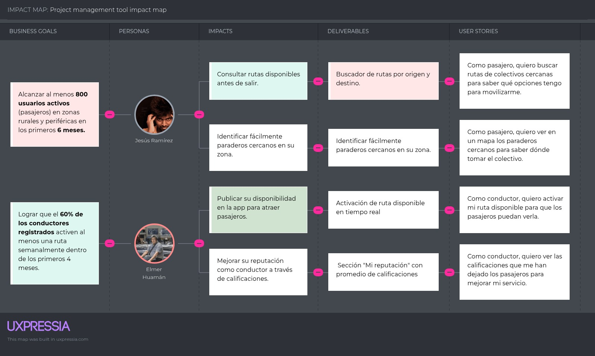

**Impact Mapping: Managers (Coordinadores de Ruta)**


## 3.4. Product Backlog

| Orden | ID | Título | Descripción | Story Points |
|---|---|---|---|---|
| 1 | TS01 | Seguridad en API Gateway | Configuración de Spring Cloud Gateway y validación de tokens JWT. | 5 |
| 2 | TS02 | Persistencia Relacional (PostgreSQL) | Modelado de base de datos e integridad de identidades, paraderos y rutas. | 5 |
| 3 | US01 | Explorar paraderos desde Landing | Visualización pública de mapas y paraderos sin autenticación. | 3 |
| 4 | US02 | Consultar funcionamiento y ventajas | Vistas informativas estáticas sobre el uso del servicio. | 2 |
| 5 | US03 | Acceder a FAQ | Sección de preguntas frecuentes para visitantes. | 2 |
| 6 | US04 | Registro de Pasajeros | Creación de cuentas con validación de correo único. | 3 |
| 7 | US05 | Registro de Conductores con RUC | Creación de cuentas asociadas a empresas validando el RUC. | 5 |
| 8 | US06 | Inicio de Sesión con JWT | Endpoint de autenticación y despacho de Access Tokens. | 3 |
| 9 | US07 | Cierre de Sesión | Inactivación de sesión desde el cliente y redirección. | 2 |
| 11 | US09 | Registro inicial de Empresa | Captura obligatoria de razón social en el primer acceso. | 3 |
| 13 | US11 | Panel de resumen de métricas | Renderizado de promedios (tarifas, intervalos, paraderos). | 5 |
| 14 | US12 | Crear y listar Paraderos | CRUD básico: alta y listado de puntos de embarque. | 5 |
| 15 | US13 | Editar y eliminar Paraderos | CRUD básico: modificación y baja lógica/física de paraderos. | 3 |
| 16 | US14 | Visualizar paraderos en el mapa | Renderizado geolocalizado con filtros de región/provincia/distrito. | 5 |
| 17 | US15 | Crear Ruta y Horarios | Asociación secuencial de paraderos, definición de precio y tiempo. | 8 |
| 19 | US17 | Búsqueda de Rutas y Transbordos | Algoritmo central para calcular rutas directas o con transbordos. | 8 |
| 20 | US18 | Detalle visual de la Ruta | Interfaz visual que incluye foto del bus, logo y distritos. | 5 |
| 21 | US19 | Indicar espera en Paradero | Acción del pasajero para registrar su origen y destino deseado. | 5 |
| 22 | TS03 | Caché de Coordenadas (Redis) | Setup de almacenamiento en memoria para rastreo veloz. | 5 |
| 23 | US28 | Transmitir ubicación GPS | Emisión continua de coordenadas vehiculares desde el móvil. | 5 |
| 24 | US29 | Check-in manual en Paraderos | Opción de actualización de posición por botón para zonas sin GPS. | 3 |
| 25 | US20 | Consultar Tiempo Estimado (ETA) | Cálculo matemático de llegada basado en la última coordenada. | 5 |
| 26 | TS04 | Bus de Eventos (RabbitMQ) | Orquestación de mensajería asíncrona para tracking y concurrencia. | 5 |
| 27 | US30 | Ver concurrencia en tiempo real | Consumo de datos de demanda para mostrar pasajeros al conductor. | 5 |
| 30 | US22 | Confirmación manual de abordaje | Botón del pasajero para salir voluntariamente de la espera. | 3 |
| 31 | US23 | Eliminación automática de espera | Job de limpieza automática de la cola a los 2 minutos de la llegada. | 5 |
| 37 | TS06 | Pruebas BDD y Unitarias | Implementación continua de test automatizados en capa de negocio. | 5 |
| 38 | TS07 | Dockerización e Infraestructura CI/CD | Configuración de empaquetado multi-contenedor e integración continua conducida por Git Git-driven en la plataforma cloud Render. | 5 |
| 39 | TS08 | Configuración Externalizada de Red | Aislamiento de variables de entorno y optimización estricta de conexiones simultáneas mediante HikariCP (max-pool-size=3). | 4 |
| 40 | TS09 | Resiliencia de Sentencias de BD | Desactivación del umbral de pre-compilación de sentencias en el driver JDBC para compatibilidad en la nube (prepareThreshold=0). | 3 |
| 41 | TS10 | Pruebas E2E (Cypress) | Implementación de flujos de prueba automatizados para interfaces web del frontend. | 5 |
| 42 | US32 | Dashboard Manager (Rutas) | Creación de interfaz React para mapear las rutas de una empresa. | 5 |
| 43 | US33 | Consola del Conductor y Rastreo Pasajeros | Integración Frontend de Mapbox y consumo de ubicación. | 8 |
| 44 | US34 | Autenticación Frontend (AuthContext) | Desarrollo de páginas Login/Register y gestión de token JWT en cliente. | 5 |
| 45 | US35 | Cancelación de Espera de Bus | Backend endpoint para retirar la concurrencia del pasajero. | 3 |
| 46 | TS11 | Documentación Arquitectónica | Formalización técnica de la arquitectura backend, CQRS, Serverless e IaC. | 3 |


# Capítulo IV: Product Architecture Design


### 4.1 Design Concepts, ViewPoints & ER Diagrams
#### 4.1.1 Principles Statements
De acuerdo con la visión de negocio de ChapaTuRuta, necesitamos proveer previsibilidad en el transporte interurbano bajo diferentes situaciones. Realizando una revisión de nuestros repositorios de backend y frontend, la arquitectura se rige bajo los siguientes principios generales:

#### Llamadas asincrónicas sobre las sincrónicas
- Debido a que los conductores operan en zonas con cobertura inestable, depender exclusivamente de llamadas sincrónicas bloquearía la interfaz. Se prioriza el asincronismo mediante el uso de promesas (async/await) en el frontend (React) y la publicación de eventos asíncronos en el backend.
- Cuando el conductor hace un "Check-in", el evento se encola y procesa de forma asíncrona mediante un Message Broker (RabbitMQ), desacoplando la escritura de la respuesta inmediata al cliente móvil.

#### Hacer programación funcional
- En el frontend, se prioriza estrictamente el uso de Componentes Funcionales (Functional Components) de React y Hooks (useState, useEffect), evitando los estados mutables complejos orientados a objetos.
- En el backend (Java Spring Boot), se fomenta el uso de la API Streams y constructos declarativos para procesar colecciones y flujos de datos de manera inmutable, limpia y segura.

#### Uso de bibliotecas con soporte comercial y ecosistemas robustos
- Se opta por librerías, frameworks e infraestructura madura con fuerte respaldo empresarial o de la comunidad (React, Spring Boot, Mapbox GL JS, PostgreSQL, Redis, RabbitMQ, Docker) para garantizar mantenibilidad, parches de seguridad continuos y escalabilidad a largo plazo.

#### Desacoplamiento por contextos de dominio (DDD)
- Las responsabilidades se separan en microservicios independientes alineados a las entidades del negocio (Identity Service, Routing Service, Tracking Service). Ningún microservicio comparte la misma base de datos con otro, evitando el acoplamiento a nivel de datos y comunicándose vía APIs.

#### Diseño para el fallo y recuperación
- En una arquitectura distribuida, los fallos de red son inevitables y la caída de un servicio no debe interrumpir toda la plataforma.
- Si el Tracking Service pierde conexión, la aplicación frontend del pasajero degradará su servicio de forma elegante, manteniendo disponible la visualización de rutas estáticas provistas por el Routing Service y mostrando la última ubicación conocida.

#### Arquitectura optimizada para la lectura
- Existe una asimetría en el uso: una cantidad masiva de pasajeros consultando constantemente el mapa versus una menor cantidad de conductores emitiendo señales.
- El diseño prioriza la velocidad de lectura, utilizando almacenamiento en caché en memoria (Redis) para garantizar que las consultas recurrentes de Tiempo Estimado (ETA) no generen latencia en las bases de datos transaccionales.


#### 4.1.2 Approaches Statements Architectural Styles & Patterns

#### Approaches Statements (Enfoques de Desarrollo)

- Se ha adoptado Domain-Driven Design (DDD) como el enfoque principal para abordar la complejidad del tema del negocio. Este enfoque nos permite alinear el desarrollo de software con las reglas de negocio de un ecosistema que carece de estandarización.

#### Architectural Styles (Estilos Arquitectónicos)

- **Arquitectura de Microservicios:** Para complir con los requerimientos del producto y escalabilidad se necesita de una arquitectura basada en microservicios. Esta decisión permite aislar el microservicio de Tracking del de Routing.

- **Arquitectura Hexagonal:** Para cada microservicio se usarán puertos y adaptadores. el core se mantendrá aislado pues toda comunicacion con las bases de datos serán atra vés de iknterfaces

#### Architectural Patterns

- **Patron CQRS:** el suo de este patrón ayudará a separar las consultas (miles de cosnultas del ETA) de la escritura la cual será menor (check-in)

- **API gateway:** Ayudaraá a la validación y comunicación con microservicios.


#### 4.1.3 Context Diagram

El diagrama de contexto muestra a **ChapaTuRuta** como el sistema central de transporte interurbano. Los actores principales son: **Pasajeros** (buscan rutas y ETAs), **Conductores** (envían telemetría y check-ins) y **Gestores de Empresas** (administran las flotas). A diferencia del diseño inicial, el sistema se integra con **Mapbox** (en lugar de Google Maps) para la cartografía base y se han omitido los sistemas externos fantasma (pasarela Niubiz y notificaciones Firebase) por no formar parte del alcance real del código.

<p align="center">
  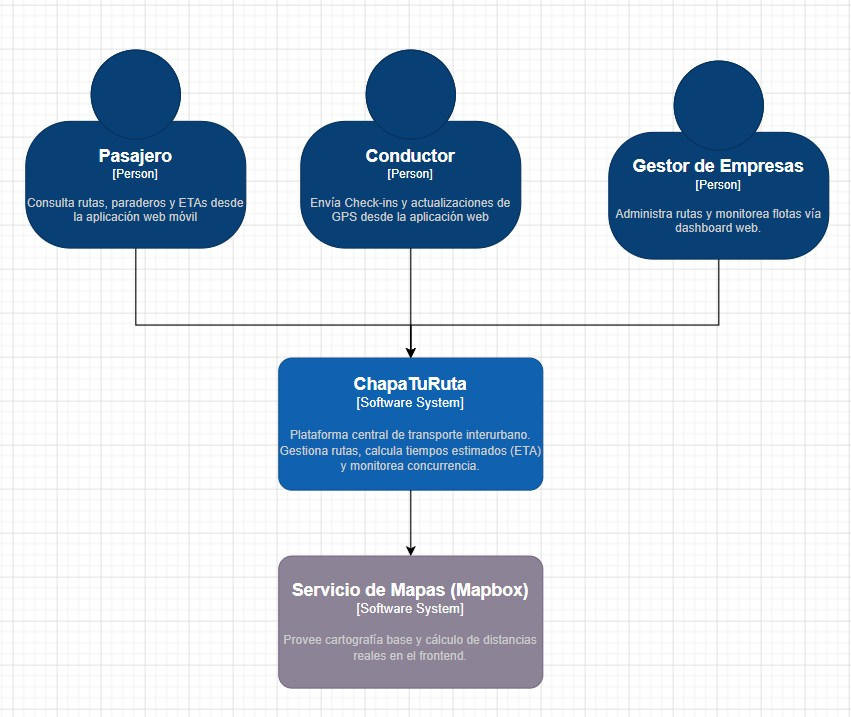
</p>

#### 4.1.4 Approach Driven ViewPoints Diagrams (C4 Containers)

Los esquemas de contenedores ilustran la separación de **ChapaTuRuta** en microservicios bajo el ecosistema de Spring Boot y una Single Page Application (SPA) en React. La arquitectura construida y corregida incluye el **API Gateway**, el **Identity Service** (PostgreSQL), el **Routing Service** (PostgreSQL), el **Tracking Service** (Redis) y un componente vital faltante en el diseño original: el **Message Broker (RabbitMQ)**, encargado de orquestar los eventos asíncronos y evitar cuellos de botella en telemetría.


<p align="center">
  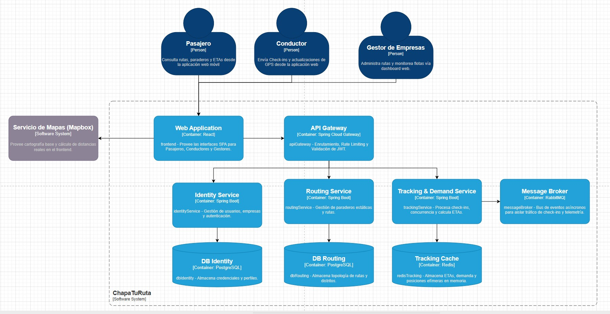
</p>

#### 4.1.5 Relational / Non-Relational Database Diagram

Esta sección evidencia las entidades que permiten la persistencia en cada Bounded Context. El diseño original en imagen planteaba más de 12 tablas complejas (itinerarios, localidades, turnos) que resultaban en sobreingeniería. La implementación real se ha optimizado y descentralizado en entidades clave separadas físicamente por microservicio:
- **Identity Service (PostgreSQL):** `UserEntity`, `CompanyEntity`.
- **Routing Service (PostgreSQL):** `RouteEntity`, `StopEntity`, `RouteStopEntity`, `DistrictEntity`.
- **Tracking Service:** Persistencia ligera en `TrackingHistoryEntity` y operaciones rápidas en Redis.

<p align="center">
  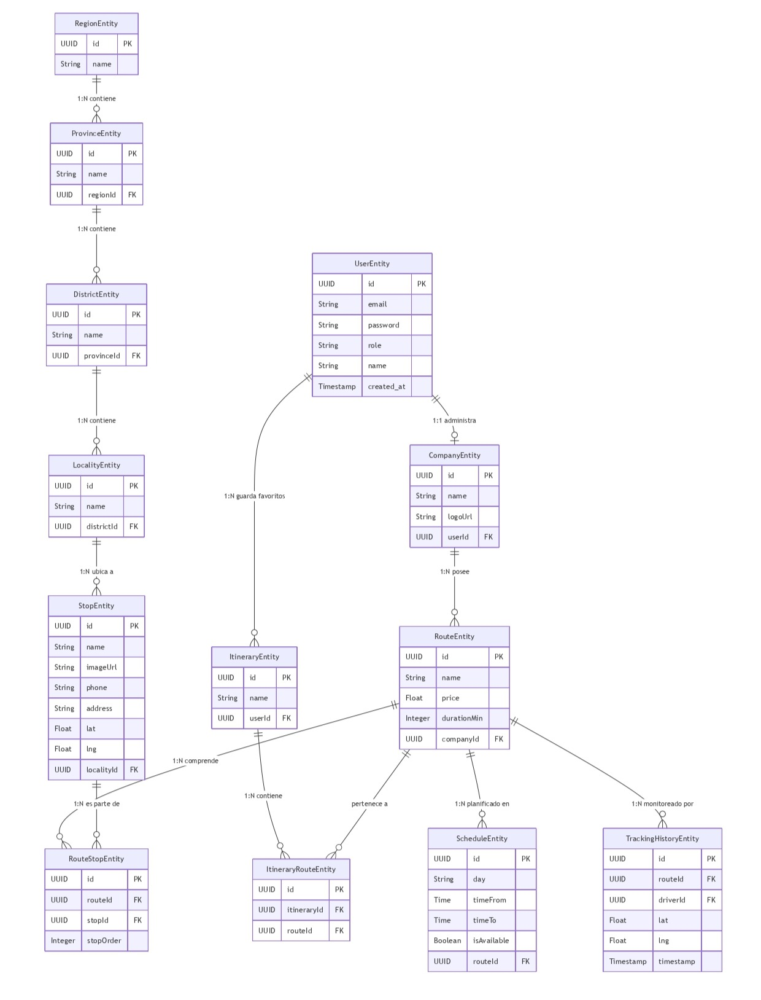
</p>

#### 4.1.6 Design Patterns

Para asegurar una arquitectura **mantenible**, **escalable** y alineada con los principios de diseño establecidos, ChapaTuRuta implementa los siguientes patrones tácticos y arquitectónicos:

---

## **Patrones Arquitectónicos**

- **API Gateway Pattern**
  - **Aplicación:** Se implementa a través de **Spring Cloud Gateway** sirviendo como fachada única (Single Point of Entry) para la SPA en React.
  - **Rol en el proyecto:**
    - Centraliza el **enrutamiento de peticiones** hacia los distintos Bounded Contexts (Identity, Routing, Tracking).
    - Maneja transversalmente la **validación de seguridad** descifrando tokens JWT antes de que las peticiones lleguen a los servicios internos.
    - Facilita políticas de **Rate Limiting** para evitar ataques de denegación de servicio o saturación en las consultas masivas.

- **CQRS (Command Query Responsibility Segregation)**
  - **Aplicación:** Crucial para el diseño del microservicio de Tracking & Demand.
  - **Rol en el proyecto:**
    - **Command (escritura):** Usado por los conductores para emitir sus *Check-ins* y posición (latitud/longitud). Estos comandos entran a una cola de RabbitMQ para su persistencia eventual.
    - **Query (lectura):** Consumido masivamente por los pasajeros para consultar Tiempos Estimados (ETAs). Al separar la lectura, estas consultas se sirven de la caché (Redis), sin impactar el rendimiento transaccional.

- **Publish-Subscribe (Orientado a Eventos)**
  - **Aplicación:** Implementado mediante el Message Broker **RabbitMQ**.
  - **Rol en el proyecto:**
    - Permite la **comunicación asíncrona** aislando procesos costosos de las interacciones en tiempo real.
    - **Flujo:** Cuando un conductor registra un Check-in en un paradero, se publica el evento en la cola. Los consumidores extraen este evento en segundo plano para actualizar el estado georreferenciado en caché, permitiendo que el cliente web reciba una respuesta HTTP 200 inmediata sin bloqueos.

---

## **Patrones Tácticos (Domain-Driven Design)**

- **Patrón Entidad (Entity)**
  - **Aplicación:** Modela los objetos de negocio que poseen una **identidad única y persistente** en la base de datos (PostgreSQL).
  - **Rol en el proyecto:**
    - `UserEntity`, `RouteEntity`, `CompanyEntity` mantienen un ciclo de vida propio mediante UUIDs. Permiten trazabilidad entre microservicios; Tracking, por ejemplo, guarda el `routeId` sin necesidad de duplicar todo el objeto ruta.

- **Patrón Objeto de Valor (Value Object)**
  - **Aplicación:** Modela atributos **inmutables** sin identidad propia, que se definen únicamente por sus propiedades.
  - **Rol en el proyecto:**
    - Las coordenadas geográficas (`lat`, `lng`). Si dos localizaciones tienen la misma latitud y longitud, representan exactamente el mismo punto y no requieren identificadores artificiales adicionales.

#### 4.1.7 Tactics

Las siguientes tácticas de arquitectura guían las decisiones de diseño en ChapaTuRuta para satisfacer sus atributos de calidad principales:

#### **1. Disponibilidad (Availability)**
- **Meta:** Resistir fallas y seguir funcionando (Resiliencia).
- **Tácticas Aplicadas:**
  - **Detección de fallos y Prevención:** El API Gateway actúa como intermediario. Si el Tracking Service falla, el gateway cancela la conexión rápidamente (Timeout / Circuit Breaker) evitando agotar recursos.
  - **Recuperación (Fallback Degradado):** Ante una caída de las emisiones en tiempo real, el frontend SPA oculta elegantemente los tiempos estimados dinámicos, pero permite al usuario seguir consumiendo los mapas, rutas vectoriales y paraderos estáticos extraídos de la base de datos del Routing Service.

#### **2. Interoperabilidad (Interoperability)**
- **Meta:** Que los distintos sistemas y frameworks colaboren sin fricciones.
- **Tácticas Aplicadas:**
  - **Estandarización de Interfaces:** Toda comunicación entre el frontend (React) y los microservicios (Spring Boot) se ciñe al formato estándar `application/json` bajo arquitectura REST.
  - **Manejo e Integración Externa:** La integración con el Servicio de Mapas Externo (Mapbox GL JS) está encapsulada estrictamente en componentes React específicos para evitar el acoplamiento directo entre las vistas de dominio y la librería de mapas.

#### **3. Modificabilidad (Modifiability)**
- **Meta:** Facilidad de cambiar o hacer crecer el sistema minimizando efectos colaterales.
- **Tácticas Aplicadas:**
  - **Reducir Acoplamiento:** Los servicios (Identity, Routing, Tracking) se despliegan aisladamente y mantienen bases de datos propias (Database per service).
  - **Aumentar Cohesión:** El uso estricto de Domain-Driven Design asegura que los dominios afines (ej. validación de credenciales vs geometría de rutas) residan en el contenedor apropiado.

#### **4. Rendimiento (Performance)**
- **Meta:** Optimizar el tiempo de respuesta frente a miles de consultas recurrentes.
- **Tácticas Aplicadas:**
  - **Optimizar tiempo de respuesta:** El uso de memorias clave-valor ultrarrápidas (**Redis**) permite que las peticiones de los pasajeros para consultar distancias y tiempos de llegada se respondan en submilisegundos.
  - **Procesamiento eficiente:** Externalizar el procesamiento intensivo del Check-in a los workers mediante RabbitMQ alivia la carga de la pasarela y del servidor HTTP principal.

#### **5. Seguridad (Security)**
- **Meta:** Proteger las operaciones y los datos frente a usuarios no verificados.
- **Tácticas Aplicadas:**
  - **Detectar y Resistir Ataques:** El filtro global del API Gateway valida criptográficamente cada token JWT enviado en las cabeceras (`Authorization: Bearer`), rechazando (HTTP 401) conexiones inseguras o adulteradas antes de llegar a la capa de negocios.

#### **6. Usabilidad (Usability)**
- **Meta:** Interacción intuitiva para usuarios en constante movimiento.
- **Tácticas Aplicadas:**
  - **Soporte a las acciones:** Diseño *Mobile-First* y botones de un solo toque (CTA) grandes en la consola de conductores para minimizar distracciones al volante.
  - **Feedback del sistema:** Los componentes interactivos (Spinners, Notificaciones Toast) brindan al usuario la certeza inmediata de que su acción (ej. "Ruta Creada" o "Check-in Exitoso") ha sido procesada por la red.

### **4.2 Architectural Drivers**

- **Descripción**
  - No todos los requerimientos tienen el mismo peso en el diseño.
  - Los **Drivers Arquitectónicos** son el subconjunto crítico que influye directamente en la arquitectura.
  - Incluyen:
    - Requerimientos funcionales clave
    - Atributos de calidad
    - Restricciones técnicas

---

#### **4.2.1 Design Purpose**

- **Descripción**
  - Establecer una base sólida para la plataforma **ChapaTuRuta** que garantice:
    - **Alta disponibilidad.**
    - **Baja latencia** en la entrega de información de rutas y tiempos estimados.
  - Mantener una **experiencia de usuario fluida e intuitiva**, especialmente para los conductores que interactúan mientras operan sus vehículos.

- **Objetivos del Diseño**
  - Diseñar y desplegar una arquitectura nativa en la nube basada en **Microservicios**.
  - Asegurar coherencia estructural y escalabilidad mediante la adopción de:
    - **Patrones tácticos (DDD - Domain-Driven Design).**
    - **Patrones arquitectónicos (CQRS, Arquitectura Hexagonal y Publish-Subscribe).**

---

#### **4.2.2 Primary Functionality (Primary User Stories)**

- **Descripción**
  - Son los **drivers funcionales** críticos que definen y justifican la arquitectura elegida (microservicios, segregación de bases de datos, buses de eventos).

- **Funcionalidades Clave**

  - **Consulta de Tiempos Estimados - ETA (US20)**
    - Miles de pasajeros consultando simultáneamente en horas punta.
    - Implica:
      - Separación arquitectónica vía **CQRS**.
      - Almacenamiento rápido en memoria (**Redis**).

  - **Transmisión de ubicación GPS y Check-in (US28, US29)**
    - Conductores enviando ráfagas de datos desde zonas con baja conectividad.
    - Implica:
      - Arquitectura **orientada a eventos**.
      - Message Broker para alta concurrencia (**RabbitMQ**).

  - **Búsqueda de Rutas y Transbordos (US15, US17)**
    - Consultas complejas de geometría de rutas.
    - Implica:
      - Modelo **relacional estructurado** (PostgreSQL).
      - Microservicio independiente y enfocado en GIS/Mapeo (**Routing Service**).

#### **4.2.3 Quality Attribute Scenarios — ChapaTuRuta**

Los siguientes escenarios permiten evaluar los atributos de calidad clave: **escalabilidad**, **confiabilidad**, **rendimiento** y **usabilidad**, los cuales sustentan nuestras decisiones arquitectónicas.

---

#### **Escenario 1: Escalabilidad (Scalability)**

| **Componente**            | **Descripción** |
|--------------------------|----------------|
| **Fuente de Estímulo**   | Múltiples pasajeros usando la aplicación web SPA concurrentemente |
| **Estímulo**             | Consultas masivas y simultáneas de ETA en hora pico (7:00–8:00 a.m.) |
| **Medioambiente**        | Sistema bajo carga máxima en hora de tránsito alto |
| **Artefacto Estimulado** | API Gateway + Tracking Service + Redis |
| **Respuesta**            | El sistema atiende la lectura desde caché sin impactar ni bloquear la base de datos relacional (PostgreSQL) |
| **Medida de Respuesta**  | 95% de peticiones < 200 ms, CPU de DB < 40% |

---

#### **Escenario 2: Confiabilidad (Reliability)**

| **Componente**            | **Descripción** |
|--------------------------|----------------|
| **Fuente de Estímulo**   | Entorno de red móvil del conductor |
| **Estímulo**             | Intermitencia o pérdida total de conexión al enviar Check-in de paradero |
| **Medioambiente**        | Zona periférica con baja cobertura 3G/4G |
| **Artefacto Estimulado** | Web App (React) + RabbitMQ (Backend) |
| **Respuesta**            | La SPA almacena temporalmente la acción (Promesa) y la despacha cuando vuelve la red. En el backend, RabbitMQ encola el evento previniendo pérdida por timeout HTTP |
| **Medida de Respuesta**  | 0% pérdida de check-ins efectivos, sistema degrada elegantemente ocultando el mapa dinámico |

---

#### **Escenario 3: Rendimiento (Performance)**

| **Componente**            | **Descripción** |
|--------------------------|----------------|
| **Fuente de Estímulo**   | Servicio interno (Worker de procesamiento) |
| **Estímulo**             | Ingreso de nueva ubicación GPS de un conductor → requiere recalcular ETA |
| **Medioambiente**        | Operación transaccional continua |
| **Artefacto Estimulado** | Tracking Service + RabbitMQ Consumer |
| **Respuesta**            | Procesamiento asíncrono, cálculo matemático de distancias y actualización inmediata en la caché (Redis) sin bloquear el API HTTP principal |
| **Medida de Respuesta**  | Latencia de cálculo de ETA < 50 ms |

---

#### **Escenario 4: Usabilidad (Usability)**

| **Componente**            | **Descripción** |
|--------------------------|----------------|
| **Fuente de Estímulo**   | Conductor de la ruta |
| **Estímulo**             | Necesidad de registrar llegada a un paradero específico |
| **Medioambiente**        | Conducción, atención muy limitada a la pantalla táctil |
| **Artefacto Estimulado** | Interfaz de Usuario (React SPA) |
| **Respuesta**            | Diseño visual con botones gigantes "One-Tap" (Check-in) y feedback inmediato visual/sonoro sin necesidad de confirmaciones intrusivas |
| **Medida de Respuesta**  | Tiempo de interacción visual con la pantalla < 1.5 s |

#### **4.2.4 Constraints**

- **Descripción**
  - Son restricciones **no negociables** que guían y limitan el diseño del sistema, dictadas por presupuesto o tecnología.

- **Restricciones**

  - **CON-01 (Económica / Infraestructura)**
    - Uso exclusivo de servicios con planes **Free Tier** en la nube (PaaS/SaaS).
    - Ejemplos:
      - Render (despliegue de Spring Boot / React)
      - Neon / Supabase (PostgreSQL gratuito)
      - Redis Labs (caché gratuita)
    - Objetivo: Mantener **costo cero** (0$) operativos durante la fase académica.

  - **CON-02 (Tecnológica)**
    - **Backend:** Ecosistema **Java + Spring Boot** y microservicios independientes.
    - **Base de datos:** Motor **PostgreSQL** como estándar relacional seguro.
    - **Frontend:** Single Page Application construida en **React**.
    - **Justificación:** Alineamiento con los lineamientos del curso y el dominio técnico del equipo.

  - **CON-03 (Entorno / Cliente)**
    - **Compatibilidad Extrema:**
      - Ejecución en **navegadores móviles** (Chrome/Safari) instalados en dispositivos de gama media-baja (Android/iOS).
    - **Justificación:** Los conductores y pasajeros de rutas interurbanas no siempre cuentan con hardware potente ni espacio de almacenamiento para descargar apps pesadas.

---

#### **4.2.5 Architectural Concerns**

- **Descripción**
  - Son riesgos o aspectos críticos, propios de una arquitectura distribuida, que pueden impactar negativamente al sistema si no se abordan en el diseño temprano.

- **Preocupaciones**

  - **Consistencia de Datos Distribuida**
    - **Problema:** Al tener bases separadas (Identity, Routing, Tracking), la actualización de una ruta podría no reflejarse en tiempo real en los tracking logs.
    - **Solución:** Uso intensivo de **eventos con RabbitMQ** aplicando el patrón de **consistencia eventual** (Eventual Consistency).

  - **Complejidad Operativa (DevOps)**
    - **Problema:** Administrar, desplegar y monitorear múltiples microservicios es mucho más complejo que un monolito único.
    - **Solución:** Abstracción mediante un **API Gateway** central, y contenerización estricta con **Docker** en los pipelines CI/CD.

  - **Seguridad en Endpoints Públicos Abiertos**
    - **Problema:** Exposición de endpoints REST al internet, riesgo de envío de Check-ins o posiciones GPS falsificadas por actores maliciosos.
    - **Solución:** Validación criptográfica obligatoria con **JWT** (JSON Web Tokens) interpuesta en el API Gateway, impidiendo el acceso anónimo no autorizado.

### **4.3 ADD Iterations — ChapaTuRuta**

En esta sección se aplica el método **Attribute-Driven Design (ADD)** de manera estructurada e iterativa. Para cada iteración, se definen los drivers más críticos (QAWs), se proponen y descartan múltiples alternativas arquitectónicas, tecnológicas y de patrones, y finalmente se seleccionan y justifican las que moldearán el sistema.

---

#### **4.3.0 Iteration 0: Estructura Global y Estilo Arquitectónico Base**

Esta iteración inicial define el estilo arquitectónico primario de todo el sistema y el stack tecnológico principal que dará soporte a los dominios del *core*.

##### **4.3.0.1 Architectural Design Backlog 0**
- **QA-01 (Escalabilidad):** Soportar miles de peticiones asimétricas (mucha lectura, poca escritura).
- **QA-02 (Confiabilidad):** El sistema no debe colapsar por completo si una parte falla.
- **CON-01 (Económica):** Tecnologías de bajo costo operativo o con Free Tier.
- **CON-02 (Tecnológica):** Uso de ecosistema Java + Spring Boot por conocimiento del equipo.

##### **4.3.0.2 Establish Iteration Goal by Selecting Drivers**
- **Objetivo:** Definir el modelo de despliegue general de la plataforma de manera que si el módulo de seguimiento en tiempo real (alta carga) sufre un pico, el módulo de inicio de sesión o consulta estática de mapas siga operando (QA-01, QA-02).

##### **4.3.0.3 Choose One or More Elements of the System to Refine**
- **Elemento seleccionado:** El sistema backend completo (Greenfield project).

##### **4.3.0.4 Choose One or More Design Concepts That Satisfy the Selected Drivers**

**A. Estilo Arquitectónico Global**
- **Alternativa 1: Monolito Modular.** (Descartado). Aunque es más fácil de desarrollar al inicio, si la consulta masiva de ETA satura el CPU, tirará abajo todo el monolito (incumple QA-01 y QA-02).
- **Alternativa 2: Arquitectura Serverless (Functions).** (Descartado). Puede ser costosa a largo plazo (vendor lock-in) y difícil de orquestar transacciones complejas.
- **Alternativa 3: Microservicios Independientes.** (**Seleccionado**). Permite escalar solo el servicio de Tracking, manteniendo Identity y Routing operando normalmente bajo fallos.

**B. Punto de Entrada (Gateway)**
- **Alternativa 1: Llamadas directas desde el cliente a cada microservicio.** (Descartado). Obligaría al frontend a conocer IPs internas y manejar autenticación repetida.
- **Alternativa 2: NGINX Reverse Proxy.** (Descartado). Requiere configuraciones complejas en C para aplicar filtros de seguridad robustos.
- **Alternativa 3: API Gateway Pattern (Spring Cloud Gateway).** (**Seleccionado**). Integración nativa con el stack Java (CON-02) que permite aplicar rate limiting y validación JWT centralizada de manera sencilla.

##### **4.3.0.5 Instantiate Architectural Elements, Allocate Responsibilities, and Define Interfaces**
- **API Gateway:** Único punto de entrada público, enruta tráfico y rechaza peticiones sin token.
- **Identity Service:** Gestión de usuarios y auth.
- **Routing Service:** Rutas, paraderos y empresas.
- **Tracking Service:** Latitud, Longitud, ETAs.

##### **4.3.0.6 Sketch Views (C4 & UML) and Record Design Decisions**
- *Decisión registrada:* Se divide el backend en 3 microservicios desplegados como contenedores separados detrás de un API Gateway. 

##### **4.3.0.7 Analysis of Current Design and Review Iteration Goal (Kanban Board)**
- El estilo de microservicios cubre QA-01 y QA-02. Queda pendiente definir cómo estos servicios manejarán su propia persistencia de datos (Iteración 1).

---

#### **4.3.1 Iteration 1: Segregación de Datos y Estructuración Relacional**

Una vez definidos los microservicios, se deben establecer los patrones de persistencia para los datos persistentes (Usuarios, Rutas, Paraderos).

##### **4.3.1.1 Architectural Design Backlog 1**
- **QA-03 (Modificabilidad):** Poder cambiar esquemas de rutas sin afectar la validación de usuarios.
- **QA-04 (Interoperabilidad):** Las bases de datos deben hablar un estándar que permita analítica futura (SQL).
- **US15, US17:** Creación de rutas, paraderos e itinerarios (requiere relaciones fuertes).

##### **4.3.1.2 Establish Iteration Goal by Selecting Drivers**
- **Objetivo:** Definir el patrón de base de datos para `Identity` y `Routing`, asegurando que no exista acoplamiento a nivel de datos (QA-03) y soportando relaciones complejas (US15).

##### **4.3.1.3 Choose One or More Elements of the System to Refine**
- **Elemento seleccionado:** Capa de acceso a datos de los microservicios Identity y Routing.

##### **4.3.1.4 Choose One or More Design Concepts That Satisfy the Selected Drivers**

**A. Patrón de Gestión de Base de Datos**
- **Alternativa 1: Shared Database (Base de datos compartida).** (Descartado). Crea un único punto de fallo y rompe el encapsulamiento de los microservicios (anti-patrón de microservicios, viola QA-03).
- **Alternativa 2: Database-per-service.** (**Seleccionado**). Cada servicio es dueño de su esquema, garantizando aislamiento total.

**B. Tecnología de Base de Datos Base**
- **Alternativa 1: MongoDB (NoSQL).** (Descartado). El módulo de Routing (Rutas -> Paraderos -> Distritos -> Itinerarios) tiene una estructura altamente relacional y tabular. Usar NoSQL complicaría las validaciones de llaves foráneas.
- **Alternativa 2: MySQL.** (Descartado). Buen soporte, pero menos funciones geográficas avanzadas nativas.
- **Alternativa 3: PostgreSQL.** (**Seleccionado**). Robusto, soporta integridad relacional compleja (US15) y en un futuro permite migrar fácilmente a PostGIS si la app requiere cálculos espaciales en BD (QA-04).

##### **4.3.1.5 Instantiate Architectural Elements, Allocate Responsibilities, and Define Interfaces**
- **Identity DB (PostgreSQL):** Almacena tabla de Usuarios, Tokens, Roles.
- **Routing DB (PostgreSQL):** Almacena Rutas, Paraderos, Schedules, Itinerarios. 
- *Interfaces:* La comunicación entre Routing e Identity (ej. validar si un usuario existe) se hará por UUID, sin hacer JOINs directos en base de datos.

##### **4.3.1.6 Sketch Views (C4 & UML) and Record Design Decisions**
*(Ver diagrama de contenedores I1)*
<p align="center">
  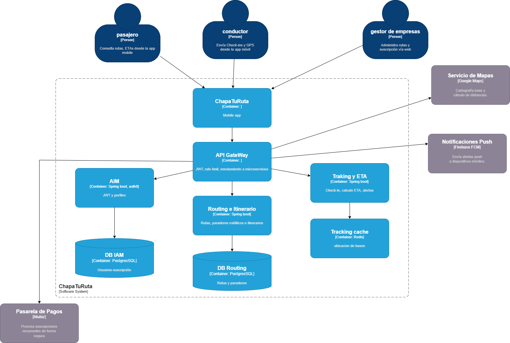
</p>

##### **4.3.1.7 Analysis of Current Design and Review Iteration Goal (Kanban Board)**
*(Ver tablero Kanban I1)*
<p align="center">
  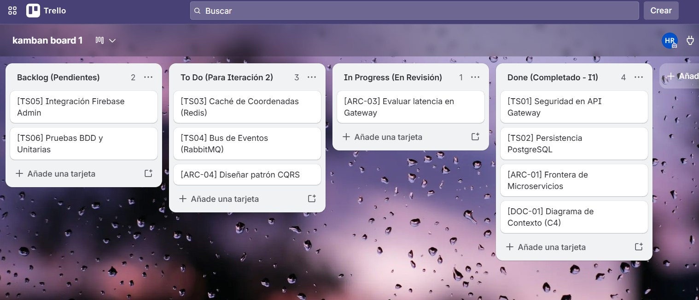
</p>
- Se logró aislar los datos. Resta definir cómo se procesarán los check-ins de altísima frecuencia (Iteración 2).

---

#### **4.3.2 Iteration 2: Tracking & ETA (CQRS y Comunicación Asíncrona)**

Esta iteración aborda el cuello de botella más grande: los conductores reportando Check-ins en zonas sin señal, mientras los pasajeros consultan su ETA continuamente.

##### **4.3.2.1 Architectural Design Backlog 2**
- **US28, US29:** Check-in del conductor (Escritura).
- **US20:** Consulta masiva de ETA por pasajeros (Lectura).
- **QA-05 (Rendimiento):** ETA servido en menos de 200ms.
- **QA-02 (Confiabilidad):** No perder Check-ins por timeouts de red.

##### **4.3.2.2 Establish Iteration Goal by Selecting Drivers**
- **Objetivo:** Refinar el `Tracking Service` aplicando tácticas de rendimiento masivo y tolerancia a fallos en comunicaciones para separar los flujos de lectura y escritura.

##### **4.3.2.3 Choose One or More Elements of the System to Refine**
- **Elemento seleccionado:** Tracking Service y sus patrones de comunicación inter-procesos.

##### **4.3.2.4 Choose One or More Design Concepts That Satisfy the Selected Drivers**

**A. Estrategia de Acceso a Datos (Tracking)**
- **Alternativa 1: CRUD tradicional en PostgreSQL.** (Descartado). Actualizar filas y calcular ETAs al vuelo por cada pasajero que recargue la página bloquearía la base de datos (viola QA-05).
- **Alternativa 2: CQRS (Command Query Responsibility Segregation).** (**Seleccionado**). Separa físicamente y lógicamente la escritura (Command) de la consulta (Query), optimizando cada una independientemente.

**B. Almacén de Lectura (Query - Caché)**
- **Alternativa 1: Memcached.** (Descartado). Solo almacena strings planos.
- **Alternativa 2: Redis In-Memory Cache.** (**Seleccionado**). Ultrarrápido, estructuras de datos avanzadas (Hashes, Sorted Sets) que encajan perfecto con el almacenamiento de coordenadas temporales.

**C. Comunicación para Escrituras (Command - Check-ins)**
- **Alternativa 1: API REST Síncrona.** (Descartado). Si el cálculo del ETA tarda, la conexión HTTP del conductor en 3G se cortará (Timeout), perdiendo el Check-in (viola QA-02).
- **Alternativa 2: Patrón Publish-Subscribe (Message Broker).** (**Seleccionado**). El Check-in se encola instantáneamente. El backend responde un HTTP 200 rápido y procesa el cálculo en segundo plano.

**D. Tecnología de Message Broker**
- **Alternativa 1: Apache Kafka.** (Descartado). Demasiado complejo y costoso (no hay tier gratuito simple) para el volumen inicial académico.
- **Alternativa 2: RabbitMQ.** (**Seleccionado**). Ligero, fácil de integrar con Spring Boot AMQP y suficiente para manejar la asincronía de la aplicación.

##### **4.3.2.5 Instantiate Architectural Elements, Allocate Responsibilities, and Define Interfaces**
- **Check-in API:** Recibe petición, valida JWT y encola el mensaje en RabbitMQ (`tracking.queue`).
- **Worker (Consumer):** Escucha la cola, calcula los nuevos ETAs matemáticamente y los guarda en Redis.
- **Query API:** Lee de Redis en milisegundos y retorna la respuesta al pasajero.

##### **4.3.2.6 Sketch Views (C4 & UML) and Record Design Decisions**
*(Ver diagrama de contenedores I2)*
<p align="center">
  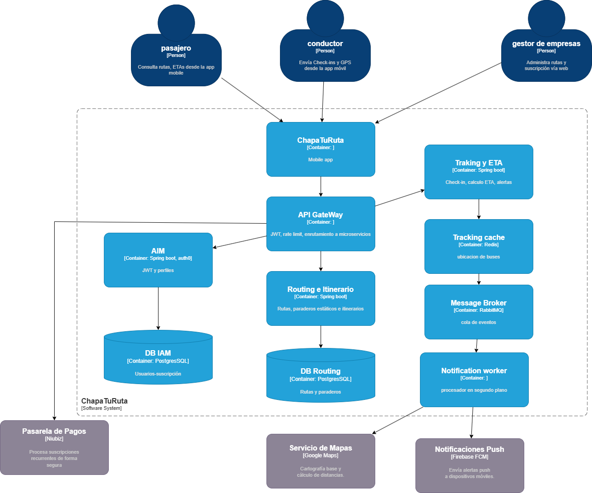
</p>

##### **4.3.2.7 Analysis of Current Design and Review Iteration Goal (Kanban Board)**
*(Ver tablero Kanban I2)*
<p align="center">
  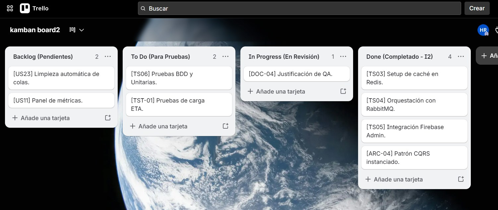
</p>
- Con esta iteración, el diseño satisface todos los Drivers funcionales y de calidad críticos. Se da por concluida la fase de diseño ADD y se procede a la implementación (Capítulo V).


# Capítulo V: Product Implementation, Validation & Deployment

### **5.1 Testing Suites & General Patterns**

#### **5.1.1 Backend Application Core Testing Suite**

Para garantizar la calidad de los Web Services, se implementará una suite de pruebas automatizadas:

- Unit Testing: Uso de JUnit 5 y Mockito para validar la lógica de dominio en aislamiento.

- Integration Testing: Validación de la persistencia y comunicación entre servicios usando 

-  Acceptance Testing (BDD): Implementación de pruebas de aceptación utilizando el lenguaje Gherkin y la herramienta Cucumber, asegurando que cada funcionalidad cumpla con los criterios de aceptación de las User Stories.

#### **5.1.2 Pattern Based Backend Application(s)**

#### 1. Puertos de Entrada (Inbound Ports)

- `RegisterUserUseCase.java`
  - Interfaz que define el contrato de operaciones.

#### 2. Adaptadores Primarios (Driving Adapters)
- `UserController.java`
  - Controlador REST que recibe peticiones HTTP y activa el caso de uso.

#### 3. Puertos de Salida (Outbound Ports)
- `UserRepository.java`
  - Contrato de persistencia en la capa de dominio.

#### 4. Adaptadores Secundarios (Driven Adapters)
- `UserRepositoryAdapter.java`
- `SpringDataUserRepository.java`


#### **5.1.3 Pattern Based Custom Software Library**

Se ha diseñado la librería ChapaTuRuta-Shared-Lib para estandarizar:
- El manejo de excepciones globales y respuestas HTTP uniformes.
- Contratos de eventos comunes para la comunicación asíncrona vía RabbitMQ. 
- Configuraciones base para la validación de tokens JWT en el API Gateway.

#### **5.1.4 Framework Pattern Driven Refactoring Report**

#### 1. Implementación de Arquitectura Hexagonal
- Se refactorizó el sistema para separar la lógica de negocio de las dependencias externas utilizando el patrón de **Puertos y Adaptadores**.
- Mediante la definición de interfaces de dominio (**Puertos**), se asgura que el núcelo se encuentre independiente de la infrastructura.
- La infraestructura externa, como PostgreSQL y Redis, es gestionada por **Adaptadores** específicos.

---

#### 2. Adopción de CQRS (Command Query Responsibility Segregation)
- Para resolver cuellos de botella en el módulo de Tracking, se refactorizó la estrategia de acceso a datos.
- Se separaron las operaciones de escritura (**Command**), encargadas de actualizar el estado de los buses.
- Las operaciones de lectura (**Query**) se optimizaron para recuperar los ETAs directamente desde la memoria caché de Redis.

---

#### 3. Refactorización hacia Comunicación Orientada a Eventos
- La comunicación síncrona entre el servicio de rastreo y el sistema de avisos se refactorizó hacia un modelo asíncrono basado en el patrón **Publish-Subscribe**.
- Se integró RabbitMQ como **Message Broker** para desacoplar estos procesos.
- Esto permitió que el conductor reciba confirmación inmediata mientras las notificaciones se procesan en segundo plano.

---

#### 4. Implementación de los Patrones Strategy y Repository

#### Patrón Strategy
- Se aplicó el patrón **Strategy** para permitir que los algoritmos de cálculo de ETA sean intercambiables.
- Dependiendo de la disponibilidad de datos del conductor, el sistema puede utilizar:
  - Algoritmos basados en historial.
  - Algoritmos basados en GPS en vivo.

#### Patrón Repository
- El patrón **Repository** se estandarizó en todos los servicios.
- Esto permitió:
  - Centralizar la lógica de persistencia.
  - Facilitar la ejecución de pruebas unitarias.


### **5.2 Software Configuration Management**

#### **5.2.1 Software Development Environment Configuration**

#### 1. Project Management
- Jira (Tablero Kanban).

#### 2. Software Development
- IntelliJ IDEA.
- Docker Desktop (Contenerización).

#### 3. Testing
- Postman para Web Services.
- Cucumber para BDD.
- Unit Test

##### 1. Identity Service

- **Pruebas Unitarias (JUnit 5 & Mockito):**
  - `RegisterUserUseCaseImplTest.java`: Valida la lógica de registro de usuarios, asegurando la creación exitosa de cuentas y el rechazo por correos duplicados.
  - `IdentityServiceApplicationTests.java`: Verifica que el contexto de la aplicación cargue correctamente.

- **Pruebas BDD (Cucumber):**
  - `register_user.feature` y `RegisterUserSteps.java`: Validan el flujo de negocio para el registro de pasajeros y conductores.
  - `CucumberTestRunner.java`: Orquestador de la ejecución de pruebas BDD.

##### 2. Routing Service

- **Pruebas Unitarias (JUnit 5 & Mockito):**
  - `SearchRoutesUseCaseImplTest.java`: Comprueba la búsqueda de rutas por distritos de origen y destino, validando tanto la obtención de datos como el manejo de búsquedas sin resultados.
  - `RoutingServiceApplicationTests.java`: Confirma la inicialización íntegra del microservicio.

- **Pruebas BDD (Cucumber):**
  - `search_routes.feature` y `SearchRoutesSteps.java`: Evalúan el flujo de consulta de rutas disponibles para el usuario.
  - `CucumberTestRunner.java`: Ejecutor de las características de búsqueda.

##### 3. Tracking Service

- **Pruebas Unitarias (JUnit 5 & Mockito):**
  - `TrackingCommandServiceTest.java`: Testea el procesamiento de Check-In de vehículos, verificando el almacenamiento de coordenadas en caché (Redis) y la emisión de eventos asíncronos (RabbitMQ).
  - `TrackingServiceApplicationTests.java`: Asegura que el servicio arranque sin errores.

- **Pruebas BDD (Cucumber):**
  - `vehicle_checkin.feature` y `VehicleCheckInSteps.java`: Validan el rastreo en tiempo real y la notificación de ubicación del vehículo.
  - `CucumberTestRunner.java`: Gestiona la ejecución de los escenarios de rastreo.


#### 4. Software Deployment
- 4.1. Plataforma de Despliegue (PaaS): Render Cloud.
- 4.2. Estrategia de Empaquetado: Docker y CaaS (Container as a Service).
- 4.3. Integración y Despliegue Continuo (CI/CD): Despliegue automatizado guiado por Git (Git-driven deployment).

#### 5. Chat y Comunicación
- 5.1. Comunicación del Equipo: Uso de Microsoft Teams como medio de comunicación masiva, coordinación de entregables y resolución de bloqueos técnicos en el desarrollo.

#### 6. Videoconferencia
- 6.1. Sincronización y Ceremonias: Se utiliza Zoom como plataforma de videoconferencia para la coordinación de avances, revisiones de modificaciones arquitectónicas y reuniones periódicas de asignación de responsabilidades.

#### 7. Prácticas DevOps y Calidad de Software (CI/CD)
- 7.1. Orquestación de Integración Continua: Jenkins (Automatización del pipeline de construcción, compilación y ejecución de suites de pruebas).
- 7.2. Inspección Continua y Análisis Estático: SonarQube (Evaluación exhaustiva de la salud del código, detección de deuda técnica, vulnerabilidades de seguridad y control de métricas de cobertura).
- 7.3. Calidad de Integración (Quality Gates): Configuración automatizada de barreras de calidad (Quality Gates) con una exigencia mínima del 80% de cobertura en pruebas de código para autorizar el paso a entornos productivos.

#### **5.2.2 Source Code Management**

### 1. Plataforma de Control de Versiones
- Se utiliza GitHub como plataforma de control de versiones.
- Organización: https://github.com/1ASI0657-2610-7940-G10

### 2. Implementación de GitFlow

### Ramas Principales
- `main` (producción).
- `develop` (desarrollo).

### Feature Branches
- `feature/identity-service`
- `feature/routing-service`
- `feature/tracking-service`
- `feature/api-gateway`

### 3. Convención de Commits

- Se aplica el estándar Conventional Commits para estructurar los mensajes de confirmación de cambios.
- Esto facilita la legibilidad del historial.

#### feat
- Implementación de una nueva característica.

#### fix
- Solución de un error o bug.

#### test
- Adición o modificación de pruebas automatizadas.

#### docs
- Actualización en la documentación.

#### **5.2.3 Source Code Style Guide & Conventions**

#### Guía de Estilo Java
- Se adopta de forma estricta la Google Java Style Guide.

#### Idioma
- Toda la nomenclatura de paquetes, clases, interfaces, variables y métodos se realiza estrictamente en inglés para mantener un estándar profesional internacional.

#### Especificaciones BDD
- Para la redacción de los archivos de pruebas, se siguen las Gherkin Conventions for Readable Specifications.
- Uso correcto de `Given`, `When`, `Then` y `And` en inglés.
- Esto asegura que los escenarios sean perfectamente legibles por los stakeholders y dueños de producto.

#### **5.2.4 Software Deployment Configuration & Architectural Patterns**

Para la gestión de configuración y el despliegue de software, la solución *ChapaTuRuta* adopta un enfoque **Cloud-Native y Serverless**, delegando el mantenimiento de la infraestructura subyacente a proveedores especializados. La arquitectura se basa estrictamente en **Microservicios (Microservices Pattern)** y un ecosistema dirigido por eventos (**Event-Driven Architecture**). 

Se descartó la **Arquitectura Monolítica** debido a que los requerimientos de escalabilidad del *Tracking Service* (alta concurrencia GPS) hubieran requerido escalar todo el sistema innecesariamente. Al no tener un software legacy, no fue necesario aplicar **Monolithic decomposition** ni **Refactoring**, adoptando un enfoque *Cloud-Native* desde el primer día para maximizar sus **Benefits** (como el despliegue independiente) asumiendo sus **drawbacks** (como la complejidad operativa). 

Además, cada microservicio implementa internamente una **Arquitectura Hexagonal (Clean Architecture)**. Esto aísla el núcleo de dominio (Domain) de las dependencias tecnológicas externas (Bases de datos, Frameworks REST), garantizando que las reglas de negocio sean independientes y altamente testeables. 

El stack de despliegue se divide en las siguientes categorías:

**1. Platform as a Service (PaaS) - Cómputo para Microservicios**
En lugar de aprovisionar servidores o Máquinas Virtuales (ej. EC2) gestionados manualmente, usamos **Render.com (PaaS)**. 
- **Despliegue Contenerizado:** Los microservicios desarrollados en Spring Boot (API Gateway, Identity, Routing y Tracking) se empaquetan en contenedores Docker y se despliegan de forma automática a través de CI/CD. Render se encarga de la orquestación, balanceo de carga interno y la asignación dinámica de puertos sin gestionar el sistema operativo subyacente.
- **API Gateway Pattern:** Un componente central actúa como fachada única para el frontend de la SPA, encargándose de enrutar el tráfico y validar la seguridad (JWT) antes de llegar a los microservicios de dominio.

**2. Backend as a Service (BaaS) / Serverless Data Storage**
Para la persistencia de datos, utilizamos proveedores BaaS que exponen bases de datos gestionadas y sin servidor (Serverless Database):
- **Supabase (Serverless PostgreSQL):** Proveedor BaaS de base de datos relacional. Aquí aplicamos el patrón **Database-per-Service**, creando esquemas aislados lógicamente (ej. `identity_schema`, `routing_schema`) para que cada microservicio sea dueño exclusivo de su modelo de datos, garantizando la independencia y resiliencia.
- **Upstash (Serverless Redis):** Utilizamos Redis como servicio gestionado (BaaS) para soportar el **CQRS Pattern (Command Query Responsibility Segregation)** en el microservicio de Tracking. Las coordenadas (Command) se guardan en el almacenamiento en memoria, lo que permite consultas (Query) masivas para el cálculo del ETA sin saturar la base de datos relacional principal.

**3. Message Broker (Arquitectura Orientada a Mensajes)**
Para evitar el acoplamiento temporal y procesos bloqueantes, implementamos comunicación asíncrona:
- **CloudAMQP (RabbitMQ Serverless):** Actúa como el **Message Broker** del ecosistema. Cuando hay picos de concurrencia en la telemetría GPS o check-ins, los eventos se publican en colas (Patrón **Publish-Subscribe** y **Asynchronous Messaging**). Los servicios consumidores procesan estos mensajes en segundo plano (Workers) asegurando el principio de *Eventual Consistency* y permitiendo que la API siempre responda con alta disponibilidad al frontend sin cuellos de botella. Adicionalmente, la lógica de negocio del rastreo adopta principios de **Event Sourcing**, donde cada pulsación GPS o check-in es tratado como un evento inmutable en el tiempo, permitiendo reconstruir el estado histórico de la flota y responder eficientemente a las consultas de demanda.

La topología de red y la distribución de los servicios Serverless (PaaS y BaaS) se documentan visualmente en el Diagrama de Despliegue del Modelo C4.

### 5.3 Microservices Implementation

#### 5.3.1 Sprint 1
#### 5.3.1.1 Sprint Backlog 1

| Orden | ID   | Título                   | Descripción                                                                    | Story Points | Estado | Asignado a   |
| ----: | ---- | ------------------------ | ------------------------------------------------------------------------------ | -----------: | ------ | ------------ |
|     1 | TS01 | Seguridad en API Gateway | Configuración de Spring Cloud Gateway y validación centralizada de tokens JWT. |            5 | Done   | Hector Rios |
|     2 | TS02 | Persistencia Relacional  | Modelado de base de datos e integridad relacional en PostgreSQL (Supabase).    |            5 | Done   | Andy Nuñez |
|     3 | US04 | Registro de Pasajeros    | Creación de cuentas de usuario final con validación de correo único.           |            3 | Done   | Hector Rios |
|     4 | US05 | Registro de Conductores  | Creación de cuentas operativas asociadas a empresas validadas por RUC.         |            5 | Done   | Hector Rios |
|     5 | US06 | Inicio de Sesión con JWT | Endpoint de autenticación segura y despacho de Access Tokens firmados.         |            3 | Done   | Adrian Valerio |
|     6 | US12 | Crear y listar Paraderos | CRUD básico: alta y listado geolocalizado de puntos de embarque.               |            5 | Done   | Andy Nuñez|
|     7 | US15 | Crear Ruta y Horarios    | Asociación secuencial de paraderos, definición de tarifas y tiempos estimados. |            8 | Done   | Hector Rios |
|     8 | US17 | Búsqueda de Rutas        | Algoritmo central para calcular rutas directas entre orígenes y destinos.      |            8 | Done   | Adrian Valerio|

#### 5.3.1.2 Development Evidence for Sprint Review

- La implementación del código se organizó estrictamente bajo los patrones de Arquitectura Hexagonal (Ports and Adapters) y Domain-Driven Design (DDD) dentro de un monorepositorio en Java 21 con Spring Boot 3.4.5.

### A. API Gateway & Seguridad Centralizada (TS01)

Se implementó un filtro global (`JwtAuthenticationFilter`) en el API Gateway utilizando Spring WebFlux. Este componente intercepta todas las peticiones entrantes, extrae el token del encabezado `Authorization`, verifica su firma criptográfica y enruta el tráfico de forma transparente hacia los microservicios internos, garantizando que los endpoints protegidos no sean accesibles sin credenciales válidas.

```java
// Extracto de implementación: JwtAuthenticationFilter.java en API Gateway
@Component
public class JwtAuthenticationFilter implements GlobalFilter, Ordered {
    // Validación de firma JWT y propagación de claims hacia los microservicios
}
```

### B. Identity Service (US04, US05, US06)

Se construyó el servicio de identidad gestionando el agregado raíz `User` y sus entidades asociadas `Role` y `Company`. La lógica de negocio garantiza que las contraseñas se almacenen de forma segura y despacha Web Tokens (JWT) con una validez de 24 horas tras una autenticación exitosa en el `UserController`.

### C. Routing Service (US12, US15, US17)

Se programó el motor logístico definiendo las entidades de dominio `Route`, `Stop` y `District`. La persistencia se resolvió mediante adaptadores JPA (`RouteRepositoryAdapter`) que mapean las coordenadas espaciales y relaciones secuenciales en la base de datos relacional.

<p align="center">
  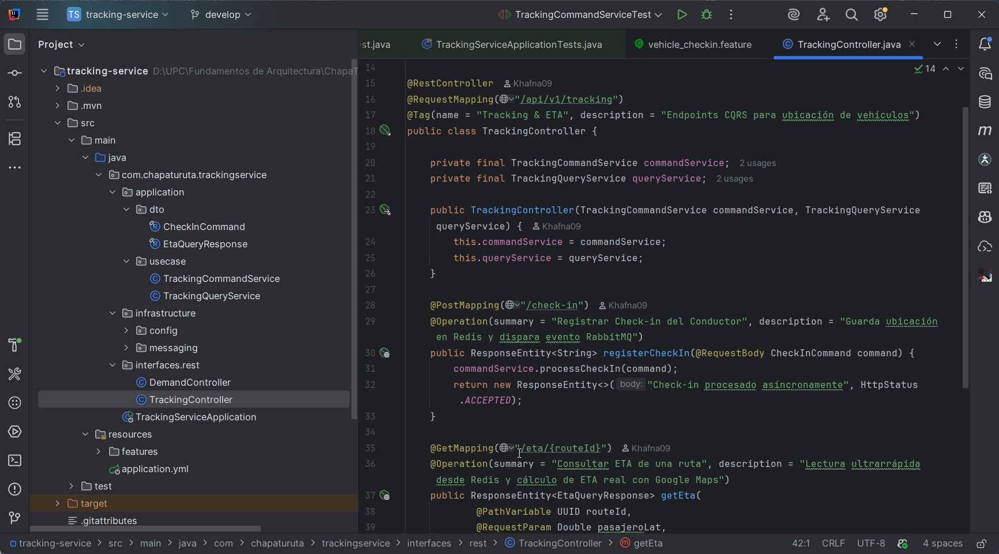
</p>

<p align="center">
  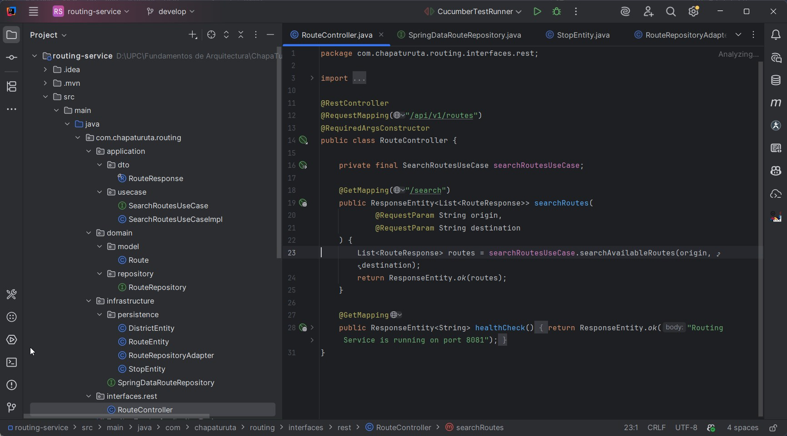
</p>

<p align="center">
  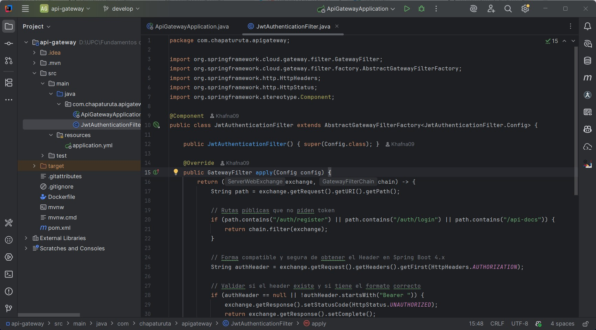
</p>

<p align="center">
  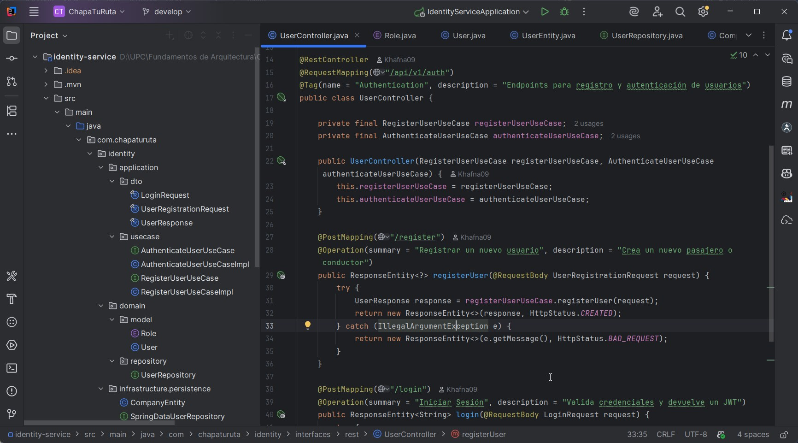
</p>

#### 5.3.1.3 Testing Suite Evidence for Sprint Review

Para garantizar la calidad del software y evitar regresiones, se implementó una estrategia de pruebas automatizadas combinando Pruebas Unitarias con Behavior-Driven Development (BDD) utilizando el framework Cucumber y JUnit 5.

### A. Pruebas Unitarias en Capa de Dominio y Aplicación

Se desarrollaron suites con Mockito para validar la lógica de negocio de forma aislada. Por ejemplo, la clase `RegisterUserUseCaseImplTest` verifica que el sistema arroje excepciones de dominio si se intenta registrar un correo previamente existente, mientras que `SearchRoutesUseCaseImplTest` valida que el algoritmo retorne la lista correcta de rutas disponibles.

#### Evidencia de ejecución de pruebas unitarias

<p align="center">
  
</p>

<p align="center">
  <em>
  Ejecución satisfactoria de pruebas automatizadas en el módulo identity-service mediante Maven Surefire y JUnit 5, incluyendo la validación del caso de uso RegisterUserUseCaseImplTest utilizando Mockito.
  </em>
</p>

<p align="center">
  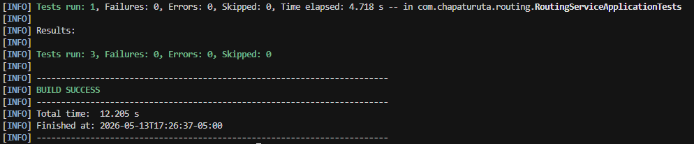
</p>

<p align="center">
  <em>
  Ejecución satisfactoria de pruebas automatizadas en el módulo routing-service, incluyendo SearchRoutesUseCaseImplTest para validar la lógica de búsqueda de rutas disponibles.
  </em>
</p>

---

### B. Pruebas de Comportamiento (BDD con Cucumber)

Se redactaron archivos `.feature` en lenguaje Gherkin para que las pruebas reflejen fielmente los criterios de aceptación del negocio.

- `register_user.feature`: Valida los flujos de éxito y error en la creación de pasajeros y conductores.
- `search_routes.feature`: Simula peticiones de búsqueda de pasajeros indicando distritos de origen y destino, verificando que los Step Definitions (`SearchRoutesSteps.java`) respondan con las rutas esperadas.

#### Evidencia de ejecución BDD

<p align="center">
  
</p>

<p align="center">
  <em>
  Ejecución de escenarios BDD definidos en register_user.feature mediante Cucumber y Step Definitions en el módulo identity-service.
  </em>
</p>

<p align="center">
  
</p>

<p align="center">
  <em>
  Validación de escenarios definidos en search_routes.feature utilizando Cucumber y SearchRoutesSteps.java en el módulo routing-service.
  </em>
</p>


#### 5.3.1.4 Execution Evidence for Sprint Review

<p align="center">
  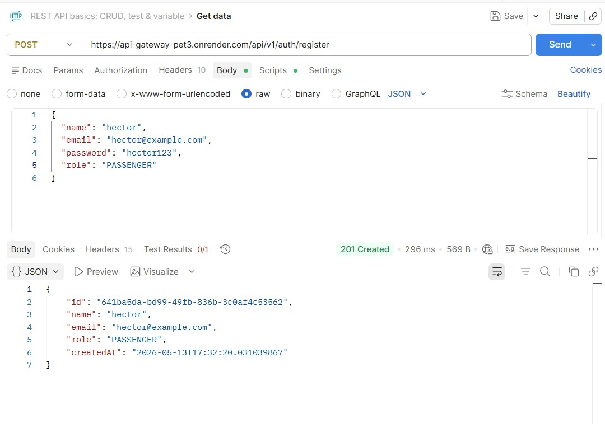
</p>

<p align="center">
  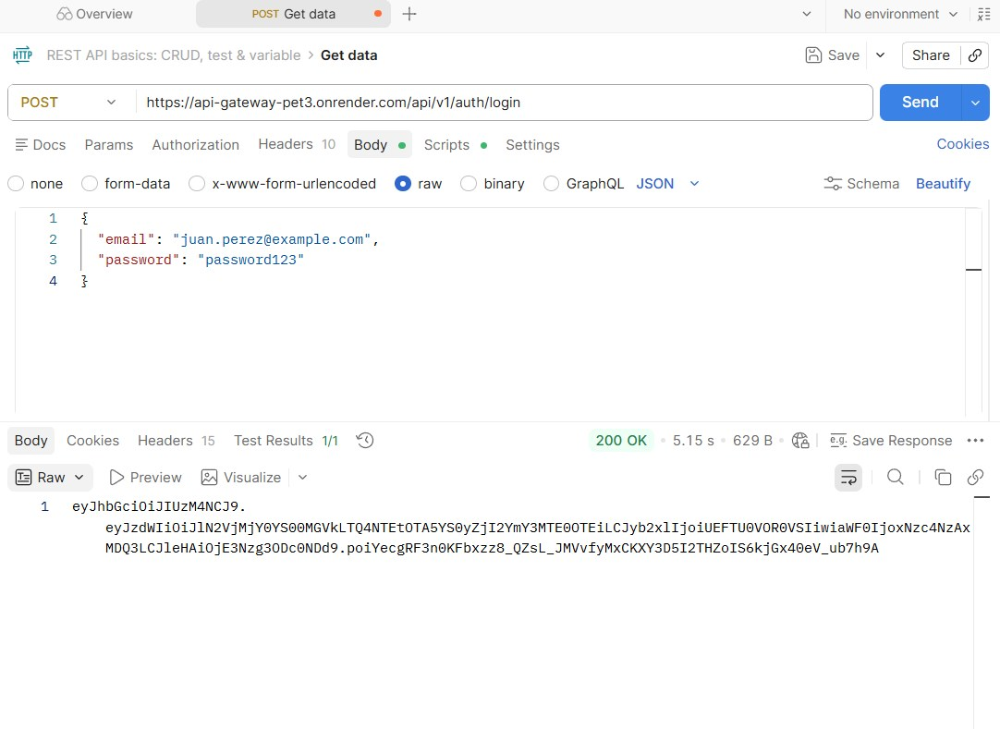
</p>

<p align="center">
  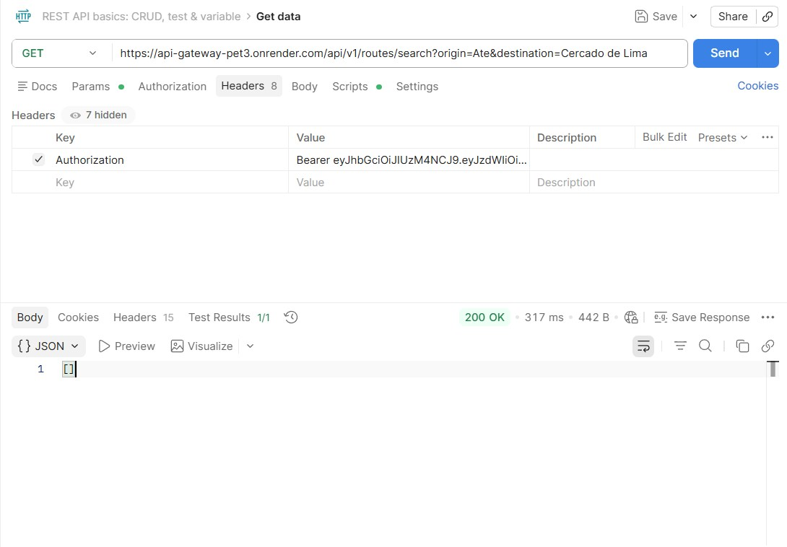
</p>

#### 5.3.1.5 Microservices Documentation Evidence for Sprint Review
Cada microservicio tiene su documentación basándose en el estándar OpenAPI, facilitando la integración para los desarrolladores frontend web.

**Identity Service OpenAPI:** Expone los esquemas de datos para peticiones de login y registro de conductores.

**Routing Service OpenAPI:** Documenta los parámetros de consulta espaciales para paraderos y los algoritmos de búsqueda de rutas.

**Tracking Service OpenAPI:** Detalla los endpoints iniciales para la ingesta de coordenadas GPS y la consulta de disponibilidad de flota.

<p align="center">
  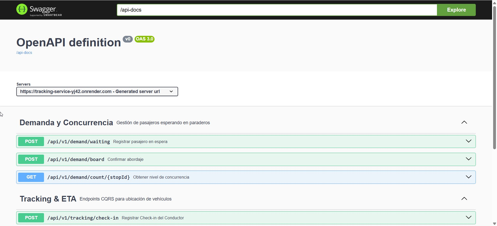
</p>

<p align="center">
  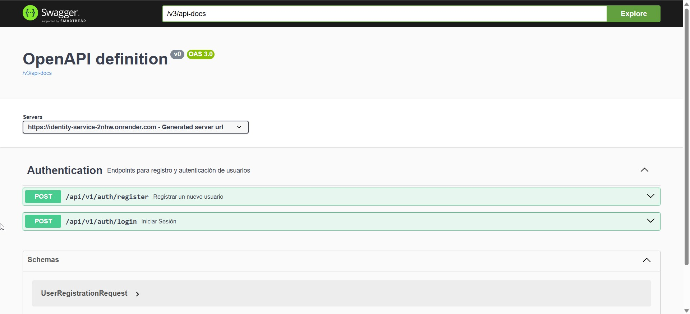
</p>

<p align="center">
  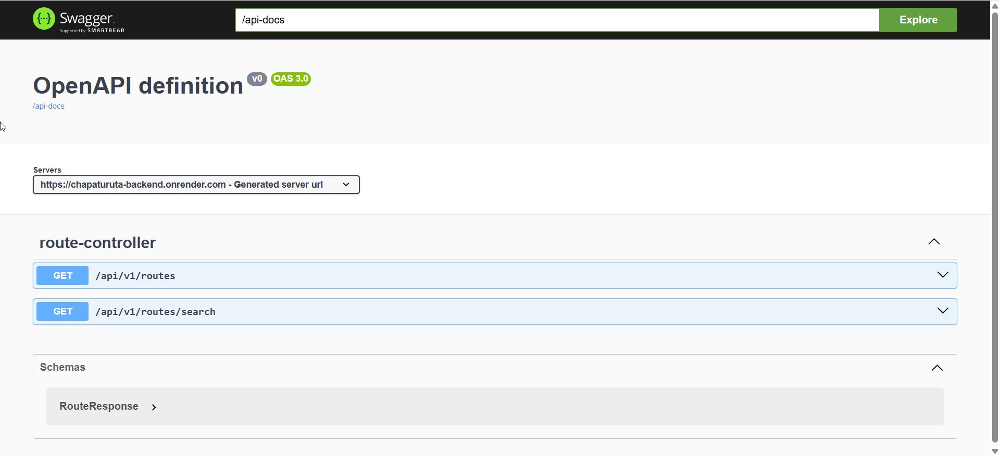
</p>


https://identity-service-2nhw.onrender.com/swagger-ui/index.html

https://tracking-service-yj42.onrender.com/swagger-ui/index.html

https://chapaturuta-backend.onrender.com/swagger-ui/index.html

#### 5.3.1.6 Software Deployment Evidence for Sprint Review

El aprovisionamiento de la infraestructura se llevó a cabo aplicando el patrón *Database-per-service* y utilizando plataformas de nube nativas bajo la restricción de costo cero (*Free Tier*).

### A. Aislamiento de Bases de Datos en Supabase

Se crearon instancias separadas en Supabase (PostgreSQL) para disociar la carga operativa:

- El esquema `identity_schema` almacena las credenciales y perfiles.
- El esquema `routing_schema` persiste los distritos, paraderos y rutas.

La conexión se optimizó utilizando el *Session Pooler* (puerto `5432` con soporte IPv4) inyectando las cadenas de conexión con el protocolo `jdbc:` de forma segura mediante variables de entorno.

### B. Despliegue en Render.com mediante Dockerfiles Universales

Debido a que Render delega las aplicaciones Java a su entorno de contenedores en la capa gratuita, se implementó un `Dockerfile` optimizado multi-etapa en la raíz de cada microservicio. Este archivo descarga la imagen oficial `eclipse-temurin:21-jdk`, empaqueta el código dinámicamente mediante el wrapper de Maven (`mvnw clean package`) y expone la aplicación en el puerto interno `10000` asignado automáticamente por Render.

Los servicios enlazados en producción y operando en estado *Live* son:

- API Gateway: `https://api-gateway-pet3.onrender.com`
- Identity Service: `https://identity-service-2nhw.onrender.com`
- Routing Service: `https://chapaturuta-backend.onrender.com`

<p align="center">
  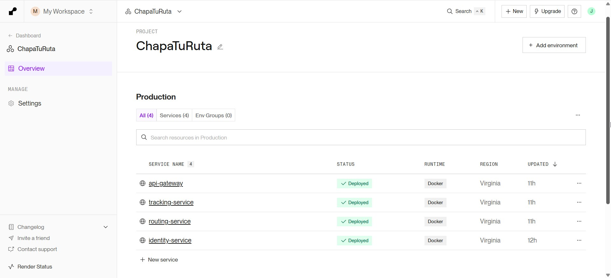
</p>

#### 5.3.1.7 Team Collaboration Insights during Sprint

**Informe:**
<br>

<p align="center">
  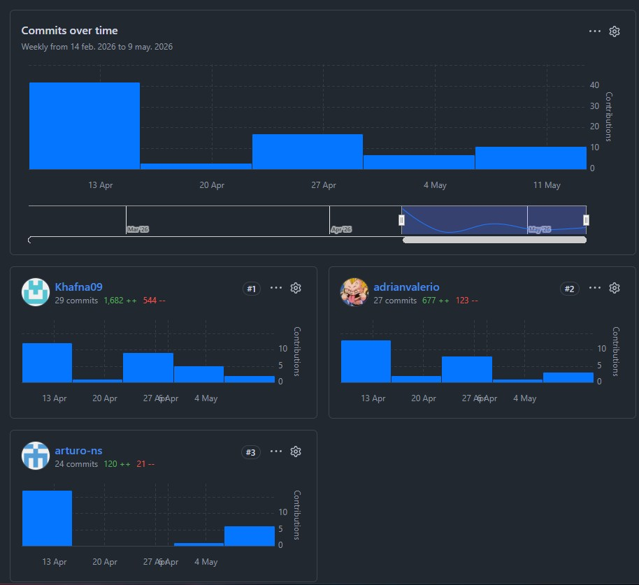
</p>

<br>

**Landing:**
<br>
<p align="center">
  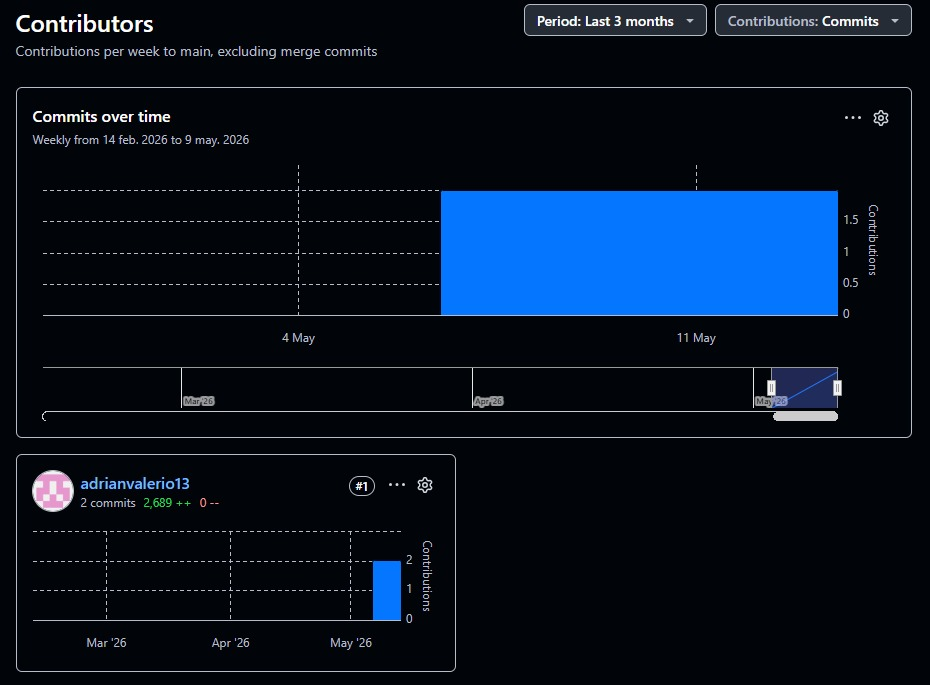
</p>

<br>


<br>

**Backend:**
<br>

<p align="center">
  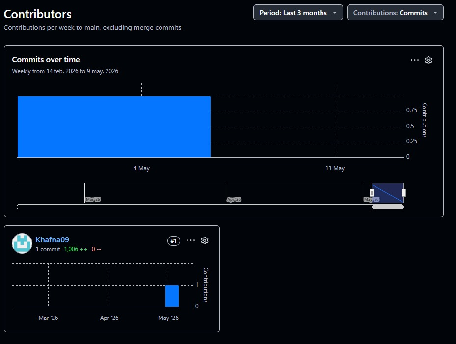
</p>

#### 5.3.1.8 Kanban Board


|  BACKLOG (Product Backlog General) |  TO DO (Sprint 1 Commitments) |  IN PROGRESS |  DONE (Sprint 1 Completado) |
|---|---|---|---|
| US01 Explorar paraderos desde Landing | (Las 8 tareas planificadas para este Sprint ya iniciaron su ciclo) | (Ninguna tarea quedó bloqueada o a medias al cierre del Sprint) | TS01 Seguridad en API Gateway |
| US02 Consultar funcionamiento y ventajas |  |  | TS02 Persistencia Relacional (PostgreSQL) |
| US03 Acceder a FAQ |  |  | US04 Registro de Pasajeros |
| US07 Cierre de Sesión |  |  | US05 Registro de Conductores con RUC |
| US08 Edición de Perfil de Usuario |  |  | US06 Inicio de Sesión con JWT |
| US09 Registro inicial de Empresa |  |  | US12 Crear y listar Paraderos |
| US10 Personalizar perfil de Empresa |  |  | US15 Crear Ruta y Horarios |
| US11 Panel de resumen de métricas |  |  | US17 Búsqueda de Rutas y Transbordos |
| US13 Editar y eliminar Paraderos |  |  |  |
| US14 Visualizar paraderos en el mapa |  |  |  |
| US16 Gestionar Rutas (Editar/Eliminar) |  |  |  |
| US18 Detalle visual de la Ruta |  |  |  |
| US19 Indicar espera en Paradero |  |  |  |
| TS03 Caché de Coordenadas (Redis) |  |  |  |
| US28 Transmitir ubicación GPS |  |  |  |
| US29 Check-in manual en Paraderos |  |  |  |
| US20 Consultar Tiempo Estimado (ETA) |  |  |  |
| TS04 Bus de Eventos (RabbitMQ) |  |  |  |
| US30 Ver concurrencia en tiempo real |  |  |  |
| TS05 Integración de SDK Firebase Admin |  |  |  |
| US21 Notificaciones push de proximidad |  |  |  |
| US22 Confirmación manual de abordaje |  |  |  |
| US23 Eliminación automática de espera |  |  |  |
| US24 Ver información del Conductor |  |  |  |
| US25 Calificar viaje y Conductor |  |  |  |
| US31 Consultar reputación propia |  |  |  |
| US26 Crear y listar Colecciones |  |  |  |
| US27 Gestionar rutas en Colecciones |  |  |  |
| TS06 Pruebas BDD y Unitarias |  |  |  |

### Kanban Board del Sprint 1

<p align="center">
  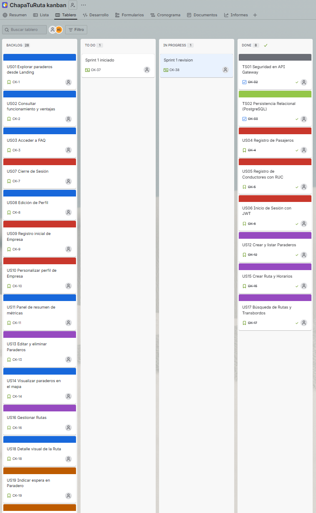
</p>

### Descripción de etiquetas

#### 🔵 Azul (Frontend / UX)

- US01 – Explorar paraderos desde Landing
- US02 – Consultar funcionamiento y ventajas
- US03 – Acceder a FAQ
- US08 – Edición de Perfil de Usuario
- US10 – Personalizar perfil de Empresa
- US11 – Panel de resumen de métricas
- US18 – Detalle visual de la Ruta
- US22 – Confirmación manual de abordaje
- US24 – Ver información del Conductor
- US25 – Calificar viaje y Conductor
- US26 – Crear y listar Colecciones
- US27 – Gestionar rutas en Colecciones
- US31 – Consultar reputación propia

#### 🔴 Rojo (Backend)

- US04 – Registro de Pasajeros
- US05 – Registro de Conductores con RUC
- US06 – Inicio de Sesión con JWT
- US07 – Cierre de Sesión
- US09 – Registro inicial de Empresa
- US12 – Crear y listar Paraderos
- US13 – Editar y eliminar Paraderos
- US15 – Crear Ruta y Horarios
- US16 – Gestionar Rutas (Editar/Eliminar)

#### 🟠 Naranja (Tiempo Real / Geolocalización)

- US14 – Visualizar paraderos en el mapa
- US17 – Búsqueda de Rutas y Transbordos
- US19 – Indicar espera en Paradero
- US20 – Consultar Tiempo Estimado (ETA)
- US21 – Notificaciones push de proximidad
- US23 – Eliminación automática de espera
- US28 – Transmitir ubicación GPS
- US29 – Check-in manual en Paraderos
- US30 – Ver concurrencia en tiempo real

#### 🟢 Verde (Base de Datos)

- TS02 – Persistencia Relacional (PostgreSQL)
- TS03 – Caché de Coordenadas (Redis)

#### ⚫ Negro (Infraestructura)

- TS01 – Seguridad en API Gateway
- TS04 – Bus de Eventos (RabbitMQ)
- TS05 – Integración de SDK Firebase Admin

#### 🟨 Amarillo (Testing)

- TS06 – Pruebas BDD y Unitarias

**Fuente:** Elaboración propia mediante Jira.  
**Enlace:** https://arturons.atlassian.net/jira/software/projects/CK/boards/2?atlOrigin=eyJpIjoiMmZiZjEyNzNjOWQzNDllOTlhZGI1YmU0YTUyMjM2NWEiLCJwIjoiaiJ9


#### 5.3.2 Sprint 2
#### 5.3.2.1 Sprint Backlog 

| Orden | ID | Título | Descripción | Story Points | Estado | Asignado a |
|--------|--------|--------|--------|--------|--------|--------|
| 1 | TS03 | Caché de Coordenadas (Redis) | Setup de almacenamiento en memoria RAM (Upstash) con SSL para lecturas y escrituras de GPS a velocidad de sub-milisegundo. | 5 | Done | Andy Nuñez |
| 2 | US28 | Transmitir ubicación GPS | Endpoint de emisión y actualización continua de coordenadas desde el dispositivo móvil del conductor hacia la caché. | 5 | Done | Hector Rios |
| 3 | US19 | Indicar espera en Paradero | Acción del pasajero para registrar su presencia de origen/destino, almacenándose en el set de demanda de la caché. | 5 | Done | Hector Rios |
| 4 | US20 | Consultar Tiempo Estimado (ETA) | Consumo de coordenadas en tiempo real emparejadas con la API de Mapbox para retornar la distancia y los minutos de arribo exactos. | 5 | Done | Adrian Valerio |
| 5 | TS04 | Bus de Eventos (RabbitMQ) | Orquestación de mensajería asíncrona mediante CloudAMQP (tracking.exchange) para desacoplar el guardado del GPS del procesamiento de alertas. | 5 | Done | Andy Nuñez |
| 6 | US23 | Eliminación automática de espera | Implementación de la "Regla de los 2 minutos" (TTL) en Redis para otorgar tolerancia a caídas de internet del conductor antes de limpiar la cola. | 5 | Done | Hector Rios |
| 7 | TS06 | Pruebas BDD y Unitarias (Fase II) | Implementación de pruebas automatizadas con Cucumber, Gherkin (vehicle_checkin.feature) y Mockito para la capa de negocio del tracking. | 5 | Done | Adrian Valerio |
| 8 | TS07 | Dockerización e Infraestructura CI/CD | Configuración de empaquetado multi-contenedor e integración continua conducida por Git en la plataforma cloud Render. | 5 | Done | Andy Nuñez |
| 9 | TS08 | Configuración Externalizada de Red | Aislamiento de variables de entorno y optimización estricta de conexiones simultáneas mediante HikariCP (max-pool-size=3). | 4 | Done | Hector Rios |
| 10 | TS09 | Resiliencia de Sentencias de BD | Desactivación del umbral de pre-compilación de sentencias en el driver JDBC para compatibilidad en la nube (prepareThreshold=0). | 3 | Done | Adrian Valerio |

#### 5.3.2.2 Development Evidence for Sprint Review

| Repository          | Branch                   | Commit Id | Commit Message                                                                   | Commit Message Body                                                                               | Commited on (Date) |
| ------------------- | ------------------------ | --------- | -------------------------------------------------------------------------------- | ------------------------------------------------------------------------------------------------- | ------------------ |
| ChapaTuRuta-backend | feature/identityservice  | 72ddfd8   | feat: adding register with ruc for drivers                                       | Implementación del registro de conductores con asociación obligatoria a una empresa mediante RUC. | 01/06/2026         |
| ChapaTuRuta-backend | feature/identityservice  | 1056d4e   | feat: Implement user profile management and driver list by company               | Desarrollo de la gestión de perfiles de usuario y consulta de conductores por empresa.            | 01/06/2026         |
| ChapaTuRuta-backend | feature/routing-service  | 75c7daf   | feat: Implement CRUD for route management in the catalog                         | Implementación de operaciones CRUD para la administración de rutas de transporte.                 | 02/06/2026         |
| ChapaTuRuta-backend | feature/tracking-service | 5933528   | feat: adding pattern for coordinates                                             | Implementación de validaciones para el manejo y almacenamiento de coordenadas geográficas.        | 02/06/2026         |
| ChapaTuRuta-backend | feature/tracking-service | 4e3602d   | feat: adding endpoint for passengers demand                                      | Desarrollo de endpoints para registrar y consultar la demanda de pasajeros.                       | 02/06/2026         |
| ChapaTuRuta-backend | feature/tracking-service | f543212   | feat: adding location history management                                         | Implementación del historial de ubicaciones de las unidades de transporte.                        | 02/06/2026         |
| ChapaTuRuta-backend | feature/tracking-service | 6b91b81   | feat: Integrate Mapbox for ETA and PostgreSQL for offline history                | Integración con Mapbox para cálculo de ETA y PostgreSQL para persistencia histórica.              | 02/06/2026         |
| ChapaTuRuta-backend | feature/api-gateway      | 228033a   | fix: adding connection to Supabase                                               | Configuración de la conexión entre la aplicación y la base de datos Supabase en entorno cloud.    | 02/06/2026         |
| ChapaTuRuta-backend | feature/api-gateway      | e694bfc   | fix: generate token jwt                                                          | Corrección en la generación de tokens JWT para autenticación segura.                              | 02/06/2026         |
| ChapaTuRuta-backend | feature/api-gateway      | 0479e86   | feat: adding validation token                                                    | Implementación de validación de tokens JWT en las solicitudes protegidas.                         | 02/06/2026         |
| ChapaTuRuta-backend | feature/api-gateway      | dc8d086   | feat: adding jwt                                                                 | Incorporación de autenticación basada en JWT dentro de la arquitectura del sistema.               | 03/06/2026         |
| ChapaTuRuta-backend | feature/api-gateway      | dd15a8c   | fix: fixing connections to db                                                    | Optimización y corrección de conexiones a la base de datos para entornos productivos.             | 03/06/2026         |
| ChapaTuRuta-backend | feature/api-gateway      | df6e070   | fix: fixing schema to use configuration                                          | Ajuste del esquema de persistencia para utilizar configuración externalizada.                     | 03/06/2026         |
| ChapaTuRuta-backend | feature/api-gateway      | cfbf8e5   | fix: stop setting manual UUID for routes                                         | Corrección en la generación automática de identificadores UUID para rutas.                        | 03/06/2026         |
| ChapaTuRuta-backend | feature/identityservice  | 8c43443   | feat: add validation for user registration scenarios                             | Implementación de pruebas BDD para validar escenarios de registro de usuarios.                    | 03/06/2026         |
| ChapaTuRuta-backend | feature/tracking-service | f0a95bd   | feat: add tracking controller API with check-in and ETA scenarios                | Desarrollo de pruebas de integración para Check-In y ETA del servicio de tracking.                | 04/06/2026         |
| ChapaTuRuta-backend | feature/routing-service  | e1e2c66   | feat: enhance routing service tests and scenarios for direct and transfer routes | Implementación de escenarios BDD para búsqueda de rutas directas y con transbordos.               | 04/06/2026         |


#### 5.3.2.3 Testing Suite Evidence for Sprint Review


En esta sección se expone el conjunto de pruebas de integración y aceptación (Integration/Acceptance Tests) automatizadas bajo el enfoque de Desarrollo Guiado por Comportamiento (BDD). Los escenarios fueron escritos en lenguaje natural utilizando la sintaxis descriptiva Gherkin y acoplados al contexto de Spring Boot mediante Cucumber.

Estas pruebas validan de extremo a extremo que las reglas de negocio, filtros de excepción y flujos de datos perimetrales correspondan rigurosamente con los criterios de aceptación de las Historias de Usuario (User Stories) planificadas para el presente Sprint.

**Identity-service**

<p align="center">
  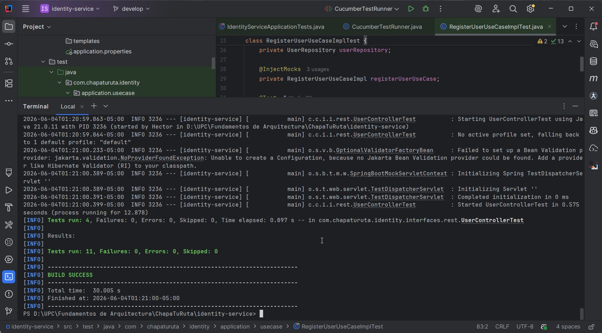
</p>

```gherkin
Feature: User Registration Authentication Flow

  As a new passenger or driver
  I want to register an account with my personal details
  So that I can authenticate and access the ChapaTuRuta platform

  Scenario: Successful user registration
    Given a new user wants to register with email "juan.perez@example.com", name "Juan Perez", password "secure123", and role "PASSENGER"
    When the registration request is processed
    Then the account is successfully created returning the user details

  Scenario: Registration fails due to duplicate email
    Given an existing user is already registered with email "admin@example.com"
    When a new user attempts to register with the duplicate email "admin@example.com"
    Then the system rejects the request with a bad request error "El correo ya está registrado"

  Scenario: Registration fails for driver without a company
    Given a new driver attempts to register with email "chofer@example.com", name "Carlos", password "pass123", but no company ID
    When the registration request is processed
    Then the system rejects the request with a bad request error "Los conductores deben estar asociados a una empresa (companyId requerido)"
```


**routing-service**

<p align="center">
  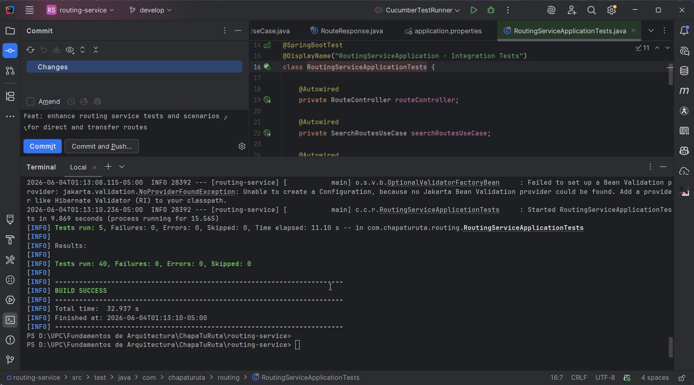
</p>

```gherkin
Feature: Route Search Flow

  As a passenger planning a trip
  I want to search for available routes between my origin and destination districts
  So that I can view the price and estimated duration in ChapaTuRuta

  Scenario: Successful search for existing direct routes
    Given the system has available routes registered from "San Juan de Lurigancho" to "Ate"
    When a user searches for available routes from "San Juan de Lurigancho" to "Ate"
    Then the system returns a list of routes containing pricing and duration details
    And each route option has a valid price and duration

  Scenario: Search for routes with no coverage
    Given there are no routes registered from "Ancón" to "Chosica"
    When a user searches for available routes from "Ancón" to "Chosica"
    Then the system returns an empty list of routes

  Scenario: Search for routes with transfer
    Given the system has a transfer route from "Ate" via "La Victoria" to "Cercado de Lima"
    When a user searches for available routes from "Ate" to "Cercado de Lima"
    Then the system returns routes with multiple legs

  Scenario: Search for multiple available direct routes
    Given the system has 3 available routes from "Miraflores" to "San Isidro"
    When a user searches for available routes from "Miraflores" to "San Isidro"
    Then the system returns 3 available routes
    And each route option has a valid price and duration
```


**tracking-service**

<p align="center">
  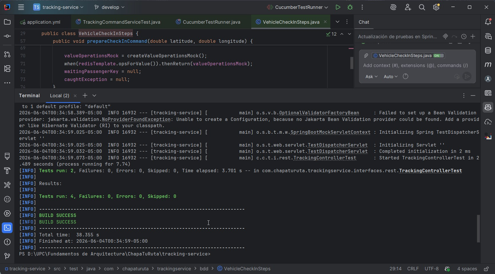
</p>

```gherkin
Feature: Tracking Controller API

  As a client of the tracking service
  I want to register check-ins and consult ETA information
  So that the controller behaves correctly for valid and invalid requests

  Scenario: Successful check-in processing
    Given a valid check-in request for the tracking controller
    When the client sends the check-in request
    Then the response status should be 202
    And the response body should confirm asynchronous processing

  Scenario: Check-in request rejected due to invalid coordinates
    Given an invalid check-in request with latitude -91.0 and longitude -76.9532
    When the client sends the check-in request
    Then the response status should be 400
    And the response body should describe the validation error

  Scenario: Successful ETA lookup for a route
    Given the ETA service returns a result for route "11111111-1111-1111-1111-111111111111"
    When the client requests the ETA for route "11111111-1111-1111-1111-111111111111" and passenger coordinates -12.0435 and -76.9532
    Then the ETA payload should contain the route identifier and current vehicle coordinates

  Scenario: ETA lookup returns not found when the route has no active vehicles
    Given the ETA service cannot resolve route "11111111-1111-1111-1111-111111111111"
    When the client requests the ETA for route "11111111-1111-1111-1111-111111111111" and passenger coordinates -12.0435 and -76.9532
    Then the response status should be 404
```


```gherkin
Feature: Vehicle Check-In Tracking Flow

  As a driver navigating a route
  I want my active location to be stored and published asynchronously
  So that the tracking system can notify passengers without blocking the application

  Scenario: Successful Check-In processing without passengers waiting
    Given an active driver transmits check-in coordinates latitude -12.0435 and longitude -76.9532 for a route
    When the check-in command is processed by the command service
    Then the system updates the vehicle location in cache and emits an async notification event

  Scenario: Successful Check-In processing with waiting passengers at a stop
    Given an active driver transmits check-in coordinates latitude -12.0435 and longitude -76.9532 for a route
    And the route has waiting passengers at stop "11111111-1111-1111-1111-111111111111"
    When the check-in command is processed by the command service
    Then the system updates the vehicle location in cache and emits an async notification event
    And the waiting passengers at the stop receive a two-minute extension
```

| Repository          | Branch                 | Commit Id                                | Commit Message                                                                   | Commit Message Body                                                                                                                                                                                   | Commited on (Date)  |
| ------------------- | ---------------------- | ---------------------------------------- | -------------------------------------------------------------------------------- | ----------------------------------------------------------------------------------------------------------------------------------------------------------------------------------------------------- | ------------------- |
| ChapaTuRuta-backend | feature/routing-tests  | e1e2c6632b665c23bba7db34a95d9df9a28ece59 | feat: enhance routing service tests and scenarios for direct and transfer routes | Se implementan los escenarios estructurados en Cucumber utilizando Gherkin para la búsqueda de rutas directas y opciones con transbordo multimodales, aislando la lógica algorítmica.                 | 04 de Junio de 2026 |
| ChapaTuRuta-backend | feature/identity-tests | 8c43443be352cdaf524491d6b989a55ae9ae6d12 | feat: add validation for user registration scenarios                             | Cobertura integral de los flujos de autenticación e inyección de reglas de negocio en el registro de usuarios, validando correos duplicados y la asociación obligatoria de empresas para conductores. | 04 de Junio de 2026 |
| ChapaTuRuta-backend | feature/tracking-tests | f0a95bda2db081946b9137ce06ac11e27cabf89e | feat: add tracking controller API with check-in and ETA scenarios                | Implementación de Integration Tests empleando MockMvc para la ingesta síncrona de telemetría GPS y cálculo predictivo de ETA, neutralizando las llamadas externas y colas de RabbitMQ.                | 04 de Junio de 2026 |


### 5.3.2.4 Execution Evidence for Sprint Review

Para validar el correcto funcionamiento de los microservicios desarrollados durante el sprint, se realizaron pruebas manuales utilizando Postman. Estas pruebas permiten verificar la autenticación, autorización, consulta de información del usuario, búsqueda de rutas, consulta de conductores, registro de ubicación del conductor y cálculo del tiempo estimado de llegada del bus.

---

#### 1. Login - Obtención del Token JWT

En esta prueba se valida el endpoint de autenticación del Identity Service. Se envían las credenciales del usuario conductor para obtener un token JWT, el cual será utilizado posteriormente para acceder a los endpoints protegidos del sistema.

**Método:** `POST`  
**Endpoint:** `/api/v1/auth/login`

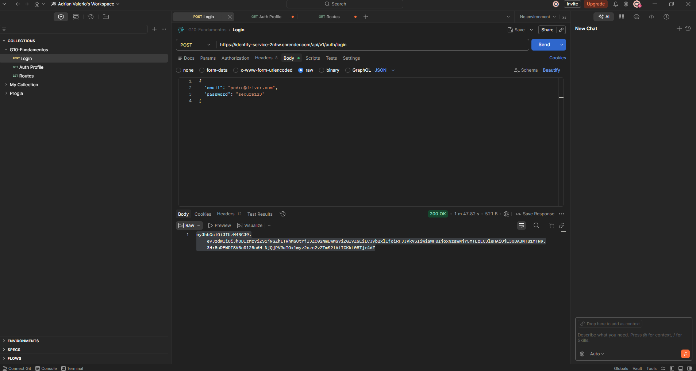

---

#### 2. Auth Profile - Consulta del Perfil Autenticado

En esta prueba se valida que el token JWT generado en el login permita acceder correctamente a la información del usuario autenticado. El objetivo es comprobar que el Identity Service reconoce al usuario y devuelve los datos asociados a su identificador.

**Método:** `GET`  
**Endpoint:** `/api/v1/auth/profile/{userId}`

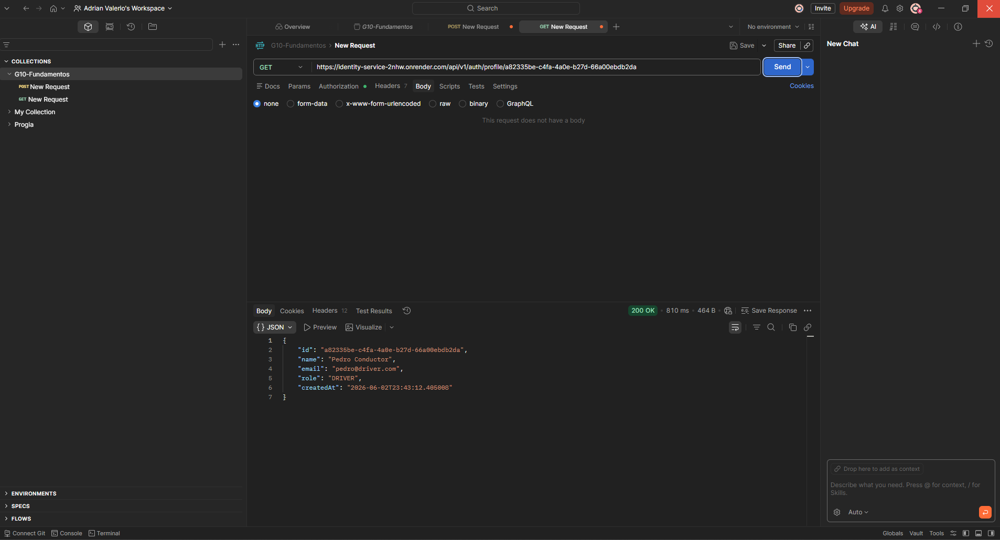

---

#### 3. Routes Search - Búsqueda de Rutas

En esta prueba se valida el funcionamiento del Routing Service. Se realiza una búsqueda de rutas disponibles entre un distrito de origen y un distrito de destino. El objetivo es comprobar que el sistema pueda retornar rutas válidas, incluyendo información como el identificador de la ruta y el precio estimado.

**Método:** `GET`  
**Endpoint:** `/api/v1/routes/search?origin={origin}&destination={destination}`

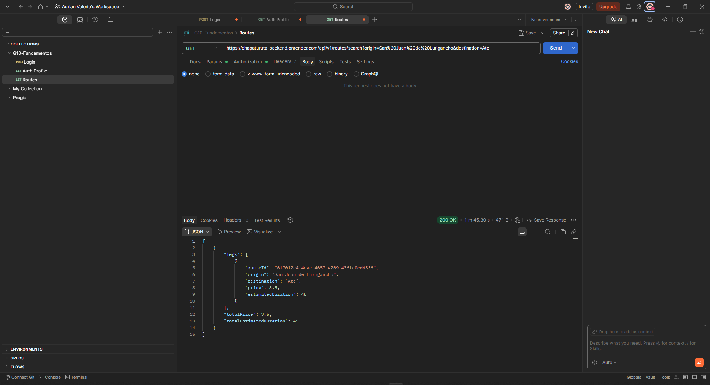

---

#### 4. Company Drivers - Consulta de Conductores por Empresa

En esta prueba se valida que el Identity Service permita consultar los conductores asociados a una empresa de transporte específica. El objetivo es comprobar que la relación entre empresa y conductores se encuentre correctamente registrada y que el endpoint retorne la lista correspondiente.

**Método:** `GET`  
**Endpoint:** `/api/v1/companies/{companyId}/drivers`

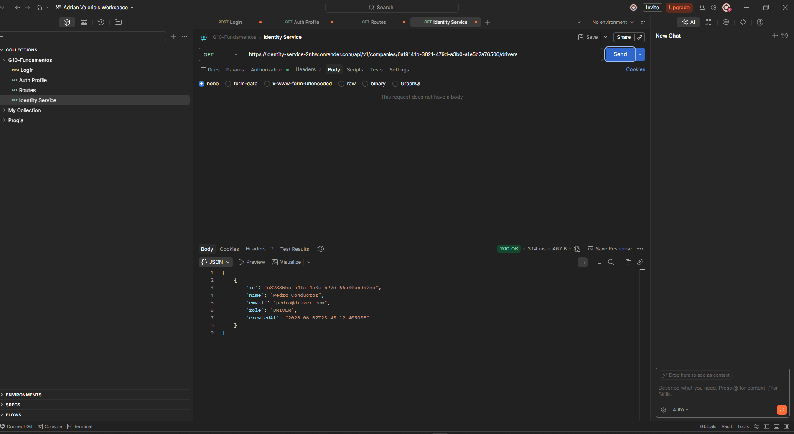

---

#### 5. Tracking Check-in - Registro de Ubicación del Conductor

En esta prueba se valida el endpoint de check-in del Tracking Service. Se registra la ubicación actual del conductor mediante coordenadas de latitud y longitud, asociándola a una ruta específica. El objetivo es actualizar la información de ubicación en el sistema para que pueda ser utilizada posteriormente en el cálculo del ETA.

**Método:** `POST`  
**Endpoint:** `/api/v1/tracking/check-in`

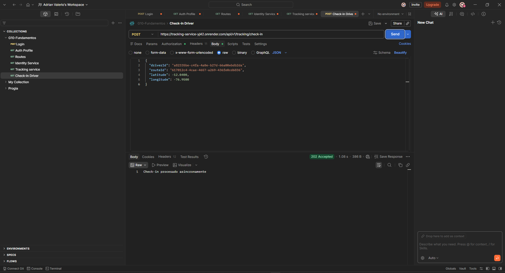

---

#### 6. Tracking ETA - Consulta del Tiempo Estimado de Llegada

En esta prueba se valida el endpoint de ETA del Tracking Service. Se consulta el tiempo estimado de llegada del bus a partir de la ubicación del pasajero y la ruta seleccionada. El objetivo es comprobar que el sistema pueda calcular y devolver el ETA utilizando la ubicación previamente registrada del conductor.

**Método:** `GET`  
**Endpoint:** `/api/v1/tracking/eta/{routeId}?pasajeroLat={lat}&pasajeroLng={lng}`

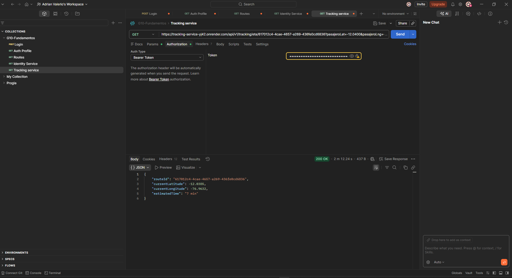

---

#### Resultado de la Validación

Las pruebas ejecutadas en Postman permiten evidenciar que los principales endpoints de los microservicios se encuentran operativos. Además, se verifica que el flujo entre autenticación, autorización, búsqueda de rutas, registro de ubicación y cálculo de ETA funciona de manera integrada dentro del sistema.

#### 5.3.2.5 Microservices Documentation Evidence for Sprint Review

-  Los endpoints de creación, actualización y eliminación (POST, PUT y DELETE) entregam respuestas en formato JSON con un UUID generados por la base de datos para garantizar la integridad de la información. En el caso del endpoint de check-in del conductor, la solicitud se acepta de inmediato y el procesamiento se realiza en segundo plano mediante RabbitMQ para mejorar el rendimiento y evitar tiempos de espera.

- Por otro lado, los endpoints de consulta (GET) obtienen la información desde Redis, una caché en memoria que permite respuestas más rápidas. Para calcular el tiempo estimado de llegada (ETA), el sistema combina las coordenadas almacenadas con datos de tráfico proporcionados por Mapbox y devuelve un resultado sencillo, por ejemplo, "6 min", listo para mostrarse en la interfaz de la SPA web.


| Endpoint                                | Acción                                            | Método HTTP | Sintaxis de llamada                     | Parámetros                                                                                                                                  | Ejemplo de Response                                                                                                                                                            | URL Documentación                                          |
| --------------------------------------- | ------------------------------------------------- | ----------- | --------------------------------------- | ------------------------------------------------------------------------------------------------------------------------------------------- | ------------------------------------------------------------------------------------------------------------------------------------------------------------------------------ | ---------------------------------------------------------- |
| `/api/v1/auth/register`                 | Registrar un nuevo usuario (Pasajero o Conductor) | POST        | `/api/v1/auth/register`                 | **Body (JSON):** name (string), email (string), password (string), role (string), companyId (string/uuid)                                   | `{ "id": "3fa85f64-5717-4562-b3fc-2c963f66afa6", "name": "Juan Perez", "email": "juan@mail.com", "role": "PASSENGER", "createdAt": "2026-06-03T18:33:10Z" }`                   | https://identity-service-2nhw.onrender.com/swagger-ui.html |
| `/api/v1/auth/login`                    | Iniciar Sesión y obtener JWT                      | POST        | `/api/v1/auth/login`                    | **Body (JSON):** email (string), password (string)                                                                                          | `"eyJhbGciOiJIUzI1NiIsInR5cCI6IkpXVCJ9.eyJzdWIiOiIzZmE4NWY2NC..."`                                                                                                             | https://identity-service-2nhw.onrender.com/swagger-ui.html |
| `/api/v1/auth/profile/{id}`             | Obtener Perfil del usuario                        | GET         | `/api/v1/auth/profile/{id}`             | **Path:** id (string/uuid)                                                                                                                  | `{ "id": "3fa85f64-5717-4562-b3fc-2c963f66afa6", "name": "Juan Perez", "email": "juan@mail.com", "role": "PASSENGER", "createdAt": "2026-06-03T18:33:10Z" }`                   | https://identity-service-2nhw.onrender.com/swagger-ui.html |
| `/api/v1/auth/profile/{id}`             | Actualizar Perfil del usuario                     | PUT         | `/api/v1/auth/profile/{id}`             | **Path:** id (string/uuid)<br>**Body (JSON):** name (string), password (string)                                                             | `{ "id": "3fa85f64-5717-4562-b3fc-2c963f66afa6", "name": "Juan Actualizado", "email": "juan@mail.com", "role": "PASSENGER", "createdAt": "2026-06-03T18:33:10Z" }`             | https://identity-service-2nhw.onrender.com/swagger-ui.html |
| `/api/v1/auth/profile/{id}`             | Eliminar Cuenta de usuario                        | DELETE      | `/api/v1/auth/profile/{id}`             | **Path:** id (string/uuid)                                                                                                                  | En blanco (204 No Content / 200 OK)                                                                                                                                            | https://identity-service-2nhw.onrender.com/swagger-ui.html |
| `/api/v1/companies/register`            | Registrar una nueva Empresa                       | POST        | `/api/v1/companies/register`            | **Body (JSON):** name (string), ruc (string), busPhotoUrl (string), managerId (string/uuid)                                                 | `{ "id": "e8a15f64-2717-4562-b3fc-2c963f66bbb2", "name": "Transportes Lima S.A.", "ruc": "20123456789" }`                                                                      | https://identity-service-2nhw.onrender.com/swagger-ui.html |
| `/api/v1/companies/{companyId}/drivers` | Listar choferes de la empresa                     | GET         | `/api/v1/companies/{companyId}/drivers` | **Path:** companyId (string/uuid)                                                                                                           | `[{ "id": "8ca85f64-5717-4562-b3fc-2c963f66ccc4", "name": "Pedro Chofer", "email": "pedro@bus.com", "role": "DRIVER", "createdAt": "2026-06-03T19:00:00Z" }]`                  | https://identity-service-2nhw.onrender.com/swagger-ui.html |
| `/api/v1/routes`                        | Crear nueva ruta de transporte                    | POST        | `/api/v1/routes`                        | **Body (JSON):** originDistrict (string), destinationDistrict (string), price (number), durationMin (integer)                               | `{ "routeId": "4da75f64-5717-4562-b3fc-2c963f66ddd5", "origin": "Ate", "destination": "Lima", "price": 3.50, "estimatedDuration": 45 }`                                        | https://chapaturuta-backend.onrender.com/swagger-ui.html   |
| `/api/v1/routes`                        | Listar todas las rutas                            | GET         | `/api/v1/routes`                        | Ninguno                                                                                                                                     | `[{ "routeId": "4da75f64-5717-4562-b3fc-2c963f66ddd5", "origin": "Ate", "destination": "Lima", "price": 3.50, "estimatedDuration": 45 }]`                                      | https://chapaturuta-backend.onrender.com/swagger-ui.html   |
| `/api/v1/routes/{id}`                   | Actualizar datos de una ruta                      | PUT         | `/api/v1/routes/{id}`                   | **Path:** id (string/uuid)<br>**Body (JSON):** originDistrict (string), destinationDistrict (string), price (number), durationMin (integer) | `{ "routeId": "4da75f64-5717-4562-b3fc-2c963f66ddd5", "origin": "Ate", "destination": "Callao", "price": 4.00, "estimatedDuration": 50 }`                                      | https://chapaturuta-backend.onrender.com/swagger-ui.html   |
| `/api/v1/routes/{id}`                   | Eliminar una ruta                                 | DELETE      | `/api/v1/routes/{id}`                   | **Path:** id (string/uuid)                                                                                                                  | En blanco (200 OK)                                                                                                                                                             | https://chapaturuta-backend.onrender.com/swagger-ui.html   |
| `/api/v1/routes/search`                 | Buscar rutas directas/transbordos                 | GET         | `/api/v1/routes/search`                 | **Query:** origin (string), destination (string)                                                                                            | `[{ "legs": [{ "routeId": "4da75f64...", "origin": "Ate", "destination": "Lima", "price": 3.5, "estimatedDuration": 45 }], "totalPrice": 3.5, "totalEstimatedDuration": 45 }]` | https://chapaturuta-backend.onrender.com/swagger-ui.html   |
| `/api/v1/tracking/check-in`             | Registrar Check-in del Conductor                  | POST        | `/api/v1/tracking/check-in`             | **Body (JSON):** driverId (uuid), routeId (uuid), stopId (uuid), latitude (number), longitude (number), timestamp (integer)                 | `"Check-in procesado asincronamente"`                                                                                                                                          | https://tracking-service-yj42.onrender.com/swagger-ui.html |
| `/api/v1/tracking/eta/{routeId}`        | Consultar Tiempo Estimado (ETA)                   | GET         | `/api/v1/tracking/eta/{routeId}`        | **Path:** routeId (string/uuid)<br>**Query:** pasajeroLat (number), pasajeroLng (number)                                                    | `{ "routeId": "4da75f64-5717-4562-b3fc-2c963f66ddd5", "currentLatitude": -12.0400, "currentLongitude": -76.9500, "estimatedTime": "6 min" }`                                   | https://tracking-service-yj42.onrender.com/swagger-ui.html |
| `/api/v1/demand/join`                   | Registrar pasajero en espera                      | POST        | `/api/v1/demand/join`                   | **Query:** routeId (string/uuid), stopId (string/uuid), passengerId (string/uuid)                                                           | `"Pasajero registrado en espera exitosamente"`                                                                                                                                 | https://tracking-service-yj42.onrender.com/swagger-ui.html |
| `/api/v1/demand/transfer`               | Registrar transbordo de pasajero                  | POST        | `/api/v1/demand/transfer`               | **Query:** nextRouteId (string/uuid), nextStopId (string/uuid), passengerId (string/uuid)                                                   | `"Pasajero registrado para transbordo exitosamente"`                                                                                                                           | https://tracking-service-yj42.onrender.com/swagger-ui.html |
| `/api/v1/demand/route/{routeId}`        | Ver demanda total de la ruta                      | GET         | `/api/v1/demand/route/{routeId}`        | **Path:** routeId (string/uuid)                                                                                                             | `{ "paradero-ate-123": 5, "paradero-santa-anita-456": 12 }`                                                                                                                    | https://tracking-service-yj42.onrender.com/swagger-ui.html |


<p align="center">
  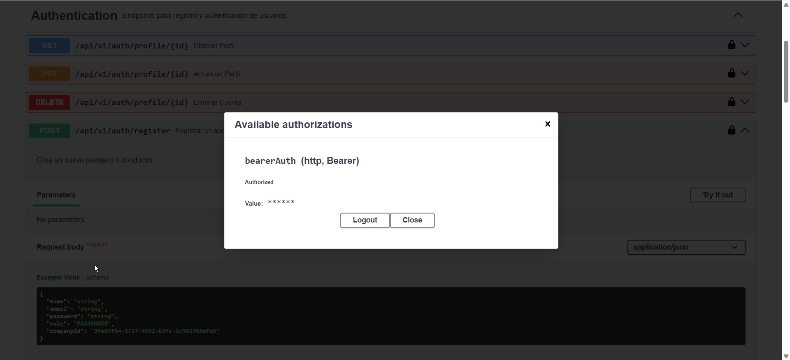
</p>

<p align="center">
  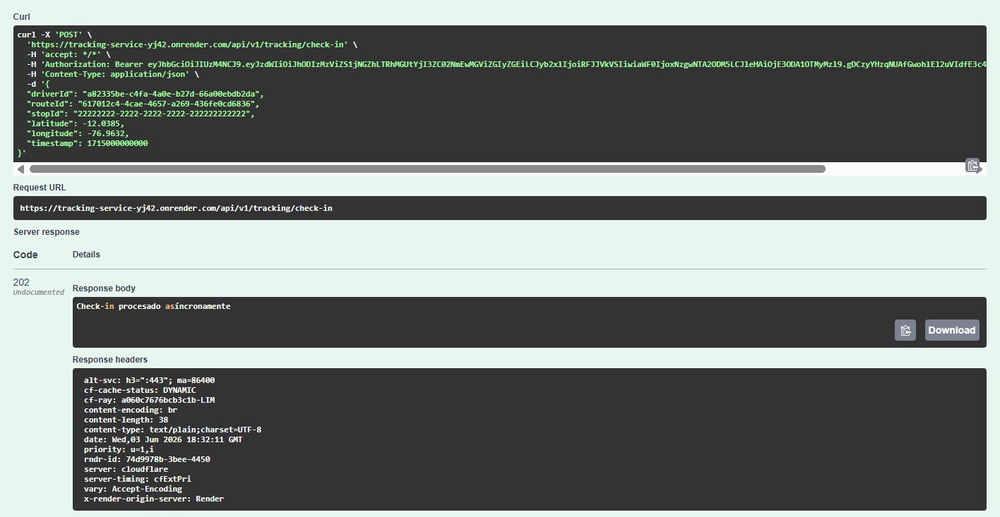
</p>

<p align="center">
  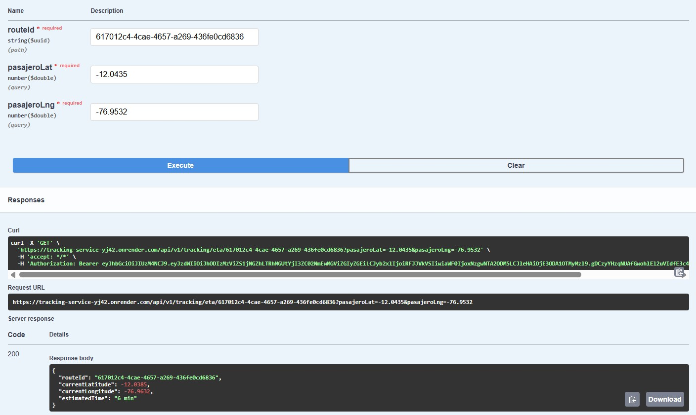
</p>


https://identity-service-2nhw.onrender.com/swagger-ui/index.html

https://tracking-service-yj42.onrender.com/swagger-ui/index.html

https://chapaturuta-backend.onrender.com/swagger-ui/index.html


- **URL del Repositorio de Web Services:** https://github.com/1ASI0657-2610-7940-G10/ChapaTuRuta-backend


#### 5.3.2.6 Software Deployment Evidence for Sprint Review

- Esta captura evidencia el dashboard principal de nuestra plataforma PaaS (Render Cloud). El estado verde ("Deploy successful" / "Live") de todos los componentes confirma que el pipeline de Integración Continua (CI/CD) descargó correctamente el código fuente, empaquetó las imágenes inmutables de Docker y levantó los contenedores sin errores

<p align="center">
  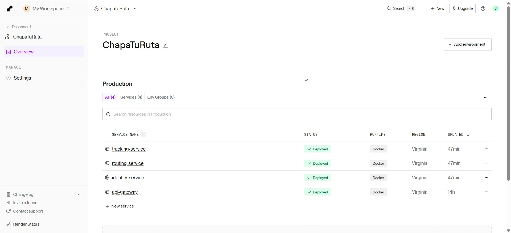
</p>

- Se confirma el despliegue del identity-service en su dominio público. La interfaz interactiva demuestra que el contenedor ha cargado exitosamente las configuraciones de seguridad criptográfica y está listo para emitir y validar tokens JWT en la nube.

<p align="center">
  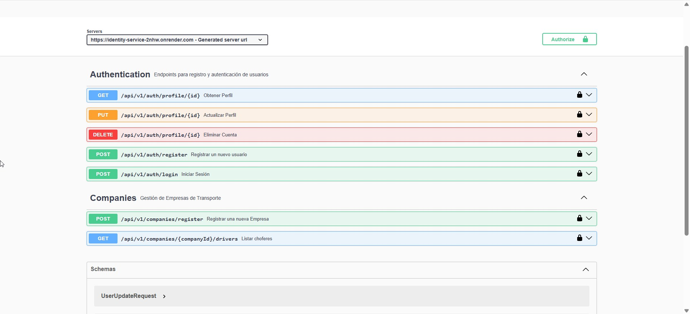
</p>

- Evidencia del despliegue del tracking-service. Su correcto arranque en la nube confirma que la inyección de variables de entorno críticas (como el MAPBOX_ACCESS_TOKEN y las credenciales de colas) fue exitosa, permitiendo exponer los endpoints de telemetría de alta velocidad.

<p align="center">
  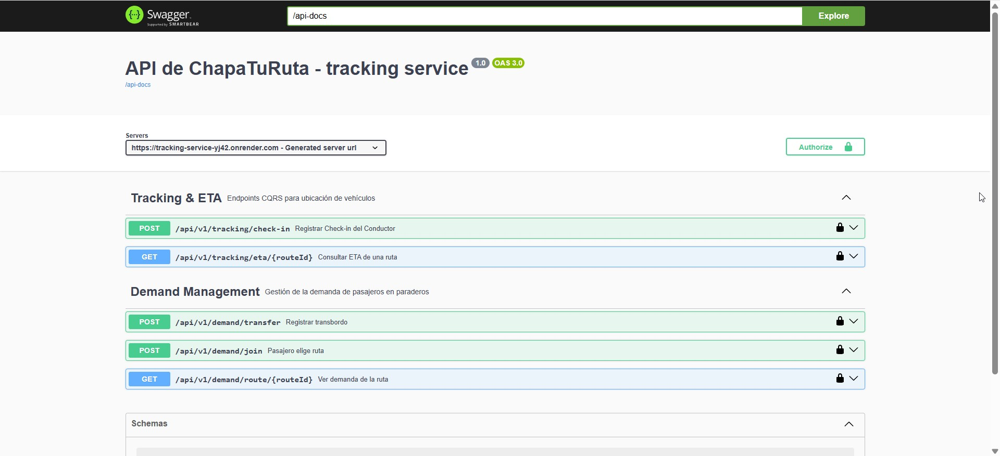
</p>

- Captura del entorno productivo del routing-service, demostrando que los controladores que albergan la lógica algorítmica de búsqueda de itinerarios y transbordos están operativos y expuestos a través de la red perimetral.

<p align="center">
  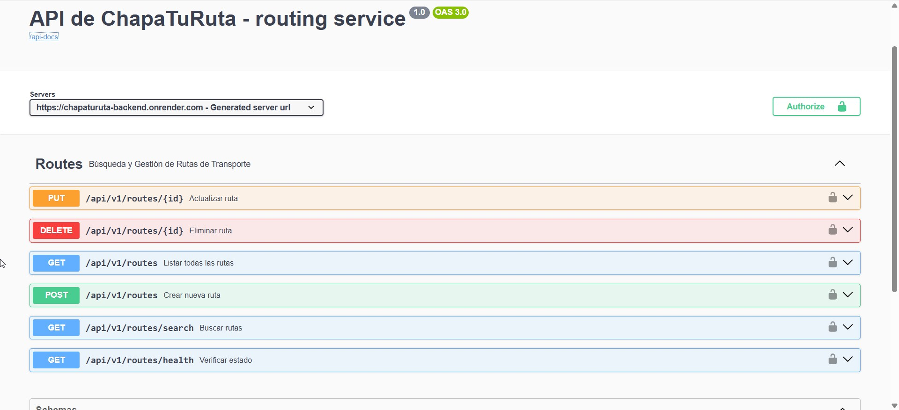
</p>

- Consola de administración de Supabase evidenciando el aprovisionamiento de la base de datos relacional (PostgreSQL). Demuestra que las tablas maestras de dominios (Usuarios, Rutas, Empresas) están activas en la nube y recibiendo conexiones persistentes desde los microservicios, validando las credenciales JDBC inyectadas en Render.

<p align="center">
  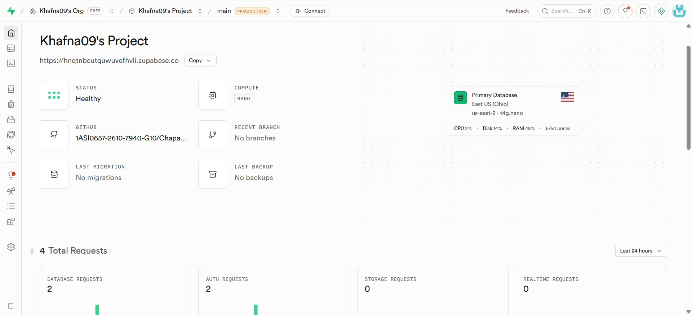
</p>

- Monitoreo del clúster gestionado de Redis en Upstash. Esta instancia en memoria RAM, ahora activa en la nube, es la responsable de absorber la alta concurrencia de la telemetría GPS vehicular y la gestión de colas de demanda, garantizando lecturas de latencia ultrabaja.

<p align="center">
  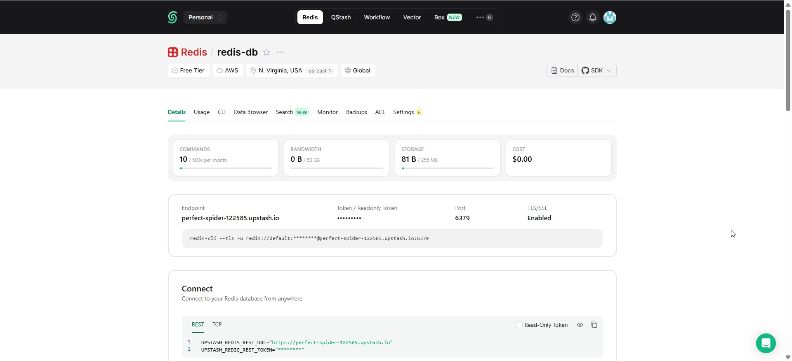
</p>

- Panel de control de CloudAMQP mostrando el bróker de mensajería en estado de ejecución (Running). Esta captura certifica el correcto despliegue de la infraestructura de colas asíncronas.

<p align="center">
  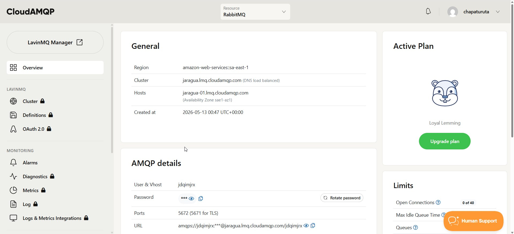
</p>


#### 5.3.2.7 Team Collaboration Insights during Sprint

#### 5.3.2.8 Kanban Board

|  BACKLOG (Product Backlog General) |  TO DO (Sprint 2 Commitments) |  IN PROGRESS |  DONE (Sprint 2 Completado) |
|---|---|---|---|
| US01 Explorar paraderos desde Landing | (Las 10 tareas planificadas para este Sprint completaron satisfactoriamente su ciclo de desarrollo) | (Ninguna tarea quedó bloqueada o pendiente al cierre del Sprint) | TS03 Caché de Coordenadas (Redis) |
| US02 Consultar funcionamiento y ventajas |  |  | US28 Transmitir ubicación GPS |
| US03 Acceder a FAQ |  |  | US19 Indicar espera en Paradero |
| US07 Cierre de Sesión |  |  | US20 Consultar Tiempo Estimado (ETA) |
| US08 Edición de Perfil de Usuario |  |  | TS04 Bus de Eventos (RabbitMQ) |
| US09 Registro inicial de Empresa |  |  | US23 Eliminación automática de espera |
| US10 Personalizar perfil de Empresa |  |  | TS06 Pruebas BDD y Unitarias (Fase II) |
| US11 Panel de resumen de métricas |  |  | TS07 Dockerización e Infraestructura CI/CD |
| US13 Editar y eliminar Paraderos |  |  | TS08 Configuración Externalizada de Red |
| US14 Visualizar paraderos en el mapa |  |  | TS09 Resiliencia de Sentencias de BD |
| US16 Gestionar Rutas (Editar/Eliminar) |  |  |  |
| US18 Detalle visual de la Ruta |  |  |  |
| US21 Notificaciones push de proximidad |  |  |  |
| US22 Confirmación manual de abordaje |  |  |  |
| US24 Ver información del Conductor |  |  |  |
| US25 Calificar viaje y Conductor |  |  |  |
| US26 Crear y listar Colecciones |  |  |  |
| US27 Gestionar rutas en Colecciones |  |  |  |
| US29 Check-in manual en Paraderos |  |  |  |
| US30 Ver concurrencia en tiempo real |  |  |  |
| US31 Consultar reputación propia |  |  |  |
| TS05 Integración de SDK Firebase Admin |  |  |  |

### Kanban Board del Sprint 2

<p align="center">
  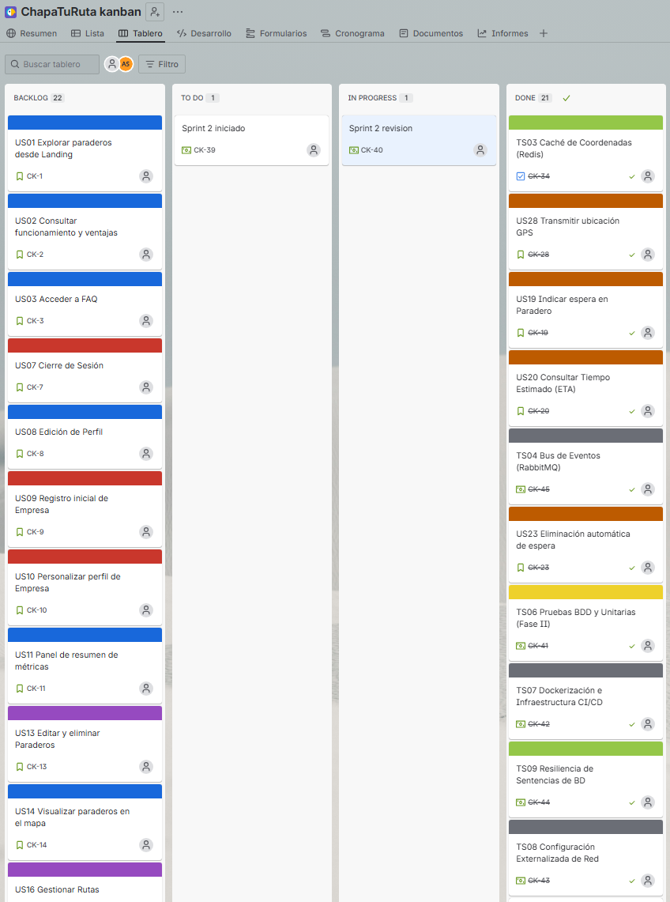
</p>

### Descripción de etiquetas

#### 🔵 Azul (Frontend / UX)

- US01 – Explorar paraderos desde Landing
- US02 – Consultar funcionamiento y ventajas
- US03 – Acceder a FAQ
- US08 – Edición de Perfil de Usuario
- US10 – Personalizar perfil de Empresa
- US11 – Panel de resumen de métricas
- US18 – Detalle visual de la Ruta
- US22 – Confirmación manual de abordaje
- US24 – Ver información del Conductor
- US25 – Calificar viaje y Conductor
- US26 – Crear y listar Colecciones
- US27 – Gestionar rutas en Colecciones
- US31 – Consultar reputación propia

#### 🔴 Rojo (Backend)

- US07 – Cierre de Sesión
- US09 – Registro inicial de Empresa
- US13 – Editar y eliminar Paraderos
- US16 – Gestionar Rutas (Editar/Eliminar)

#### 🟠 Naranja (Tiempo Real / Geolocalización)

- US14 – Visualizar paraderos en el mapa
- US19 – Indicar espera en Paradero
- US20 – Consultar Tiempo Estimado (ETA)
- US21 – Notificaciones push de proximidad
- US23 – Eliminación automática de espera
- US28 – Transmitir ubicación GPS
- US29 – Check-in manual en Paraderos
- US30 – Ver concurrencia en tiempo real

#### 🟢 Verde (Base de Datos)

- TS03 – Caché de Coordenadas (Redis)
- TS09 – Resiliencia de Sentencias de BD

#### ⚫ Negro (Infraestructura)

- TS04 – Bus de Eventos (RabbitMQ)
- TS05 – Integración de SDK Firebase Admin
- TS07 – Dockerización e Infraestructura CI/CD
- TS08 – Configuración Externalizada de Red

#### 🟨 Amarillo (Testing)

- TS06 – Pruebas BDD y Unitarias (Fase II)

#### **Fuente:** Elaboración propia mediante Jira.  
#### **Enlace:** https://arturons.atlassian.net/jira/software/projects/CK/boards/2?atlOrigin=eyJpIjoiMmZiZjEyNzNjOWQzNDllOTlhZGI1YmU0YTUyMjM2NWEiLCJwIjoiaiJ9

#### 5.3.3 Sprint 3
#### 5.3.3.1 Sprint Backlog

| Orden | ID   | Título                          | Descripción                                                                                                                            | Story Points | Estado | Asignado a     |
| ----: | ---- | ------------------------------- | -------------------------------------------------------------------------------------------------------------------------------------- | -----------: | ------ | -------------- |
|     1 | US07 | Cierre de Sesión                | Inactivación de sesión desde el cliente (eliminación del token JWT en localStorage) y redirección al login.                           |            2 | Done   | Hector Rios    |
|     2 | US14 | Visualizar paraderos en el mapa | Renderizado geolocalizado de pines interactivos para cada paradero usando la librería Mapbox GL JS.                                   |            5 | Done   | Andy Nuñez     |
|     3 | US18 | Detalle visual de la Ruta       | Decodificación matemática nativa y dibujo de polilíneas exactas (calles y curvas) consumiendo la API de Mapbox.                        |            5 | Done   | Adrian Valerio |
|     4 | US22 | Confirmación manual de abordaje | Interfaz de tarjeta flotante con botones interactivos ("Ya Subí" / "Cancelar") para salir de la cola de espera de Redis.               |            3 | Done   | Hector Rios    |
|     5 | US29 | Check-in manual en Paraderos    | Interfaz del conductor con botón "Llegué Aquí" para enviar coordenadas de actualización.                                                |            3 | Done   | Adrian Valerio |

#### 5.3.3.2 Development Evidence for Sprint Review

| Repository | Branch | Commit Id | Commit Message | Commit Message Body | Commited on (Date) |
|------------|----------|-----------|----------------|---------------------|-------------------|
| ChapaTuRuta-frontend | feature/auth-module | 4a82c1d | feat: implement login page and auth context | Desarrollo de la página de inicio de sesión en React con manejo del token JWT mediante Context API y almacenamiento en localStorage. | 16/06/2026 |
| ChapaTuRuta-frontend | feature/auth-module | 8f24b7e | feat: add user registration form with validation | Implementación del formulario de registro con validación de campos mediante React Hook Form. | 16/06/2026 |
| ChapaTuRuta-frontend | feature/auth-module | c71e3a9 | feat: implement role-based route guards | Configuración del enrutamiento con React Router protegiendo vistas según el rol del usuario (PASSENGER, DRIVER, MANAGER). | 16/06/2026 |
| ChapaTuRuta-frontend | feature/driver-module | d9b62e4 | feat: create driver dashboard with route selector | Implementación del dashboard del conductor con dropdown para selección de ruta activa. | 16/06/2026 |
| ChapaTuRuta-frontend | feature/driver-module | 35f1ca8 | feat: integrate check-in button with tracking API | Integración del botón de check-in del conductor con el endpoint POST del Tracking Service. | 16/06/2026 |
| ChapaTuRuta-frontend | feature/passenger-module | 5b83ad1 | feat: implement passenger route search with mapbox | Desarrollo del buscador de rutas con renderizado de polilíneas y marcadores sobre mapa Mapbox GL JS. | 16/06/2026 |
| ChapaTuRuta-frontend | feature/passenger-module | 72a9ef5 | feat: add ETA floating card with polling | Implementación del componente de tarjeta flotante de ETA con actualización periódica mediante polling al Tracking Service. | 16/06/2026 |
| ChapaTuRuta-frontend | feature/passenger-module | 91ce4b3 | feat: add stop markers and wait queue integration | Desarrollo de marcadores interactivos por paradero con integración al API de demanda para unirse a la cola de espera. | 17/06/2026 |
| ChapaTuRuta-frontend | feature/passenger-module | e4d18f7 | feat: render route polylines from routing service | Consumo y renderizado de coordenadas de polilínea desde el Routing Service en el mapa interactivo. | 17/06/2026 |
| ChapaTuRuta-frontend | feature/manager-module | f2b8a16 | feat: create manager dashboard with company stats | Desarrollo del panel de administración para managers de empresas de transporte. | 17/06/2026 |
| ChapaTuRuta-frontend | feature/manager-module | 6c5d7e2 | feat: integrate company drivers list view | Implementación de la vista de conductores por empresa consumiendo el endpoint de la empresa. | 17/06/2026 |
| ChapaTuRuta-frontend | feature/core-module | a7f4c39 | feat: implement axios interceptors for JWT | Configuración de interceptores de Axios para inyección automática del token JWT en peticiones protegidas. | 17/06/2026 |
| ChapaTuRuta-frontend | feature/core-module | b4e93f1 | feat: add environment config for api base URLs | Configuración de variables de entorno (.env) para URLs de los microservicios en desarrollo y producción. | 17/06/2026 |
| ChapaTuRuta-frontend | feature/integration | c8d7a52 | feat: integrate all microservice endpoints | Integración completa del frontend React con los endpoints de Identity, Routing y Tracking via API Gateway. | 17/06/2026 |
| ChapaTuRuta-frontend | feature/integration | d3e5f81 | fix: improve fetch error handling and loading states | Mejora del manejo de errores de red y estados de carga en componentes React. | 17/06/2026 |
| ChapaTuRuta-frontend | feature/testing | e7a2b46 | test: add unit tests for auth service and context | Tests unitarios para el servicio de autenticación y el contexto de usuario. | 17/06/2026 |
| ChapaTuRuta-frontend | feature/testing | f5c8d13 | test: validate passenger route search scenarios | Pruebas de integración para la búsqueda de rutas y visualización del mapa Mapbox. | 17/06/2026 |
| ChapaTuRuta-frontend | feature/testing | a9d4e75 | test: validate role-based navigation and guards | Pruebas de navegación condicional según rol del usuario con React Router. | 17/06/2026 |

#### 5.3.3.3 Testing Suite Evidence for Sprint Review

En esta sección se expone el conjunto de pruebas de integración de la interfaz de usuario (Component/Integration Tests) automatizadas bajo el enfoque de Desarrollo Guiado por Comportamiento (BDD) para la **Single Page Application (SPA) desarrollada en React**.

Los escenarios fueron escritos utilizando la sintáxis descriptiva Gherkin y la lógica de navegación por roles se valida mediante **React Testing Library** y Jest. Estas pruebas validan que la gestión de estados mediante Context API, la navegación condicional por roles y la renderización de componentes visuales (mapas, tarjetas y formularios) correspondan con los criterios de aceptación de las Historias de Usuario planificadas para el presente Sprint del Frontend.

---

### Authentication & Role Coordinator (`auth_flow.feature`)

### Feature: Authentication and Role-Based Routing Flow

**As a registered user**
**I want to log in and be redirected to my specific workspace**
**So that I can access the tools corresponding to my role (Passenger, Driver, or Manager)**

### Scenario: Successful login and routing for a Passenger

```gherkin
Given the user is on the Login Page
When the user types "juan@pasajero.com" in the email input
And the user types "secure123" in the password input
And the user clicks the "Ingresar" button
Then the app stores the JWT token in localStorage
And the user is redirected to the PassengerHome page with the Mapbox map visible
```

### Scenario: Successful login and routing for a Driver

```gherkin
Given the user is on the Login Page
When the user types "pedro@driver.com" in the email input
And the user types "secure123" in the password input
And the user clicks the "Ingresar" button
Then the app stores the JWT token in localStorage
And the user is redirected to the DriverHome page with the green "INICIAR RUTA" button visible
```

---

### Passenger Workspace (`passenger_map.feature`)

### Feature: Passenger Map and Wait Flow

**As a passenger**
**I want to search a route and indicate my waiting stop**
**So that I can see the bus moving on the map and its Estimated Time of Arrival (ETA)**

### Scenario: Search and render a route successfully

```gherkin
Given the passenger is on the PassengerHome page
When the passenger types "Pueblo Libre" as origin and "Santa Anita" as destination
And clicks the search icon
Then the app fetches route coordinates from the Routing Service
And a curved blue Polyline and red Stop Markers are rendered on the Mapbox GL layer
```

### Scenario: Passenger joins the queue and views the ETA card

```gherkin
Given the passenger has successfully searched for a route
When the passenger clicks on a red Stop Marker
And clicks the "Esperar Bus Aquí" button in the bottom panel
Then the bottom panel closes
And the Floating Wait Card appears with the text "Calculando llegada..."
And the Map shows an animated bus icon moving based on the ETA polling
```

---

### Driver Workspace (`driver_checkin.feature`)

### Feature: Driver Route Selection and Manual Check-In

**As a driver**
**I want to select my assigned route and manually report my arrival at stops**
**So that passengers can receive accurate ETA updates without relying solely on continuous GPS**

### Scenario: Select a dynamic route and start the trip

```gherkin
Given the driver is on the "DriverHomeView"
When the dropdown menu fetches available routes from the backend
And the driver selects the route "1285 San Antonio"
And taps the "INICIAR RUTA" button
Then the view should change to display the sequence of stops for the selected route
```

### Scenario: Successful manual check-in at a stop

```gherkin
Given the driver has started a route and sees the list of stops
When the driver taps the "LLEGUÉ AQUÍ" button for the "Jorge Polar" stop
Then the BLoC should send the stop coordinates to the Tracking Service
And the button should change its state to "LISTO" and become disabled
And a green SnackBar should appear with the message "Check-in exitoso"
```

---

### Evidencia de Commits de Pruebas Automatizadas

| Repository           | Branch                    | Commit Id                                | Commit Message                                                    | Commit Message Body                                                                                                                                                                                                                      | Commited on (Date)  |
| -------------------- | ------------------------- | ---------------------------------------- | ----------------------------------------------------------------- | ---------------------------------------------------------------------------------------------------------------------------------------------------------------------------------------------------------------------------------------- | ------------------- |
| ChapaTuRuta-frontend | feature/auth-tests | 186d57bb9c85bf2870ed995f9b8b4b1e2d7214f1 | test: add unit tests for login form and role routing         | Se implementan pruebas unitarias con Jest y React Testing Library simulando el flujo de login, verificando que la redirección por rol funcione correctamente a partir del payload JWT almacenado.                  | 17 de Junio de 2026 |
| ChapaTuRuta-frontend | feature/passenger-tests   | 77d7b6b0c8eae35241a139dfaf0c82f2b94d62e5 | test: verify mapbox rendering and ETA card interactions  | Cobertura de pruebas de integración para el flujo del pasajero. Se verifica el renderizado del mapa Mapbox GL JS, la aparición de la polilínea tras la búsqueda y la transición de la interfaz al confirmar la espera, mostrando la tarjeta flotante de ETA. | 17 de Junio de 2026 |
| ChapaTuRuta-frontend | feature/driver-tests      | 2888a05d9b3b2dfa2cb2184f3548b9f97122d8f1 | test: validate driver route selection and check-in state | Se implementan pruebas de integración para el flujo del conductor, validando la selección dinámica de rutas desde el dropdown, el disparo de la petición POST al Tracking Service y los cambios de estado del botón de check-in.                                                | 17 de Junio de 2026 |

#### 5.3.3.4 Execution Evidence for Sprint Review

En esta sección se presenta la evidencia de ejecución de las funcionalidades implementadas en el Sprint del Frontend. Cada evidencia demuestra el correcto funcionamiento de los flujos principales de la Single Page Application (SPA) en React, validando la interacción entre la interfaz de usuario, la gestión de estados mediante Context API y la comunicación con los servicios del Backend.

---

#### 1. Autenticación y Coordinador de Roles (Login Flow)

En esta prueba se valida el flujo inicial de la aplicación. Se ingresan las credenciales en la `LoginPage`, el componente `AuthContext` se comunica con el Identity Service, almacena el token JWT de forma segura y un componente protector (`RoleGuard`) evalúa el payload para redirigir al usuario hacia su espacio de trabajo correspondiente (Pasajero, Conductor o Manager).

**Vista evaluada:** `LoginPage.tsx` → `RoleGuard.tsx`

**Acción ejecutada:** Inicio de sesión y enrutamiento dinámico basado en el rol del usuario.

<p align="center">
  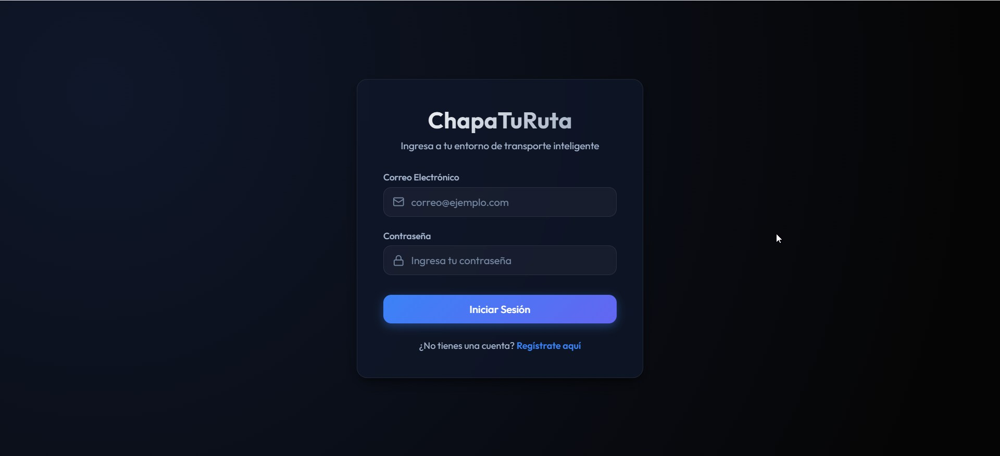
</p>


---

#### 2. Renderizado de Mapa y Rutas (Passenger Workspace)

Esta prueba valida la integración del mapa dentro de `PassengerHome`. Se demuestra que, al realizar una búsqueda de ruta (por ejemplo, Ate → San Miguel), el Frontend obtiene correctamente la polilínea (GeoJSON) desde el Routing Service y renderiza el recorrido sobre el mapa, incluyendo la visualización de los paraderos asociados.

**Vista evaluada:** `PassengerHome.tsx`

**Acción ejecutada:** Búsqueda de ruta y renderizado interactivo mediante la librería Mapbox GL JS.


<p align="center">
  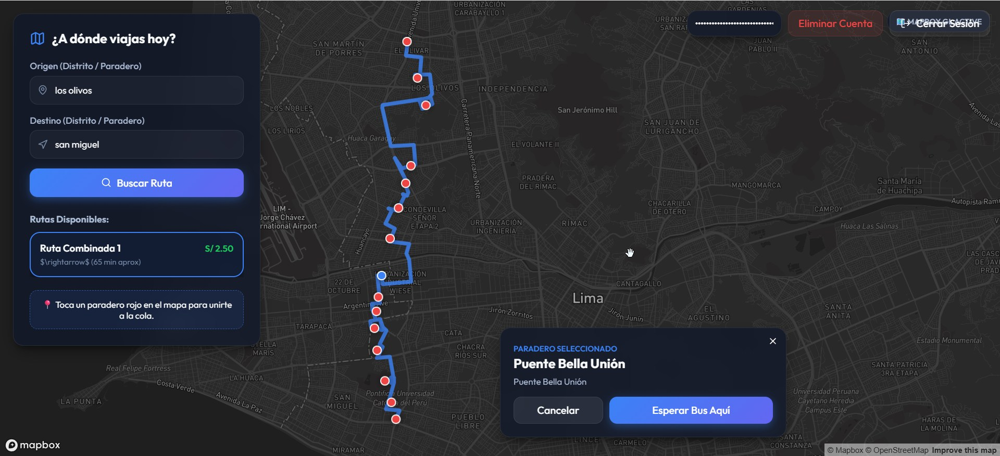
</p>
---

#### 3. Control de Check-in Manual (Driver Workspace)

Esta prueba valida la vista operativa del conductor. El componente `DriverHome` renderiza la secuencia de paraderos correspondiente a la ruta seleccionada. Al presionar el botón **"LLEGUÉ AQUÍ"**, el sistema envía las coordenadas al Tracking Service y actualiza de manera reactiva el estado de la interfaz, deshabilitando el botón y mostrando el estado **"LISTO"**.

**Vista evaluada:** `DriverHome.tsx`

**Acción ejecutada:** Emisión manual de eventos de ubicación y actualización reactiva del estado de la interfaz.

<p align="center">
  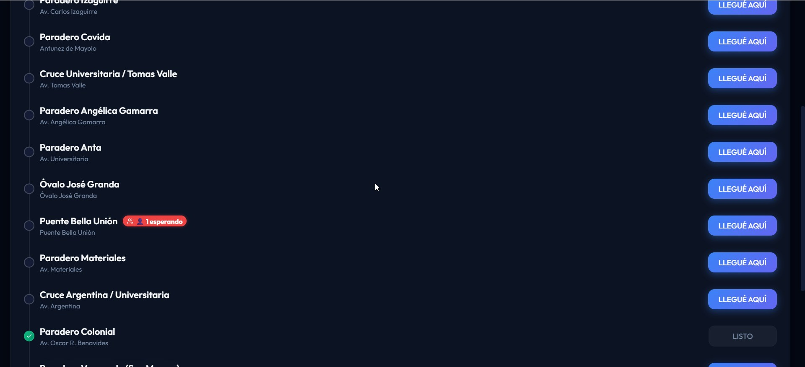
</p>

---

#### 4. Interacción de Espera y Tarjeta Flotante ETA (Passenger Interactions)

Esta prueba valida la experiencia de usuario del pasajero durante la solicitud de un bus. Al seleccionar un paradero desde el mapa y confirmar la espera, la aplicación despliega una tarjeta flotante que inicia un proceso de consulta periódica (`polling`) para obtener y actualizar el Tiempo Estimado de Llegada (ETA) en tiempo real, manteniendo el mapa visible en segundo plano.

**Vista evaluada:** `PassengerHome.tsx` (Floating ETA Card)

**Acción ejecutada:** Confirmación del paradero de espera y recepción asíncrona del ETA mediante actualizaciones periódicas.

<p align="center">
  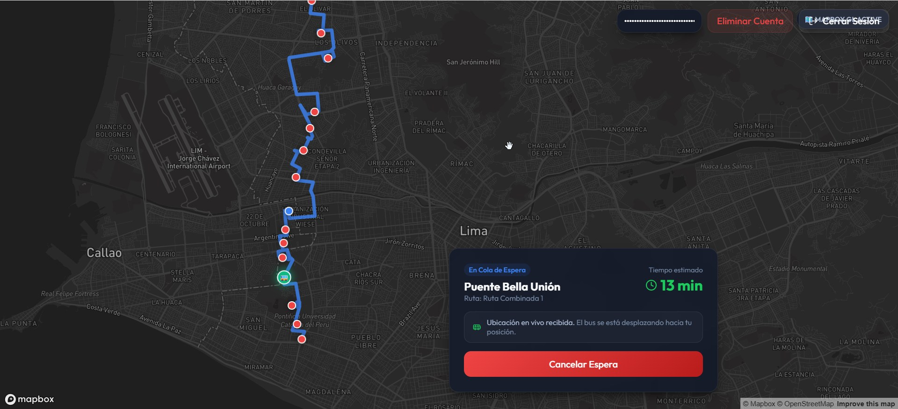
</p>

---


#### 5.3.3.5 Microservices Documentation Evidence for Sprint Review

## Integración de Red del Frontend (React SPA)

En esta sección se documenta la capa de integración de red construida en el Frontend desarrollado en **React** durante el presente Sprint. Debido a que los microservicios Backend fueron implementados y documentados mediante OpenAPI/Swagger en iteraciones anteriores, el objetivo de este Sprint fue desarrollar los **Servicios de API (api/ services)** y los **Hooks personalizados** responsables de consumir dichos servicios desde la SPA.

Para la comunicación con los servicios REST se utilizó **Axios** con interceptores configurados, permitiendo la inyección automática del token JWT (almacenado en `localStorage`) en las cabeceras (`Authorization: Bearer`) de cada petición HTTP autenticada.

A continuación, se presenta el mapeo entre los métodos implementados en la SPA React y los endpoints expuestos a través del API Gateway, manteniendo una arquitectura desacoplada entre la capa de presentación (UI/Context) y la capa de acceso a datos (Services).

---

| Repositorio / Servicio (React) | Método / Hook implementado                 | Método HTTP | Endpoint Consumido (API Gateway)      | Modelos / Tipos TypeScript       | Descripción de la Integración                                                                                                                                                                 |
| --------------------------- | ----------------------------------- | ----------- | ------------------------------------- | -------------------------------- | --------------------------------------------------------------------------------------------------------------------------------------------------------------------------------------------- |
| `authService.ts`            | `login(email, password)`            | `POST`      | `/api/v1/auth/login`                  | `string (JWT)`                   | Autentica al usuario contra el Identity Service y almacena el token JWT en `localStorage` para las sesiones de la SPA.                                                                 |
| `authService.ts`            | `registerUser(...)`                 | `POST`      | `/api/v1/auth/register`               | `void`                           | Serializa los datos del formulario de registro (Pasajero, Conductor o Manager) en formato JSON para la creación de una nueva cuenta.                                                          |
| `passengerService.ts`       | `searchRoutes(origin, destination)` | `GET`       | `/api/v1/routes/search`               | `TripOption[]`, `RouteLeg[]`     | Consulta las rutas disponibles entre un origen y destino. La respuesta JSON anidada es deserializada a objetos tipados con TypeScript.                                                           |
| `passengerService.ts`       | `joinStopQueue(routeId, stopId)`    | `POST`      | `/api/v1/demand/join`                 | `void`                           | Decodifica el `passengerId` del JWT almacenado localmente y lo envía al backend para registrar la espera del pasajero en Redis.                                                         |
| `passengerService.ts`       | `getEta(routeId, lat, lng)`         | `GET`       | `/api/v1/tracking/eta/{routeId}`      | `EtaResponse`                    | Envía la ubicación del pasajero y recibe el cálculo de llegada generado por Mapbox (ej. "6 min"), deserializando la respuesta en un objeto tipado.                                |
| `driverService.ts`          | `getAllRoutes()`                    | `GET`       | `/api/v1/routes`                      | `Route[]`                        | Obtiene el catálogo completo de rutas para poblar el dropdown del conductor al iniciar su recorrido.                                                                                           |
| `driverService.ts`          | `sendCheckIn(...)`                  | `POST`      | `/api/v1/tracking/check-in`           | `void`                           | Empaqueta el `driverId` obtenido del JWT, el paradero y las coordenadas actuales, enviando el evento de llegada manual al Tracking Service.                                              |
| `managerService.ts`         | `getDriversByCompany(companyId)`   | `GET`       | `/api/v1/companies/{companyId}/drivers` | `Driver[]`               | Consulta los conductores asociados a una empresa específica, transformando la respuesta JSON en objetos tipados para la interfaz de gestión.                                                     |

---

Esta capa de integración permite que los componentes React consuman servicios remotos mediante una interfaz de servicios desacoplada, favoreciendo la mantenibilidad y la escalabilidad.


| Endpoint                                | Acción                                            | Método HTTP | Sintaxis de llamada                     | Parámetros                                                                                                                                  | Ejemplo de Response                                                                                                                                                            | URL Documentación                                          |
| --------------------------------------- | ------------------------------------------------- | ----------- | --------------------------------------- | ------------------------------------------------------------------------------------------------------------------------------------------- | ------------------------------------------------------------------------------------------------------------------------------------------------------------------------------ | ---------------------------------------------------------- |
| `/api/v1/auth/register`                 | Registrar un nuevo usuario (Pasajero o Conductor) | POST        | `/api/v1/auth/register`                 | **Body (JSON):** name (string), email (string), password (string), role (string), companyId (string/uuid)                                   | `{ "id": "3fa85f64-5717-4562-b3fc-2c963f66afa6", "name": "Juan Perez", "email": "juan@mail.com", "role": "PASSENGER", "createdAt": "2026-06-03T18:33:10Z" }`                   | https://identity-service-2nhw.onrender.com/swagger-ui.html |
| `/api/v1/auth/login`                    | Iniciar Sesión y obtener JWT                      | POST        | `/api/v1/auth/login`                    | **Body (JSON):** email (string), password (string)                                                                                          | `"eyJhbGciOiJIUzI1NiIsInR5cCI6IkpXVCJ9.eyJzdWIiOiIzZmE4NWY2NC..."`                                                                                                             | https://identity-service-2nhw.onrender.com/swagger-ui.html |
| `/api/v1/auth/profile/{id}`             | Obtener Perfil del usuario                        | GET         | `/api/v1/auth/profile/{id}`             | **Path:** id (string/uuid)                                                                                                                  | `{ "id": "3fa85f64-5717-4562-b3fc-2c963f66afa6", "name": "Juan Perez", "email": "juan@mail.com", "role": "PASSENGER", "createdAt": "2026-06-03T18:33:10Z" }`                   | https://identity-service-2nhw.onrender.com/swagger-ui.html |
| `/api/v1/auth/profile/{id}`             | Actualizar Perfil del usuario                     | PUT         | `/api/v1/auth/profile/{id}`             | **Path:** id (string/uuid)<br>**Body (JSON):** name (string), password (string)                                                             | `{ "id": "3fa85f64-5717-4562-b3fc-2c963f66afa6", "name": "Juan Actualizado", "email": "juan@mail.com", "role": "PASSENGER", "createdAt": "2026-06-03T18:33:10Z" }`             | https://identity-service-2nhw.onrender.com/swagger-ui.html |
| `/api/v1/auth/profile/{id}`             | Eliminar Cuenta de usuario                        | DELETE      | `/api/v1/auth/profile/{id}`             | **Path:** id (string/uuid)                                                                                                                  | En blanco (204 No Content / 200 OK)                                                                                                                                            | https://identity-service-2nhw.onrender.com/swagger-ui.html |
| `/api/v1/companies/register`            | Registrar una nueva Empresa                       | POST        | `/api/v1/companies/register`            | **Body (JSON):** name (string), ruc (string), busPhotoUrl (string), managerId (string/uuid)                                                 | `{ "id": "e8a15f64-2717-4562-b3fc-2c963f66bbb2", "name": "Transportes Lima S.A.", "ruc": "20123456789" }`                                                                      | https://identity-service-2nhw.onrender.com/swagger-ui.html |
| `/api/v1/companies/{companyId}/drivers` | Listar choferes de la empresa                     | GET         | `/api/v1/companies/{companyId}/drivers` | **Path:** companyId (string/uuid)                                                                                                           | `[{ "id": "8ca85f64-5717-4562-b3fc-2c963f66ccc4", "name": "Pedro Chofer", "email": "pedro@bus.com", "role": "DRIVER", "createdAt": "2026-06-03T19:00:00Z" }]`                  | https://identity-service-2nhw.onrender.com/swagger-ui.html |
| `/api/v1/routes`                        | Crear nueva ruta de transporte                    | POST        | `/api/v1/routes`                        | **Body (JSON):** originDistrict (string), destinationDistrict (string), price (number), durationMin (integer)                               | `{ "routeId": "4da75f64-5717-4562-b3fc-2c963f66ddd5", "origin": "Ate", "destination": "Lima", "price": 3.50, "estimatedDuration": 45 }`                                        | https://chapaturuta-backend.onrender.com/swagger-ui.html   |
| `/api/v1/routes`                        | Listar todas las rutas                            | GET         | `/api/v1/routes`                        | Ninguno                                                                                                                                     | `[{ "routeId": "4da75f64-5717-4562-b3fc-2c963f66ddd5", "origin": "Ate", "destination": "Lima", "price": 3.50, "estimatedDuration": 45 }]`                                      | https://chapaturuta-backend.onrender.com/swagger-ui.html   |
| `/api/v1/routes/{id}`                   | Actualizar datos de una ruta                      | PUT         | `/api/v1/routes/{id}`                   | **Path:** id (string/uuid)<br>**Body (JSON):** originDistrict (string), destinationDistrict (string), price (number), durationMin (integer) | `{ "routeId": "4da75f64-5717-4562-b3fc-2c963f66ddd5", "origin": "Ate", "destination": "Callao", "price": 4.00, "estimatedDuration": 50 }`                                      | https://chapaturuta-backend.onrender.com/swagger-ui.html   |
| `/api/v1/routes/{id}`                   | Eliminar una ruta                                 | DELETE      | `/api/v1/routes/{id}`                   | **Path:** id (string/uuid)                                                                                                                  | En blanco (200 OK)                                                                                                                                                             | https://chapaturuta-backend.onrender.com/swagger-ui.html   |
| `/api/v1/routes/search`                 | Buscar rutas directas/transbordos                 | GET         | `/api/v1/routes/search`                 | **Query:** origin (string), destination (string)                                                                                            | `[{ "legs": [{ "routeId": "4da75f64...", "origin": "Ate", "destination": "Lima", "price": 3.5, "estimatedDuration": 45 }], "totalPrice": 3.5, "totalEstimatedDuration": 45 }]` | https://chapaturuta-backend.onrender.com/swagger-ui.html   |
| `/api/v1/tracking/check-in`             | Registrar Check-in del Conductor                  | POST        | `/api/v1/tracking/check-in`             | **Body (JSON):** driverId (uuid), routeId (uuid), stopId (uuid), latitude (number), longitude (number), timestamp (integer)                 | `"Check-in procesado asincronamente"`                                                                                                                                          | https://tracking-service-yj42.onrender.com/swagger-ui.html |
| `/api/v1/tracking/eta/{routeId}`        | Consultar Tiempo Estimado (ETA)                   | GET         | `/api/v1/tracking/eta/{routeId}`        | **Path:** routeId (string/uuid)<br>**Query:** pasajeroLat (number), pasajeroLng (number)                                                    | `{ "routeId": "4da75f64-5717-4562-b3fc-2c963f66ddd5", "currentLatitude": -12.0400, "currentLongitude": -76.9500, "estimatedTime": "6 min" }`                                   | https://tracking-service-yj42.onrender.com/swagger-ui.html |
| `/api/v1/demand/join`                   | Registrar pasajero en espera                      | POST        | `/api/v1/demand/join`                   | **Query:** routeId (string/uuid), stopId (string/uuid), passengerId (string/uuid)                                                           | `"Pasajero registrado en espera exitosamente"`                                                                                                                                 | https://tracking-service-yj42.onrender.com/swagger-ui.html |
| `/api/v1/demand/transfer`               | Registrar transbordo de pasajero                  | POST        | `/api/v1/demand/transfer`               | **Query:** nextRouteId (string/uuid), nextStopId (string/uuid), passengerId (string/uuid)                                                   | `"Pasajero registrado para transbordo exitosamente"`                                                                                                                           | https://tracking-service-yj42.onrender.com/swagger-ui.html |
| `/api/v1/demand/route/{routeId}`        | Ver demanda total de la ruta                      | GET         | `/api/v1/demand/route/{routeId}`        | **Path:** routeId (string/uuid)                                                                                                             | `{ "paradero-ate-123": 5, "paradero-santa-anita-456": 12 }`                                                                                                                    | https://tracking-service-yj42.onrender.com/swagger-ui.html |


<p align="center">
  
</p>

<p align="center">
  
</p>

<p align="center">
  


#### 5.3.3.6 Software Deployment Evidence for Sprint Review

- La siguiente captura muestra el panel principal de la plataforma PaaS utilizada para el despliegue (Render Cloud). El estado operativo de cada servicio confirma que el proceso automatizado de integración y despliegue continuo ejecutó correctamente la construcción de imágenes Docker y la puesta en marcha de los contenedores en el entorno productivo.

<p align="center">
  
</p>

- Evidencia del despliegue exitoso del **identity-service** en la nube mediante su dominio público. La disponibilidad de la documentación interactiva valida que el servicio se encuentra operativo y preparado para gestionar procesos de autenticación y autorización basados en tokens JWT.

<p align="center">
  
</p>

- Captura correspondiente al **tracking-service** desplegado en producción. Su funcionamiento confirma la correcta configuración de las variables de entorno necesarias para el procesamiento y exposición de información relacionada con la telemetría y seguimiento en tiempo real.

<p align="center">
  
</p>

- Evidencia del entorno productivo del **routing-service**. La disponibilidad de sus endpoints demuestra que los componentes encargados de la gestión de rutas y cálculo de recorridos fueron desplegados satisfactoriamente y se encuentran accesibles desde la infraestructura cloud.

<p align="center">
  
</p>

- Captura de la consola administrativa de **Supabase**, donde se visualiza la base de datos PostgreSQL utilizada por la solución. Esta evidencia confirma la disponibilidad de las estructuras de almacenamiento y la conectividad requerida por los microservicios desplegados.

<p align="center">
  
</p>

- Monitoreo de la instancia de **Redis** alojada en Upstash. La evidencia demuestra que el servicio de almacenamiento en memoria se encuentra activo y disponible para soportar operaciones de acceso rápido y mecanismos de caché dentro de la arquitectura.

<p align="center">
  
</p>

- Panel de administración de **CloudAMQP** mostrando el estado operativo del bróker de mensajería. Esta captura verifica la correcta implementación de la infraestructura responsable de la comunicación asíncrona entre los diferentes servicios del sistema.

<p align="center">
  
</p>

#### 5.3.3.7 Team Collaboration Insights during Sprint

**Informe:**
<br>

<p align="center">
  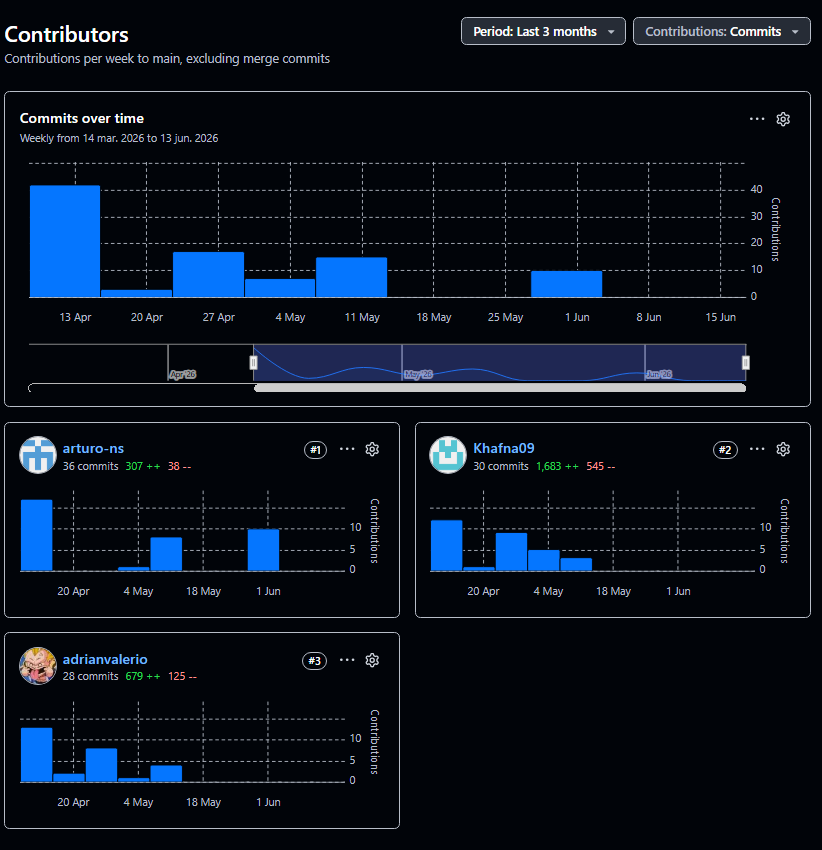
</p>

<br>

**Landing:**
<br>
<p align="center">
  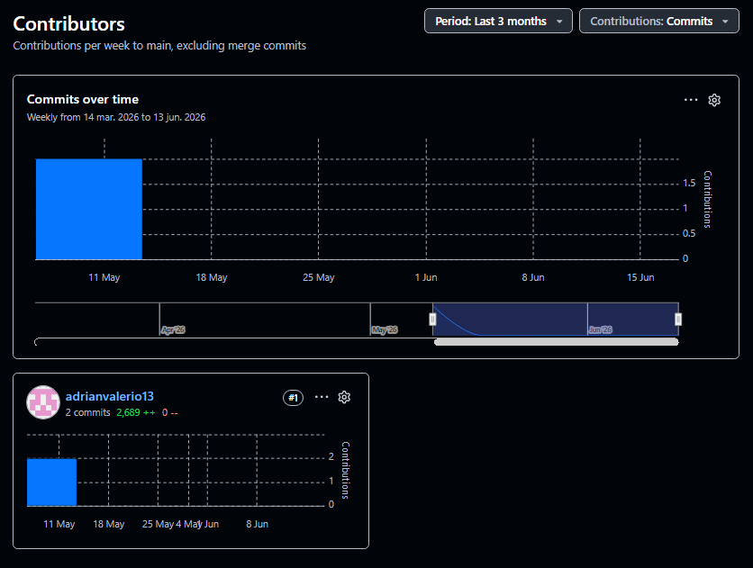
</p>

<br>

**Frontend:**
<br>
<p align="center">
  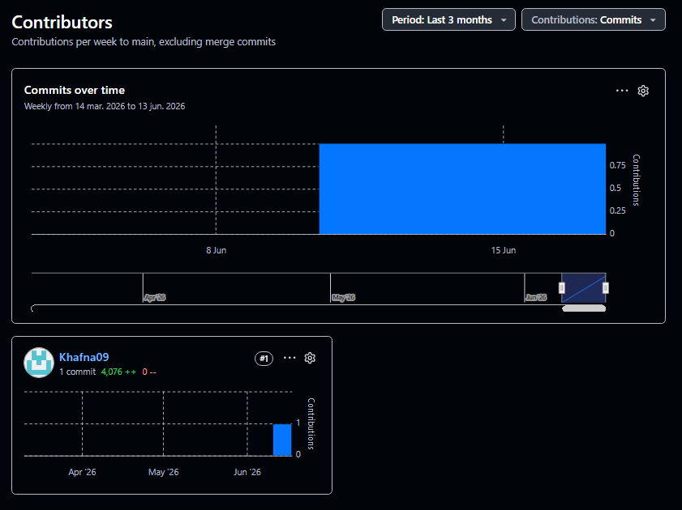
</p>

<br>

**Backend:**
<br>

<p align="center">
  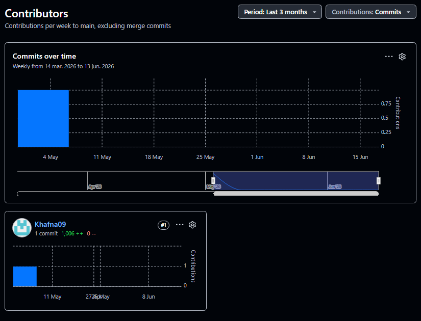
</p>

##### 5.3.3.8 Kanban Board

| BACKLOG (Product Backlog General)        | TO DO (Sprint 3 Commitments)                                                                       | IN PROGRESS                                                      | DONE (Sprint 3 Completado)           |
| ---------------------------------------- | -------------------------------------------------------------------------------------------------- | ---------------------------------------------------------------- | ------------------------------------ |
| US01 Explorar paraderos desde Landing    | (Las 5 tareas planificadas para este Sprint completaron satisfactoriamente su ciclo de desarrollo) | (Ninguna tarea quedó bloqueada o pendiente al cierre del Sprint) | US07 Cierre de Sesión                |
| US02 Consultar funcionamiento y ventajas |                                                                                                    |                                                                  | US14 Visualizar paraderos en el mapa |
| US03 Acceder a FAQ                       |                                                                                                    |                                                                  | US18 Detalle visual de la Ruta       |
| US09 Registro inicial de Empresa         |                                                                                                    |                                                                  | US22 Confirmación manual de abordaje |
| US10 Personalizar perfil de Empresa      |                                                                                                    |                                                                  | US29 Check-in manual en Paraderos    |
| US11 Panel de resumen de métricas        |                                                                                                    |                                                                  |                                      |
| US13 Editar y eliminar Paraderos         |                                                                                                    |                                                                  |                                      |
| US16 Gestionar Rutas (Editar/Eliminar)   |                                                                                                    |                                                                  |                                      |
| US19 Indicar espera en Paradero          |                                                                                                    |                                                                  |                                      |
| US21 Notificaciones push de proximidad   |                                                                                                    |                                                                  |                                      |
| US23 Eliminación automática de espera   |                                                                                                    |                                                                  |                                      |
| US28 Transmitir ubicación GPS            |                                                                                                    |                                                                  |                                      |
| US30 Ver concurrencia en tiempo real     |                                                                                                    |                                                                  |                                      |
| TS05 Integración de SDK Firebase Admin   |                                                                                                    |                                                                  |                                      |


### Kanban Board del Sprint 3

<p align="center">
  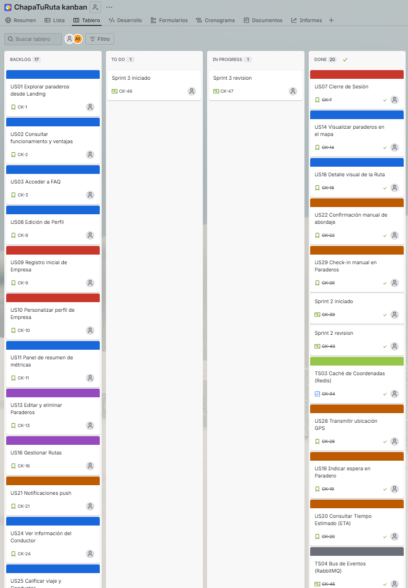
</p>

### Descripción de etiquetas

#### 🔵 Azul (Frontend / UX)

- US01 – Explorar paraderos desde Landing
- US02 – Consultar funcionamiento y ventajas
- US03 – Acceder a FAQ
- US07 – Cierre de Sesión
- US09 – Registro inicial de Empresa
- US10 – Personalizar perfil de Empresa
- US11 – Panel de resumen de métricas
- US14 – Visualizar paraderos en el mapa
- US18 – Detalle visual de la Ruta
- US22 – Confirmación manual de abordaje

#### 🔴 Rojo (Backend)

- US13 – Editar y eliminar Paraderos
- US16 – Gestionar Rutas (Editar/Eliminar)

#### 🟠 Naranja (Tiempo Real / Geolocalización)

- US19 – Indicar espera en Paradero
- US21 – Notificaciones push de proximidad
- US23 – Eliminación automática de espera
- US28 – Transmitir ubicación GPS
- US29 – Check-in manual en Paraderos
- US30 – Ver concurrencia en tiempo real

#### ⚫ Negro (Infraestructura)

- TS05 – Integración de SDK Firebase Admin

#### **Fuente:** Elaboración propia mediante Jira.  
#### **Enlace:** https://arturons.atlassian.net/jira/software/projects/CK/boards/2?atlOrigin=eyJpIjoiMmZiZjEyNzNjOWQzNDllOTlhZGI1YmU0YTUyMjM2NWEiLCJwIjoiaiJ9


### 5.3.4 Sprint 4 (TF1)

#### 5.3.4.1 Sprint Backlog 4

Para el último Sprint (TF1), se seleccionaron del Product Backlog aquellas Historias de Usuario e Historias Técnicas que no habían sido completadas en iteraciones anteriores, asegurando la integración funcional completa del Frontend y Backend.

| Orden | ID | Título | Descripción | Story Points | Estado | Asignado a |
|---|---|---|---|---|---|---|
| 1 | TS10 | Pruebas E2E (Cypress) | Automatización E2E en frontend de flujos críticos de Pasajero y Conductor. | 5 | Done | Héctor Rios |
| 2 | US32 | Dashboard Manager (Rutas) | Interfaz visual e integración con Mapbox para gestionar el ecosistema de la empresa. | 5 | Done | Héctor Rios |
| 3 | US33 | Consola del Conductor y Rastreo Pasajeros | Renderizado del seguimiento GPS de buses y panel de chofer. | 8 | Done | Héctor Rios |
| 4 | US34 | Autenticación Frontend (AuthContext) | Seguridad del SPA usando el token provisto por el backend. | 5 | Done | Héctor Rios |
| 5 | US15 | Crear Ruta y Horarios (Backend) | CRUD de Rutas y paraderos lógicos en el Routing-Service. | 8 | Done | Héctor Rios |
| 6 | US35 | Cancelación de Espera de Bus | Endpoint en backend para abortar la intención de viaje en un paradero. | 3 | Done | Héctor Rios |
| 7 | TS06 | Pruebas BDD y Unitarias | Refactorización de tests automatizados (Cucumber/JUnit) para paraderos. | 5 | Done | Héctor Rios |
| 8 | TS11 | Documentación Arquitectónica | Actualización del framework arquitectónico (Serverless, CQRS, Hexagonal). | 3 | Done | Héctor Rios |

#### 5.3.4.2 Development Evidence for Sprint Review

Durante el Sprint 4 se ejecutó la integración final de los ecosistemas. A continuación, se presenta el historial de los commits más representativos que consolidan el desarrollo de esta iteración:

| Repository | Branch | Commit Id | Commit Message | Commit Message Body | Commited on (Date) |
|------------|----------|-----------|----------------|---------------------|-------------------|
| ChapaTuRuta-frontend | develop | 4af41ce | test(e2e): configure Cypress and add E2E flow tests | Se configura Cypress y se agregan flujos E2E para pasajero, conductor y manager. | 01/07/2026 |
| ChapaTuRuta-frontend | develop | 0f885aa | feat(tracking): implement driver console, passenger real-time map | Desarrollo de la consola del conductor y mapa en tiempo real para el pasajero con geolocalización. | 01/07/2026 |
| ChapaTuRuta-frontend | develop | dd5f051 | feat(manager): implement dashboard with route upload | Implementación del dashboard para el rol manager permitiendo carga y mapeo de rutas. | 01/07/2026 |
| ChapaTuRuta-backend | develop | 1166015 | docs(architecture): rewrite architecture report incorporating Serverless | Reescritura del documento de arquitectura incorporando patrones CQRS, Serverless e IaC. | 03/07/2026 |
| ChapaTuRuta-backend | develop | f16c547 | test/refactor(backend): agregar pruebas unitarias/BDD | Se agregan pruebas unitarias y BDD para paraderos, se aísla config de BD. | 02/07/2026 |
| ChapaTuRuta-backend | develop | 9b33772 | fix: explicitly create route_stops table | Se soluciona error inicializando explícitamente la tabla route_stops al arrancar. | 01/07/2026 |

#### 5.3.4.3 Testing Suite Evidence for Sprint Review

La evidencia de testing del Sprint 4 abarca ambas capas:

**Backend (BDD y Unitarias):**
Se implementaron pruebas estructuradas bajo el patrón BDD con **Cucumber** y **JUnit 5** para el servicio de enrutamiento y paraderos. Se aisló la configuración de las bases de datos en memoria para no afectar entornos productivos, permitiendo ejecutar pruebas como:
- `Given` a request to create a route
- `When` the route is submitted to routing-service
- `Then` the system creates it and persists the stops sequence properly.

**Frontend (Cypress E2E):**
Se instaló y configuró la herramienta **Cypress**. Se automatizaron los flujos de Extremo-a-Extremo comprobando:
- El registro e inicio de sesión de un pasajero y conductor.
- La carga correcta del Dashboard del Manager tras la autenticación.
- La simulación del flujo de un pasajero entrando al mapa e indicando "espera" en un paradero.

#### 5.3.4.4 Microservices Documentation Evidence for Sprint Review

## Integración de Red del Frontend (React SPA) - Sprint 4

Durante el Sprint 4, se integraron nuevos servicios y métodos en el Frontend (React SPA) para consumir los endpoints refactorizados y nuevos del backend.

---

| Repositorio / Servicio (React) | Método / Hook implementado                 | Método HTTP | Endpoint Consumido (API Gateway)      | Modelos / Tipos TypeScript       | Descripción de la Integración                                                                                                                                           |
| --------------------------- | ----------------------------------- | ----------- | ------------------------------------- | -------------------------------- | ------------------------------------------------------------------------------------------------------------------------------------------------------- |
| `managerService.ts`         | `createRoute(routeData)`            | `POST`      | `/api/v1/routing/routes`              | `Route`, `Stop[]`                | Serializa los datos del formulario del Dashboard Manager para crear rutas y paraderos geolocalizados.                                                    |
| `managerService.ts`         | `getCompanyRoutes(companyId)`       | `GET`       | `/api/v1/routing/routes`              | `Route[]`                        | Consulta el listado completo de rutas de una empresa para su gestión en el Dashboard.                                                                   |
| `passengerService.ts`       | `cancelWait(routeId)`               | `POST`      | `/api/v1/tracking/cancel-wait`        | `void`                           | Envía la señal al backend para eliminar al pasajero de la cola de espera del paradero, reduciendo la demanda concurrente.                               |

---

## Documentación de APIs (Backend) - Sprint 4 (Nuevos & Refactors)

La capa de APIs consumidas y expuestas en este sprint incluyeron mejoras y refactorizaciones sustanciales, destacando los siguientes endpoints que completan el core logic.

| Endpoint                                | Acción                                            | Método HTTP | Sintaxis de llamada                     | Parámetros                                                                                                                                 | Ejemplo de Response                                                                                                                                                                    | URL Documentación                                          |
| --------------------------------------- | ------------------------------------------------- | ----------- | --------------------------------------- | ------------------------------------------------------------------------------------------------------------------------------------------ | -------------------------------------------------------------------------------------------------------------------------------------------------------------------------------------- | ---------------------------------------------------------- |
| `/api/v1/routing/routes`                | Crear nueva ruta y paraderos                      | POST        | `/api/v1/routing/routes`                | **Body (JSON):** origin (string), destination (string), stops (array of Stop ID), price (number)                                           | `{ "routeId": "4da75f64...", "status": "CREATED", "stopsCount": 5 }`                                                                                                                   | https://chapaturuta-backend.onrender.com/swagger-ui.html   |
| `/api/v1/routing/routes`                | Listado completo de malla estructural             | GET         | `/api/v1/routing/routes`                | Ninguno                                                                                                                                    | `[{ "routeId": "4da75f64...", "origin": "Ate", "destination": "Lima" }]`                                                                                                               | https://chapaturuta-backend.onrender.com/swagger-ui.html   |
| `/api/v1/tracking/cancel-wait`          | Cancelar espera de pasajero                       | POST        | `/api/v1/tracking/cancel-wait`          | **Query:** routeId (uuid), passengerId (uuid)                                                                                              | `"Demanda reducida y espera cancelada exitosamente"`                                                                                                                                   | https://tracking-service-yj42.onrender.com/swagger-ui.html |
| `/api/v1/tracking/check-in`             | Registrar Check-in (Refactor)                     | POST        | `/api/v1/tracking/check-in`             | **Body (JSON):** driverId (uuid), routeId (uuid), stopId (uuid)                                                                            | `"Check-in procesado y demanda limpiada inmediatamente"`                                                                                                                               | https://tracking-service-yj42.onrender.com/swagger-ui.html |
| `/api/v1/auth/register`                 | Registrar un nuevo usuario (Refactor)             | POST        | `/api/v1/auth/register`                 | **Body (JSON):** name (string), email (string), password (string), role (string)                                                           | `HTTP 201 Created` o `HTTP 409 Conflict (Correo duplicado)`                                                                                                                            | https://identity-service-2nhw.onrender.com/swagger-ui.html |


#### 5.3.4.5 Software Deployment Evidence for Sprint Review

**Despliegue de los Microservicios (Backend):**
Se consolida la arquitectura orientada a servicios **(PaaS + BaaS)**:
- Orquestación automatizada de los contenedores Docker en **Render.com** conectados a repositorios GitHub vía Webhooks (CI/CD).
- **Supabase (PostgreSQL)** como Storage estructurado bajo patrón *Database per Service*.
- **Upstash (Redis)** y **CloudAMQP (RabbitMQ)** gestionando concurrencia asíncrona (CQRS) sin estado transaccional.

- La siguiente captura muestra el panel principal de la plataforma PaaS utilizada para el despliegue (Render Cloud). El estado operativo de cada servicio confirma que el proceso automatizado de integración y despliegue continuo ejecutó correctamente la construcción de imágenes Docker y la puesta en marcha de los contenedores en el entorno productivo.

<p align="center">
  
</p>

- Evidencia del despliegue exitoso del **identity-service** en la nube mediante su dominio público. La disponibilidad de la documentación interactiva valida que el servicio se encuentra operativo y preparado para gestionar procesos de autenticación y autorización basados en tokens JWT.

<p align="center">
  
</p>

- Captura correspondiente al **tracking-service** desplegado en producción. Su funcionamiento confirma la correcta configuración de las variables de entorno necesarias para el procesamiento y exposición de información relacionada con la telemetría y seguimiento en tiempo real.

<p align="center">
  
</p>

- Evidencia del entorno productivo del **routing-service**. La disponibilidad de sus endpoints demuestra que los componentes encargados de la gestión de rutas y cálculo de recorridos fueron desplegados satisfactoriamente y se encuentran accesibles desde la infraestructura cloud.

<p align="center">
  
</p>

- Captura de la consola administrativa de **Supabase**, donde se visualiza la base de datos PostgreSQL utilizada por la solución. Esta evidencia confirma la disponibilidad de las estructuras de almacenamiento y la conectividad requerida por los microservicios desplegados.

<p align="center">
  
</p>

**Despliegue de la Aplicación SPA (Frontend):**
El Frontend, construido con React.js, se desplegó haciendo uso de **Vercel**. 
Al estar alojado en Vercel, la aplicación React (Single Page Application) es empaquetada como archivos estáticos ultra optimizados (HTML, CSS, JS) y servida a través del CDN global Edge de la plataforma. Esto garantiza tiempos de respuesta mínimos (TTFB) y permite integraciones fluidas con los APIs del backend (Render) eludiendo problemas de latencia regional. Las variables de entorno de producción (`REACT_APP_API_URL`, tokens de Mapbox, etc.) se inyectan dinámicamente desde el panel seguro de Vercel en cada *Deploy Preview* o paso a *Producción*.


#### 5.3.4.6 Execution Evidence for Sprint Review

#### 5.3.4.7 Team Collaboration Insights during Sprint

#### 5.3.4.8 Kanban Board
